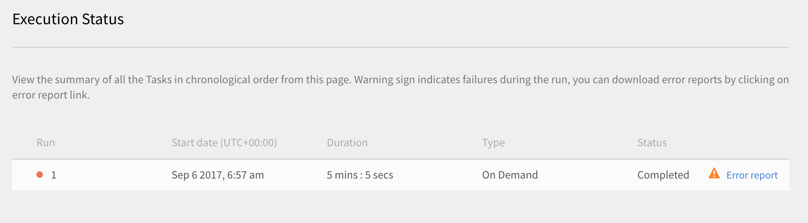
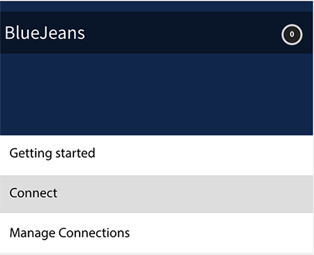

# Learning Manager Connectors {#learning-manager-connectors}

Learn on how to integrate Salesforce with Learning Manager using connectors, how to integrate FTP with Learning Manager and upload CSV automatically using FTP connector.

Enterprises have other applications and systems which may need to be integrated with Learning Manager. Connectors are utilities that help in performing data-based integrations such as importing data into Learning Manager from external  systems,  or exporting data to external systems from Learning Manager. In the July 2016 release, the connectors have only the capability of bulk importing users for Learning Manager from external systems.

Learning Manager provides Salesforce and FTP connectors. Using Salesforce connector, integration Administrators of an organization can integrate their Salesforce application with Learning Manager. As an integrator, you can also use FTP connector to auto import a set of users into your enterprise application.

Learning Manager also provides the Lynda, getAbstract, and the Harvard Management System connectors which enable learners to access and consume courses from Lynda.com, getAbstract, and Harvard ManageMentor.

Read on to know how to configure and use each of these connectors in Learning Manager.

 

## Salesforce connector {#sfconnector}

Salesforce connector connects Learning Manager and Salesforce accounts to automate data synchronization. Salesforce connector capabilities are as follows: 

### Map attributes

Integration Administrator can choose Salesforce columns and map them to corresponding Learning Manager's group-able attributes. This is a one time effort. Once the mapping is completed, the same mapping is used in subsequent user imports. It can be reconfigured if Administrator wants to have a different mapping for importing users.

### Automated user import

User import process allows Learning Manager Administrator to fetch employee details from Salesforce and import them into Learning Manager automatically. This automation avoids the manual effort involved in creating CSV and uploading into Prime.

### Auto Schedule

Using auto scheduling feature along with automated user import feature can be effective. Learning Manager Administrator can set up schedule according to organization's needs. Users in the Learning Manager application can be up-to-date according to the schedule. Sync can be performed on daily basis in Learning Manager application. 

### Filtering users

Learning Manager Administrator can apply filtering on the users before importing them. For example, Learning Manager Administrator can choose to import all users in the hierarchy under one or more specific Managers. 

## Configure Salesforce connector {#configuresalesforceconnector}

Learn the process to integrate Learning Manager with Salesforce.

### Pre-requisites {#prerequisites}

Ensure that you have your Salesforce organization URL with you. For example, if your organization name is **myorg**, the Salesforce URL could be [https://myorg.salesforce.com](https://myorg.salesforce.com/). It is the only input which is required to connect Salesforce account with Learning Manager.

Also make sure that you have the appropriate credentials to log in to the account.

## Create a connection {#createaconnection}

1. In Learning Manager home page, hover mouse over the Salesforce card/thumbnail. A menu appears. Click **Connect** item in the menu.

   

1. A dialog appears prompting you to enter the org-url. Click **Connect** after providing the URL. 
1. Upon successful connection, the overwiew page appears.

## Map attributes {#mapattributes}

Once connection is successfully established, you can map Salesforce columns to the corresponding attributes of Learning Manager. This step is mandatory. 

1. In the mapping page, on left side you can see Learning Manager's columns and on right side you can see the Salesforce columns. Select the appropriate column name that maps to the Learning Manager's column name.

   

   Learning Manager's column data shown on the left side are fetched from the active fields. The **manager** field must necessarily be mapped to a field of type email address. Mapping all the columns is mandatory before the connector can be used.

1. Click **Save** after completing the mapping. 
1. The connector is now ready for use. The account that has been configured now, appears as a data source within the Administrator app, for the administrator to schedule the import or for on-demand sync.

## Using Salesforce connector {#usingsalesforceconnector}

Salesforce connector connects to Salesforce.com to fetch the users as configured and add them to Learning Manager. 

## Learning Manager FTP connector {#ftpconnector}

Using the FTP connector, you can integrate Learning Manager with arbitrary external systems to automate data synchronization. It is expected that external systems can export data in a CSV format and place it in the appropriate folder of the Learning Manager FTP account. FTP connector capabilities are as follows: 

You can also use the Box connector for data migration, user  import  and data export. For more information, see [Box connector.](third-party-connectors.md#main-pars_header_302653946)

## Data import {#dataimport}

User import process allows Learning Manager Administrator to fetch employee details from the Learning Manager FTP service and import them into Learning Manager automatically. Using this feature, you can integrate multiple systems by placing the CSV generated by those systems in the appropriate folders of the FTP accounts. Learning Manager picks up the CSV files, merges them, and imports the data according to the schedule. Refer to Scheduling feature for more information. 

**Map attributes**

Integration Administrator can choose the columns of CSV and map them to Learning Manager's group-able attributes. This mapping is one time effort. Once the mapping is done, the same mapping is used in subsequent User imports.The mapping can be reconfigured if the Administrator wants to have a different mapping for importing users.

## Export Data {#exportdata}

The Data Export allows users to export user skills to an FTP location to integrate with any third party system.

## Scheduling {#scheduling}

Administrator can set up scheduling tasks as per organization's requirements and users in the Learning Manager application are up-to-date according to the schedule. Similarly, Integration Admin can schedule skill export on a timely basis to be integrated with an external system. Sync can be performed on daily basis in Learning Manager application. 

## Configure Learning Manager FTP connector {#configurecaptivateprimeftpconnector}

Learn the process to integrate Learning Manager with FTP connector. 

### Create a connection {#Createaconnection-1}

1. In Learning Manager home page, hover mouse over the FTP card/thumbnail. A menu appears. Click **Connect **item in the menu.

   

1. A dialog appears prompting you to enter the email id. Provide the email id of the person responsible for managing the Learning Manager FTP account for the organization. Click **Connect** after providing the email id. 
1. Learning Manager sends you an email prompting the user to reset the password before accessing the FTP for the first time. The user must reset the password and use this for accessing the Learning Manager FTP account.

   Only one Learning Manager FTP account can be created for a given Learning Manager account.

   In the overview page, you can specify the Connection Name for your integration. Choose what action you want to take from the following options:

   * Import Internal Users  
   * Export User Skills - Configure a Schedule  
   * Export User Skills - OnDemand

   

## Import

+++Internal User

The import internal user option allows you to schedule the generation of user import report automatically. The generated reports are sent to you as .CSV files.

+++

+++Map Attributes

Once connection is successfully established, you can map the columns of CSV files that will be placed in the FTP folder to the corresponding attributes of Learning Manager. This step is mandatory. 

1. In the Map Attributes page, on left side you can see Learning Manager's expected columns and on right side you can see the CSV column names. Initially, on the right side, you can see an empty select box. Import any template CSV by clicking **Choose File**.
1. The above step populates the right side select drop-down list with all the CSV column names. Select the appropriate column name that maps to the Learning Manager's column name.

   *The Manager field must necessarily be mapped to a field of type email address. Mapping all the columns is mandatory before the connector can be used.*

1. Click **Save** after completing the mapping. 

   The connector is now ready for use. The just configured account will now appear as a data source within the Administrator app for the Administrator to schedule the import or for on-demand sync.

    

+++

+++Using the Learning Manager FTP connector

1. The CSV files from external systems should be placed at the following path: 

   `code $OPERATION$/$OBJECT_TYPE$/$SUB_OBJECT_TYPE$/data.csv`

   **Note:** In the July 2016 Release, only import of users is allowed. Therefore to use the FTP connector, you must ensure that the CSV files are placed in the following folder:

   `code Home/import/user/internal/*.csv`

1. The FTP connector takes all rows from CSV files, so it is important that the row corresponding to a user in one CSV does not appear in any other CSVs.
1. All CSVs should contain the columns specified in the mapping.
1. All the required CSVs should be present in the folder before the process begins. 

While importing users into Learning Manager, Administrator also need to know how users are managed in Learning Manager. Refer to [User Management Help](../integration-admin/feature-summary/migration-manual.md#usermanagement) to know more information. 

+++

## Export

+++Skills

There are two options to export User skill reports.

**[!UICONTROL User Skills - On Demand]**: You can specify the  start date and export the report using the option .The report will be extracted from the date enterd till present.

**[!UICONTROL User Skills - Configure]**: This option let's you schedule the extraction of the report. Select the Enable Schedule checkbox and specify the start date and time. You can also specify the interval at which you want the report to be generated and sent.

+++

To open the Export folder where the exported files will be placed in your FTP location, open the link to FTP Folder provided in the User Skills page as shown below.

The auto-exported files will be present in the location **Home/export/&#42;FTP_location&#42;**

The auto-exported files will be available with the title, **skill_achievements_&#42;date from&#42;_to_&#42;date to&#42;.csv**

 

## Lynda connector {#lyndaconnector}

The Lynda connector can be used by enterprise customers of Lynda.com who would like their learners to discover and consume Lynda courses from within Learning Manager. The connector can be configured to fetch courses from Lynda.com periodically with your API key. Once a course is created within Prime, users can search for them and consume them. Learner progress can then be tracked within Learning Manager.

### Configure the Lynda connector {#configurethelyndaconnector}

1. From the Integrated Admin dashboard, click Lynda.

   You will see the tile with three options: Getting Started, Connect, and Manage Connections.

1. If you are configuring the Lynda connector for the first time, click Connect.

   You must configure the Exavault FTP account before you configure this connector.

1. From the connection page, specify a name for your connector. Enter the Appkey and the Secret key for your connection.

   You must contact your vendor to get the Appkey and the Secret key.

1. Click Save.

   The configuration is saved and the Lynda connection for your account is added. You can now click Manage Connections from the Home  page,  and edit your configuration anytime.

1. If you already have a connection established, click Manage Connections view all your connections.

   Migration feature must be enabled for your account before you configure this connector.

1. Click the connection that you want to edit.
1. From the left pane, click Configure. Do one of the following:

   * View or edit the details of your account, and the synchronization schedule from this window. You must select the Enable Connection checkbox if you want to enable this account. 
   * Click Edit and edit your credentials. Click Reset to undo your updates to this field.
   * Click Enable Schedule to schedule your synchronization. You can enter the start time and date, and then enter the frequency of your synchronization schedule in days. For example, enabling synchronization every 3 days.

   Click Save to save your changes.

   

1. From the left pane, click On Demand Execution. This option allows you to import user feeds and other relevant data from Lynda. Enter the Start Date for the on demand execution, and click Execute to execute the synchronization. All the data from the start date till present is imported.

   * You can click Disable access to Learning Manager during execution where the application will have a downtime during the synchronization.
   * If you click Enable access to Learning Manager during execution, there is no disruption in service during synchronization.

   

1. You can also click Execution Status from the left pane anytime to view the summary of all the runs for this connector, in a chronological order. You can view the start date and duration of the synchronization, the type of synchronization (whether it is on-demand synchronization) and status of the synchronization (whether the synchronization is in progress or is complete).

   When you delete and recreate a connection, the previous runs for the connector come up again. You can view all the runs before you deleted the connection.

   You can perform a rerun only for the latest synchronization.

   

## getAbstract connector {#getabstractconnector}

The getAbstract connector can be used by enterprise customers of getAbstract.com, who would like their learners to discover and consume getAbstract summaries. The connector can be configured to fetch usage data periodically, based on which learner completion records are created within Learning Manager. Read on to know how to configure this connector in Learning Manager.

### Configure the getAbstract connector {#configurethegetabstractconnector}

1. From the Integrated Admin dashboard, click getAbstract.

   From the tile, you will see three options: Getting Started, Connect, and Manage Connections.

1. If you are configuring the getAbstract connector for the first time, click Connect.

   You must configure the Exavault FTP account before you configure this connector.

   Ensure that you share this FTP credentials with your content provider to access the feeds.

1. Enter a name for your connection in the Connection Name field.

   Enter the appropriate keys in the Client Id and Client Secret fields. You may have to contact your vendor to get the appropriate keys for this connector.

   The keys are required to get the course metadata for the courses consumed by the client.

1. If you already have a connection established, from the Home page, click getAbstract > Manage Connections to view and edit your existing configuration.

   Migration feature must be enabled for your account before you configure this connector.

1. Click the connection whose configuration you want to view or edit. 

   

1. From the left pane, click Configure. Do one of the following:

   * View or edit the details of your account, and the synchronization schedule from this window. You must select the Enable Connection checkbox if you want to enable this account. 
   * Click Edit and edit your credentials. Click Reset to undo your updates to this field.
   * Click Enable Schedule to schedule your synchronization. You can enter the start time and date, and then enter the frequency of your synchronization schedule in days. For example, enabling synchronization every 3 days.

1. Click Save.

   The configuration is saved and the getAbstract connection for your account is added.

1. From the left pane, click On Demand Execution. This option allows you to import user feeds and other relevant data from getAbstract. Enter the Start Date for the on demand execution, and click Execute to execute the synchronization. All the data from the start date till present is imported.

   * You can click Disable access to Learning Manager during execution where the application will have a downtime during the synchronization.
   * If you click Enable access to Learning Manager during execution, there is no disruption in service during synchronization.

1. You can also click Execution Status from the left pane anytime to view the summary of all the runs for this connector, in a chronological order. You can view the start date and duration of the synchronization, the type of synchronization (whether it is on-demand synchronization) and status of the synchronization (whether the synchronization is in progress or is complete).

   When you delete and recreate a connection, the previous runs for the connector come up again. You can view all the runs before you deleted the connection.

   You can perform a rerun only for the latest synchronization.

   For any type of synchronization to work, you must ensure that the user feed is present in the getAbstract FTP folder for the dates specified in the synchronization.

   See the following excel sheet, which is a sample user feed file from getAbstract. The file name should follow the format: **report_export_yyyy_MM_dd_HHmmss.xlsx** or **report_export_yyyy_MM_dd.xlsx**.
   [getAbstract user feed sample excel sheet](assets/report-export-20170401175342.xlsx)

## Harvard ManageMentor connector {#hmmconnector}

The Harvard ManageMentor connector can be used by enterprise customers of Harvard ManageMentor, who would like their learners to discover and consume Harvard ManageMentor courses. The connector helps create courses within Prime, and can be configured to fetch learner progress data periodically. To configure this connector, perform the following procedure:

### Configure the Harvard ManagerMentor connector {#configuretheharvardmanagermentorconnector}

1. From the Integrated Admin dashboard, click Harvard ManageMentor.

   From the tile, you will see three options: Getting Started, Connect, and Manage Connections.

1. If you are configuring the Harvard ManageMentor connector for the first time, click Connect.

   You must also configure the Exavault FTP account before you configure this connector.

   Ensure that you share this FTP credentials with your content provider to access the feeds.

1. In the Connection Name field, enter a name for your connection. Click Connect to save this connection.
1. If you already have a connection established, from the Home page, click Harvard ManageMentor > Manage Connections. Click the connection that you want to edit to edit your existing configuration.

   Migration feature must be enabled for your account before you configure this connector.

   

1. From the left pane, click Configure. Do one of the following:

   * View or edit the details of your account, and the synchronization schedule from this window. You must select the Enable Connection checkbox if you want to enable this account. 
   * Click Enable Schedule to schedule your synchronization. You can enter the start time and date, and then enter the frequency of your synchronization schedule in days. For example, enabling synchronization every 3 days.

1. From the left pane, click On Demand Execution. This option allows you to import user feeds and other relevant data from Harvard ManageMentor. Enter the Start Date for the on demand execution, and click Execute to execute the synchronization. All the data from the start date till present is imported for this connection.

   * You can click Disable access to Learning Manager during execution where the application will have a downtime during the synchronization.
   * If you click Enable access to Learning Manager during execution, there is no disruption in service during synchronization.

   If you want to automate the synchronization every few days, specify the number of days in the Repeat No of Days field. Synchronization ensures that your account is updated with the latest version of the abstracts and summaries from Harvard ManageMentor.

1. You can also click Execution Status from the left pane anytime to view the summary of all the runs for this connector, in a chronological order. You can view the start date and duration of the synchronization, the type of synchronization (whether it is on-demand synchronization) and status of the synchronization (whether the synchronization is in progress or is complete).

   When you delete and recreate a connection, the previous runs for the connector come up again. You can view all the runs before you deleted the connection.

   You can perform a rerun only for the latest synchronization.

   For the synchronization to be successful, you must ensure that at least one of the following files are present in the Harvard ManageMentor FTP folder:

   hmm12_metadata.xlsx: This file gives the course metadata for the Harvard ManageMentor connector. Ensure that you follow the naming convention when you upload the file.

   client_hmm12_20150125.xlsx: This is the user feed for the Harvard ManageMentor connector. The file naming convention that you must follow is **client_hmm12_yyyyMMdd.xlsx.**

   See the following two sample user feed and course feed files for this connector:
   [Course metadata file for the Harvard ManageMentor connector](assets/hmm12-metadata.xlsx) [User feed for the Harvard ManageMentor connector](assets/client-hmm12-20170304.xlsx)

## Workday connector {#workdayconnector}

Using the Workday connector, you can integrate Learning Manager with Workday tenant to automate data synchronization.

### Import {#import}

#### Map attributes

Integration Administrator can choose Workday columns and map them to corresponding Learning Manager's group-able attributes. This is a one-time effort. Once the mapping is completed, the same mapping is used in subsequent user imports. It can be reconfigured if Administrator wants to have a different mapping for importing users.

#### Automated user import

User import process allows Learning Manager Administrator to fetch employee details from Workday and import them into Learning Manager automatically.

#### Filtering users

Learning Manager Administrator can apply filtering to the users before importing them. For example, Learning Manager Administrator can choose to import all users in the hierarchy under one or more specific Managers. 

## Export {#export}

The User-skill Export allows users to export user skills to Workday automatically.

Skills from multiple prime accounts cannot be exported simultaneously using the same Workday account.

## Scheduling {#Scheduling-1}

Administrator can set up scheduling tasks as per organization's requirements and users in the Learning Manager application are up-to-date according to the schedule. Similarly, Integration Admin can schedule skill export on a timely basis to be integrated with an external system. Sync can be performed on daily basis in Learning Manager application. 

## Configure Workday connector {#configureworkdayconnector}

**Prerequisite**: Request the Workday Administrator of your organization, to create an Integration System User (ISU) with the permissions as defined in the ISU_Permissions document. Download a copy from the link below.
[Download a copy of integration system user (ISU) security.](assets/isu-permissions-v1.pdf) Learn the process to integrate Learning Manager with Workday connector. 

1. In Learning Manager home page, hover your mouse over the Workday tile. A menu appears. Click **[!UICONTROL Connect]** item in the menu.

   

1. A dialog appears prompting you to enter the credentials for the new connection. The following are fields you need to enter before you make the connection.

   * Connection name: Provide a connection name according to your preference.
   * Host URL: Integration admin can get the Host URL details from the corresponding Workday admin.
   * Tenant: The tenant is internal to your company. Your Workday admin will provide you the tenant details.
   * Username and password: The Workday admin creates an integrated system user (ISU) with the required security privileges and shares it with the integration admin.

   Note: Learning Manager uses version 28.1 of Workday API.

   

1. Click connect after entering information in all the relevant fields.

   You can also have multiple Workday connections synced to your Learning Manager account.

In the overview page, you can specify the Connection Name for your integration. Choose what action you want to take from the following options:

* Import Internal Users  
* Export User Skills - Configure a Schedule  
* Export User Skills - OnDemand

 

## Import {#Import-1}

### Map Attributes {#MapAttributes-1}

You can use Workday connector to integrate Learning Manager and Workday to automate data synchronization. You can import all active users from Workday to Learning Manager. Users can be imported from various data sources including FTP and Salesforce.

The user attributes from Learning Manager and Workday needs to be mapped before importing users. In the Overview page, use the Internal Users option under Import to provide the map attributes.

Enter the Adobe Captivate Prime credentials under Adobe Learning Manager column. Use the drop downs to select the correct credentials for the columns under Workday.

Currently, Learning Manager supports the import of 44 user attributes from Workday. Add additional attributes using the Active Fields in Prime.

Workday has four level of  hierarchy  while Learning Manager has two levels. The four levels in Workday are skill profile category, skill profile, skill item category, and skill item. Your skill  name,  and level from Learning Manager together will be mapped in Workday under the skill item.

+++List of supported Workday attributes

wd:User_ID  
wd:Worker_ID  
wd:Personal_Data.wd:Name_Data.wd:Preferred_Name_Data.wd:Name_Detail_Data.@wd:Formatted_Name  
wd:Personal_Data.wd:Name_Data.wd:Legal_Name_Data.wd:Name_Detail_Data.@wd:Formatted_Name  
wd:Personal_Data.wd:Name_Data.wd:Legal_Name_Data.wd:Name_Detail_Data.wd:Prefix_Data.wd:Title_Descriptor  
wd:Personal_Data.wd:Name_Data.wd:Preferred_Name_Data.wd:Name_Detail_Data.wd:Prefix_Data.wd:Title_Descriptor  
wd:Personal_Data.wd:Name_Data.wd:Preferred_Name_Data.wd:Name_Detail_Data.wd:First_Name  
wd:Personal_Data.wd:Name_Data.wd:Preferred_Name_Data.wd:Name_Detail_Data.wd:Last_Name  
wd:Personal_Data.wd:Name_Data.wd:Legal_Name_Data.wd:Name_Detail_Data.wd:First_Name  
wd:Personal_Data.wd:Name_Data.wd:Legal_Name_Data.wd:Name_Detail_Data.wd:Last_Name  
wd:Personal_Data.wd:Contact_Data.wd:Address_Data.0.@wd:Formatted_Address  
wd:Personal_Data.wd:Contact_Data.wd:Address_Data.0.wd:Postal_Code  
wd:Personal_Data.wd:Contact_Data.wd:Address_Data.0.wd:Country_Region_Descriptor  
wd:Personal_Data.wd:Contact_Data.wd:Phone_Data.0.@wd:Formatted_Phone  
wd:Personal_Data.wd:Contact_Data.wd:Phone_Data.0.wd:Country_ISO_Code  
wd:Personal_Data.wd:Contact_Data.wd:Phone_Data.0.wd:International_Phone_Code  
wd:Personal_Data.wd:Contact_Data.wd:Phone_Data.0.wd:Phone_Number  
wd:Personal_Data.wd:Primary_Nationality_Reference.wd:ID.1.$  
wd:Personal_Data.wd:Gender_Reference.wd:ID.1.$  
wd:Personal_Data.wd:Identification_Data.wd:National_ID.0.wd:National_ID_Data.wd:ID  
wd:Personal_Data.wd:Identification_Data.wd:Custom_ID.0.wd:Custom_ID_Data.wd:ID  
wd:User_Account_Data.wd:Default_Display_Language_Reference.wd:ID.1.$  
wd:Role_Data.wd:Organization_Role_Data.wd:Organization_Role.0.wd:Organization_Role_Reference.wd:ID.1.$  
wd:Employment_Data.wd:Worker_Job_Data.0.wd:Position_Data.wd:Position_Title  
wd:Employment_Data.wd:Worker_Job_Data.0.wd:Position_Data.wd:Business_Title  
wd:Employment_Data.wd:Worker_Job_Data.0.wd:Position_Data.wd:Business_Site_Summary_Data.wd:Name  
wd:Employment_Data.wd:Worker_Job_Data.0.wd:Position_Data.wd:Business_Site_Summary_Data.wd:Address_Data.@wd:Formatted_Address  
wd:Employment_Data.wd:Worker_Job_Data.0.wd:Position_Data.wd:Job_Classification_Summary_Data.0.wd:Job_Classification_Reference.wd:ID.1.$  
wd:Employment_Data.wd:Worker_Job_Data.0.wd:Position_Data.wd:Job_Classification_Summary_Data.0.wd:Job_Group_Reference.wd:ID.1.$  
wd:Employment_Data.wd:Worker_Job_Data.0.wd:Position_Data.wd:Work_Space__Reference.wd:ID.1.$  
wd:Employment_Data.wd:Worker_Status_Data.wd:Active  
wd:Employment_Data.wd:Worker_Status_Data.wd:Active_Status_Date  
wd:Employment_Data.wd:Worker_Status_Data.wd:Hire_Date  
wd:Employment_Data.wd:Worker_Status_Data.wd:Original_Hire_Date  
wd:Employment_Data.wd:Worker_Status_Data.wd:Retired  
wd:Employment_Data.wd:Worker_Status_Data.wd:Retirement_Date  
wd:Employment_Data.wd:Worker_Status_Data.wd:Terminated  
wd:Employment_Data.wd:Worker_Status_Data.wd:Termination_Date  
wd:Employment_Data.wd:Worker_Status_Data.wd:Termination_Last_Day_of_Work  
wd:Organization_Data.wd:Worker_Organization_Data.0.wd:Organization_Data.wd:Organization_Code  
wd:Organization_Data.wd:Worker_Organization_Data.0.wd:Organization_Data.wd:Organization_Name  
wd:Organization_Data.wd:Worker_Organization_Data.0.wd:Organization_Data.wd:Organization_Type_Reference.wd:ID.1.$  
wd:Organization_Data.wd:Worker_Organization_Data.0.wd:Organization_Data.wd:Organization_Subtype_Reference.wd:ID.1.$  
wd:Qualification_Data.wd:Education.0.wd:School_Name  
wd:Qualification_Data.wd:External_Job_History.0.wd:Job_History_Data.wd:Job_Title  
wd:Qualification_Data.wd:External_Job_History.0.wd:Job_History_Data.wd:Company  
wd:Management_Chain_Data.wd:Worker_Supervisory_Management_Chain_Data.wd:Management_Chain_Data.0.wd:Manager.Employee_ID

+++

## Export {#Export-1}

You can export all the skills achieved by a user from Learning Manager to Workday. Note that only all active user skills are exported and Learning Manager does not export retired skills. You can also connect multiple prime accounts to the same Workday connector. In case the skill names are same in two Learning Manager accounts, they are mapped to the same skill in Workday. It is advisable to update skill names in all Learning Manager Accounts before updating the skill in Workday in case two Prime accounts are using the same Workday account.

+++User Skills - Configure

This option lets you schedule the extraction of the report. Ensure that the Enable user-skill export using this connection checkbox is enabled. Select the Enable Schedule checkbox and specify the start date and time. You can also specify the interval at which you want the report to be generated and sent. Select the enable schedule checkbox and enter the Start date, Time and Repeat after 'n' number of days. Once done, click Save.

+++

+++User Skills - On Demand

You can specify the start date and export the report using the option. The report will be extracted from the date entered till present. Enter the date from which you want to start generating the report and click Execute.

+++

+++User Skills - Execution status

Here, you can view the summary of all the Tasks and get their status report. you can download error reports by clicking on error report link.

+++

## miniOrange connector {#miniorangeconnector}

Using the miniOrange connector, you can integrate Learning Manager with miniOrange tenant to automate data synchronization.

### Import {#Import-2}

#### Map attributes

Integration Administrator can choose  miniOrange  attributes and map them to corresponding Learning Manager's group-able attributes. This is a one-time effort. Once the mapping is completed, the same mapping is used in subsequent user imports. It can be reconfigured if Administrator wants to have a different mapping for importing users.

#### Automated user import

User import process allows Learning Manager Administrator to fetch employee details from  miniOrange  and import them into Learning Manager automatically.

#### Filtering users

Learning Manager Administrator can apply filtering to the users before importing them. For example, Learning Manager Administrator can choose to import all users in the hierarchy under one or more specific Managers. 

To set up   miniOrange   connector, please contact the Learning Manager CSM team.

## Configure miniOrange connector {#configureminiorangeconnector}

1. In Learning Manager home page, hover  mouse  over the  miniOrange  card/thumbnail. A menu appears. Click  **[!UICONTROL Connect]** option in the menu.

   

1. Click Connect to establish a new connection. The  miniOrange  connector page appears. Enter the details of your account you wish to map.

   

1. If you wish to import miniOrnage user directly as a Prime internal user, use the **[!UICONTROL Import Internal Users]** option.

   

1. In the mapping page, on  left   side  you can see Learning Manager's columns and on  right   side  you can see the  miniOrnage  columns. Select the appropriate column name that maps to the Learning Manager's column name.

   

1. To view and edit Data source, as an Administrator, click **[!UICONTROL Settings > Data Source]**.

   The established  miniOrange  source would be listed. If you require to edit the filter, click **[!UICONTROL Edit]**.

   

1. You will receive a notification upon completion of import. To view or edit the import log, click **[!UICONTROL Users > Import log.]**

### Delete a connection {#deleteaconnection}

Follow these steps to delete an established  miniOrange  connection.

## BlueJeans connector {#bluejeansconnector}

You can now integrate Learning Manager with BlueJeans connector and use BlueJeans to host classes. BlueJeans lets you launch audio and video conference calls, video chats, and webinars.

Follow these steps to set up and use the connector.

1. In Learning Manager  home page , hover the mouse over the BlueJeans card/thumbnail. A menu appears. Click  **[!UICONTROL Connect]** option from the menu.

   

1. The BlueJeans connector page opens. Enter the details of your account into respective fields to integrate Learning Manager and BlueJeans for synchronization of user feed. You can get the details from the administrator of your BlueJeans account.

   

   As a learner, while enabling the connector, use the same email id used for your Learning Manager account to enable user feeds back into Learning Manager.

1. Once the connection is established, as an Author, create a VC course with BlueJeans as the conferencing system.

   

1. Administrators, managers, and learners can enroll learners  to  the created course. Upon enrollment, the learner receives an email. The learner can sign in to their Learning Manager account to view the program details and take the course.
1. When the course is complete, the completion report is sent to Learning Manager. The administrator can see the completion report to check the attendance and score of the learners.

   

## Box connector {#boxconnector}

Using the BOX connector, you can integrate Learning Manager with arbitrary external systems to automate data synchronization. It is expected that external systems can export data in a CSV format and place it in the appropriate folder of the Learning Manager Box account. Box connector capabilities are as follows: 

You can also use the FTP connector for data migration, user  import  and data export. For more information, [Learning Manager FTP connector.](third-party-connectors.md#main-pars_header_1427405935)

## Data Import {#DataImport-1}

User import process allows Learning Manager Administrator to fetch employee details from the Learning Manager Box service and import them into Learning Manager automatically. Using this feature, you can integrate multiple systems by placing the CSV generated by those systems in the appropriate folders of the Box accounts. Learning Manager picks up the CSV files, merges them, and imports the data according to the schedule. Refer to Scheduling feature for more information. 

**Map attributes**

Integration Administrator can choose the columns of CSV and map them to Learning Manager's group-able attributes. This mapping is  one time  effort. Once the mapping is done, the same mapping is used in subsequent User imports.The mapping can be reconfigured if the Administrator wants to have a different mapping for importing users.

## Data Export {#dataexport}

The Data Export allows users to export user skills to an Box location to integrate with any third party system.

## Schedule reports {#schedulereports}

Administrator can set up scheduling tasks as per organization's requirements and users in the Learning Manager application are up-to-date according to the schedule. Similarly, Integration Admin can schedule skill export on a timely basis to be integrated with an external system. Sync can be performed on daily basis in Learning Manager application. 

## Configure Box connector {#configureboxconnector}

Learn the process to integrate Learning Manager with Box connector. 

1. In Learning Manager home page, hover  mouse  over the Box card/thumbnail. A menu appears. Click Connect item in the menu.

   

1. A dialog appears prompting you to enter the email id. Provide the email id of the person responsible for managing the Learning Manager Box account for the organization. Click Connect after providing the email id.   

1. Learning Manager sends you an email prompting the user to reset the password before accessing the Box for the first time. The user must reset the password and use this for accessing the Learning Manager Box account.

   Only one Learning Manager Box account can be created for a given Learning Manager account.

   In the overview page, you can specify the Connection Name for your integration. Choose what action you want to take from the following options:

   * Import Internal Users  
   * Export User Skills - Configure a Schedule  
   * Export User Skills - OnDemand

## Import

+++Internal user

The import internal user option allows you to schedule the generation of user import report automatically. The generated reports are sent to you as .CSV files.

+++

+++Map attributes

Once a connection is successfully established, you can map the columns of CSV files that will be placed in the Box folder to the corresponding attributes of Learning Manager. This step is mandatory.

1. In the Map Attributes page, on  left   side  you can see Learning Manager's expected columns and on  right   side  you can see the CSV column names. Initially, on the right side, you can see an empty select box. Import any template CSV by clicking Choose File.  

1. The above step populates the right side select drop-down list with all the CSV column names. Select the appropriate column name that maps to the Learning Manager's column name.

   *The Manager field must necessarily be mapped to a field of type email address. Mapping all the columns is mandatory before the connector can be used.*

1. Click Save after completing the mapping. 

   The connector is now ready for use. The just configured account will now appear as a data source within the Administrator app for the Administrator to schedule the import or for on-demand sync.

+++

+++Using Learning Manager Box connector

1. The CSV files from external systems should be placed  at  the following path: 

   `code $OPERATION$/$OBJECT_TYPE$/$SUB_OBJECT_TYPE$/data.csv`

   **Note:** In the July 2016 Release, only import of users is allowed. Therefore to use the Box connector, you must ensure that the CSV files are placed in the following folder:  
   `code Home/import/user/internal/*.csv`

1. The Box connector takes all rows from CSV files, so it is important that the row corresponding to a user in one CSV does not appear in any other CSVs.
1. All CSVs should contain the columns specified in the mapping.
1. All the required CSVs should be present in the folder before the process begins. 

While importing users into Learning Manager, Administrator also need to know how users are managed in Learning Manager. Refer to [User Management Help](../integration-admin/feature-summary/migration-manual.md#usermanagement) to know more information. 

+++

## Export

+++Skills

There are two options to export User skill reports.

User Skills - On Demand: You can specify the start date and export the report using the option.The report will be extracted from the date  enterd  till present

**[!UICONTROL User Skills - Configure]**: This option let's you schedule the extraction of the report. Select the Enable Schedule checkbox and specify the start date and time. You can also specify the interval at which you want the report to be generated and sent.

+++

To open the Export folder where the exported files will be placed in your Box location, open the link to Box Folder provided in the User Skills page as shown below.

The auto-exported files will be present in the location **Home/export/&#42;Box_location&#42;**

The auto-exported files will be available with the title, **skill_achievements_&#42;date from&#42;_to_&#42;date to&#42;.csv**

The access permissions and the content in the Box folder shared by the Learning Manager team should be managed by the customer.  Also  note that the content in the folder would be physically stored in Frankfurt region.

## LinkedInLearning connector {#linkedinlearningconnector}

The LinkedInLearning connector can be used by enterprise customers of LinkedIn.com who would like their learners to discover and consume courses from within Learning Manager. The connector can be configured to fetch courses periodically with your API key. Once a course is created within Prime, users can search for them and consume them. Learner progress can then be tracked within Learning Manager.

### Configure LinkedIn connector {#configurelinkedinconnector}

1. From the Integrated Admin dashboard, click LinkedInLearning.

   You will see the tile with three options: Getting Started, Connect, and Manage Connections.

1. If you are configuring the  LinkedInLearning  connector for the first time, click Connect.

   You must configure the Exavault FTP account before you configure this connector.

1. From the connection page, specify a name for your connector. Enter the Appkey and the Secret key for your connection.

   You must contact your vendor to get the Appkey and the Secret  key .

1. Click Save.

   The configuration is saved and the LinkedInLearning connection for your account is added. You can now click Manage Connections from the Home  page,  and edit your configuration anytime.

1. If you already have a connection established, click Manage Connections view all your connections.

   Migration feature must be enabled for your account before you configure this connector.

1. Click the connection that you want to edit.
1. From the left pane, click Configure. Do one of the following:

   * View or edit the details of your account, and the synchronization schedule from this window. You must select the Enable Connection checkbox if you want to enable this account. 
   * Click Edit and edit your credentials. Click Reset to undo your updates to this field.
   * Click Enable Schedule to schedule your synchronization. You can enter the start time and date, and then enter the frequency of your synchronization schedule in days. For example, enabling synchronization every 3 days.

   Click Save to save your changes.

1. From the left pane, click On Demand Execution. This option allows you to import user feeds and other relevant data from LinkedIn. Enter the Start Date for the  on demand  execution, and click Execute to execute the synchronization. All the data from the start date till present is imported.

   * You can click Disable access to Learning Manager during execution where the application will have a downtime during the synchronization.
   * If you click Enable access to Learning Manager during execution, there is no disruption in service during synchronization.

1. You can also click Execution Status from the left pane anytime to view the summary of all the runs for this connector, in a chronological order. You can view the start date and duration of the synchronization, the type of synchronization (whether it is on-demand synchronization) and status of the synchronization (whether the synchronization is in progress or is complete).

   When you delete and recreate a connection, the previous runs for the connector come up again. You can view all the runs before you deleted the connection.

   You can perform a rerun only for the latest synchronization.

