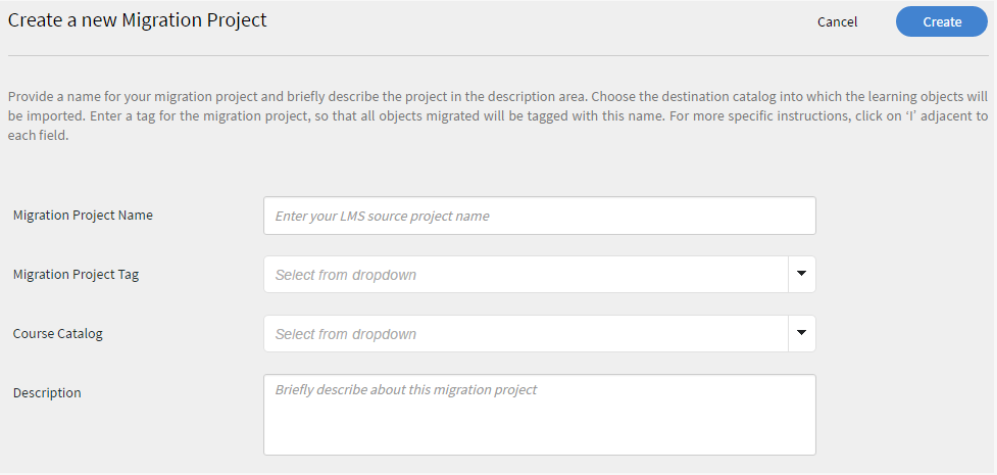

# Learning Manager Deployment Guide - Section 2

Learning Manager Learning Programs are renamed to Learning Paths. This change happens immediately after the October 2021 release and the terminology of Learning Path is reflected for all roles.

## Technical Set up {#technicalsetup}

The technical set up for your Learning Manager account is required mainly for enterprise users. This document talks about configuring single sign on for your organization, and integrating Learning Manager with third-party connectors.

### Configure Single Sign-On {#configuresinglesignon}

As a system admin on the Admin Console, one of your first tasks is to define and set up an identity system against which your end users will be authenticated. As your organization purchases licenses for Learning Manager, you will need to provision those licenses to your end users. And for this, you will need a way to authenticate these users. Perform the following procedure to configure SSO for your users.

1. From the Learning Manager Home page, click **[!UICONTROL **Settings** > **Login Methods**.]**

   

1. Depending on your user type, select either **[!UICONTROL **Internal Users** or **External Users**.]**

    

1. From the **[!UICONTROL **Login**]**drop-down field, select **[!UICONTROL **Single Sign-On**.]**

   

1. To configure the Single Sign-On settings, click **[!UICONTROL **Change**.]**

   

1. In the ****[!UICONTROL IDP-Initiated Authentication URL]**** field, enter the authentication URL given by your service provider.

    

   

1. Click **[!UICONTROL **Upload**]**next to the **[!UICONTROL  **IDP Metadata XML File**]**** **field, and upload your XML file.
1. Click **[!UICONTROL **Save**.]**
1. The SSO authentication is successfully configured for your account. You should be able to login to your Learning Manager account using SSO.

   ***The SSO you configure in Learning Manager should support SAML 2.0.***

## Migration of user data {#migrationofuserdata}

As an administrator, when your enterprise purchases Learning Manager, one of the crucial steps that you need to perform is migration. It is imperative that you move your existing training content and user data to Learning Manager. The following migration workflow helps you leverage the benefits of modern and intuitive LMS without losing any of your organization's legacy data.

Learning Manager allows you to migrate from your existing LMS through a step-by-step wizard, in iterative sprints. You get complete visibility on the status of each sprint to ensure that your learners experience zero downtime while you are migrating your legacy data to Adobe Learning Manager.

To perform the migration workflow, you need the Integration Admin privileges. As an administrator, you can either take up the role of an Integration Admin, or assign this role to another user.

**We can take Shaleen's help here to create a visual.**

1. Prerequisite
1. Evaluation of the existing content and user data
1. Export and map the data from the existing LMS
1. Set up FTP and BOX folders for migration
1. Transfer the learners to Learning Manager
1. Transfer learning content to Learning Manager
1. Transfer remaining data to Learning Manager

 

### Prerequisite {#prerequisite}

Before you start the migration process, you must perform the following prerequisite:

* Extraction of data and content from the incumbent LMS, and transforming the data to the file formats as defined by Learning Manager. 
* Importing of users using FTP and BOX connectors. Integration Admin must ensure that the connectors are configured prior to the migration process.

 

***It is recommended that Administrators try out the migration process in a trial account before migrating the data and content into the Learning Manager production environment. ***

### Evaluating and exporting data {#evaluatingandexportingdata}

The Integration Admin should first look at the data that is available in the current LMS. As the Integration Admin, you can migrate only the following learning objects:

* Module
* Course
* Module version
* Course instance
* Course module
* Skills
* Skill level
* Skill course
* Certification
* Certification course
* Certification commit
* Learning program
* Learning program course
* Learning program instance
* Learning program course instance
* Enrollments
* Certification enrollment
* Learning program enrollment
* User course grades

 

After you evaluate your existing data, you must map this data with the standard CSV specifications in Learning Manager. Download the following sample ***csv-specifications.zip*** file which contains seven excel sheets that are required for this migration. These excel sheets contain specifications with descriptions to make you understand how to map the existing data with the fields in the .csv files.

<!--
<Download link to the zip file>
-->

Ensure that each .csv file contains the data for each field in the prescribed format:

<table> 
 <tbody> 
  <tr> 
   <th width="7%" valign="top">
<strong>No.</strong>
</th> 
   <th width="29%" valign="top">
<strong>Excel sheet name</strong>
</th> 
   <th width="31%" valign="top">
<strong>Description of content</strong>
</th> 
   <th width="31%" valign="top">
<strong>Notes</strong>
</th> 
  </tr> 
  <tr> 
   <td>
1
</td> 
   <td>
module.xlsx
</td> 
   <td>
Metadata for module.csv
</td> 
   <td>
 
</td> 
  </tr> 
  <tr> 
   <td>
2
</td> 
   <td>
course.xlsx
</td> 
   <td>
Metadata for course.csv
</td> 
   <td>
Mention one author name for a given course as sometimes multiple author names are not displayed accurately in the application after migration. 
</td> 
  </tr> 
  <tr> 
   <td>
3
</td> 
   <td>
module_version.xlsx 
</td> 
   <td>
Metadata for module_version.csv
</td> 
   <td>
Ensure that you provide the URL path of the Box account folder where you uploaded the content. 
</td> 
  </tr> 
  <tr> 
   <td>
4
</td> 
   <td>
course_instance.xlsx
</td> 
   <td>
Metadata for course_instance.csv 
</td> 
   <td> </td> 
  </tr> 
  <tr> 
   <td>
5
</td> 
   <td>
course_module.xlsx
</td> 
   <td>
Metadata for course_module.csv
</td> 
   <td> </td> 
  </tr> 
  <tr> 
   <td>
6
</td> 
   <td>
skill.xlsx
</td> 
   <td>
Metadata for skill.csv
</td> 
   <td> </td> 
  </tr> 
  <tr> 
   <td>
7
</td> 
   <td>
skill_level.xlsx
</td> 
   <td>
Metadata for skill_level.csv
</td> 
   <td> </td> 
  </tr> 
  <tr> 
   <td>
8
</td> 
   <td>
skill_course.xlsx
</td> 
   <td>
Metadata for skill_course.csv
</td> 
   <td> </td> 
  </tr> 
  <tr> 
   <td>
9
</td> 
   <td>
Certification.xlsx
</td> 
   <td>
Metadata for Certification.csv
</td> 
   <td> </td> 
  </tr> 
  <tr> 
   <td>
10
</td> 
   <td>
certification_course.xlsx
</td> 
   <td>
Metadata for certification_course.csv
</td> 
   <td> </td> 
  </tr> 
  <tr> 
   <td>
11
</td> 
   <td>
certification_commit.xlsx
</td> 
   <td>
Metadata for certification_commit.csv
</td> 
   <td> </td> 
  </tr> 
  <tr> 
   <td>
12
</td> 
   <td>
learning_program.xlsx
</td> 
   <td>
Metadata for learning_program.csv
</td> 
   <td> </td> 
  </tr> 
  <tr> 
   <td>
13
</td> 
   <td>
learning_program_course.xls 
</td> 
   <td>
Metadata for learning_program_course.csv 
</td> 
   <td> </td> 
  </tr> 
  <tr> 
   <td>
14
</td> 
   <td>
learning_program_instance.xlsx 
</td> 
   <td>
Metadata for learning_program_instance.csv
</td> 
   <td> </td> 
  </tr> 
  <tr> 
   <td>
15
</td> 
   <td>
learning_program_instance_course_instance.xlsx 
</td> 
   <td>
Metadata for learning_program_instance_course_instance.csv
</td> 
   <td> </td> 
  </tr> 
  <tr> 
   <td>
16
</td> 
   <td>
enrollments.xlsx
</td> 
   <td>
Metadata for  enrollments.csv
</td> 
   <td> </td> 
  </tr> 
  <tr> 
   <td>
17
</td> 
   <td>
certification_enrollment.xlsx
</td> 
   <td>
Metadata for certification_enrollment.csv
</td> 
   <td> </td> 
  </tr> 
  <tr> 
   <td>
18
</td> 
   <td>
learning_program_enrollment.xlsx
</td> 
   <td>
Metadata for learning_program_enrollment.csv
</td> 
   <td> </td> 
  </tr> 
  <tr> 
   <td>
19
</td> 
   <td>
User_course_grade.xlsx
</td> 
   <td>
Metadata for User_course_grade.csv
</td> 
   <td>
Provide the required learner records data in the .csv file even though they are not mandatory. Without this info, even if the .csv is processed for migration, the Learning Manager application may not reflect any data. 
</td> 
  </tr> 
 </tbody> 
</table>

***Learning Manager supports date and time values in UTF 8 and 32 bit format only. You may get errors during migration if you specify date in CSV files with an out of range date such as 2038-07-17T08:53:21.000Z or 1980-04-17T08:13:25.322Z.***

### Dependencies while importing data to csv files {#dependencieswhileimportingdatatocsvfiles}

While you are importing the existing data into the standard csv format, be aware of the following dependencies:

* module_version.csv is dependent on module.csv
* course_instance.csv is dependent on course.csv
* course_module.csv is dependent on course.csv, module.csv and module_version.csv
* course_instance.csv is dependent on course.csv
* enrollment.csv is dependent on course.csv
* user_course_grade.csv is dependent on course.csv and module.csv
* skill_course.csv is dependent on course.csv
* skill_level.csv is dependent on skill.csv
* learning_program_instance.csv is dependent on learning program and learning_program_course.csv
* learning_program_course.csv is dependent on learning_program.csv
* learning_program_enrollment.csv is dependent on learning program and learning_program_instance.csv
* learning_program_instance_course_instance.csv is dependent on learning_program.csv, learning_program_instance.csv and course_instance.csv
* certification_course.csv is dependent on certification.csv and course.csv
* certification_commit.csv is dependent on certification.csv and certification_course.csv 
* certification_enrollment.csv is dependent on certification.csv, certification_course.csv and certification_enrollment.csv

 

After you export the data, save the .csv files in your local computer. The files are now ready to be dropped in the FTP or BOX folders.

## Set up FTP and BOX folders for the migration {#setupftpandboxfoldersforthemigration}

Before you plan and start your actual migration of all the content, you must set up the FTP and BOX folders first. You need these folders to drop your .csv files in these folders. Once your legacy content, in the form of .csv files, are available in the FTP and BOX folders, Learning Manager can consume the data.

### Set up an FTP account {#setupanftpaccount}

In the Integration Admin Home page, click **[!UICONTROL **Request for CSV FTP Folder**.]** In the pop-up dialog box that appears, enter your email ID. Go through the online wizard to create the Exavault FTP account. As soon as you create your account, you can view your migration project and sprint project folders in Exavault FTP. 

See a sample snapshot of the project files and folder of ExaVault as shown here:

When you successfully set up the FTP folder, the system displays the "FTP folder setup is complete" message.

## Set up a BOX account {#setupaboxaccount}

To create a BOX account and setup a BOX folder, perform the following steps:

In the Integration Admin Home page, select Migration.

In the Setup section, click Request for a Box folder.

In the ****[!UICONTROL Enter Email]**** field, enter the email ID where you would like to receive the log in instructions for connecting to Box.

Click **[!UICONTROL **Connect**.]**

You would receive an email from Box with a link to the shared folder. If you do not have a box account, click SignUp and create an account. Login instructions are then sent to the Integration Admin Email ID.

After you save the connection, the migration page displays the message: "Box folder setup is complete".

## Migrating the content to Learning Manager {#migratingthecontenttocaptivateprime}

Before you start the migration, it is important to note the following: 

* Only one migration project can be active in an account at any given point in time. Within a project, only one sprint can be active at any given point in time.
* You cannot undo a Run that is already in process. However, you can use the existing delete option within each feature of Learning Manager to undo any data or content migration. 

As soon as the migration project starts, the project moves into a state of 'Under Migration'. In this state, no other user other than the Integration Admin can log in to Learning Manager. 

Upload training content to Content folders:

In the Integration Admin Home page, click **[!UICONTROL Migration.]**

In the Migration Home page, the system displays the migration projects that are already created in your organization.

Click **[!UICONTROL **New**]**in the upper-right corner of the page, to create a migration project.

***If you have not created an FTP folder already, you will be prompted to create an FTP folder Exavault account. This is mandatory step before you start creating a migration project. ***

In the ****[!UICONTROL Create a New Migration Project]**** page, specify the name for your project.

Specify a tag for your project, the course catalog, and provide a description for the migration project. Your migration data items are identified using the Migration Project Tag. If you do not have any specific course catalog choose the default catalog from the drop-down, all the courses that you migrate using a migration project will be included in the catalog that you choose at this stage. If you do not choose any catalog, all the migrated courses will be part of the default catalog.

Click **[!UICONTROL Create.]**

In the Sprint Configuration page, create a sprint for your migration project. A Sprint, in Learning Manager migration process, defines a set of migration items that you have chosen to migrate from the existing LMS.

Specify a name for the sprint, and provide a description for the sprint.

Select the ****[!UICONTROL Users have been added or modified since the last run check box]****, to synchronize the list of users with the Learning Manager application. If you are migrating content and data into Learning Manager application, this may not be required. But, if there is a time lapse between your earlier sprint migration to the latest sprint migration, it is recommended that you choose to synchronize the list of users. This step enables the Learning Manager database to be in sync with your LMS users.

***The Synchronization step is recommended when enrollment.csv and user_course_grade.csv are migrated. This step enables the Learning Manager database to be in sync with your Migration database and ensures that all users whose records to be migrated in the Sprint are available in the Migration database.***

Click **[!UICONTROL **Next**.]**

Click **[!UICONTROL **Start**]**to start the Sprint migration with your uploaded data and content. Click ****[!UICONTROL Refresh]**** before you start the Sprint Run to sync up the FTP and Content folders with Learning Manager. 

You can click ****[!UICONTROL Stop]****at any point in time during Sprint migration process to abort the sprint migration. 

The system displays the Migration status against each of the sprint data items and content. Check the number of success and failed items as part of migration sprint run.

If you are uploading module content, ensure that the path of content folder is provided in the *module_version.csv *file. If you miss this step, you may face errors during migration. For example, if you are uploading a self-paced module content such as videos, then you need to specify the relative Box URL path in *module_version.csv *file.

A sample snapshot of the migration progress is provided below for your reference. As shown in the snapshot, you can view the number of records processed for each migration data item along with success and failed items status. Click Download error records against the failed items to download and view the error logs. You can fix the issues in CSV and upload again in FTP. 

To view the list of all the sprints of a migration project, click **[!UICONTROL **Sprint**]**in the left navigation pane. You can view a list of all the sprints, the number of Runs you executed for each sprint, the start date, duration and completion status as shown in the sample snapshot below.

To view the list of all the sprints of a migration project, click **[!UICONTROL **Sprint**]**in the left navigation pane. You can view a list of all the sprints, the number of Runs you executed for each sprint, the start date, duration and completion status as shown in the sample snapshot below.

To view the list of all the sprints of a migration project, click **[!UICONTROL **Sprint**]**in the left navigation pane. You can view a list of all the sprints, the number of Runs you executed for each sprint, the start date, duration and completion status as shown in the sample snapshot below.

***Before marking the migration project as complete ensure that all the sprints in the project are complete. Once you mark the migration project as complete, you cannot go back and create any sprints in that project. You cannot make any modifications to that project. You can only create another migration project and add sprints to it.***

After migrating the learning data and content from your organization's legacy LMS, verify whether the data and content are imported properly. You can verify by logging in as an Administrator and verifying the availability of imported modules and courses data and content

For useful resources on migration, refer the following:

* Troubleshooting migration issues
* FAQ on uploading CSVs

