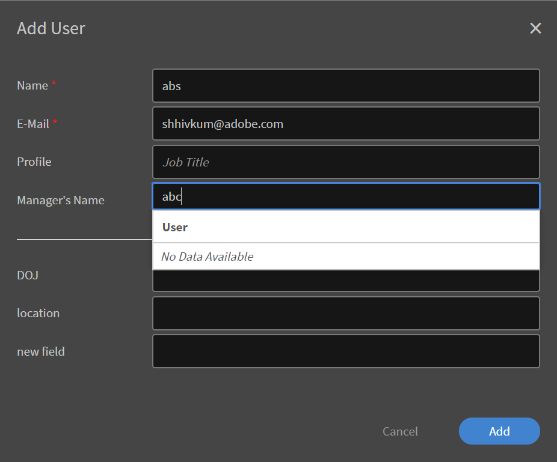

# Set up users in Learning Manager {#set-up-users-in-learning-manager}

## Internal and external users {#internalandexternalusers}

In any LMS, including Learning Manager, managing users is an important aspect. Learning Manager allows you to classify users as internal and external. Internal users are those users that belong to a specific organization or a group. Generally, users within an enterprise are internal users. These users have specific learning objects with specific deadlines, as assigned by their managers or the administrator.

In contrast, external users are generally temporary users of a specific Prime account. These users might access specific learning objects by clicking a temporary, external link that they receive over email. The external user profiles usually have an expiry date. For example, an organization that conducts certifications for Java may have any user who temporarily logs in to complete relevant courses and then attempt the certification. Usually, classroom trainings and courses meant for external users also have limited capacity.

Read on to know how to add internal users and external users in Prime.

## Set up external users {#setupexternalusers}

As an administrator, you might want to add external users such as employees of partner organizations to your Learning Manager account. To add external users:

1. From the **[!UICONTROL **Administrator**]**login page, click **[!UICONTROL **Users**]**in the left navigation pane.
1. In the **[!UICONTROL **Users**]**page, click **[!UICONTROL **External**]**in the left navigation pane. The system displays the External Users page with a list of external users (if applicable).
1. Click **[!UICONTROL **Add**]**in the upper-right corner of the page.

   

1. In the **[!UICONTROL **Add User**]**pop-up dialog box, the following fields are mandatory:

   * **[!UICONTROL **Profile Name**:]**Specify the name for the external profile that you are creating.
   * **[!UICONTROL **Manager Email**:]** Specify the email address of the manager for the external user.
   * **[!UICONTROL **Seats Allotted**:]** Specify the number of learners who can enroll for the course.
   * **[!UICONTROL **Expiry**:]** Specify the expiry date after which an external user cannot register or consume the course.

1. Click **[!UICONTROL **Advanced Settings**.]**
1. Optionally set the following options when you create an external profile:

   * **[!UICONTROL **Add Image**:]** Drag-and-drop the image that you want. This image is displayed in the Learner page for users.
   * **[!UICONTROL **Login Requirement**:]** Specify the number of days within which the user needs to login. If the external user exceeds this login period, the learner cannot access or consume the learning object.
   * **[!UICONTROL **Allowed Domains**:]** Specify the domains separated by a comma. Only those users with the specified domains can register to the account.
   * **[!UICONTROL **Email Verification Required**:]** Select this check box if you want a verification email to be sent to users

    

1. Click **[!UICONTROL Save.]**

    

   

   A pop-up dialog box with the URL is displayed. You can copy this URL and send it to the external users. By default, an email with this URL is sent to the user.

1. As you add external profiles, they are displayed in the **[!UICONTROL **External Users page** (**Administrator** > **Users** > **External**). ]** The seat limit, expiry date, and login requirement are also displayed for these users.
1. To edit the settings of an external user anytime, click on the user name. The **[!UICONTROL Edit External Enrollment]** dialog box appears. Modify the settings, and click **[!UICONTROL **Save**.]**
1. You can also resend the Welcome email or copy the URL anytime by clicking the email/copy URL icons next to the external profile.

   

## Pause the external user profile {#pausetheexternaluserprofile}

After adding an external user group to Learning Manager, you can also pause the external users registration process. When you pause, the external users registration process is blocked. However, this process works only when the users haven't registered yet by accepting the invitation. 

To pause the external user groups, click  **[!UICONTROL **Actions** ]**from the upper-right corner of the page and choose **[!UICONTROL Pause]**.

## Resume external user profile {#resumeexternaluserprofile}

At any point in time, you can always revoke the blockage (pause) by choosing a Resume option. Click  **[!UICONTROL **Actions** ]**at the upper-right corner of the page and choose **[!UICONTROL Resume]**. 

**[!UICONTROL External user states]**

In Learning Manager, the following states are applicable for external users: 

* **Inactive state** - In this state, the external users registration is expired. Administrators set the expiry date for the external users while adding them through the add user workflow. 
* **Active state** - In this state, the external users can register to the Learning Manager application, and also log in to the application. 
* **Pause** - In this state, the registration process for external users is blocked. However, the existing users can continue to login. 

## Set up internal users {#setupinternalusers}

As an administrator, you might want to set up users for your enterprise or organization. These users are also called as internal users. Internal users can login to the application either using Single Sign On or using Adobe ID. These users can then access and consume the learning objects as per their requirements. To set up internal users for an organization, there are three possible ways:

* Adding users in bulk using a CSV
* Adding users through self-registration
* Adding a single internal user

 

## Adding users using a CSV file {#addingusersusingacsvfile}

You can choose this method to add internal users if the number of users are large. When you use a CSV to add users for the first time, you must map the csv data contents to the application labels. Subsequently when you add new users or update the user data, the same mapping is retained. To add internal users in bulk:

1. On the **[!UICONTROL Administrator Home]** page, click **[!UICONTROL **Users**]**in the left navigation pane.
1. Click **[!UICONTROL **Add** > **Upload a CSV**.]**
1. In the pop-up dialog box, click **[!UICONTROL **Import**. ]**
1. Browse to the location where you have saved your CSV file. Click **[!UICONTROL Open]**.
1. Import the CSV file, and map the contents of the CSV file with the application labels. This step is applicable only when you upload the CSV file for the first time.
1. Click **[!UICONTROL **Save**]**to save the mapping.
1. Click **[!UICONTROL **Add**]**to upload the CSV file that is already mapped to the application data.

### Considerations when creating the CSV file for upload: {#considerationswhencreatingthecsvfileforupload}

When you create the CSV file for uploading internal users, the following are some of the mandatory fields for which you must enter data: Employee's Name, Employee's Email, Employee's Profile or Designation, and Manager Hierarchy.

The name and email of each employee can be mapped directly to the application data. Note that you must specify an email that is specified in the CSV file, as the Manager Email. You can either define the Manager ID when you create the CSV file, or you can specify the email ID that corresponds to the Manager ID when you upload the CSV file.

***Before you add an ID as an employee's Manager ID, ensure that the Manager is added as an employee in the CSV file.***

***Ensure that there are no extra spaces between entries to successfully upload the CSV file.***

See a sample snapshot of a CSV file here:

To download a sample CSV file, download `<give link to zip file>`.

<!--Zip file reference, no source file-->

### Setting up root user {#settinguprootuser}

Automating the bulk import of users.

## Adding users through self-registration {#addingusersthroughselfregistration}

Apart from adding internal users in bulk, you can also add users by self-registration. You can use self-registration to enable employees to register themselves as learners to your Learning Manager account. When you create a self-registration profile, a unique URL is created. Share this URL with the employee to enable them to register in Learning Manager.

1. On the **[!UICONTROL Administrator Home]** page, click **[!UICONTROL Users]** in the left navigation pane.
1. Click **[!UICONTROL **Add** > **Self-Registration**.]**

   

1. In the **[!UICONTROL Add User]** pop-up dialog box, specify the name of the employee in the **[!UICONTROL Profile Name]** field.
1. In the **[!UICONTROL Manager's Name]** field, enter the name of the employee's manager.
1. Optionally, you can add the profile picture of the employee using the **[!UICONTROL Add Image]** field.
1. Click **[!UICONTROL Save]**.

   

   The system displays another pop-up dialog box with the message that the profile has been created successfully. A unique URL is also generated in this dialog box.

1. Share this URL with the employee to enable the employee to self-register as a learner.

   

## Add single users in Learning Manager {#addsingleusersincaptivateprime}

Adding single users is the third method by which you can add internal users to your account. When you want to add a few users, this procedure is ideal. To add a single user:

1. On the **[!UICONTROL Administrator Home]** page, click **[!UICONTROL Users]** in the left navigation pane.
1. Click **[!UICONTROL **Add** > **Single User**.]**

    

1. In the Add User pop-up dialog box, specify the following details for users:

   * **[!UICONTROL Name]** **[!UICONTROL :]** Specify the name of the employee or internal user. This field is mandatory.
   
   * **[!UICONTROL Email]** **[!UICONTROL :]** Specify the email ID of the employee. This field is mandatory.
   
   * **[!UICONTROL Profile]** **[!UICONTROL :]** Specify the designation or the job title of the employee.
   
   * **[!UICONTROL **Manager's Name**:]** Specify the name of the Manager. The Manager should already be added in the database to be specified here.
   * **[!UICONTROL **DOJ**:]** Specify the date of joining of the employee.
   * **[!UICONTROL **Location**:]**Specify the location of the employee. For example, if you have your organization in several geographical locations, specify the location where the employee is located.

    

   

1. Click **[!UICONTROL Add]**.
1. The system displays a message that the user has been added successfully. The user receives a verification link in the specified email ID. The user can click this link to activate his account, and start accessing Learning Manager.

   

## Managing user groups in Learning Manager {#managingusergroupsincaptivateprime}

User group is nothing but a set of users pertaining to a defined category. As an administrator, you can use user groups to select learners quickly based on their attributes. Further, you can quickly assign logos or catalogs to the group of users, and generate customized reports on their progress. 

There are two types of user groups in Learning Manager: Custom and Auto-generated. When you add learners to your account, some default groups are automatically created based on the roles and properties of the users in your account. These groups are the auto-generated. For example, a group with all learners, or all authors.

***You cannot edit the name and the description of auto-generated groups.***

To view the Auto-generated user groups in Learning Manager, in the left pane click **[!UICONTROL Auto-generated]**. The application displays a list of all the auto-generated user groups that are available for your account.

You can also create custom groups with a selected list of users in Learning Manager. Custom groups allow you to specify a name, description and the attributes for the user group. Custom groups that you create in Learning Manager are dynamic in nature. That is, if new users are added with similar attributes, they are automatically added to these user groups. 

## Create custom user groups {#createcustomusergroups}

1. In the Learning Manager Administrator Home page, click **[!UICONTROL Users]**.
1. In the Custom User Groups page, click **[!UICONTROL **Add**]**from the upper-right corner of the page.

   The system displays the **[!UICONTROL Add User Group]** dialog box.

   

1. Specify the name and the description for your user group. For example, Dev-Users which includes users from the product development team.
1. Add users to the custom user group by entering the user name or the profile of the user in the **[!UICONTROL **Add Users** field.]**
1. To add more users to the custom group, click **[!UICONTROL **Add More Users**.]**
1. After adding all the users, click **[!UICONTROL Save]**to save the custom user group.

