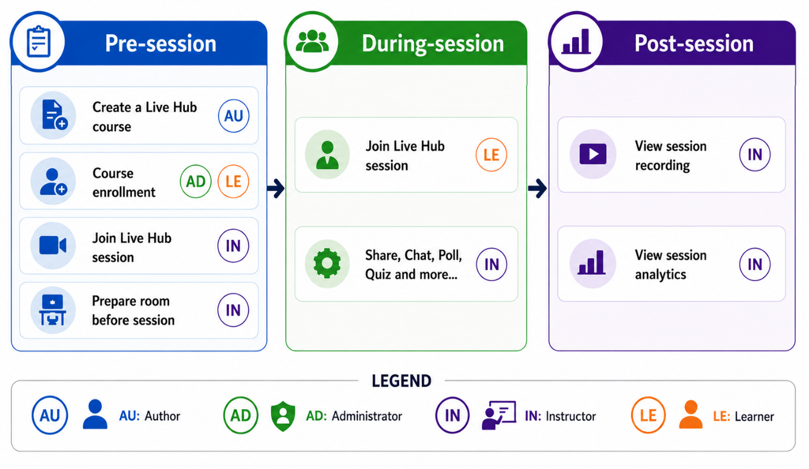

# About Live Hub in Adobe Learning Manager

Live Hub in Adobe Learning Manager enables organizations to deliver live, instructor-led training directly within the platform, without requiring external tools for core delivery.

It provides a seamless, browser-based experience for Instructors and learners, combining session delivery, collaboration, and engagement tools in a single environment.

## The challenge

Organizations often rely on multiple tools for course management, session delivery, and collaboration. This creates friction across the training workflow:

* Context switching between disconnected platforms

* Increased setup and configuration complexity

* Limited visibility into learner engagement and participation

Live Hub is designed to remove this friction by bringing course delivery, collaboration, and tracking into one place.

## What is Live Hub

Live Hub is a built-in virtual training solution that allows you to:

* Create and deliver live training sessions within Adobe Learning Manager.

* Manage Instructors, Learners, and sessions in one place.

* Use integrated tools for communication, collaboration, and engagement.

* Track participation and performance without switching systems.

Unlike third-party integrations, Live Hub is fully embedded into the learning workflow, offering a more unified experience.

## How Live Hub works

Delivering a Live Hub course involves four roles, each responsible for a distinct part of the workflow:

* **Author**: Creates the Live Hub course.

* **Administrator**: Enrolls learners into the course.

* **Instructor**: Prepares the room, conducts the session, engages learners, and reviews recordings and analytics.

* **Learner**: Joins the session and participates in activities such as chat, polls, quizzes, whiteboards, and breakout sessions.

## Live Hub session workflow

A Live Hub session follows three key stages: **Pre-session**, **During-session**, and **Post-session**. Each stage includes specific tasks for Authors, Administrators, Instructors, and Learners to ensure a smooth learning experience.

| **Stage** | **Key activities** |
|----|----|
| **Pre-session** | Author creates the Live Hub course, the Administrator enrolls Learners, and the Instructor prepares the room by configuring layouts, content, and interactive activities for the upcoming session. |
| **During-session** | Instructor delivers the live session and engages Learners using features such as chat, polls, quizzes, whiteboards, screen sharing, and breakout rooms. Learners participate in these activities throughout the session. |
| **Post-session** | Instructor reviews session recordings, attendance reports, and engagement analytics to assess learner participation and evaluate the session's effectiveness. |
