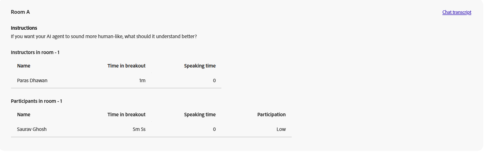

# Components of the Session dashboard

## Overview

The Session dashboard in Live Hub consists of multiple sections that provide detailed insights into session performance and learner engagement.

Each component helps Instructors analyze participation, understand learner behavior, and evaluate the effectiveness of Live Hub sessions.

## Session summary

The Session summary provides an overview of live and recorded sessions, including session recordings. It includes details such as the number of enrolled and joined learners, session duration, attendance over time, participant engagement, and recording views.

Select **Session summary (PDF)** to download the summary.

 to download the summary.")

You can view the following details:

* **Session duration**: View the total live session duration and the average attended duration across learners.

* **Attendance**: View the number of enrolled learners, along with those who joined and those who did not.

* **Attendance over time**: View how attendance changed throughout the session, including the peak attendance and the total number of participants.

* **Participant engagement**: View how learners engaged during the session, including the number of answered polls, chat interactions, questions asked, quizzes submitted, and reactions sent.

### Recordings

View insights related to session recordings. These insights help you understand learner engagement and recording consumption. You can also download the recording and access reports for further analysis.

* **Total views**: The total number of times the recording has been viewed, along with the number of unique viewers.

* **Viewers who also attended the live session**: The number of learners who attended the live session and later watched the recording. Select **Download list** to view the learner list.

* **Average view duration**: The average amount of time learners spent watching the recording.

From the recording options, the following actions are available:

* Select **Download** to download the recording.

* Select **Edit recording** to modify the recording. It opens the recording in the recording player.

## Interactions

View how learners interact and engage in the session from Interactions. Track responses to polls, Q&A metrics, and attendee reactions across the engagement tools.

Select **Interactions** in the left panel to view how attendees are engaged.

The Interactions dashboard consists of the following tabs:

### Polls

The Polls tab allows you to view questions and responses added to the poll. You can also download a report of all poll interactions from the **Polls** tab. The report includes:

* Participant details, including first name, last name, and email address.

* The poll number, poll type, and poll question.

* Each participant's response to the poll.

### Quizzes

The tab allows you to view the quiz metrics during a live session. It contains the following panels:

* Download a report of quiz interactions in ZIP format.

* View an illustration showing learners who submitted the quiz, did not complete it, or have not attempted it.

* The number of questions in the quiz. Select **View list** to view all the questions.

* Select **View detailed report** to view participant reports by question list, questions, leaderboard, and individual responses.

* Average accuracy of the answer. Select **View leaderboard** to view scores.

* Average time taken to attempt a quiz.

## Breakouts

View how learners participated in breakout sessions during the live class. This section provides a summary of the breakout activity along with detailed insights for each breakout session.

* **Breakout sessions**: Total number of breakout sessions conducted during the session.

* **Duration of breakouts**: Combined duration of all breakout sessions.

* **Participants across breakouts**: Number of participants who took part in breakout sessions.

Select **Breakouts Report (PDF)** to download the report.

For each breakout session, you can view the session name, its duration, and its start time. You can also view:

* **Participants**: Total number of participants in the breakout session.

* **Participation distribution**: Breakdown of participants by participation level. The available levels are High, Moderate, and Low.

* **Rooms**: Number of breakout rooms created.

Select **View details** to expand a breakout session and see room-level insights. Select **Hide details** to collapse it again.

### Breakout room details

In the expanded view, each room displays the following:

* **Instructions**: The prompt or activity given to participants in the room.

* **Chat transcript**: Select **Chat transcript** to view the chat exchanged in the room.

* **Instructors in room**: A table listing each instructor's name, time in breakout, and speaking time.

* **Participants in room**: A table listing each participant's name, time in breakout, speaking time, and participation level.

## Other Interactions

Select **Download interaction reports** from the top-right dropdown to download the **Q&A** and **Reactions** report.

### Q&A metrics

View the following attributes of the Q&A metrics:

* Total questions asked.

* The number of unanswered questions.

* The number of attendees who asked questions.

* The number of attendees who asked more than one question, who are likely to be the top prospects.

* Average time taken to answer a question.

### Reactions

View Learner reactions during the session, including agreement, disagreement, applause, and laughter.

View the following details on the graph:

* Total reactions.

* Number of attendees who reacted at least once.

* Total clicks.

* Unique attendees.

* A graphical representation of the total clicks on every reaction done by unique attendees.

## Participant activity

The **Participant activity** section provides a consolidated view of individual learner engagement during the session. It helps Instructors analyze participation levels and track learner interactions across different activities.

From the left panel, select **Participant activity** to view detailed learner-level insights. Select **Participant activity report (CSV)** to download the complete report.

The table displays the following information for the learner activity:

* **Participant details**: Name and email ID of the participant.

* **Duration attended**: Percentage of session attended by the participant.

* **Polls answered**: Number of polls the participants responded to.

* **Quizzes submitted**: Number of quizzes submitted by the participant.

* **Overall quiz score**: Score obtained by the participant in quizzes.

* **Speaker time**: Duration for which the participant spoke during the session.

* **Camera time**: Duration for which the learner's camera was active.

* **Questions asked**: Number of questions asked by the participant.

* **Reactions**: Number of reactions shared by the participants.

* **Have doubt reactions**: Number of times the participant indicated doubt during the session.

## Reports

Download reports for different activities from a centralized hub as an Instructor. These reports capture attendee interactions and engagement during live and recorded performances.

To download reports:

1.  From the left panel, select **Download reports**.

1.  Select **Download all (.zip)** to download a combined report for all activities.

      to download a combined report.")

1.  Select the download icon next to each report to download them individually.
