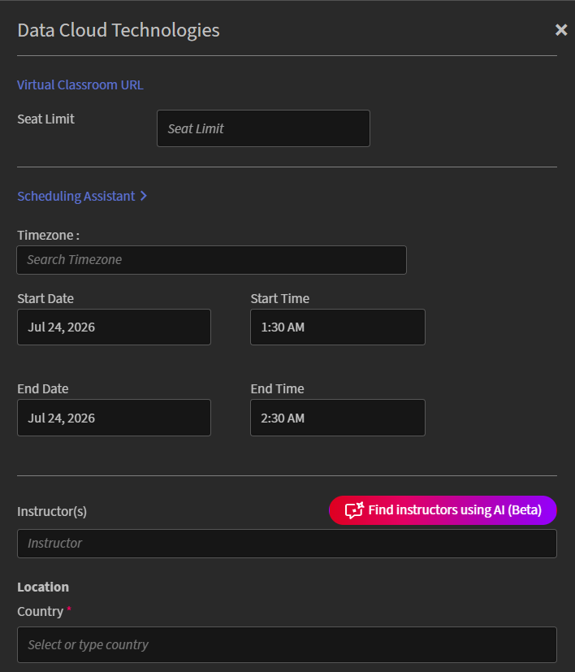

# Create a Live Hub session

Use Live Hub to deliver live, instructor-led training within an Adobe Learning Manager course. You can combine Live Hub sessions with self-paced content to create a blended learning experience.

When you add a Virtual Classroom module to a course, select the virtual training tool that will host the live session. You can choose **Live Hub**, Adobe's built-in AI-powered virtual training solution, or use an external provider such as **Adobe Connect**.

>[!NOTE]
>
> Live Hub appears as a Live Virtual Training Tool option only if your Administrator has enabled it in the Live Hub settings. If it isn't enabled, use an external provider such as Adobe Connect instead. View [Enable Live Hub](../administrators/feature-summary/enable-live-hub.md) for more information.

When creating a Live Hub course, you can:

* Add one or more Live Hub sessions to a course.

* Select Instructors manually or use AI-assisted instructor recommendations.

* Configure the course with a single default instance or create multiple instances for different schedules or audiences.

This article explains how to create a Live Hub course, assign Instructors, and configure course instances.

## Create a Live Hub course

A default instance is created automatically when you add a Virtual Classroom module. This is useful when you want to deliver a single session or a standard schedule for all learners.

To create a Live Hub course:

1.  Sign in to Adobe Learning Manager as an Author.

1.  Select **Create Courses**.

1.  On the **Course Catalog** page, select **Add**, and then enter the following details:

    1.  Course name

    1.  Brief description

    
    *Enter the course name and brief description before adding modules to the course.*

1.  Select **Content** > **Add Modules** in the **Modules** section. The **Select Module Type** pop-up window appears.

1.  Select **Virtual Classroom** and enter the course details, including title, description, timezone, start and end date, and start and end time.

1.  Select **Live Hub** in **Live Virtual Training Tools**.

    
    *Select Live Hub to enable AI-powered instructor recommendations for the session.*

1.  Add Instructors by using one of the following options:

    1.  Enter Instructor names in the **Instructors** field.

    1.  Select **Find instructors using AI** to view AI-recommended Instructors. See [Add Instructors using Instructor Finder](#add-instructors-using-instructor-finder) for more information.

1.  Select **Add** > **Save**.

1.  Select the required skills in the **Course Skills** section.

1.  Select the **Skill Level**, and then review or update the **Max Credits**.

    
    *Assign a skill and skill level to define the credits learners earn by completing the course.*

1.  Select **Save** > **Publish**. The course is created successfully in Adobe Learning Manager.

## Create a course instance

An Administrator can create one or more instances of a course to offer it to different audiences, schedules, or locations. Each instance has its own session details, so you can assign different Instructors, Instructor Finder recommendations, and timings to each instance of the same course.

To create a course instance:

1.  Sign in to Adobe Learning Manager as an Author.

1.  Open the course, and then select **Instances** from the left panel.

    
    *The Default Instance is created automatically when you add a Virtual Classroom module.*

1.  Select **Add New Instance**.

1.  Enter the **Instance Name**, **Start Date**, and **Completion Deadline**. Select **Show More Options** to configure additional settings.

    
    *Enter an instance name, start date, and completion deadline to create a new course instance.*

1.  Select **Save**. The new instance is added to the **Instances** list.

    
    *The new instance appears alongside the Default Instance in the Instances list.*

1.  Select the number under **Sessions** to view the **Session Details**.

    
    *Session details show which timing, instructor, and location fields still need to be configured.*

1.  Select the edit (pencil) icon next to the session details to open the session configuration panel.

    
    *Configure the schedule, instructor, and location for a specific session instance.*

1.  In the **Instructors** field, enter names manually, or select **Find instructors using AI** for AI-recommended Instructors. See [Add Instructors using Instructor Finder](#add-instructors-using-instructor-finder) for more information.

1.  Enter the **Location** details, and then select **Save**. The session is updated with the configured timings, Instructor, and location details.

## Add Instructors using Instructor Finder

Instead of searching for and adding Instructors manually, use **Instructor Finder** to receive AI-powered Instructor recommendations for the session. Instructor Finder matches instructors based on the course details and required skills, while also considering the organization's holiday calendar, Instructor availability, and Instructor utilization to suggest the most suitable instructors. View [Add and manage Instructors](./instructor-management.md) for more information.

>[!NOTE]
>
> Instructor Finder appears only if your Administrator has enabled the Instructor Finder Assistant in the Live Hub settings. View [Enable Live Hub](../administrators/feature-summary/enable-live-hub.md) for more information.

To add Instructors using Instructor Finder:

1.  Navigate to the **Instructors** section in the **Virtual Classroom** module.

1.  Select **Find Instructors using AI**. The **AI Assistant** panel opens on the right side.

    
    *Use the AI Assistant panel to get instructor and time-slot recommendations based on the session's details.*

1.  Review the list of recommended Instructors. Instructor Finder recommends Instructors based on the course skills and session requirements. Recommendations also consider Instructor availability, utilization, and your organization's holiday calendar. View **Instructor management** for more information.

1.  Navigate to the Instructor that you want to assign, and then select **Add**. The selected instructor is added to the **Instructors** field as a tag.

## Enroll learners in the course

Learners can be enrolled in a Live Hub course in the following two ways:

1.  An **Administrator** enrolls Learners in the course based on organization requirements. View [Create course instances and learning paths](https://experienceleague.adobe.com/en/docs/learning-manager/using/admin/courses) for more information.

1.  Learners can directly enroll themselves in the course from the **Catalog** page. If the course is configured for self-enrollment, Learners are enrolled immediately and can access the course from **My Learnings**. View [My Learnings](https://experienceleague.adobe.com/en/docs/learning-manager/using/learner/courses) for more information.

After enrollment, Learners are added to the course and receive a notification in their Adobe Learning Manager account. Depending on the account's email notification settings, Learners may also receive an invitation to join the course via email.

## Customize Live Hub room branding

Administrators can customize the appearance of Live Hub rooms to align with your organization's branding. Use the **Themes** settings in Adobe Learning Manager to apply brand colors, logos, and visual styling across Live Hub sessions.

Customized branding helps create a consistent learning experience and ensures that live training sessions reflect your organization's identity.

For more information about configuring themes, see the [Color themes](../administrators/feature-summary/themes.md#color-themes) article.
