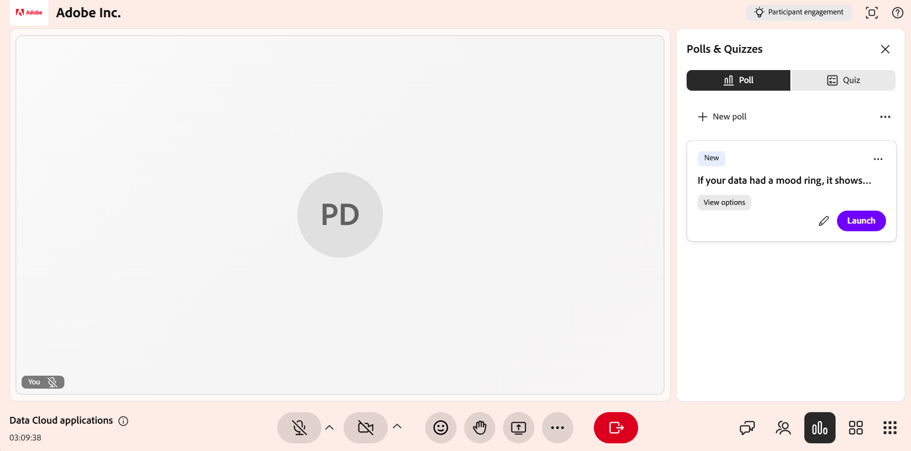

# Create and launch a poll

Use polls to make your Live Hub sessions more interactive and engaging. From the **Polls & Quizzes** panel, you can create polls manually by selecting question types such as multiple choice or short answer, or generate them using AI with **Icebreaker** and **Knowledge check** options.

During a live session, you can launch and close polls, monitor responses in real time, review participant answers, and choose whether to share results with Learners. This article explains how to create, manage, and share polls during a Live Hub session.

## Create a poll manually

Create polls to ask questions and collect responses from Learners during a live session. You can create polls in advance or on the fly to check understanding, gather feedback, and encourage participation.

To create a poll manually:

1.  Select the **Polls & Quizzes** panel from the control bar.

1.  Select the **Poll** tab and then select **Build your own**.

    
    *Select Build your own in the Poll tab to create a poll manually.*

1.  In the **Poll** tab, select one of the following question types from the dropdown:

    1.  Multiple choice

    1.  Short answer

1.  Configure the poll based on the selected question type:

    1.  **Multiple choice**: Enter each answer option on a separate line. By default, three option fields are available. You can do the following:

        1.  To add more options, select **Add option**.

        1.  To allow multiple selections, enable **Multiple correct answers**.

    1.  **Short answer**: No answer options are required. Learners enter responses in a text field.

1.  Select **Save**.

## Create a poll using AI

You can use AI-assisted options in the **Polls & Quizzes** panel to generate poll questions without creating them manually. Two AI poll types are available:

* **Icebreaker poll**: Generates introductory or conversational questions to encourage participation at the start of a session or when resuming after a break.

* **Knowledge check poll**: Generates knowledge check questions to help Instructors understand how well Learners are following the topic and adjust their approach if needed.

### Create an Icebreaker poll

Create an Icebreaker poll to engage Learners at the beginning of a session. Icebreaker polls help Instructors understand learner preferences, expectations, or prior knowledge, and encourage participation early in the session.

To create an Icebreaker poll:

1.  Open the **Polls & Quizzes** panel.

1.  Select the **Poll** tab and then select **Icebreaker poll**.

1.  Review the generated question and answer options and modify them if needed. You can do the following:

    * Edit the question.

    * Update or remove existing answer options.

    * Change the question type to **Short answer**.

    * Select **Add option** to include additional choices.

    * Enable **Multiple correct answers** in case of multiple-choice questions.

    
    *Generate and customize an Icebreaker poll with AI in the Poll tab.*

1.  (Optional) Select **Regenerate poll** to generate a new question.

1.  (Optional) Use the thumbs-up or thumbs-down options to provide feedback on the generated content.

1.  Select **Save**.

### Create a Knowledge check poll

Create a Knowledge check poll to assess learner comprehension during a session and evaluate how well Learners have understood a topic. These polls help Instructors identify knowledge gaps, validate key concepts, and adjust the session's pace or focus based on learner responses.

To create a Knowledge check poll:

1.  Open the **Polls & Quizzes** panel.

1.  Select the **Poll** tab and then select **Knowledge check**.

1.  Review the generated question and answer options and modify them if needed. You can modify the following:

    * Edit the question.

    * Update or remove existing answer options.

    * Change the question type.

    * Select **Add option** to include additional choices.

    * Enable **Has multiple answers** in case of multiple-choice questions.

    
    *Generate and customize a Knowledge check poll with AI in the Poll tab.*

1.  (Optional) Select **Regenerate poll** to replace the current question with a new one.

1.  (Optional) Use the thumbs-up or thumbs-down options to provide feedback on the generated content.

1.  Select **Save**.

## Launch a poll

Once a poll is created and saved, it appears in the **Polls & Quizzes** panel, under the **Polls** tab. You can access saved polls at any time during the session and launch them to engage Learners and collect responses in real time.

To launch a poll:

1.  Open the **Polls & Quizzes** panel.

1.  Select the **Poll** tab.

1.  Select a saved poll from the list.

1.  Select **Launch poll**.

>[!NOTE]
>
> The poll becomes visible to Learners, and Instructors can view the poll results in real time. Learners can update their responses while the poll remains live.

*Select Launch poll to start collecting responses during the session.*

## Share poll results with participants

You can share poll results with participants at any time during the session. Select **Share results to all participants** to make the results visible in real time. When results are shared, the poll displays a **Results live** tag, indicating that Learners can view the poll outcomes.

*Select Share results to all participants to display poll results in real time.*

## Close a poll

When you no longer want participants to respond, you can close the poll.

To close a poll:

1.  Open the **Polls & Quizzes** panel.

1.  Navigate to the active poll in the **Poll** tab.

1.  Select **End poll**.

*Select End poll to stop collecting responses and close the poll.*

After the poll ends, the **Closed** status appears above the poll question.

## View poll results

As an Instructor, you can view poll results during a session. These results are updated in real time as Learners submit or update their responses. By default, the poll view displays the overall distribution of responses for each option.

To view detailed responses:

1.  Open the **Poll** tab.

1.  Select the active or closed poll.

1.  Select **View responses**.

A pop-up window opens showing the participant names, their selected answers, and multiple entries for questions that allow multiple responses.

*View participant names and their selected answers in the Poll responses window.*

Learners can view the poll results in real time as responses are submitted or updated.

## Manage a closed poll

After a poll is closed, you can manage it from the options menu (the three dots) on the poll. These options let you reuse the poll, create a copy, or remove it from the session.

To manage a closed poll:

1.  Select the **Poll** tab from the **Polls & Quizzes** panel.

1.  Navigate to the closed poll and select the options (**...**) menu.

    
    *Use the options menu to Reset, Duplicate, or Delete a closed poll.*

1.  Select one of the following options:

| **Option** | **Description** |
|----|----|
| **Reset** | Permanently deletes all responses to the poll while keeping the poll itself intact. Use this to run the same poll again and collect a fresh set of responses. |
| **Duplicate** | Creates a copy of the poll, including its question-and-answer options, so you can reuse or adjust it without building it again from scratch. |
| **Delete** | Permanently removes the poll and all its responses from the session. This action cannot be undone. |

>[!NOTE]
>If you encounter an error while duplicating, deleting, or resetting a poll, see [Troubleshooting guide for Live Hub](../kb/troubleshooting-guide-for-live-hub.md#poll-tab-issues) for a list of common error messages and how to resolve them.
