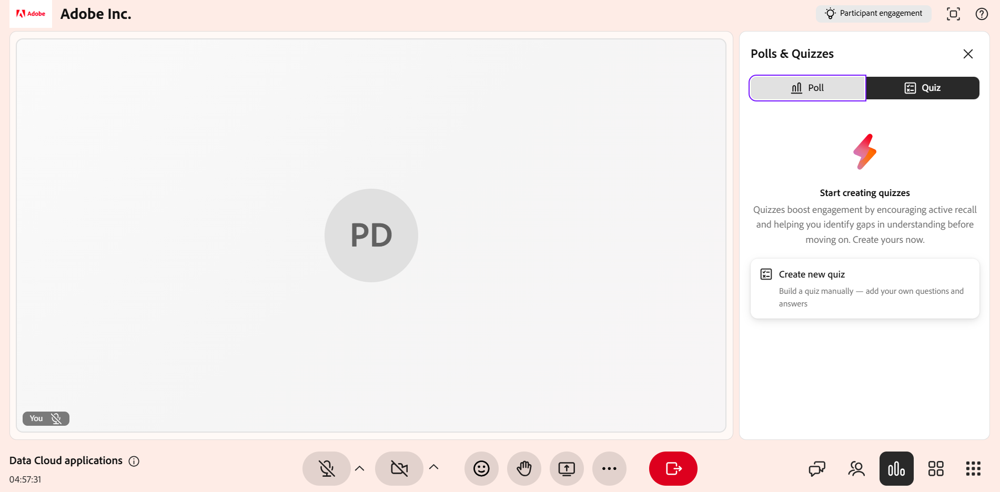

# Create and manage a quiz in Live Hub

As an Instructor, the Quiz feature lets you measure how well learners have grasped a topic during a Live Hub session. Unlike a quick single-question poll, a quiz lets you build a structured, multi-question assessment with multiple-choice and multiple-answer questions, scoring, and settings such as time limits and randomized question or option order.

This article walks through every quiz action available to Instructors, from creating a quiz to sharing its results.

## Create a quiz

You can create a quiz to assess learner understanding during a session. Quizzes can include different question types and support scoring to track performance. If no quizzes are available, you can create a new quiz from the **Quiz** tab.

To create a quiz:

1.  Select the **Quiz** tab from the **Polls & Quizzes** panel.

    

1.  Select **Create new quiz**. A new quiz titled **Untitled Quiz 1** opens.

1.  In the question field, enter your question.

1.  Enter your answer options in the Option fields. Three options are provided by default. You can:

    1.  Select **+ Add option** to add another option.

    1.  Select the **X** next to an option to remove it.

    1.  Drag the handle beside an option to reorder it.

1.  Mark the correct answer:

    1.  To set a single correct answer, select the radio button next to the correct option.

    1.  To allow more than one correct answer, enable the **Multiple correct answers** toggle, and then select the radio button for each correct option.

1.  To add additional questions, select **+ Add question**.

    

1.  Select **Done**.

1.  Select **Save**. The quiz is now available to launch.

## Set a time limit for the quiz

You can set an optional time limit so that learners must complete the quiz within a fixed duration. The time limit is set from the timer at the top of the quiz.

To set a time limit:

1.  Select the Timer icon at the top of the quiz.

1.  Enable **Set time limit**.

1.  Set the duration in minutes.

## Edit a quiz

Update questions, modify answer options, or reorder questions before launching the quiz. Once the quiz is launched, it cannot be edited.

To edit a quiz:

1.  Select the **Quiz** tab.

1.  Navigate to the quiz you want to edit.

1.  Select the edit (pencil) icon.

1.  Perform any of the following actions:

    1.  Edit the question text.

    1.  Update or remove answer options.

    1.  Select the correct answer(s).

    1.  Add a new question using **Add question**.

    1.  Delete a question if it is no longer required.

    

1.  Select **Save** to apply the changes.

## Launch a quiz

After you create and save a quiz, it appears in the **Quiz** tab with a **New** label. Launching makes the quiz visible to learners and allows them to attempt questions in real time.

To launch a quiz:

1.  Select the **Quiz** tab.

1.  From the saved quiz list, select **Launch quiz**.

When you launch a quiz, it appears in the **Polls & Quizzes** panel for learners to answer. If a time limit is set, you can also extend the quiz duration by selecting **+1 min** during the live quiz.

## View quiz results

View quiz results during and after a session to monitor learner performance and participation. Results are updated in real time as learners attempt and complete the quiz.

To view quiz results:

1.  Select the **Quiz** tab from the **Polls & Quizzes** panel.

1.  Navigate to the active or completed quiz.

1.  Select **View results**.

The **Quiz** panel shows the results with the following details:

* Learner profiles

* Number of questions attempted

* Scores

* Time taken to complete the quiz

### View detailed responses for a learner

Select an individual learner from the results list to view detailed responses. You can see how the learner answered each question.

## Close a quiz

Use this option to end an active quiz when learners have completed their responses or when you want to stop submissions.

To close a quiz:

1.  Select **Close quiz**. The quiz stops immediately for all learners.

1.  The quiz status updates to **Closed**.

## Share quiz results with learners

You can share quiz results with learners after you end or close the quiz. To make the results visible to everyone, enable the **Share results with participants** toggle.

When result sharing is enabled, the quiz is labeled with a **Results live** tag. This means that the results are being displayed to learners.

## Manage a quiz

You can manage a saved or closed quiz from its options (**...**) menu in the **Polls & Quizzes** panel. These options let you clear responses, reuse the quiz, or remove it from the session.

To manage a quiz:

1.  Select the **Quiz** tab from the **Polls & Quizzes** panel.

1.  Navigate to the quiz and select the options (**...**) menu.

    

1.  Select one of the following options:

| **Option** | **Description** |
|----|----|
| **Reset** | Permanently deletes all responses to the quiz while keeping the quiz itself intact. Use this to run the same quiz again and collect a fresh set of responses. |
| **Duplicate** | Creates a copy of the quiz, including its questions and answer options, so you can reuse or adjust it without building it again from scratch. |
| **Delete** | Permanently removes the quiz and all its responses from the session. This action cannot be undone. |
