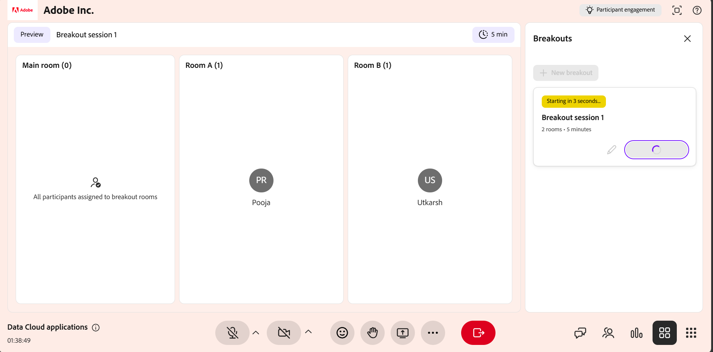
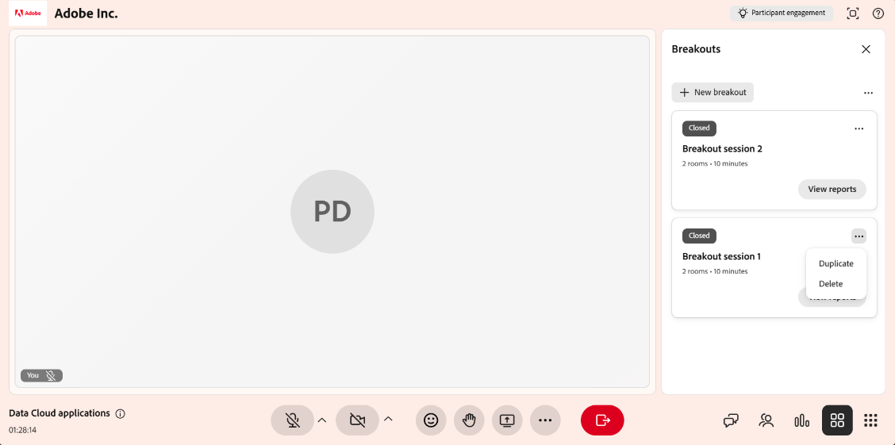
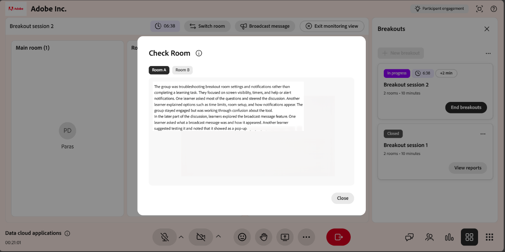
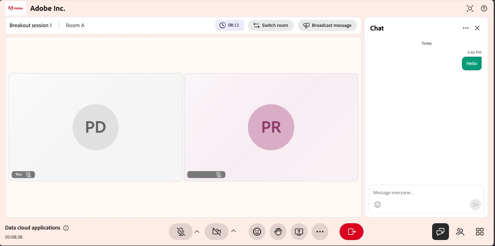
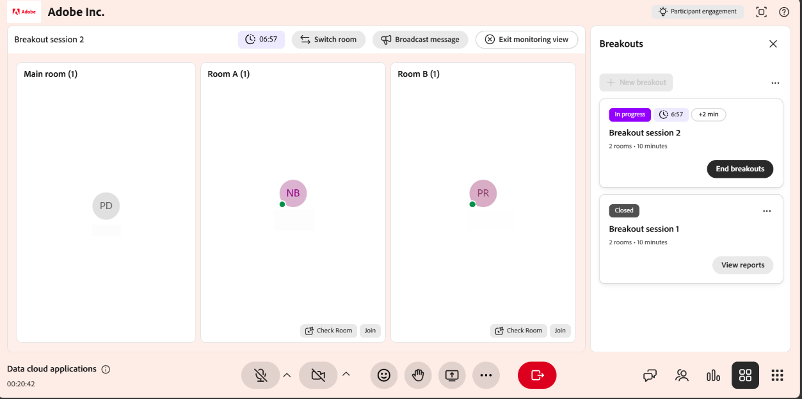
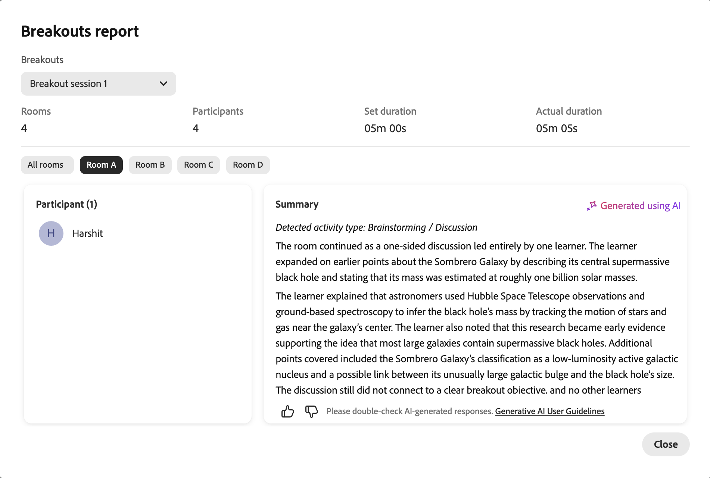

# Create and manage breakout sessions

Instructors can split a Live Hub session into smaller, interactive groups for focused activities and discussion. You can create breakout rooms, automatically or manually assign learners, set activity instructions, and control how long the session runs. While a breakout session is active, you can monitor rooms with AI-generated summaries, join a room to share your screen or chat, and extend the session.

This guide walks through every breakout room action available to Instructors, from creating a room to reviewing the session report.

## Create a breakout session

Breakout sessions split a virtual classroom into smaller, interactive groups. Follow these steps to create one.

To create a breakout session:

1.  Select **Breakout sessions** from the control bar.

    
    *Live Hub interface showing the Breakout panel.*

1.  Select **Set up a breakout session**.

The Breakouts panel opens. From here, you can configure breakout rooms, assign learners, and manage breakout session settings.

## Design a breakout session

Before starting a breakout session, configure rooms, assign learners, and define the activity details using the **Breakouts** panel. Proper configuration helps place learners correctly and understand the objective of each breakout activity.

To design a breakout session:

1.  Select **Breakout** from the control bar. The Breakouts panel opens.

    
    *Breakouts panel showing the options to configure the breakout rooms.*

1.  Configure the breakout rooms using the following options:

| **Option** | **Description** |
|----|----|
| Edit icon | Select the edit icon to rename the breakout session. |
| **Rooms** | Set the number of breakout rooms using the increase or decrease controls. The maximum is **10** rooms. |
| **Duration** | Define how long the breakout session will run. The minimum duration is **5 minutes**, and the maximum is **60 minutes**. |
| **Assign participants** | Select **Auto-assign** to automatically assign participants to rooms. You can also drag and drop a learner to move them to a different room. |
| **Set individually for rooms** | Customize instructions separately for each breakout room. |
| **Instructions** | Describe the activity and outline the expected outcome for the breakout session. |
| **View room allocations** | Preview how learners will be distributed across breakout rooms before the session starts. |
| **Start breakouts** | Start the breakout session and move learners to their assigned rooms. |
| Discard icon | Discard the current breakout configuration without saving changes. |

1.  Select **Save**. The breakout session appears in the **Breakouts** panel with a **New** tag.

## Start a breakout session

Once the breakout session is configured and saved, it appears in the **Breakouts** panel. Start the session to move learners into their assigned rooms.

To start a breakout session:

1.  Open the **Breakouts** panel.

1.  Navigate to the breakout session with the **New** tag.

1.  Select **Start breakouts**. A notification shows **Starting in 5 seconds**, and learners are then moved to their assigned breakout rooms with the configured setup applied.

    
    *Select Start breakouts to start the breakout session.*

## Manage breakout sessions

After you save a breakout session, it appears in the **Breakouts** panel. Each saved session shows its status (**New** or **Closed**), the number of rooms, and the duration. From this panel, you can edit, duplicate, or delete a session as needed.

### Edit a breakout session

Use this option to update an existing breakout configuration. Editing is available for sessions with the **New** status.

To edit a breakout session:

1.  Open the **Breakouts** panel.

1.  Navigate to the breakout session you want to change.

1.  Select the edit (pencil) icon on the session.

    
    *Select the Edit (pencil) icon to update the breakout session configuration.*

1.  Update the configuration as needed, such as the number of rooms, the duration, or the instructions.

1.  Select **Save**.

### Duplicate a breakout session

Reuse an existing breakout setup by duplicating a previously created session.

To duplicate a session:

1.  Open the **Breakouts** panel.

1.  Navigate to the breakout session that you want to duplicate.

1.  Select the more options (**...**) icon on the session.

    
    *The More options menu shows Duplicate actions.*

1.  Select **Duplicate**.

A new session is created with the same room configuration, participant assignments, instructions, and duration. The copied breakout room appears at the top of the panel with the **New** status and a name such as **Breakout session 1 (Copy)**.

### Delete a breakout session

Use this option to remove a breakout session that is no longer required.

To delete a breakout session:

1.  Open the **Breakouts** panel.

1.  Navigate to the saved breakout session.

1.  Select the more options (**...**) icon on the session.

1.  Select **Delete**. A confirmation pop-up window appears.

    
    *Select Delete from the confirmation pop-up window to delete a breakout session.*

1.  Select **Delete**.

## Manage activities in an active breakout session

During an active breakout session, Instructors can monitor room activity, communicate with learners, and collaborate with participants by joining individual breakout rooms. Most collaboration tools available in the main session, such as Chat, Screen sharing, and the whiteboard, are also available in breakout rooms and work in the same way.

### View AI-generated summaries of breakout rooms

Instructors can view AI-generated summaries of discussions in each breakout room to monitor learner conversations, assess alignment with the activity, and decide when to join a room. The summaries update automatically throughout the session as discussions unfold.

To view summaries:

1.  Navigate to the room that you want to review.

1.  Select **Check Room**. A **Check Room** pop-up window appears with the summary of the room.

    
    *Check Room pop-up window displays the summary of the room.*

1.  (Optional) Select another room. The summary updates to display details for the selected room.

### Use collaboration tools in breakout rooms

After joining a breakout room, Instructors can use the same collaboration tools that are available in the main session to guide and interact with learners. You can:

* Chat with learners to answer questions and facilitate discussions. See [About the Chat panel](./about-the-chat-panel.md) for more information.

* Share your screen or presentations to explain concepts or demonstrate tasks. See [About the screen sharing](./about-the-screen-sharing.md) for more information.

* Collaborate using the whiteboard for brainstorming, annotations, and interactive activities. See [About the whiteboard](./about-the-whiteboard.md) for more information.

## End a breakout session

You can end the breakout session at any time.

1.  Navigate to the **Breakouts** panel.

1.  Select **End breakouts** in the active breakout session. All learners are moved back to the main room, and the breakout session ends for all participants.

    
    *Breakout session 2 showing End breakouts options to end the breakout session.*

## View a breakout session report

After the breakout session ends, select **View report** to view a detailed session summary. The report includes room-wise summaries, participant details, instructions shared during the session, and an overview of session duration and activity.

To view a breakout session report:

1.  Navigate to the closed breakout session in the **Breakouts** panel.

1.  Select **View reports**. The Breakouts report pop-up window opens with the rooms report.

    
    *Breakouts reports pop-up window showing the breakout rooms report.*

All breakout session insights are also available in the **Session dashboard**, where you can review summaries, analyze participation, and track session outcomes after the session. See [Components of the Session dashboard](./components-of-the-session-dashboard.md) for more information.

## Extend a breakout session

If more time is required, you can extend the breakout session while it is active by selecting **Extend time by 2 minutes** from the breakout controls to increase the session duration. You can extend the session up to two times during each breakout session. The updated duration is applied immediately, allowing learners to continue their activities without interruption.
