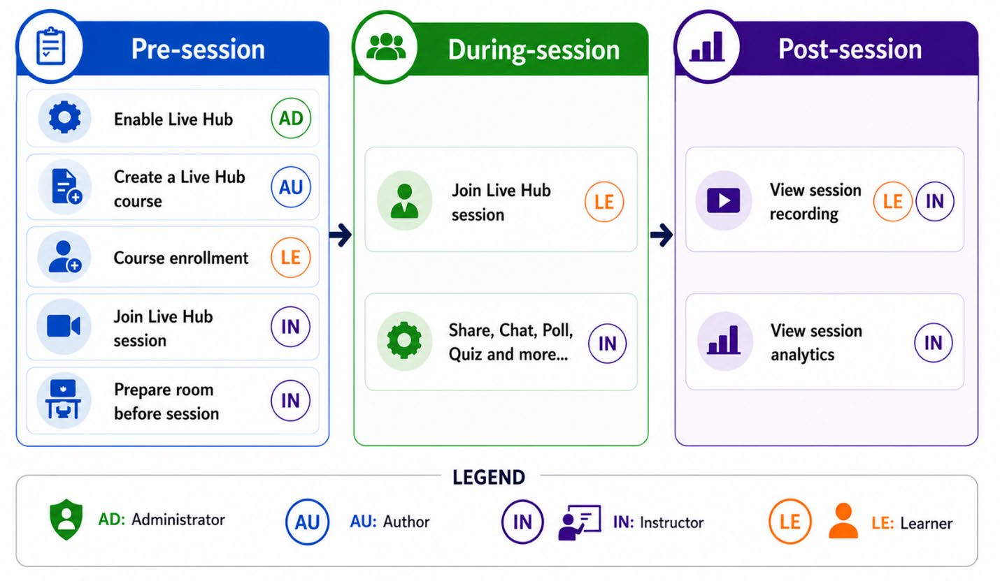

# Getting started with Live Hub

Live Hub in Adobe Learning Manager enables organizations to deliver live, instructor-led training directly within the platform, eliminating the need for external tools for core session delivery.

It provides a seamless, browser-based experience for Instructors and Learners, combining session delivery, collaboration, and engagement tools in a single environment. This integrated approach helps organizations streamline training delivery, reduce administrative overhead, and maintain visibility into learner participation throughout the learning journey.

Many organizations rely on separate tools for course management, session delivery, and collaboration. This can introduce challenges such as:

- Switching between multiple platforms for training
- Additional setup and configuration requirements
- Limited visibility into learner engagement and participation

Live Hub addresses these challenges by bringing course delivery, collaboration, engagement, and tracking into one unified experience within Adobe Learning Manager.

## What is Live Hub

Live Hub is a built-in virtual training solution that allows you to:

- Create and deliver live training sessions within Adobe Learning Manager.
- Manage Instructors, Learners, and sessions in one place.
- Use integrated tools for communication, collaboration, and engagement.
- Track participation and performance without switching systems.

Unlike third-party integrations, Live Hub is fully embedded into the learning workflow, offering a more unified experience.

## How Live Hub works

Delivering a Live Hub course involves four roles, each responsible for a distinct part of the workflow:

- **Administrator**: Enables Live Hub for the Learning Manager account. View [Administrators in Live hub session](./administrator.md) for more information.
- **Author**: Creates the Live Hub course. View [Authors in Live Hub session](./authors-in-live-hub-session.md) for more information.
- **Instructor**: Prepares the room, conducts the session, engages learners, and reviews recordings and analytics. View [Instructors in Live Hub session](./instructors-in-a-live-hub-session.md) for more information.
- **Learner**: Joins the session and participates in activities such as chat, polls, quizzes, whiteboards, and breakout sessions. View [Learners in Live Hub session](./learners-in-live-hub-session.md) for more information.

## Live Hub session workflow

A Live Hub session follows three key stages: **Pre-session**, **During-session**, and **Post-session**. Each stage includes specific tasks for Administrators, Authors, Instructors, and Learners to ensure a
smooth learning experience.

|**Stage**|**Key activities**|
|---|---|
|**Pre-session**|The Administrator verifies that the [system requirements](./system-requirements-for-live-hub.md) are met and [enables Live Hub](../administrators/feature-summary/enable-live-hub.md) for the account. They can also enroll the Learners to a course. The Author [creates the Live Hub course](create-a-live-hub-session.md), and the Instructor prepares the room by [configuring layouts](./understand-the-live-hub-layout.md), content, and interactive activities for the upcoming session.|
|**During-session**|Instructor delivers the live session and engages Learners using features such as [chat](about-the-chat-panel.md), [polls](./about-the-polls.md), [quizzes](./about-the-quiz.md), [whiteboards](./about-the-whiteboard.md), [screen sharing](./about-the-screen-sharing.md), and [breakout rooms](./about-the-breakouts.md). Learners participate in these activities throughout the session. The Instructor can [record the session](./record-a-session.md) to make it available for learners to view later.|
|**Post-session**|Instructor reviews session recordings, attendance reports, and [engagement analytics](./view-the-session-dashboard.md) to assess Learner participation and evaluate the session's effectiveness. Learners can revisit the session through a [topic-based recording](./view-recordings-as-a-learner.md) view that splits the recording into navigable topics, each with a title, overview, and notes, so they can jump to any topic or read it instead of watching.|

>[!NOTE]
>Live Hub is also available on the Adobe Learning Manager mobile app, with some feature limitations. For supported mobile capabilities, see [Live Hub mobile experience](./live-hub-mobile-experience-for-learners.md). To optimize your Live Hub experience, see [Best practices for a Live Hub session](./best-practices-for-a-live-hub-session.md).