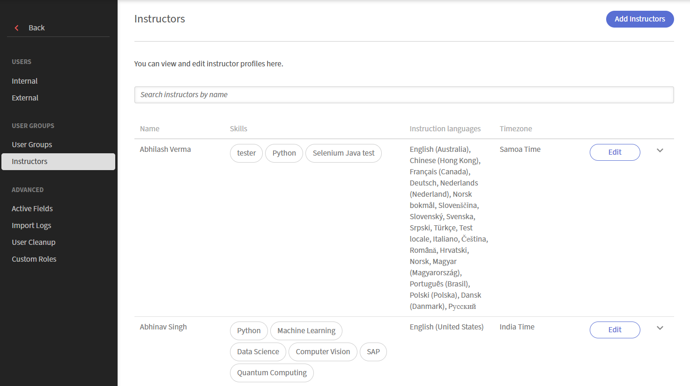
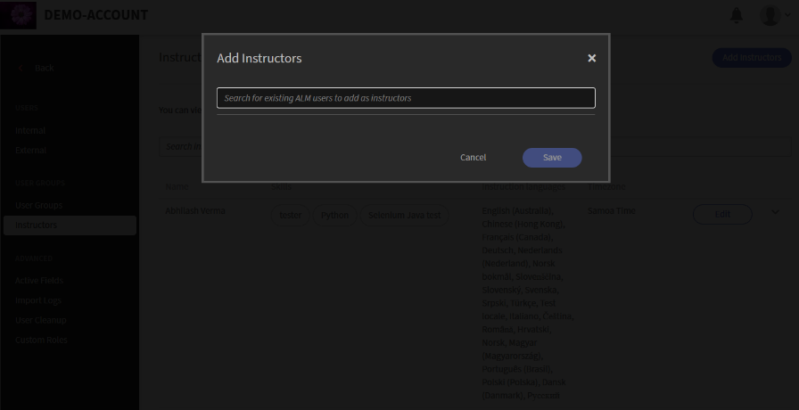
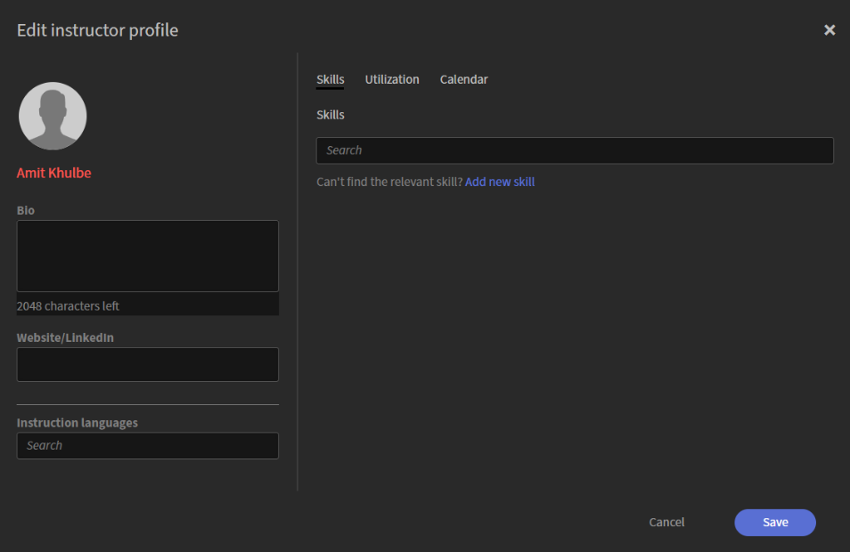
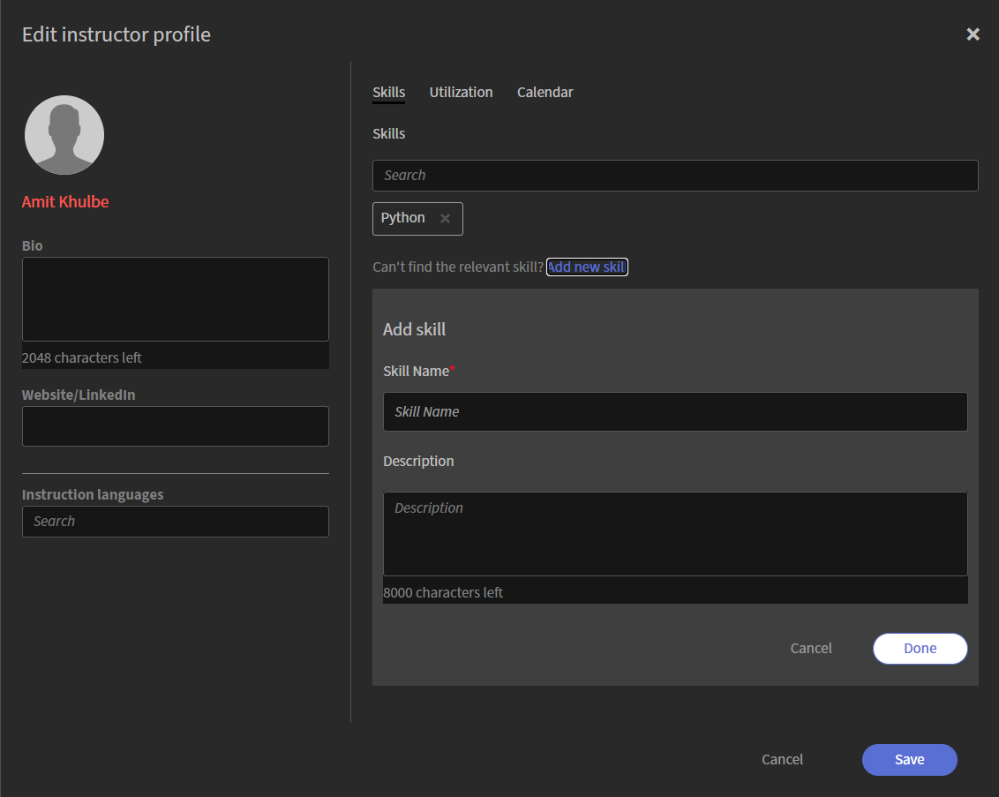
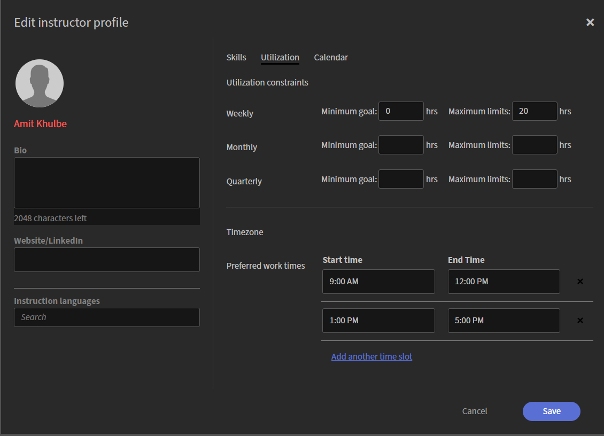
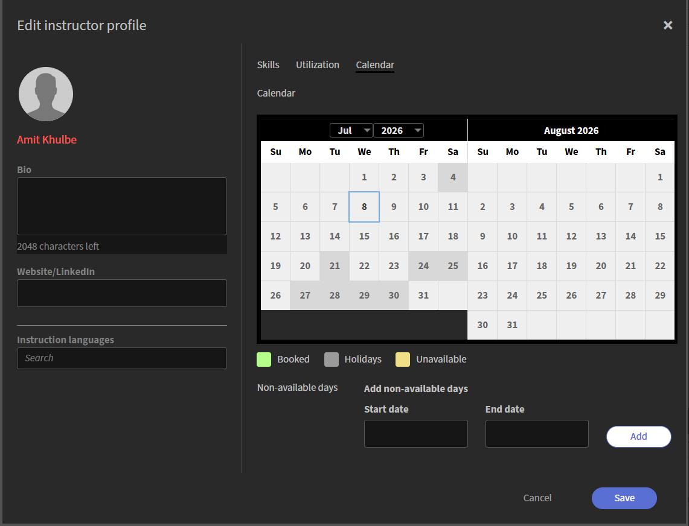

# Add and manage Instructors

Instructors deliver live sessions and engage learners in Live Hub. To support accurate scheduling and effective course delivery, Administrators can add Instructors, build their profiles, define teaching skills and languages, and configure availability.

The Instructors tab provides a single place to manage this information across your organization. From here, you can add existing Adobe Learning Manager users as Instructors, review and update their profiles, and keep their skills, languages, and availability up to date as teaching needs evolve.

## Access the Instructors tab

Follow these steps to view and manage Instructors:

1.  Log in to Adobe Learning Manager.

1.  Navigate to **Admin** > **Users**.

1.  Select **Instructors** in **User Groups**.

     
    *Select Instructors in User Groups to view and manage Instructors.*

## Add an Instructor

Instructors are created from existing Adobe Learning Manager users. If a user does not yet have Instructor permissions, add them as an Instructor.

To add an Instructor:

1.  Select the **Instructors** tab from **User Groups**.

1.  Select **Add Instructors**. A pop-up window of **Add Instructors** appears.

     
    *Search for a user by name and select them to assign the Instructor role.*

1.  Search for the user by name and select the user from the search results to assign the Instructor role.

1.  Select **Save**. The user is now assigned the Instructor role and appears in the Instructors list.

### Set up an Instructor profile

An Instructor profile defines the Instructor's teaching information, languages, skills, utilization, and availability. Completing the profile ensures accurate Instructor matching, efficient scheduling, and alignment with course requirements.

To set up an Instructor profile:

1.  Search the Instructor name in the Instructors tab.

1.  Select **Add skills and other details**. An **Edit instructor profile** pop-up window appears.

     
    *The Edit instructor profile window includes tabs for basic details, skills, utilization, and availability.*

#### Add basic details

Basic details appear in the left panel of the dialog box and are always visible, regardless of which tab is open.

To add the basic details:

1.  Navigate to the profile section.

1.  Enter the following details:

| **Fields** | **Action** |
|----|----|
| **Bio** | Enter a short description of the Instructor (up to 2,048 characters). |
| **Website/LinkedIn** | Enter an external profile or reference link. |
| **Instruction languages** | Search for the languages the Instructor can teach in. The selected languages appear as tags. |

### Add Instructor skills in the profile

Skills define the subject areas and expertise an Instructor can teach. This plays a key role in matching Instructors to relevant courses and ensuring that the right Instructor is assigned based on course requirements.

To add Instructor skills:

1.  Navigate to the **Skills** tab.

1.  Type a skill name in the **Search** field. This populates a list with the skills.

1.  Select skills from the list. The selected skills appear as tags.

1.  Select **Save**.

#### Create a new skill

If the required skill is not available, you can create it directly from the profile.

To add a new skill:

1.  Select **Add new skill** from the **Skills** tab. An **Add skill** panel opens.

     *Enter a skill name and description, then select Done to add the new skill.*

1.  Enter the following details in the **Add skill** panel:

    1.  Skill Name

    1.  Description

1.  Select **Done**. The new skill has been added and appears as a tag.

1.  Select **Save**. The skills are added to the Instructor profile.

### Configure Instructor utilization

Use the **Utilization** tab to define an Instructor's teaching capacity and preferred working hours. You can set utilization constraints to establish teaching goals and limits and specify preferred work times to indicate when the Instructor is available to conduct sessions. The displayed time zone is inherited from the Instructor's user profile.

To configure Instructor utilization:

1.  Navigate to the **Utilization** tab.

1.  Enter the **Minimum goals** and **Maximum limits** (in hours) for the **Monthly** period.

1.  Enter a **Start time** and **End time** for the preferred time slot.

    
    *Enter a start time and end time for the Instructor's preferred working hours.*

1.  (Optional) Select **Add another time slot** to add additional availability.

1.  Select **Save**. The Instructor's utilization constraints and preferred work times are updated.

### Manage Instructor availability

Use the **Calendar** tab to add the Instructor's schedule and mark periods when the Instructor is unavailable. The calendar uses color coding to identify **Booked**, **Holidays**, and **Unavailable** dates.

To mark unavailable days:

1.  Navigate to the **Calendar** tab.

1.  Select a start date and an end date in the **Add non-available days** section.

    
    *Select a start date and end date to mark a range as unavailable on the Instructor's calendar.*

1.  Select **Add**. The selected date range is marked as unavailable on the calendar.

1.  Select **Save**. The Instructor's availability settings are updated.
