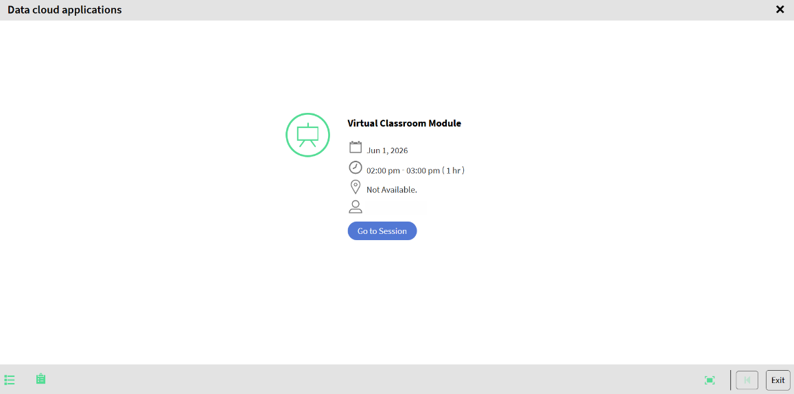

# Join a Live Hub session as a Learner

Learners join a Live Hub session directly from the course they are enrolled in. Once you join, you take part in the live training through chat, polls, quizzes, whiteboards, and breakout rooms.

## Join the session

1.  Sign in to Adobe Learning Manager.

1.  Navigate to **My Learnings**.

1.  Select the enrolled course.

    
    *Select Go to Session to open the Live Hub pre-join screen.*

1.  Select **Start** > **Go to Session**. The Live Hub joining interface opens.

1.  (Optional) Test the microphone and apply the virtual background. See [Set up the pre-join screen in Live Hub](./setup-pre-join-screen-in-live-hub.md) for more information.

1.  Select **Join**.
