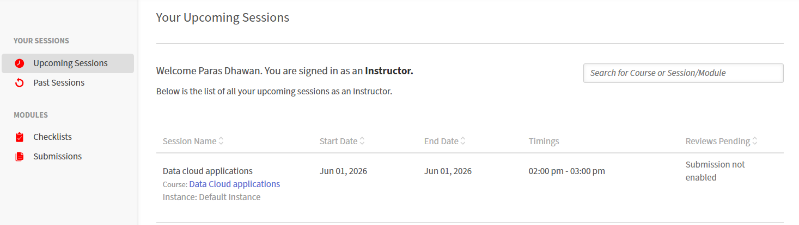
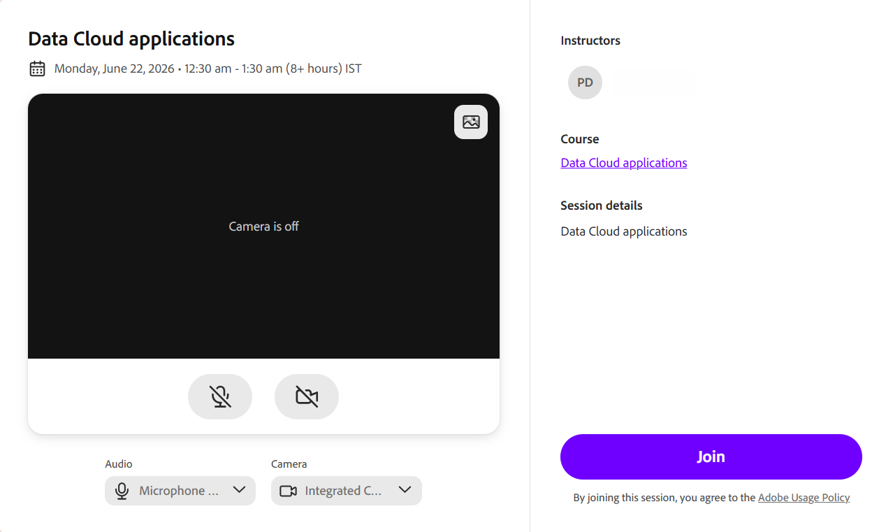

# Join a Live Hub session as an Instructor

Instructors can enter the virtual classroom before the scheduled start time to prepare the room, configure learner permissions, captions, polls, quizzes, and breakouts, and set up their own audio and video before learners arrive.

## Join the session

Instructors can join the room before the scheduled session starts to prepare the session and configure the required settings before Learners join.

1.  Sign in to Adobe Learning Manager.

1.  Select the scheduled Live Hub session from **Upcoming Sessions**.

    
    *Select Upcoming Sessions to open the classroom joining URL.*

1.  Select the session from the listed ones. The **Session Overview** page opens.

    
    *The Session Overview page shows the options to enter the Live Hub session.*

1.  Select **Enter classroom** from the Live hub. The Live Hub joining interface opens.

    
    *The pre-joining screen of Live Hub.*

1.  (Optional) Test the microphone and apply the virtual background. See [Set up the pre-join screen in Live Hub](./setup-pre-join-screen-in-live-hub.md) for more information.

1.  Select **Join**.
