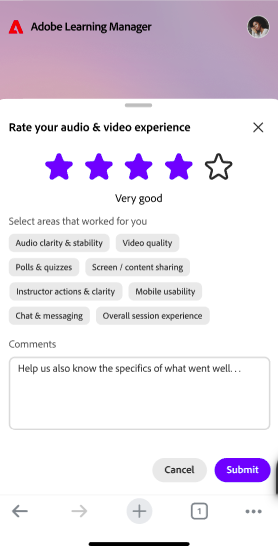

# Live Hub mobile app experience for Learners

Use the Adobe Learning Manager mobile app to join and participate in Live Hub sessions from your iOS or Android device. During a session, you can interact with Instructors and participants, respond to polls and quizzes, collaborate in breakout rooms, and access shared content directly from your mobile device.

>[!NOTE]
>
> The mobile app supports core Live Hub participation features. Some capabilities available in the desktop experience may not be available on mobile devices.

## Learner experience on mobile

The following table summarizes the Live Hub features available to Learners in the mobile app.

| **Feature** | **Mobile experience** |
|----|----|
| Join sessions | Join Live Hub sessions from the Adobe Learning Manager mobile app. |
| Audio and video | Turn your microphone and camera on or off and select available audio devices. |
| Chat and questions | Participate in chat conversations and submit questions during the session. |
| Reactions and hand raise | Send reactions and raise your hand to engage with the Instructor. |
| Polls | Respond to polls published during the session. |
| Quizzes | Attempt quizzes launched by the Instructor. |
| Breakout rooms | Join assigned breakout rooms, collaborate with other participants, request Instructor assistance, and view breakout summaries. |
| Whiteboard and shared content | View and interact with content shared during the session. |
| Miro boards | View Miro boards shared by the Instructor. |
| Closed captions | Turn closed captions on or off during the session. |
| Screen sharing | View content shared by Instructors or participants. |
| Session recordings | Access recordings when they are made available after the session. |

## Join a Live Hub session

Join your scheduled Live Hub session from the Adobe Learning Manager mobile app.

Before joining, you can review your camera, microphone, and audio device settings to ensure they are configured correctly.

*Review your camera, microphone, and audio device settings before joining a Live Hub session on mobile.*

>[!NOTE]
>
> Virtual backgrounds and background blur effects are not supported in the mobile app.

## Navigate the session interface

After joining a session, the main session view displays participant video tiles or shared content along with controls for communication and participation.

Use the session controls to:

* Turn your microphone on or off.

* Turn your camera on or off.

* Raise your hand.

* Send reactions.

* Access chat and questions.

* Participate in polls and quizzes.

* Join breakout room activities.

* Leave the session.

## Use closed captions

Closed captions help you follow spoken content during a session.

You can turn captions on or off at any time while attending a Live Hub session.

>[!NOTE]
>
> Caption formatting options such as font size and display styles are not available in the mobile app.

## Ask questions in chat

Use the Chat panel to communicate with Instructors and other participants.

You can:

* Post messages to the session chat.

* View messages from Instructors and participants.

* Submit questions during the session.

* Review responses provided by the Instructor.

## Respond to polls

When an Instructor launches a poll, it appears automatically in the session.

*Respond to a poll directly from the Adobe Learning Manager mobile app.*

You can submit your response directly from the mobile app. Depending on how the poll is configured, you may also be able to view poll results after responding.

## Attempt quizzes

When an Instructor launches a quiz, you can complete it from your mobile device without leaving the session.

Quiz results and answer visibility depend on the settings configured by the Instructor.

## Participate in breakout rooms

If breakout rooms are used during a session, the Instructor will assign you to a room.

*Breakout room view showing collaboration options available on mobile.*

Within a breakout room, you can:

* Collaborate with other participants.

* Participate in breakout activities.

* Request assistance from the Instructor.

* Review breakout summaries when available.

Breakout room assignments and timing are managed by the Instructor.

## View shared content

During a session, Instructors may share presentations, whiteboards, Miro boards, or other content. You can view shared content directly in the mobile app and follow discussions and activities.

*View content shared by an Instructor directly in the mobile app.*

## Leave a session

When you're ready to exit the session, select **Leave**.

*Select Leave to exit the session from the mobile app.*

After leaving, you will be prompted to provide feedback about your session experience.
