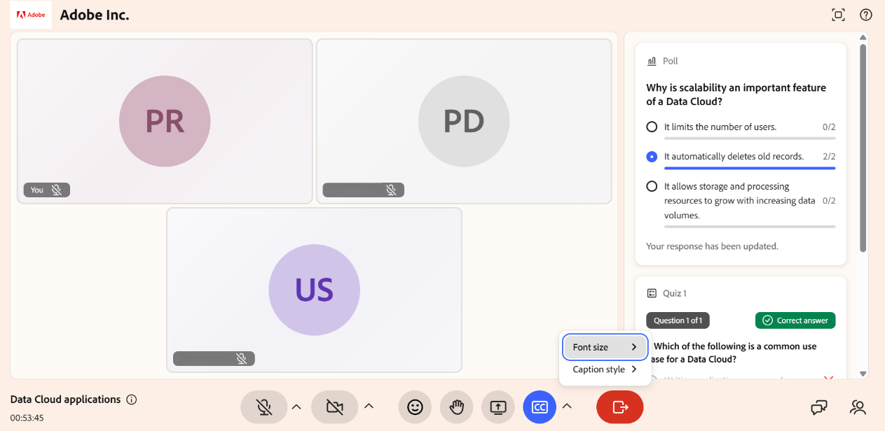

# Manage closed captions as a Learner

Closed captions display spoken content as on-screen text, making a Live Hub session easier to follow, for example, if you're in a noisy environment or prefer reading along with the audio. You control your own captions from the closed captions (CC) button in the control bar. This guide explains how to display, adjust, and hide captions as a Learner.

## Display closed captions

You can display closed captions in your own view during a session. The captions update in real time as participants speak, so you can follow the conversation as text. Each participant chooses whether to display captions based on their own preference.

To display captions, select the closed captions (**CC**) button in the control bar.

*Select the CC icon to display the closed captions in the session.*

## Change the appearance of closed captions

You can customize the appearance of closed captions to improve readability based on your viewing needs.

To change caption appearance:

1.  Select the arrow next to the closed captions (CC) button in the control bar.

1.  Select one of the following options:

    1.  **Font size**: Select a size for the text of the closed captions. The available options are **Small**, **Medium**, and **Large**.

    1.  **Caption style**: Select a color combination. The available combinations are **Black on White**, **Yellow on Black**, **White on Black**, **Dark on Yellow**, and **Yellow on Blue**.

    
    *Select the arrow next to the CC icon to change the font size and caption style.*
