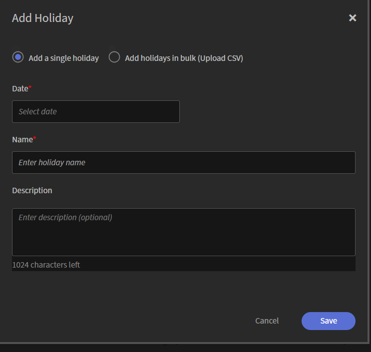

# Manage holidays in Adobe Learning Manager

Use the **Holidays** setting to define organization-wide holidays in Adobe Learning Manager. Holidays appear in the Instructor calendar as non-working days, affecting Instructor availability when scheduling Live Hub sessions.

You can add holidays individually or import multiple holidays using a CSV file. After you add holidays, they appear on the **Holidays** page, where you can view, search, and manage them.

## Access the Holiday settings

To access the **Holidays** settings:

1.  Sign in to Adobe Learning Manager.

1.  Select **Settings** from the **Configure**.

1.  Navigate to the **Advanced** section in the left navigation pane.

    

1.  Select **Holidays**. The **Holidays** page appears.

## Add holidays

Use the **Add Holiday** option to create a single holiday or import multiple holidays from a CSV file.

1.  Select **Add** on the top right corner of the **Holidays** page. The Add Holidays pop-up window appears.

1.  Select one of the following options:

    1.  Add a single holiday

    1.  Add holidays in bulk (Upload CSV)

### Add a single holiday

To add a holiday manually:

1.  Select **Add a single holiday**.

1.  Select **Date** and enter the holiday name.

1.  (Optional) Enter a description.

    

1.  Select **Save**. The holiday is added to the list.

### Add holidays in bulk

Use a CSV file to add multiple holidays at once.

1.  Select **Add holidays in bulk (Upload CSV)**.

1.  Select **Download sample CSV** template and add your holiday details to the file.

    

1.  Drag the CSV file into the upload area, or select the upload area to browse and select the file.

1.  Select **Save**. The holidays are imported and added to the list.
