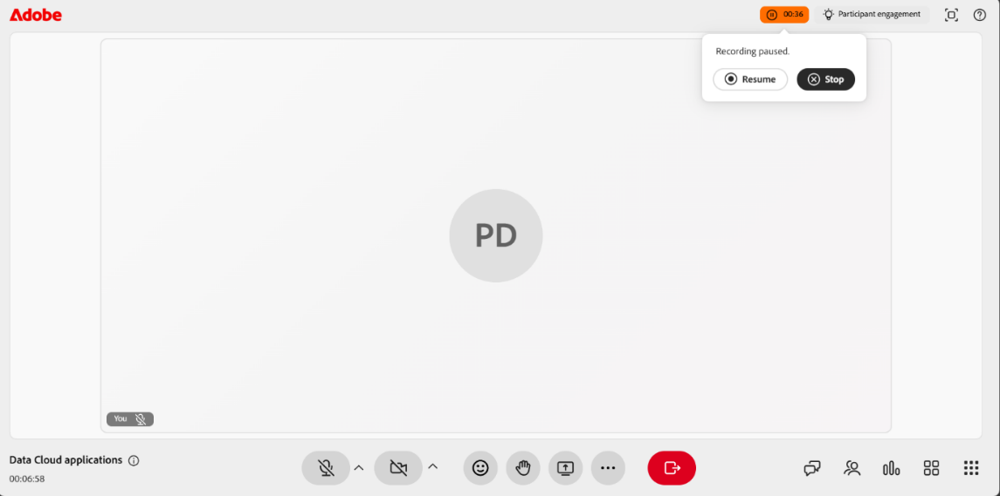
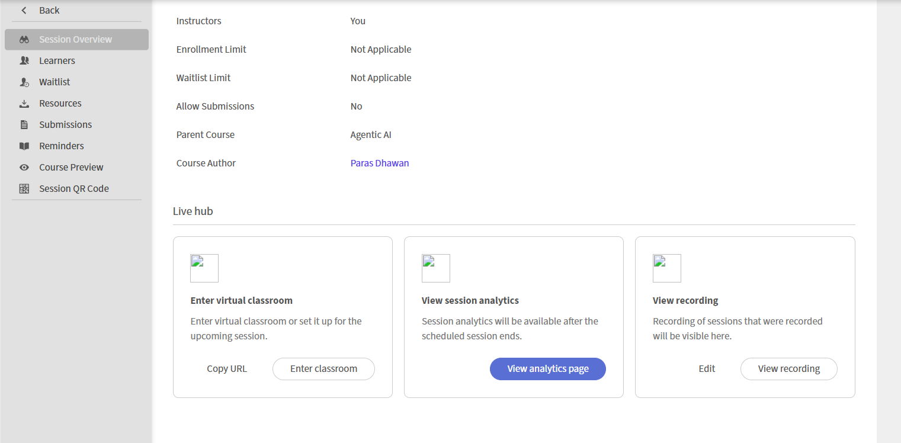
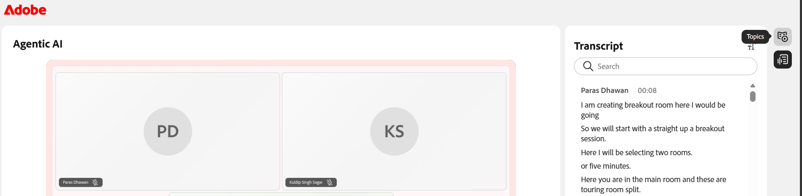

# Record a session in Live Hub

As an Instructor, you have full control over how a session is captured, refined, and shared. You can start a recording during a live session, manage it while it runs, and review the automatically generated topics, summary, and transcript once the session ends.

Beyond capturing the session, you can edit the recording to remove unnecessary sections, enable closed captions, and transcripts. The following sections walk through each of these actions in detail.

## Record a session

1.  Navigate to the **More actions** menu.

1.  Select **Start recording**. A confirmation pop-up appears, indicating that "**The session is now being recorded**".

    

## Stop, Pause, and Resume recording

When a session is being recorded, a recording indicator appears in the top corner of the virtual classroom. You can start, stop, and resume the recording.

### Stop recording

1.  Select the recording indicator. A pop-up window opens with recording actions.

    

1.  Select **Stop recording**. A confirmation message appears that the session is no longer being recorded.

### Pause recording

To pause the recording:

1.  Select the recording indicator.

1.  Select **Pause recording**. A confirmation message will appear, displaying **Recording and transcription paused**.

### Resume recording

Once you pause the recording, a resume recording option appears. Select **Resume recording** to continue the paused recording.

## Access a recording

Recorded sessions are available on the **Session Overview** page for each session. From here, you can play back a recording or open it in edit mode to refine the timeline and transcript.

To access a recording:

1.  Navigate to the required course and open the session.

1.  Scroll to the **Live hub** section on the **Session Overview** page.

1.  In the **View recording** card, do one of the following:

    * Select **View recording** to open the recording in playback mode.

    * Select **Edit** to open the recording in edit mode.

    

## Play a recording

Selecting View recording opens the recording in the recording player. The player displays the session video, participant thumbnails, and the Transcript.

To play a recording:

1.  Navigate to the **Session Overview** page.

1.  Select **View recording** from the **Live hub** section. The recording opens in playback mode.

    

1.  Use the following playback controls to adjust your viewing experience:

| **Control** | **Description** |
|----|----|
| Play or Pause | Starts or pauses playback. |
| Volume | Adjusts the audio level. |
| Progress bar | Drag to move to a specific point in the recording. The elapsed and total time are shown next to the controls. |
| Playback speed | Slows down or speeds up the playback. Available options are **0.25x**, **0.5x**, **0.75x**, **1x**, **1.25x**, **1.5x**, and **2x**. |
| CC (closed captions) | Turns closed captions on or off during playback. Select the arrow next to the CC button to customize captions. Choose a font size from **Small**, **Medium**, or **Large** and a caption style from **Black on White**, **Yellow on Black**, **White on Black**, **Dark on Yellow**, or **Yellow on Blue**. |
| Full screen | Expands the recording player. |

## Generate Topics in recording

Topics automatically divide recordings into meaningful sections based on the flow of the session discussion. They help organize longer recordings and improve navigation. You can also search for a topic using keywords to quickly navigate to the relevant section of the recording.

## View Topics in recording

Once the topics are generated, you can browse and navigate them. The topics are marked as **Generated using AI**. Review the content, as AI-generated responses should be double-checked.

To view and navigate topics:

1.  In the **Topics** panel, browse the list of topics, or use the **Search** box to find a topic using keywords.

1.  Select a topic to expand it and view its summary, details, and total duration.

1.  Select **Play topic**. The recording starts playing from the selected topic section.

    

## View Transcript

The transcript provides a time-stamped text version of the session that you can read alongside the recording. Each entry includes the speaker's name and the time the text was spoken.

To view the transcript:

1.  Select the **Transcript** icon from the panel toggles on the right side of the player. The **Transcript** panel opens and displays the time-stamped transcript.

1.  (Optional) Use the **Search** box to find specific words or phrases within the transcript.

To navigate to a specific part of the recording, select a transcript entry. The recording jumps to the corresponding timestamp and begins playback from that point.

### Change the Transcript text size

You can adjust the size of the transcript text to make it easier to read.

To change the text size:

1.  In the **Transcript** panel, select the **text size** icon next to the **Transcript** heading.

1.  Select a text size from the list. The available sizes are 12, 14, 16, 18, 20, 24, 30, and 36. The default size is 14. The transcript text updates to the selected size.

    

## Edit a recording

Editing a recording in Live Hub allows you to refine the content before sharing it with learners. You can trim the timeline to remove unnecessary sections and improve clarity. Edits do not change the original recording until you save them.

To edit a recording:

1.  Navigate to **Session Overview** > **Live hub** > **View recording** and select **Edit**. The recording opens in edit mode.

1.  (Optional) To rename the recording, select the **edit (pencil)** icon next to the recording title and enter a new name.

1.  Select **Edit timeline** at the bottom of the recording player. A draggable progress bar appears in the recording timeline.

1.  Position the marker on the progress bar to select the segment you want to remove.

1.  Drag the marker or use the left and right arrow keys to move it precisely. A preview thumbnail and time stamp help you find the exact point.

    

1.  Select **Cut selection**. The selected section of the recording is removed.

1.  (Optional) Use **Undo** or **Redo** to reverse or reapply an action or select **Cancel** to discard the current selection.

1.  Select **Save edits**. The changes are applied to your recording.

    

You can also edit a recording from the **Session dashboard**. See [Components of the Session dashboard](../getting-started-with-live-hub/components-of-the-session-dashboard.md#recordings) for more information.

## Regenerate topics

When you edit the recording timeline, the existing topics no longer match the updated recording. You can regenerate the topics to keep them in sync with the new timeline.

To regenerate topics:

1.  Select the **Topics** icon from the panel toggles on the right of the player. The Topics panel appears.

1.  Select **Regenerate**. A **Generating topics** message appears while the topics are being identified. Identifying topics might take some time.

    

## Revert to original

If you want to discard all edits and restore the recording to its original state, use the Revert to original option.

To revert to the original recording:

1.  Select **Revert to original** icon at the top of the player. A confirmation pop-up appears.

    

1.  Select **Revert**. This undoes all changes made to the recording and transcript. This is an irreversible action and cannot be undone.

1.  (Optional) Select **Cancel** if you do not want to revert.

## Download a recording

You can download a recording to access it offline or share it outside the platform.

Downloading a recording is managed from the session dashboard. See [Components of the Session dashboard](Components-of-the-Session-dashboard.md) for more information.
