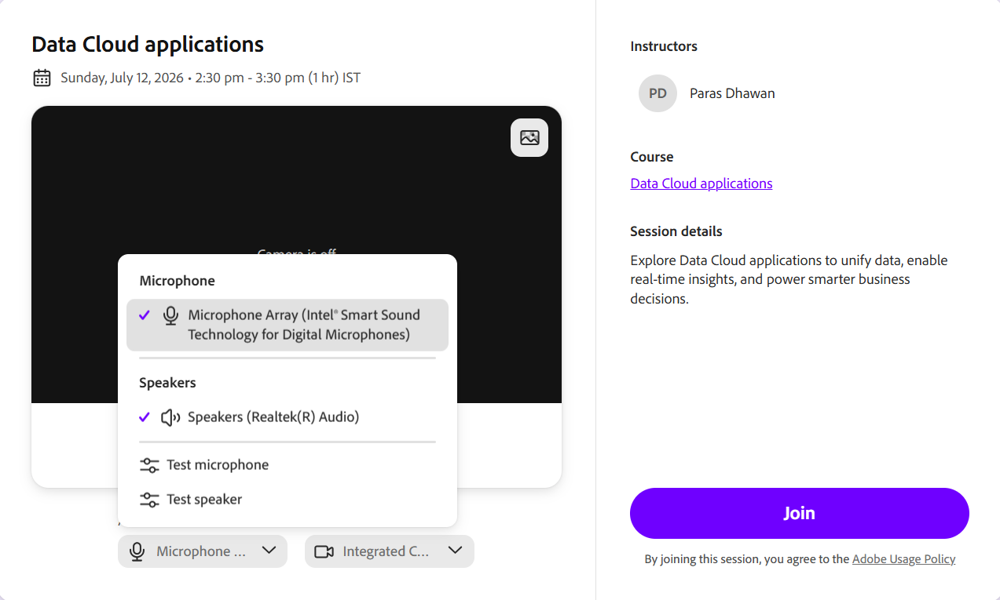
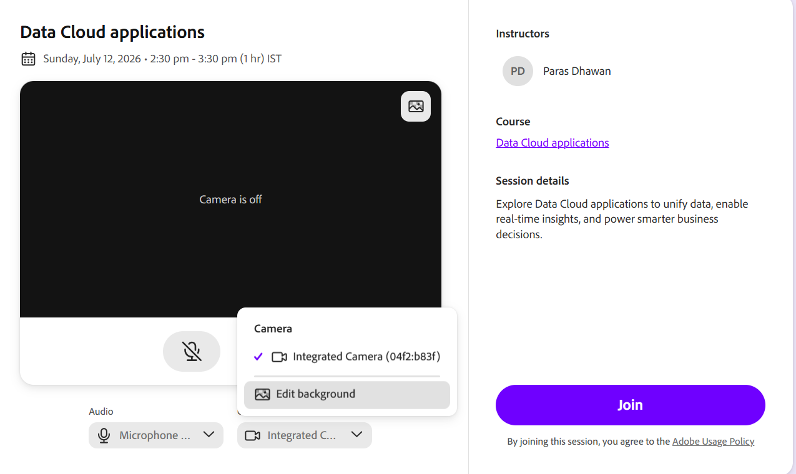

# Set up the pre-join screen

A Live Hub session in Adobe Learning Manager is a live, Instructor-led training that Instructors and Learners attend together in a virtual classroom. During a session, participants can talk, chat, respond to polls and quizzes, collaborate on a whiteboard, and join breakout rooms for smaller group discussions.

This article explains how a session works from start to finish and walks through the shared setup that applies to everyone, regardless of role.

## What you will see on the pre-join screen

The pre-join screen is where both Instructor and Learner land before entering the classroom. It shows the session details and gives you audio and camera controls so you can check everything that works first. When the screen loads, a brief loading indicator may appear while the session information is retrieved. You can review the session title or module name, the Instructor, the course, and the session description.

### Allow browser permissions

The first time you join a session from a new browser or device, your browser prompts you to grant access to your microphone and camera. This prompt appears before the pre-join audio and video preview loads. Until you allow access, the audio and camera controls may display **Can't access microphone** or **Can't access camera**.

When prompted by your browser, select **Allow** to enable access to your microphone and camera. Once permission is granted, you can preview and configure your audio and video settings before joining the session.

*Select Allow when your browser prompts for microphone and camera access.*

### Configure audio controls

Your microphone and speaker are selected automatically. Use the audio control on the pre-join screen to confirm they work or switch to a different device.

To test the microphone and speaker:

1.  Select the **Microphone** from the pre-join screen. The **Microphone** dropdown appears.

    
    *Select the Microphone dropdown to switch devices or test your microphone and speaker.*

1.  (Optional) Select **Test microphone** to verify your microphone is working.

1.  (Optional) Select **Test speaker** to verify the speaker output.

### Change your camera background

Use the **Camera** menu in the pre-join screen to apply a virtual background.

To change the background:

1.  Select the **Camera** dropdown. The **Camera** dropdown appears.

    
    *Select the Camera dropdown, then select Edit background to choose a virtual background.*

1.  Select **Edit background** and choose a virtual background. The preview updates immediately.
