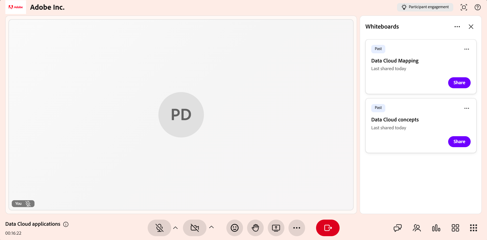

# Share a whiteboard

Use the whiteboard in a Live Hub session to visually explain concepts, annotate content, and collaborate with learners in real time. As an Instructor, you can create a new whiteboard or reopen an existing one, add drawings, shapes, and text, and manage multiple boards during a session.

You can also rename boards, export a whiteboard as an image, allow learners to collaborate on the board, and open external whiteboards such as Miro.

This article explains how to create, manage, share, and export whiteboards in a Live Hub session.

## Share a new whiteboard

Start a new whiteboard when you want a fresh canvas to present ideas, explanations, or diagrams during a live session.

To share a new whiteboard:

1.  From the session control bar, select **More options**.

1.  Select **Share whiteboard**.

1.  Select **New whiteboard**. A new whiteboard opens and is visible to all participants in the session.

    
    *Live Hub interface showing the options to share a whiteboard.*

## Reopen a whiteboard

You can open an existing whiteboard to access content that was previously shared during the session. This lets you continue discussions or build on earlier explanations without starting over.

To reopen a whiteboard:

1.  Select **More options**.

1.  Select **Share whiteboard**.

1.  Select the whiteboard from the list of available whiteboards. The selected whiteboard opens and is visible to all the learners.

    
    *Share Whiteboard options displaying the list of available existing whiteboards.*

>[!NOTE]
>
> You can also open previously shared whiteboards from the **More** menu within the whiteboard.

## Use whiteboard tools

Whiteboard tools allow you to create visual explanations, draw, add shapes, insert text, and annotate content during a live session.

*Whiteboard interface showing the whiteboard tools.*

Use the following whiteboard tools to create and annotate content during the session:

| **Tool reference** | **Description** |
|----|----|
| **Select** | Select shapes or text on the whiteboard. After selecting an object, you can move, resize, rotate, duplicate, or delete it. |
| **Pan** | Drag on the canvas to navigate and view different areas of the whiteboard. |
| **Marker** | Draw freehand strokes on the whiteboard canvas. Use the color picker and stroke thickness options to customize the drawing. |
| **Shape** | Add geometric shapes such as rectangles, circles, arrows, and lines. Drag on the canvas to draw a shape. Adjust its fill color, border, and thickness. |
| **Text** | Add text labels, notes, or explanations to the whiteboard. Select the canvas to insert text. Use formatting options such as font size, style, and color. |
| **Eraser** | Remove strokes or objects from the whiteboard. For drawings, the eraser allows partial removal. For shapes or text, the entire object is removed. |
| **Undo** | Revert the most recent action performed on the whiteboard, such as drawing, adding text, inserting shapes, or deleting objects. Select **Undo** multiple times to reverse multiple actions in sequence. |
| **Redo** | Restore the most recent action that was undone on the whiteboard. Select **Redo** to reapply actions that were previously reversed using **Undo**. |

## Clear all whiteboard content

Clear the whiteboard to remove all drawings, shapes, and text, and start with a blank canvas.

To clear the whiteboard:

1.  Navigate to the upper left corner of the whiteboard.

1.  Select **More options**.

1.  Select **Clear all content**. All content on the whiteboard is removed.

    
    *More menu showing the options to clear all the whiteboard content.*

You can use **Undo** to restore the content you cleared.

## Manage existing whiteboards

Instructors can create, organize, and control multiple whiteboards during a Live Hub session using the **Whiteboards** panel. This panel helps you review available whiteboards and take bulk actions such as clearing or deleting boards.

To manage existing boards:

1.  Select **More options** from the control bar.

1.  Select **Share whiteboard**.

1.  Select **View boards**. The **Whiteboards** panel opens and displays all whiteboards created in the session.

    
    *Whiteboards panel showing the options to manage the existing boards.*

### Available actions in the Whiteboards panel

From the **Whiteboards** panel, Instructors can perform the following actions:

| **Action** | **Description** |
|----|----|
| **Share** | Share the selected whiteboard. |
| **Delete** | Permanently delete the current whiteboard from the **Whiteboards** panel. |
| **Delete all** | Permanently delete all whiteboards listed in the **Whiteboards** panel. |

## Rename a whiteboard

Rename a whiteboard directly from the whiteboard interface to better identify its content during a session.

To rename a whiteboard:

1.  Select **Share** from the **Whiteboards** panel.

1.  On the whiteboard toolbar, select the **Edit** (pencil) icon next to the whiteboard name.

1.  Enter a new name and select the checkmark icon. The whiteboard is renamed with the updated name.

    
    *Rename the whiteboard option in the whiteboard interface.*

## Export whiteboard snapshot as an image

Instructors can export whiteboard content as an image to capture key discussions, diagrams, or annotations created during a session.

To export a whiteboard snapshot:

1.  Navigate to the upper left corner of the whiteboard.

1.  Select **More options**.

1.  Select **Export snapshot**. The whiteboard content is exported as a **PNG** image and downloaded to your local system.

    
    *More menu showing the options to export the whiteboard as an image.*

## Allow participants to edit the whiteboard

You can also allow the participants to draw and interact with the whiteboard during a session. Allowing the participants to access whiteboards supports collaboration, brainstorming, and active participation.

To grant access to edit whiteboards:

1.  Navigate to the upper left corner of the whiteboard.

1.  Select **More options**.

1.  Enable **Allow participants to draw**. Participants can now draw on the whiteboard, add shapes, insert text, and use all available annotation tools.

    
    *More Options menu showing controls to allow learners to edit the whiteboard.*

## Share Miro and other external whiteboards

Instructors can share third-party whiteboards, such as Miro, in a Live Hub session.

To share a Miro board:

1.  Select **More apps** from the control bar.

1.  Select **Miro**.

1.  Sign in to your Miro account.

    
    *More apps menu showing the options to share the Miro board.*

1.  From the Miro project page, select the board you want to share.

Learners can view the shared Miro board based on the session configuration, but they cannot open or share the Miro boards.
