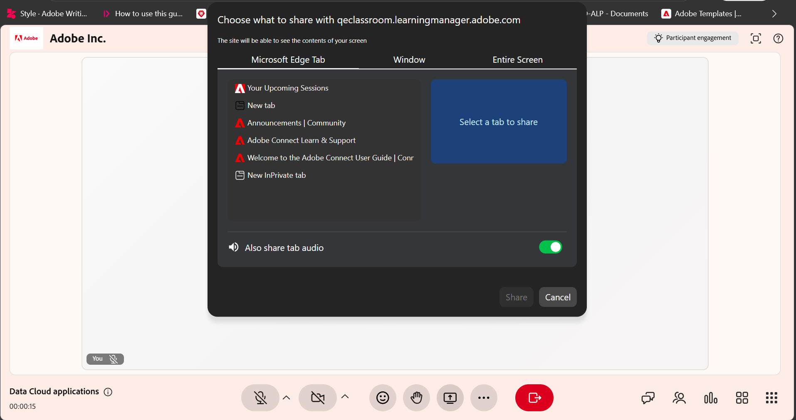

# Share your screen as an Instructor

Screen sharing allows you to present content from your device to participants during a Live Hub session. Share a browser tab, application window, or your entire screen to demonstrate workflows, deliver presentations, and guide learners through tasks in real time.

You can enhance presentations by displaying up to two contents side by side in Split View, using a whiteboard alongside shared content, and annotating directly on the screen to emphasize key information. You can also allow learners to share their screens while maintaining control over the session.

This article explains how to share your screen, annotate content, use Split View, and manage learner screen sharing in Live Hub.

## Share your screen in a session

You can start screen sharing during a session to present content to all participants in real time. This allows you to demonstrate applications, walk through workflows, or deliver presentations directly from your device.

Follow these steps to share your screen:

1.  Select **Share screen** from the control bar. A pop-up window appears.

1.  Select one of the following:

    1.  **Chrome tab**: Share a browser tab.

    1.  **Window**: Share a specific application.

    1.  **Entire screen**: Share your full screen.

    
    *Screen sharing pop-up window showing multiple options for sharing your screen.*

1.  (Optional) Enable **Also share tab audio** to include audio from the shared tab.

1.  Select the content you want to share.

1.  Select **Share**. The selected content is displayed to all the learners.

You can share up to two contents during a session. When additional content is shared, the layout automatically adjusts to display them together.

### Stop screen sharing

To stop sharing your screen, select **Stop sharing** from the shared screen interface.

*Control bar showing the option to stop screen sharing.*

The screen sharing in the session ends, and the shared content is removed from the room interface.

## Share multiple contents in a session

Virtual Classroom supports split view when multiple content types are shared during a session. This lets Instructors present more than one content type at the same time, such as a screen share, whiteboard, or engagement panel.

### How split view works

When multiple contents are active:

* A maximum of two contents can be displayed at a time.

* One content appears on the main stage area.

* The other content appears in a secondary view.

* When new content is shared, existing content may move to the secondary view.

>[!NOTE]
>
> Engagement panels, such as polls, are prioritized and appear first in the split view.

### Switch to single view

When multiple contents are displayed, Instructors can switch focus to a single content.

To switch to a single view:

1.  Select the content you want to bring into focus.

1.  Choose **Maximize**. The selected content appears on the main stage, while the remaining content moves to a secondary view.

## Use screen sharing with a whiteboard

You can run screen sharing alongside a whiteboard during a session to present content while adding explanations or annotations.

When a whiteboard is shared during an active screen share, or when screen sharing starts while a whiteboard is already active, the session automatically switches to split view.

To use screen sharing with a whiteboard:

1.  Share your screen.

1.  Select the whiteboard icon from the control bar.

1.  Select **Share whiteboard**. Both contents appear in split view.

    
    *Live Hub interface showing a split view with the whiteboard on the left and shared content on the right.*

To switch focus between the whiteboard and shared screen:

1.  Select the content you want to view.

1.  Select **Maximize**. The selected content moves to the main stage. The other content moves to a secondary view.

    
    *Live Hub interface showing a split view with the maximized whiteboard and shared content at the bottom of the interface.*

## Annotate shared content

You can annotate shared content during a session to highlight important information, explain concepts, or visually guide learners. Annotations are applied to a snapshot of the shared screen. They are designed for real-time explanations and provide a focused, distraction-free experience.

While sharing your screen, select the annotate (pen) icon in the upper-right corner of the screen share interface. The annotation tools appear automatically in the screen share interface.

### Use annotation tools

An annotation toolbar appears when you start annotating.

*Live Hub interface showing the annotation toolbar for interacting with the shared content.*

The annotation toolbar provides the following options:

| **Tool** | **Description** |
|----|----|
| **Select** | Manage existing annotations. You can move, resize, duplicate, or delete annotation elements. |
| **Draw** | Create freehand drawings. You can adjust stroke thickness and color. |
| **Shapes** | Add structured shapes such as rectangles or circles. You can customize stroke and fill properties. |
| **Text** | Add labels or explanations. You can format text and adjust its position. |
| **Eraser** | Remove annotations from the screen. You can erase individual elements or clear all annotations. |
| **Stop annotating** | Exit annotation mode and resume screen sharing. All annotations are discarded. |
| **Undo** | Reverses the most recent action. |
| **Redo** | Reapply the previously undone action. |

## Allow participants to share their screen

You can allow participants to share their screen during a session. This allows them to present content, demonstrate workflows, or support discussions.

When screen sharing is enabled for learners:

* Learners can start screen sharing from the session controls.

* Only one screen share can be active at a time.

* Instructors retain full control over screen sharing during the session.
