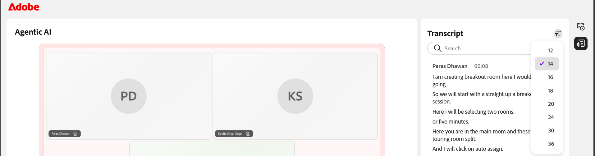

# View session recordings as a Learner

After a virtual classroom session ends, a recording becomes available on the course page. As a Learner, you can watch the recording, browse AI-generated topics to navigate to specific sections, and review the time-stamped transcript alongside the video.

## Access the session recording

Session recordings are available from the **Session Recordings** section on the course page. The recording link is typically available about **forty** minutes after the scheduled session end time. If you access the course page before processing is complete, the recording link does not appear.

To access the recording:

1.  Open the course page for the session.

1.  Select the **Modules** tab. The course detail page appears.

       *Session recordings on the course page*.

1.  Navigate to the **Session Recordings** section.

1.  Select the recording link. The recording opens in a new browser tab.

     
    *The recording player is in playback mode, showing the session video and the Transcript panel.*

1.  Use the following playback controls to adjust your viewing experience:

| **Control** | **Description** |
|----|----|
| **Play/Pause** | Start or pause playback. |
| **Volume** | Adjust the audio level. |
| **Progress bar** | Move to a specific point in the recording. The elapsed and total duration are displayed next to the controls. |
| **Playback speed** | Change the playback speed. Available options are **0.25x**, **0.5x**, **0.75x**, **1x**, **1.25x**, **1.5x**, and **2x**. |
| **Closed Captions (CC)** | Turn captions on or off. Select the arrow next to **CC** to choose a caption style and font size. |
| **Full screen** | View the recording in full-screen mode. |

## View Topics in recording

AI-generated topics make it easier to review recordings by highlighting key discussion areas and allowing you to jump directly to relevant sections.

For recordings that are **thirty** minutes or longer, Live Hub automatically generates AI-powered topics to divide the session into meaningful sections.

>[!NOTE]
>
> Topics are available only when AI-generated topics are enabled for the account and have not been disabled by the Instructor for the session.

To view and navigate topics:

1.  In the **Topics** panel, browse the list of topics, or use the **Search** box to find a topic using keywords.

1.  Select a topic to expand it and view its summary, details, and total duration.

1.  Select **Play topic**. The recording starts playing from the selected topic section.

    
    *The Topics panel, where AI-generated topics help you navigate the recording.*

## View Transcript

The transcript provides a time-stamped text version of the session that you can read alongside the recording. Each entry includes the speaker's name and the time the text was spoken.

To view the transcript:

1.  Select the **Transcript** icon from the panel toggles on the right side of the player. The **Transcript** panel opens and displays the time-stamped transcript.

1.  (Optional) Use the **Search** box to find specific words or phrases within the transcript.

To navigate to a specific part of the recording, select a transcript entry. The recording jumps to the corresponding timestamp and begins playback from that point.

*The Transcript panel, where each entry links to its point in the recording.*

### Change the Transcript text size

You can adjust the size of the transcript text to make it easier to read.

To change the text size:

1.  In the **Transcript** panel, select the **text size** icon next to the **Transcript** heading.

1.  Select a text size from the list. The available sizes are 12, 14, 16, 18, 20, 24, 30, and 36. The default size is 14. The transcript text updates to the selected size.

    
    *Choose a transcript text size to make entries easier to read.*
