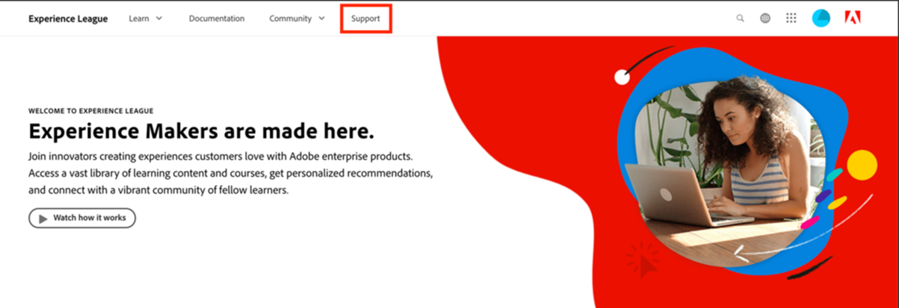
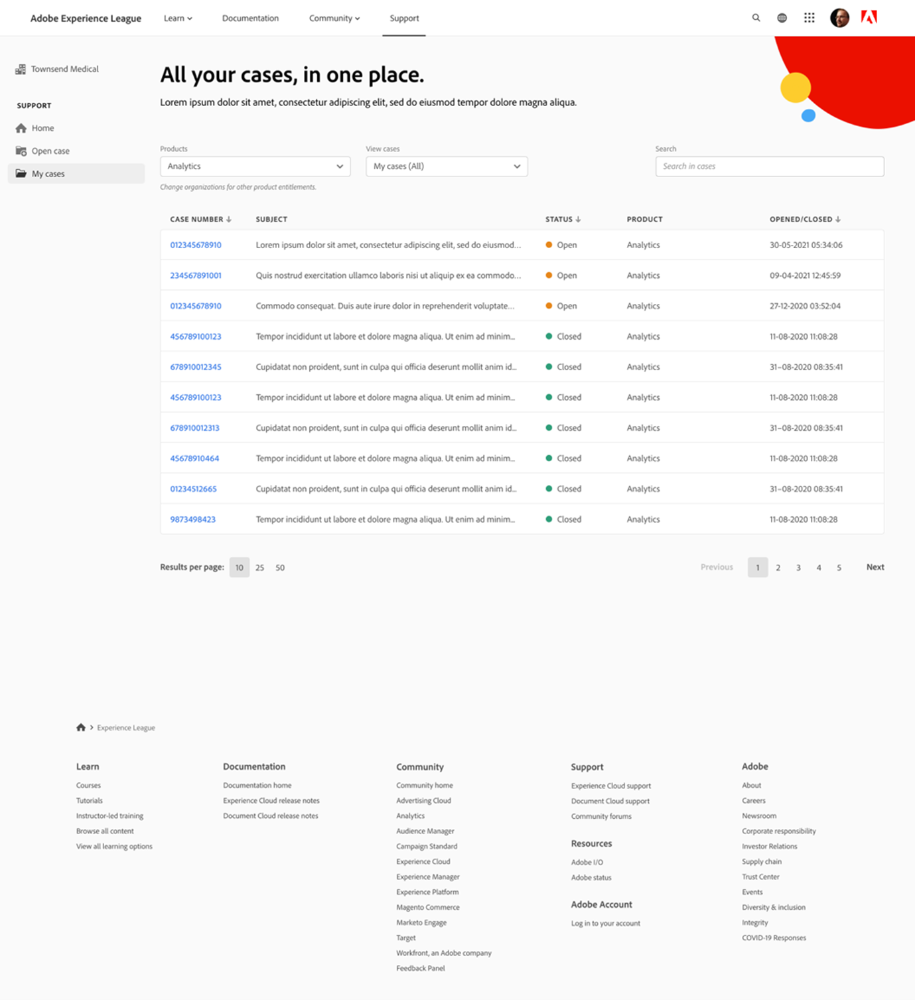

# How to submit a support ticket on Experience League

The process for submitting Adobe Learning Manager support tickets is now directly integrated with the Experience League support platform. This is a self-service portal that was recently redesigned to offer more personalization and ease-of-use for entitled customers. Check out this guide below for more information on how to access the Experience League Support portal and log a ticket.
 
Please note that submitting a Support ticket is only available to authorized support contacts. For your support queries, please continue to submit your support tickets to Adobe Learning Manager until May 11th, 2025. Following this date, you can submit your support tickets via the Experience League Support portal as described below.

1. To access the Support portal, visit the **[!UICONTROL Experience League]** website and select the **[!UICONTROL Support]** tab located at the top of the page. Alternatively, you can visit the [direct link](https://experienceleague.adobe.com/home#support).

   
   _Support homepage_

2. From the **[!UICONTROL Support]** homepage, you can easily navigate to your open cases, log a new case, view top support articles, or explore additional learning resources.   

   
   _Open ticket_

3. To submit a case, select the option **[!UICONTROL Open a support case]**. You can also select the **[!UICONTROL Open Tickets]** option on the sidebar menu. You will be directed to the case creation page, where you can enter your product name (Adobe Learning Manager, Audience Manager, Campaign, Target, etc.), **[!UICONTROL Case title]**, and **[!UICONTROL Case description]**. To expedite the troubleshooting process, please be as descriptive as possible when describing the issue you are facing.

   Towards the end of the form, please fill out the following fields to provide us with more specific information that will help us troubleshoot:
 
    * Issue Reason (Select the appropriate drop down for a issue type)
    * Account ID
    * Role (Admin, Author, Learner, Integration administrator etc)
    * Case Priority (Low, Medium, High, Critical)
    * Business Impact
    * Time Zone
    * Option to Copy intended users.

   Lastly, be sure to upload any relevant files before you click **[!UICONTROL Submit]**. (Size of the attachment is no more than 24 MB)

   
   _Ticket form_ 

4. Once you click **[!UICONTROL Submit case]**, you will be redirected to the **[!UICONTROL My cases]** page, where you can view any and all cases that your organization has submitted. You can also navigate to this page by clicking the **[!UICONTROL My cases]** button on the sidebar menu. On this page, you'll be able to view all your open and closed support cases. Using the options at the top of the page, you can filter by case status (open or closed) or by Experience Cloud solution. You can also use the search bar to search for any keywords pertaining to your support issues.

   
   _Open cases_
   
5. To view more details on a case, click on the case to access its case view. Within the case view you can view the latest comments with the assigned case owner and add any additional attachments or responses you'd like.

You can escalate a case by selecting the "Escalate to management" option on the right-hand side of the page under Case Detail. You can also close the case out by selecting the adjacent "Close case" button.

## Additional notes

For our Support leadership team to address your escalations in the most efficient manner, please submit a case escalation only if it is severely impacting your organization, partners, or customers.
 
If you have any further questions on how to use the **[!UICONTROL Experience League Support]** portal, please let us know in the comment section below, or reach out to our Support team directly at this email address [almdynsupp@adobe.com](mailto:almdynsupp@adobe.com).

