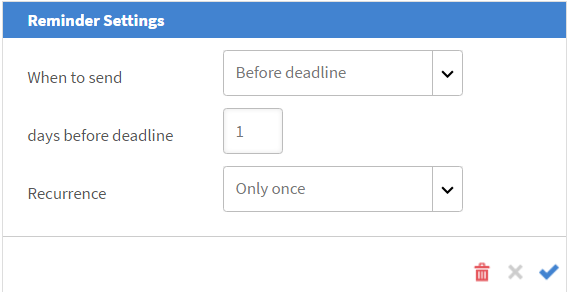

# Managing learners for your session

Read this article to know how to manage the attendees, send course related emails and reminders for your sessions.

## See sessions or modules with pending reviews {#pending}

As an instructor, you can see the sessions or modules with pending reviews. 

On the Sessions/Modules page, you can see a column **Reviews Pending** that shows the number of pending reviews for the corresponding session/activity.

## Manage waitlist for your session {#managewaitlistforyoursession}

As the Learners register for your module, you can see the latest status of the enrollment and waitlist from the Waitlist page.

1. From the Instructor App, select Upcoming Sessions > Waitlist in the left navigation pane.

   You can view the Seat Limit, number of seats that are currently filled, and the number of seats vacant. A table also lists the Learners who have been waitlisted. This is blank if there are no waitlist queues.

   
   *View waitlisted learners*

1. From the Waitlist table, select the Learner or Learners whom you want to confirm.
1. Select Actions > Confirm Learners.

   The learners whom you have confirmed, are added to the Confirmed Learners list.

Instructors have the capability to unenroll learners from sessions. This also unenrolls them from corresponding learnings. Select **[!UICONTROL Waitlist]** tab. Select the learners to unenroll using the checkbox. To unenroll, select **[!UICONTROL Actions]** > **[!UICONTROL Unenroll learners]**.

*Unenroll the learners*

### Waitlist report

Adobe Learning Manager's new **[!UICONTROL Waitlist Report]** allow instructors to download waitlisted learners list for all instances of a course. Instructors can access this report from the **[!UICONTROL Waitlist]** section on the **[!UICONTROL Session Overview]** page.

Following the columns available in the Waitlist report:

* Course Name
* Instance Name
* Instance ID
* Instance Status
* User Name
* Email
* User Unique ID
* Date Enrolled (UTC TimeZone)
* Status
* Waitlist Number
* Waitlist Limit
* Seat Limit

To download the report from Instructor section:

1. Log in as **[!UICONTROL Instructor]**.
2. Select any session from the home page.
3. Select the **[!UICONTROL Waitlist]** option in the **[!UICONTROL Session Overview]** page.
4. Select **[!UICONTROL Actions]** > **[!UICONTROL Export Report]** to download the **[!UICONTROL Waitlist]** report.

## Mark attendance for your session {#markattendanceforyoursession}

You can view the number of confirmed Learners who are attending the session, their names, attendance status of the Learners, and other details from the Learners page.

1. In the left navigation pane, click Upcoming Sessions > Learners.
1. Select the Learner or Learners from the list of Attendees and do one of the following:

   * To mark attendance, click Actions > Mark Attendance. Once the status has been marked as Attended, you cannot change the status.
   * To mark the non-attendance, click Actions > Not Attended.
   * To delete a learner due to cancellation or other reasons, click Actions > Delete Learners.

   A Learner cannot complete a module until the Attendance status reads Attended.

   
   *Mark learner attendance*

## Send emails to learners {#sendemailstolearners}

You can send emails to specific or all attendees for your session. The Send Email feature is very useful if you want to confirm the attendance of learners, or if you want to send out communication regarding the session. You can also use the Send Email to All option to email the assignment and session material, or send out general communication to all the learners.

To send emails to learners, from the Learners page in the Instructor app, do one of the following:

* To send emails to specific attendees, select the attendee, and click Actions > Send Email to Selected.
* To send emails to all the attendees to send a course material or an assignment, click Actions > Send Email to All.

## Exporting learners list {#exportinglearnerslist}

As an instructor, you can easily mark the attendance for all your learners by exporting the attendee list as a pdf. To export the attendee list, from the Learner from the left pane. Click Actions > Export Learner List (PDF). 

After the attendee list is confirmed for your session, you can export the list as a PDF. This easy-to-print pdf displays the learners as a table. You can then mark the attendance or provide scores, and make or provide notes for the learner, all in the same PDF. 

Notice a QR code at the top right corner of this PDF. This functionality allows individual learners to scan the code using the Learning Manager mobile app for learners to mark their attendance. 

*Scan the QR code to mark attendence* 

## Approve or reject submissions {#approveorrejectsubmissions}

If leaners have uploaded documents like assignments, reports, or assessments for your session, you can view the documents in the Submissions page. You can use the materials for grading the learner, and either approve or reject the submission.

1. From the left pane, click either Upcoming Sessions or Past Sessions, based on the schedule of your session.
1. Click the Course for which you want to view the submissions.

   From the left pane, click Submissions.

1. You can view the submissions from learners for the session that you selected. Select the submission that you want to approve or reject, and click Approve or Reject.

   The status of the submission changes to Approved or Rejected, based on your action.

## Configure reminders for your session {#configureremindersforyoursession}

1. From the left pane, click Upcoming Sessions.
1. Click the course for which you want to set the reminder. From the left pane, click Reminders.
1. From the Select Reminder tile, click Set Reminder.

   
   *Configure reminders for your session*

1. Do the following:

   * In the Reminder Settings dialog box, set the option on when to send the reminder to learners: Before deadline, On deadline, or After deadline.
   * In the days before deadline field, set the number of days prior to the deadline when you want to send the reminder to learners.
   * Set the recurrence for your reminder.

   
   *View reminder settings*

1. Do one of the following:

   * Click the tick mark to save the reminder.
   * Click the cross mark to cancel the reminder.

   An automated course reminder is sent to all the learners at the set date that you have indicated in your reminder settings.

   If you have already set reminders for your sessions, you can see them under the Existing Reminder tiles. Further, you can also add additional reminders to your existing reminders.

   To delete an existing reminder, click on the reminder. From the pop-up that appears, click the Delete icon (Trash icon) to delete the reminder.
