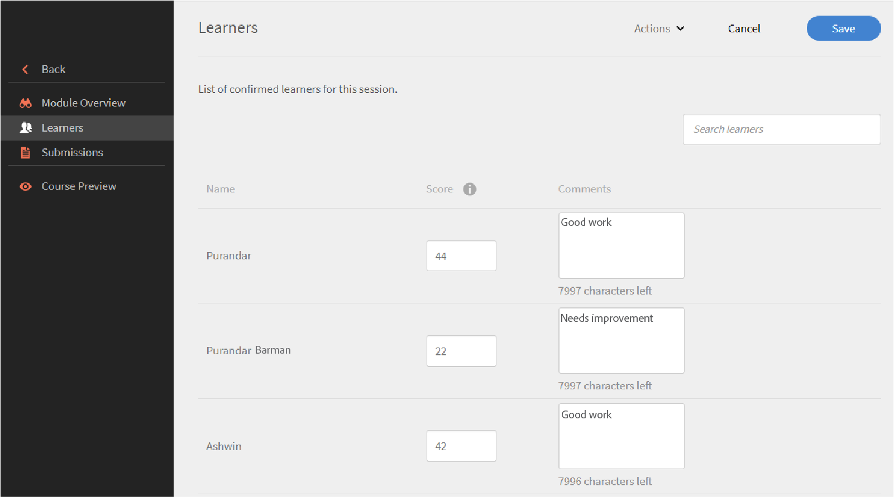

# Modules

Read this article to learn how to manage modules as an instructor in Learning Manager.

## View session overview {#viewsessionoverview}

1. From the left pane, click Upcoming Session.
1. From the list of your upcoming sessions, select the session whose details you want to view.

   The app displays the Session overview with details such as the name of the session, venue, timings, enrollment limit, waitlist limit, and so on.

   
   *View upcoming sessions*

## Configure session details {#configuresessiondetails}

1. From the left pane, click Upcoming Session.
1. Select the session that you want to update.
1. Click Edit on the upper-right corner.

   
   *Configure session details*

1. From the Session Overview page, you can edit the session timings, date, venue and so on. You can also edit or add the following session details:

   * Specify the Enrollment Limit to set the maximum number of learners allowed for the session.
   * Specify the Waitlist Limit if you want to set the maximum number of learners allowed on waitlist for the session.
   * In the Allow Submissions field, select Yes to enable Learners to submit assignments. If you select No, Learners cannot upload assignment submissions for the session.

   
   *Edit the session details*

1. Click Save.

   You cannot edit the Instructor field from this page. 

## Upload resource files for your session {#uploadresourcefilesforyoursession}

As an instructor, you can upload resource files such as assignment files or presentations for the modules, or activity files for the module. Use the Resources menu to add resources files for your module or session.

1. From the Instructor App, click Upcoming Sessions > Resources.

   You can view the Resources page, that already has a link to the resources the authors may have uploaded for the course associated with your module. In addition, instructors can also upload resource files for modules.

1. Click Add.

   
   *Add a resource for the session*

1. Browse to the appropriate file in your computer. Select the file, and click Open.
1. After the file is uploaded, you can see the file along with the date on which it was added.

   Learners who have enrolled for this module can see your files once they are uploaded, in the Resources section under Courses.

   To delete a resource file, select the file or files that you want to delete. Click Actions > Delete File from the Resources page.

## File submission for activity modules {#filesubmissionforactivitymodules}

Activity Module supports File Submission workflow. As an Author, create an activity module and select the  **[!UICONTROL File Submission]** option. This allows learners to submit a file.

These files can be Approved/Rejected by the module Instructors. The module gets completed only after the Instructor approves the submission.

 
*Approve or reject files*

## Evaluate checklist module {#evaluate-checklist-module}

After the learner takes the course, the Instructor sees the checklist module on the Submissions/Checklists page in the **Modules**section. This page contains all the activity checklist modules along with the activity submission modules for which reviews are due. For each module, the number of learners is displayed for who the evaluation is due.

On the page below, you can view modules of type **Submission** and **Checklist**. For this example, we shall use Checklist module.

*View list of modules*

Click on the Checklist module. On the **Checklist** page, you see the following:

* The name of the module
* The name of the course
* Instance the course belongs to
* Pass criteria that the author had set
* Number of checklist questions

*Viedw the checklist page*

To evaluate a learner, click **Evaluate** in the **Checklist** column. You can also see that the status of the review is **Pending**.

Evaluate the learner and click **Submit**. As an instructor, you must respond to all the evaluation questions.

*Checklist for evaluation*

Depending on the pass criteria, the Status will be either Failed or Pass.

A checklist, once evaluated, cannot be re-evaluated.

An Instructor can also view the responses submitted by other instructors of the module.

You can export the learners as a csv based on based on the search filter applied.

After the instructor evaluates the course using the Checklist, the learner sees module status as **Pass** and course status as **Completed**, or the module status as **Fail**, and course status as **Completed**.

## Instructor comments for rejection of an activity {#rejection-comments}

A learner can see the comment of an instructor in the notification that is sent for rejection. The learner can then re-submit by providing more information in the form of comments. 

Here's the workflow:

1. An author creates a course with an activity module, assigns an instructor, and then publishes the course.  

1. A learner consumes the course, and after completing the course, submits proof of completion. 

   
   *Submit proof of completion*

1. The instructor then selects the activity module that is assigned to him/her. In the Submissions page for the module, the instructor clicks **Edit**. He/she can then enter the comments for rejection and enable the option Show comment, so that the learner can view the comment in the notification. 

   
   *Enter completion comments*

1. The instructor can clicks **Reject**. The status of the submission changes to **Marked for Rejection**. 

   
   *Reject a submission*

1. After submission, the status changes to **Rejected**. 

   
   *View rejection status*

1. The learner now sees a notification that his/her submission has been rejected. The comments from the instructor also appears in the notification.

   
   *Receive rejection notification*

To accommodate the changes, Adobe has updated the email template for **Submission Rejected**.

## Add scores and comments for activity modules {#addscoresandcommentsforactivitymodules}

To add scores and comments for activity modules that have been sent for submission, follow the below steps:

1. From the left pane, click **Learner**.

   
   *Select a learner*

1. From the Learner's page, click **Actions** > **Edit Scores & Comments**.

   
   *Add comments*

   For learners who have not completed the course, the score and comments input field will not appear.

   
   *Edit scores and comments*

1. Click **Save.**
