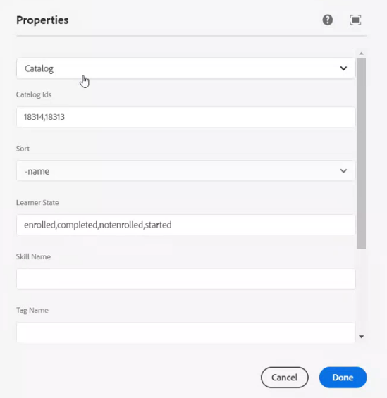

# Integrate Captivate Prime with AEM

Captivate Prime Learning Programs are renamed to Learning Paths. This change happens immediately after the October 2021 release and the terminology of Learning Path is reflected for all roles.

## Overview {#overview}

Captivate Prime is Learning Management System with a built-in Learning Content Management System. Users manage their learning content by uploading it to Prime, so that Prime performs the versioning, allocation to courses, defining the visibility to learners , tracking the consumption and reporting back to administrators.

However there are users who store and manage their content on asset management systems. The content then gets repurposed for various other functions.

The various strips present in the learner app can be embedded in the AEM sites. Any learner who signs into the AEM site will see his/her specific training data in these strips.

## Download the content package {#downloadthecontentpackage}

The installer is shipped as an AEM content package. [***Download the package***](https://github.com/adobe/captivate-prime-aem-components/releases).

The content package, is available as a zip file, and** **is compatible with AEM 6.4 and AEM 6.5.

## Install Captivate Prime component {#installcaptivateprimecomponent}

Install the Captivate Prime content package using the AEM Package Manager:

>[!NOTE]
>
>For information on instaling packages, see  [***How to Work With Packages***](https://experienceleague.adobe.com/docs/experience-manager-65/administering/contentmanagement/package-manager.html?lang=en#how-to-work-with-packages).

1. As AEM Author, open the AEM Package Manager.  

1. Click the button **Upload Package**.  

1. Click **Browse **and upload the content package.
1. Click **Upload**.
1. After the package uploads, install the content package by selecting it and clicking **Install**.

   

## Generate the refresh token {#generatetherefreshtoken}

The AEM Admin requires a refresh token from the Prime account. The Prime Integration Admin will generate the refresh token.

1. Approve the AEM Sites featured app.

   Click **Applications > Featured Apps > Adobe Experience Manager – Sites.**

   

1. Click **Applications > Featured Apps**, and open the AEM sites application.

   Copy the Application ID and the description.

1. Click **Developer Resources > Access Tokens**.

   

1. Enter the following details:

   * Client ID, which is the Application ID.
   * Client secret, which is present in Description.

   1.

   Get the OAuth code. You must use v2 API in the redirect URI.

1. 
1. Click **Submit **and get the refresh token.

## Configure the widget in AEM {#configurethewidgetinaem}

For widget configuration, the AEM author only requires the refresh token provided by the Prime Integration Admin.

You can also set multiple account configurations in multiple pages.

1. Click Tools -> Cloud Services -> Captivate Prime Widget Configuration.
1. Click **Create**.
1. Enter the refresh token here. Set up the other settings.
1. Hostname should be changed to “captivateprimeeu” for EU regions.
1. Save and close the configuration.
1. Select a configuration and publish the configuration.

## AEM Author {#aemauthor}

The AEM author must first add the component in AEM template

The AEM author then will be able to drag and drop the Adobe Captivate Prime component and configure accordingly.

Captivate Prime component requires the configuration created in above step to be mapped to the Page.  Author can map the configuration by Editing Page Properties under **Advanced > Configuration > Cloud Configuration** and provide path of configuration. In this way, Author can create configurations for multiple Captivate Prime accounts and map each one to different Sites Page. If a configuration is not mapped to the Page, component will read the configuration from Parent Page recursively until it finds one.

## Learner {#learner}

The learner can take the courses from within the page.

To be able to access the Captivate Prime widget, Learner should be a logged in AEM user. Also, property **email** should be present in “/profile” node of Learner’s rep:User node. This email should be exactly same as the one present in Captivate Prime account.

The learner can take the courses from within the page.

The course progress also gets saved.

The following widgets are provided:

1. Gamification
1. Learning calendar
1. Social widget
1. Catalog widget
1. My Learning
1. Recommendation based on peer learning
1. Recommendations by admin
1. Recommendation based on learner interests

If there are no recommendations, the widget appears blank.

## Support for Skyline

Skyline is the cloud version of AEM. You must first install Skyline from the package manager. To use the Skyline component in AEM, a user must be present in the Captivate Prime account. In other words, the user’s email address must exist in the account.

## Deploy Skyline

The steps to configure Skyline are mentioned in the  [GitHub repo](https://github.com/adobe/captivate-prime-aem-components).

## Catalog widget

The Catalog widget displays training from a specific or a set of catalogs to a user. In the Properties section in the page properties, select Catalog from the options listed. 



The Catalog widget contains the following options:

* **Catalog ids:** Comma-separated catalog ids for which the training need to be displayed.
* **Sort:** Sort order for the training. The options are- name, date, dateCreated, dateEnrolled, and so on.
* **Learner State:** Returns all training that uses the following as filters- enrolled, started, completed, and notenrolled. The search results will not be displayed if the sort option is dateEnrolled, dueDate, or dateEnrolled.
* **Skill name:** The skill used to filter exact training.
* **Tag name:** The tag used to filter exact results.

Here are a few additional components that you can customize:

**Learning Object Types:** Filter according to the type of the Learning Object. The supported types are- course, certification, jobAid,and learningProgram.

In AEM, the title of a card in a strip will be empty initially. In properties, type the name of the title in widgets.html.

**Customization**

You can customize the look and feel of the layout using widgets.html. You can change the appearance of the cards that appear and customize the theme.

In the **General Settings** section, you can choose the primary and secondary colors for the cards and specify the properties to customize the theme.

```
\{ 
 "globalCssText":"@import url('https://fonts.googleapis.com/css2?family=Grandstander:ital,wght@0,100;0,200;0,300;0,400;0,500;0,600;0,700;0,800;0,900;1,100;1,200;1,300;1,400;1,500;1,600;1,700;1,800;1,900&family=Montserrat:ital,wght@0,100;0,200;0,300;0,400;0,500;0,600;0,700;0,800;0,900;1,100;1,200;1,300;1,400;1,500;1,600;1,700;1,800;1,900&display=swap');", 
 "fontNames":"Grandstander", 
 "cardLayout":{ 
 "cardLayoutName":"compact", 
 "cardPrimaryColor":"#376BA4", 
 "cardSecondaryColor":"#F98EB0", 
 "startedStateTextColor":"#ffffff", 
 "continueStateTextColor":"#ffffff", 
 "revisitStateTextColor":"#ffffff", 
 "startedStateColor":"#a0a0a0", 
 "continueStateColor":"#f9a122", 
 "revisitedStateColor":"#7fbc64", 
 "textPrimaryColor":"#ffffff", 
 "textSecondaryColor":"#d93f3f", 
 "navIconColor":"#a0a0a0" 
 } 
}
```

### Ignore higher order LO enrollment

If the **Ignore Higher Order LO Enrollment** check-box is enabled and a user is enrolled directly into a Learning Program or Certification, the courses for that certification or Learning Program will show up for the user in the widgets.

If the check-box is disabled, the courses present in the Learning Program or Certification where user has not enrolled directly will not show up.


The setting is then applied on the widget.

### Security

The fields Client ID and Client Secret are added. In addition, the refresh token gets masked. After a user creates the entire configuration, if the user opens the configuration again to edit it, or if some other user opens this configuration, the refresh token will be masked.
