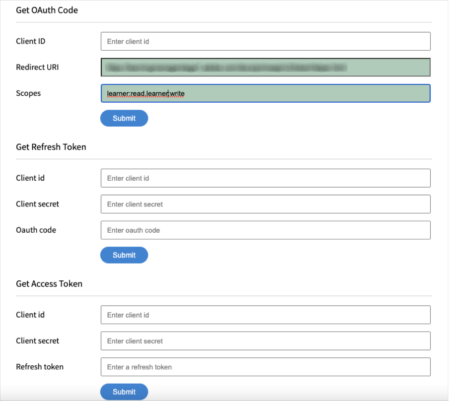

# Integrate Adobe Learning Manager with AEM

Adobe Learning Manager (ALM) integrates with Adobe Experience Manager (AEM) sites. This enables you to create your own website and responsive mobile interfaces for Adobe Learning Manager with minimum coding effort. With this integration, you can create customized learning experiences for your users.

To build such an experience, ALM provides an Adobe Learning Manager reference site package (ALM reference site package) for AEM Sites in the form of a ZIP file that you can install on your AEM Sites instance.

The package includes AEM Sites web page templates and website components along with embeddable widgets, for example, Learning catalog, embeddable widgets, calendar, and so on.

After you install the ALM reference site package, you can start building a website for Adobe Learning Manager that you can host on your AEM Sites instance. Your users can then drag and drop the components on the website.

>[!IMPORTANT]
>
>Adobe Learning Manager (ALM) packages for AEM Sites provide a quick-start code block for implementation. This package is designed for headless deployments. Upon implementation of the provided codebase, ongoing maintenance and further development shall be the responsibility of the implementing party, as is standard practice with headless applications based on Adobe Learning Manager.

## Install ALM reference site package

### Pre-requisites

* Licenses for AEM Sites and Adobe Commerce.
* AEM on-premise 6.5 or Adobe Experience Manager - Cloud Service  
* Adobe Commerce 2.4.3

After you secure your environment of AEM Sites, you must install the ALM reference site package. This package includes AEM web pages and website components that help construct the learning platform.

The reference site package is hosted on the [**GitHub repository**](https://github.com/adobe/adobe-learning-manager-reference-site/releases).

For more information, see the README.

## Download the content package {#downloadthecontentpackage}

The installer is shipped as an AEM content package. [***Download the package***](https://github.com/adobe/adobe-learning-manager-reference-site).

The content package, is available as a zip file, and is compatible with AEM 6.4 and AEM 6.5.

## Install Learning Manager component {#installcaptivateprimecomponent}

Install the Learning Manager content package using the AEM Package Manager:

>[!NOTE]
>
>For information on installing packages, see  [***How to Work With Packages***](https://experienceleague.adobe.com/docs/experience-manager-65/administering/contentmanagement/package-manager.html?lang=en#how-to-work-with-packages).

1. As AEM Author, open the AEM Package Manager.  
1. Click the button **[!UICONTROL Upload Package]**.  
1. Click **[!UICONTROL Browse]** and upload the content package.
1. Click **[!UICONTROL Upload]**.
1. After the package uploads, install the content package by selecting it and clicking **[!UICONTROL Install]**.

   

   *Install the content package*

## Create an application in [!DNL Adobe Learning Manager]

After you install the AEM site package, you must configure an ALM application to connect your learning portal with the AEM site.

This scenario is applicable when AEM is used with [!DNL Adobe Learning Manager].

Follow the steps below:

1. As an Integration Administrator, click **[!UICONTROL Applications]**.
1. To create a new application, on the upper-right corner of the page, click **[!UICONTROL Register]**.
1. In the Register a new application screen, enter the following details:

   1. Application Name: The name of the application that you are creating.
   1. URL: The URL of your organization.
   1. Redirect Domains: The hosting domains of the AEM website. You can also specify wildcards.
   1. Description: The description of the application.
   1. Scopes: Select Learner role read access and Learner role write access.
   1. For this account only?: Select Yes if you want to use the application for the existing ALM account.

1. After making the changes, click Save.

Note the application credentials from the screen.


*Application credentials*

To approve the application, click **[!UICONTROL Approve]**.

## Get the tokens

1. In the Developer Resources tab, click **[!UICONTROL Access Tokens for Testing and Development]**. 

   

   *Select Access Tokens for Testing and Development*

1. Enter the following details:

   
   *Enter the token details*

   1. Get OAuth Code: Enter the client ID from the previous section and change the scope. Click Submit to get the Oauth code.  
   1. Get Refresh Token: Enter the client ID and secret from the previous section. Also enter the OAuth code that you got from the previous step. Click Submit.  
   1. Get Access Token: Enter the client ID and secret from the previous section. Also enter the Refresh token that you got from the previous step. Click Submit.  
   1. Get Access Token Details: Enter the access token that you got from the previous step. Click Submit.

1. You can get the details from the JSON response that follows. The response consists of the access token, refresh token, user role, account id, user id, and the time to expire. Note the refresh token, as you will reuse that. 

## Configure ALM account in AEM

1. Launch your AEM instance.
1. Click Settings > Cloud Services.   
1. Click Adobe Learning Manager Configuration.

   
   *Select Adobe Learning Manager configuration*

1. Click Create > Configuration Folder. Name your folder.

   
   *Create configuration*

1. In the learning project, select the configuration that you created.  

1. Enter the details of the configuration. 

   
   *Create configuration folder*

   1. Adobe Learning Manager mode: Choose how you want the learning experience for both logged-in and non-logged in learners.  
   1. Adobe Learning Manager URL: Enter the URL of the ALM instance where the learning services are hosted.  
   1. Account ID: The ID of the ALM account.  
   1. Client ID, Client Secret, and Author Refresh Token: Enter the credentials that you got while creating the application in ALM.   
   1. Customization of Widget: For more information, see [Integrate with AEM](/help/migrated/integrate-aem-learning-manager.md) `.`

1. Save and close the configuration.

### AEM + Adobe Learning Manager (logged-in/non-logged-in users)

Adobe Learning Manager now enables you to showcase your product and training to your existing and prospective customers and partners without mandating account creation or sign-in. This functionality will help you drive product and training adoption by providing learners with a quick and easy preview of the training, which helps highlight and promote product features. Therefore, you can effectively showcase your products and offerings, especially to prospective customers and partners resulting in increased product awareness. The ease of access and better reachability lead to heightened interest, which helps drive training enrollments and learning adoption. 

Using this workflow a learner can preview a training, access training information, or search for training without signing into Adobe Learning Manager. This workflow is not applicable for the native Learning Manager interface (applicable ONLY for AEM Sites, and other headless interfaces).

**Configure and enable the learning platform connector**

This section underlines the steps needed to configure and enable the following connector:

**Training Data Access**

This connector enables your AEM Sites-based or another custom-made headless user interface to retrieve and render training information to the learners and realize a seamless training information search either before or after a learner logs in. 

This connector is only required if you are using AEM Sites-based or other headless interfaces. 

The connector exports training metadata to a data storage and retrieval solution as well as a search enablement system. Therefore, you can configure your AEM Sites-based or another custom-made headless user interface to use these two services to retrieve training data, render web pages, and provide optimized training search functionality to the learners. For example, a non-logged in AEM Sites-based interface can use the exported metadata to help a learner search, browse, and access training pages that show training information. 

Enable this connector to build and render your AEM Sites-based web pages and deliver customized experiences to your learners both before and after login. Enable this connector to build and render your AEM Sites-based web pages and deliver customized experiences to your learners both before and after login.

* Adobe Learning Manager cdn base URL - Enter the base URL of the data retrieval CDN service path from the Training Data Access connection page.  
* Admin refresh token - Enter the refresh token that you determined in the earlier section.   
* Training Metadata base URL - Enter the base URL of the search enablement and search data retrieval service path from the Training Data Access connection page.
* Adobe Learning Manager Register URL - Enter the self-registration URL generated by the integration administrator for the account, which is used by learners to enroll in training.

### AEM + Adobe Learning Manager + Adobe Commerce (logged-in/ non-logged-in users)

Adobe Learning Manager now provides solutions to help you seamlessly integrate the learning platform with Adobe Commerce. This release will enable you to easily connect your native, AEM sites-based or other headless Learning Manager interfaces to Adobe Commerce. This integration enables you to realize e-commerce abilities within your learning platform. You can now offer paid training to your customers and business partners as well as enable training purchases easily on both native and non-native Learning Manager interfaces. A learner can also preview a training, access training information, or search for training without signing into Adobe Learning Manager.

A user can use the already AEM application and approve it, instead of creating one.

* Adobe Learning Manager cdn base URL - Enter the base URL of the data retrieval CDN service path from the Adobe Commerce connection page.  
* Adobe Commerce URL - Enter the URL of the Adobe Commerce instance that you are using.   
* GraphQL proxy path - The client-side Learning Manager components access the Adobe Commerce GraphQL endpoint directly, and therefore, CORS error may occur. To avoid this error, all calls must either be served from the same endpoint as AEM or served via a proxy that adds CORS headers.  
* Adobe Commerce store name - Enter the Adobe Commerce store name that you determined in the earlier section.   
* Adobe Commerce customer token lifetime (in secs) - Enter the customer token lifetime indicating the pre-determined period for a login session.   
* Admin refresh token - Enter the refresh token that you determined in the earlier section.

## Customize webpages

Customize your webpages by using the AEM references site and the available widgets. 

1. Launch your AEM instance.  
1. Click Sites and open the configuration page.  
1. Click **[!UICONTROL Learning Site]** > **[!UICONTROL Language Masters]** > **[!UICONTROL English]**. All webpages in the project are included in the folder. 

   
   *View all webpages*

1. Select any template and click **[!UICONTROL Edit]**.  

1. On the page, click the component settings button and change the properties of the component.

   
   *Select Settings button*

1. Preview your changes or you can publish the page. 

## Create webpages

Apart from the templates that you can use that are provided by the reference site package, you can also create webpages based on the templates ibn AEM.

1. On the main AEM page, click Create > Page.   

1. Choose the template that you want to customize. Click Next.   

1. Enter the page properties. 

   
   *Page properties*

1. To create the page, click **[!UICONTROL Create]**.  

1. Select the new page and click **[!UICONTROL Edit]**.  

1. Insert a component on the page, for example, **Learning- Content**.

   
   *Filter by site*

1. Choose the required Catalog filters that will be displayed on the page.

## Create site from Blueprint

The ALM reference site package provides a "Learning Site Blueprint," which enables you to create a website for your learning platform. AEM blueprints allow you to build webpages directly from AEM Sites components. You need not use any templates. 

1. On the AEM start page, click **[!UICONTROL Sites]**.  

1. Click **[!UICONTROL Create]** > **[!UICONTROL Site]**.   

1. Click Learning Site Blueprint. 

   

   *Create site from blueprint*

1. Click Next.   

1. On the properties page, enter the page metadata. Click Create. 

   
   *Select Learning Site Blueprint*

1. Click the Home hyperlink to navigate to the home page of the site that you have created. On this page, you can customize the widgets and catalog components.

## Code your website

In addition to using the built-in templates and creating your website from scratch using the WYSIWYG components, you can also write code and build the site.

The code is in the [Reference site GitHub repository](https://github.com/adobe/adobe-learning-manager-reference-site) for you to get started.

The main parts of the template are: 

* core: Java bundle containing all core functionality like OSGi services, listeners or schedulers, as well as component-related Java code such as servlets or request filters.  
* ui.apps: contains the /apps (and /etc) parts of the project, ie JS&CSS clientlibs, components, templates.  
* ui.content: contains sample content using the components from the ui.apps  
* ui.frontend: contains React components.

All the code is in the repo to get you up and running. 

## Import and add learning manager components to existing web-page or template

Installing AEM reference site package adds the Learning Manager components to your AEM Sites instance. By default, you can add these components to the web project (website) Learning Site that we provide out-of-the-box. These components are also available in the website that you create from the Learning Site Blueprint.

However, if you want to use these newly added Learning Manager components to your existing web project or website, you should import them using the following procedure.

1. Install the ALM reference site package.  

1. Open the web project and navigate to the HTML file (for the webpage or web template where you want to add the Learning Manager components).
1. Joining a meeting

   Open the HTML file and add the following code snippets to the page component so that the code executes before the learning components present in the page render.

   *`<sly data-sly-use.configModel="com.adobe.learning.core.models.GlobalConfigurationModel"/>`*
   *`<meta name="cp-config" content="${configModel.config}" />`*

   The preceding code adds the mapped configuration in the meta tag of the page, which is required for the learning components to render. For more details, see [Adobe Learning Manager reference site](https://github.com/adobe/adobe-learning-manager-reference-site/blob/master/ui.apps/src/main/content/jcr_root/apps/learning/components/page/customheaderlibs.html).

1. Ensure that you have mapped the configuration with the web project.  
1. Open the AEM Sites template where you want to import the Learning Manager components.  
1. On the template page editor, navigate to the Allowed Components container and select **Policy**.
1. In the Policy page, navigate to Properties > Allowed Components and select the following components "Learning - Content," "Learning - Form," and "Learning - Structure"

The following procedure enables the template to fulfill the client library dependencies of the imported Learning Manager components.

The web pages that include these components should load these libraries to successfully render and use the components.

1. On the template page editor, click Page Information and then click Page Policy.
1. In the Policy page, navigate to Properties > Client Libraries and add these to your template page:

   1. learning.site
   1. learning.ui
   1. learning.commerce

After you save this template, you can add the Learning Manager components in all web pages derived from this template.

## Configure the widget in AEM {#configurethewidgetinaem}

For widget configuration, the AEM author only requires the refresh token provided by the Learning Manager Integration Admin.

You can also set multiple account configurations in multiple pages.

1. Click **[!UICONTROL Tools]** > **[!UICONTROL Cloud Services]** > **[!UICONTROL Learning Manager Widget Configuration]**.
1. Click **[!UICONTROL Create]**.
1. Enter the refresh token here. Set up the other settings.
1. Hostname should be changed to "learningmanagereu" for EU regions.
1. Save and close the configuration.
1. Select a configuration and publish the configuration.

## AEM Author {#aemauthor}

The AEM author must first add the component in AEM template

The AEM author then will be able to drag and drop the Adobe Learning Manager component and configure accordingly.

Learning Manager component requires the configuration created in above step to be mapped to the Page.  Author can map the configuration by Editing Page Properties under **[!UICONTROL Advanced]** > **[!UICONTROL Configuration]** > **[!UICONTROL Cloud Configuration]** and provide path of configuration. In this way, Author can create configurations for multiple Learning Manager accounts and map each one to different Sites Page. If a configuration is not mapped to the Page, component will read the configuration from Parent Page recursively until it finds one.

## Learner {#learner}

The learner can take the courses from within the page.

To be able to access the Learning Manager widget, Learner should be a logged in AEM user. Also, property **email** should be present in "/profile" node of Learner's rep:User node. This email should be exactly same as the one present in Learning Manager account.

The learner can take the courses from within the page.

The course progress also gets saved.

The following widgets are provided:

1. Gamification
1. Learning calendar
1. Social widget
1. Catalog widget
1. My Learning
1. Recommendation based on peer learning
1. Recommendations by admin
1. Recommendation based on learner interests

If there are no recommendations, the widget appears blank.

## Support for Skyline

Skyline is the cloud version of AEM. You must first install Skyline from the package manager. To use the Skyline component in AEM, a user must be present in the Learning Manager account. In other words, the user's email address must exist in the account.

### Deploy Skyline

The steps to configure Skyline are mentioned in the  [GitHub repo](https://github.com/adobe/captivate-prime-aem-components).

## My Learning widget

**[!UICONTROL My Learning]** widget allows you to display training from a specific or a set of catalogs to a user. 

In the **[!UICONTROL Properties]** section in the page properties, select **[!UICONTROL Catalog]** from the options listed. 

<!---->

The Catalog options contains the following options:

* **[!UICONTROL Catalog ids]:** Comma-separated catalog ids for which the training need to be displayed.
* **[!UICONTROL Sort]:** Sort order for the training. The options are- name, date, dateCreated, dateEnrolled, and so on.
* **[!UICONTROL Learner State]:** Returns all training that uses the following as filters- enrolled, started, completed, and not enrolled. The search results will not be displayed if the sort option is dateEnrolled, dueDate, or dateEnrolled.
* **[!UICONTROL Skill name]:** The skill used to filter exact training.
* **[!UICONTROL Tag name]:** The tag used to filter exact results.

Here are a few additional components that you can customize:

**[!UICONTROL Learning Object Types]:** Filter according to the type of the Learning Object. The supported types are- course, certification, jobAid,and learningProgram.

In AEM, the title of a card in a strip will be empty initially. In properties, type the name of the title in widgets.html.

**Customization**

You can customize the look and feel of the layout using widgets.html. You can change the appearance of the cards that appear and customize the theme.

In the **[!UICONTROL General Settings]** section, you can choose the primary and secondary colors for the cards and specify the properties to customize the theme.

```
{ 
 "globalCssText":"@import url('https://fonts.googleapis.com/css2?family=Grandstander:ital,wght@0,100;0,200;0,300;0,400;0,500;0,600;0,700;0,800;0,900;1,100;1,200;1,300;1,400;1,500;1,600;1,700;1,800;1,900&family=Montserrat:ital,wght@0,100;0,200;0,300;0,400;0,500;0,600;0,700;0,800;0,900;1,100;1,200;1,300;1,400;1,500;1,600;1,700;1,800;1,900&display=swap');", 
 "fontNames":"Grandstander", 
 "cardLayout":{ 
 "cardLayoutName":"compact", 
 "cardPrimaryColor":"#376BA4", 
 "cardSecondaryColor":"#F98EB0", 
 "startedStateTextColor":"#ffffff", 
 "continueStateTextColor":"#ffffff", 
 "revisitStateTextColor":"#ffffff", 
 "startedStateColor":"#a0a0a0", 
 "continueStateColor":"#f9a122", 
 "revisitedStateColor":"#7fbc64", 
 "textPrimaryColor":"#ffffff", 
 "textSecondaryColor":"#d93f3f", 
 "navIconColor":"#a0a0a0" 
 } 
}
```

### Configure My Saved Courses widgets in AEM sites

My Saved Courses widget allows learners to view their bookmarked or saved courses directly on their learning pages, providing easy access to courses they want to revisit or complete later.

To configure the My Saved Courses Widget in AEM sites:

1. Launch the AEM sites.
2. Open the page in **[!UICONTROL Edit]** mode.
3. Go to the **[!UICONTROL Components Browser]** and add **[!UICONTROL My Learning widget]** to the page.
4. Select the component and then select **[!UICONTROL Configure]**.
5. Select **[!UICONTROL My Saved Courses]** from the dropdown menu in the **[!UICONTROL Properties]**.
6. Select **[!UICONTROL Done]** and then refresh the page in **[!UICONTROL Preview]** or **[!UICONTROL Publish]** mode.

The widget will display the saved courses to the learners. 

When you apply another filter in the Catalog, only the results matching that filter are displayed. Bookmarked items are not included automatically.

### Ignore higher order LO enrollment

If the **Ignore Higher Order LO Enrollment** checkbox is enabled and a user is enrolled directly into a Learning Program or Certification, the courses for that certification or Learning Program will show up for the user in the widgets.

If the check-box is disabled, the courses present in the Learning Program or Certification where user has not enrolled directly will not show up.


*Select the Ignore Higher Order LO Enrollment checkbox.

The setting is then applied on the widget.

### Security

The fields Client ID and Client Secret are added. In addition, the refresh token gets masked. After a user creates the entire configuration, if the user opens the configuration again to edit it, or if some other user opens this configuration, the refresh token will be masked.
