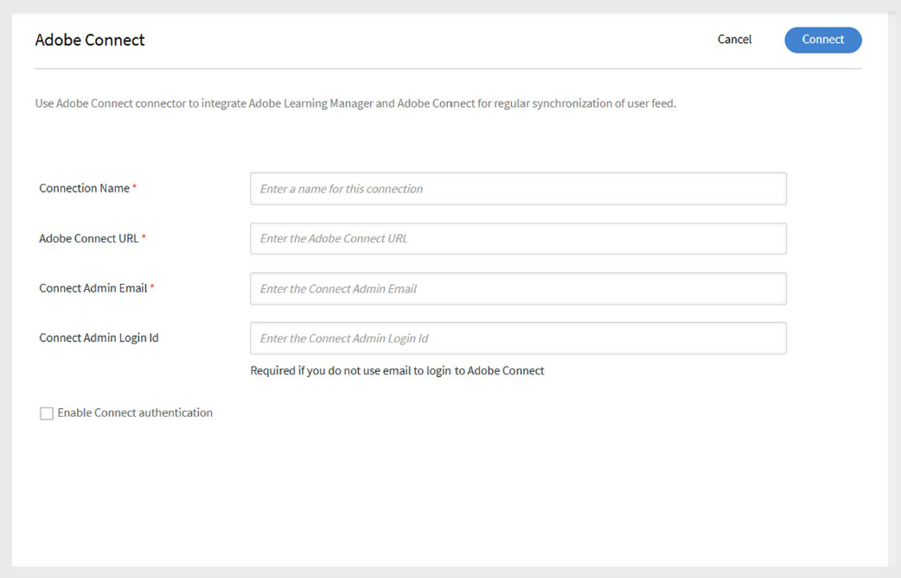

# Adobe Connect connector in Adobe Learning Manager

## Introduction

Adobe Learning Manager integrates with Adobe Connect to help you deliver and manage virtual classroom training. With this integration, you can schedule sessions, use persistent or dynamic meeting rooms, capture attendance, import quiz results, and provide learners with session recordings.

## Configure Adobe Connect

To configure Adobe Connect:

1. Log in to Adobe Learning Manager as an integration administrator.
2. Hover over the **Adobe Connect** tile and select **Connect**.

   
      _Select Connect to configure Adobe Connect Connector_

3. Type the following details:

   - **Connection Name**
   - **Adobe Connect URL**
   - **Connect Admin Email**
4. Type the **Connect Admin Login Id** (Required if email login for Adobe Connect i s not used).

   
      _Type the required details for Adobe Connect configuration_

5. Select **Enable Connect authentication**.

   >[!NOTE]
   >
   >Only Adobe-hosted Connect accounts are supported. (Domain must end with .adobeconnect.com)

6. Select **Connect**.

After you authenticate the admin email ID:

- Adobe Learning Manager displays a success message confirming that Connect is integrated.
- The request goes to the Adobe Connect backend team for approval. This usually takes one to two days.

>[!IMPORTANT]
>
>The Adobe Connect account administrator must accept the Terms and Conditions when logging in for the first time. If this is not done, login authentication may fail.

## Add virtual classroom session information

If an author has not provided session details for a virtual classroom course, the Administrator can add them:

1. Log in as administrator.
2. Select the VC course.
3. Select **Instances** and then select **Session Details**.
4. Select the **Edit** icon to add or update session information.

>[!NOTE]
>
>Your Connect account must have enough meeting rooms and capacity for concurrent users to run virtual classrooms. Each Adobe Learning Manager virtual classroom session automatically creates a new Connect meeting room unless you use a persistent room.

## Persistent meeting rooms

Adobe Connect supports persistent meeting rooms, which stay available for reuse.

- You can create a virtual classroom session using an existing persistent room in Connect.
- You can also choose to have Adobe Learning Manager create a dynamic room for each session instead.

When learners attend a session using Adobe Connect, they enter the room through Learning Manager using secure authentication.

After completing a session, learners can access the session recording and passcode in their Learning Manager app.

## Import quiz scores from Adobe Connect

Adobe Learning Manager can import quiz data from Adobe Connect sessions and combine it with other reporting workflows. This includes quiz scores, learner responses, and completion data, like how self-paced modules work.

### Quiz import workflow

#### Adobe Connect (Host)

- The Connect host creates a course and uploads content that includes an interactive quiz.
- The host sets up a Virtual Classroom (VC) training and either links the course to the VC or uses the **Share Course** option to share it during the session.

#### Adobe Learning Manager (Author)

- The Author creates a course in Adobe Learning Manager with the module type set to **Virtual Classroom**.
- From the **Conferencing System** drop-down, select **Connect** as the VC provider.
- Choose the **Persistent Meeting Room** created by the host in Connect.
- Assign an instructor, save, and publish the course.

#### Adobe Learning Manager (Learner)

- The learner enrolls in the course and joins the Connect VC session.
- The Connect host allows the learner to access the session.

### Adobe Connect (Host & Learner)

- The host shares the quiz in the session.
- The learner completes the quiz and exits the session.

### Adobe Learning Manager (Sync & Admin)

- When the session ends, Adobe Learning Manager automatically syncs the quiz data.
- The quiz import workflow starts after the scheduled duration ends.
- To track progress, the integration admin can check **Execution Status** in the Adobe Connect connector.
- Once the import is complete, the status updates to **Completed**.

The Administrator can then review the imported results:

- **Attendance & Scoring:** View final quiz scores and attendance.
- **L2 Quiz Score:**
  - **By User:** Shows individual scores in points and percentages.
  - **By Question:** Displays quiz results in a report chart.
