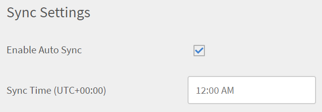

# Manage custom roles via CSV files {#manage-custom-roles-via-csv-files}

The Integration admin can add number of custom roles to his/her account in bulk via CSV as well as can assign the same to various users. This approach automates the process of creation of custom roles.

You can configure roles via the Learning Manager FTP and Box connectors.

After you sign in to your Box or ExaVault storage account, the Integration admin can add the following csvs in the account:

* role.csv
* user_role.csv

To get started, download the csvs and change the values according to your requirements.

**role.csv**
[Sample file- role.csv](assets/role.csv) [Sample file- user_role.csv](assets/user-role.csv) 

<table> 
 <tbody>
  <tr> 
   <td>
<b>Column name</b>
</td> 
   <td>
<b>Description</b>
</td> 
   <td>
<b>Example Values</b>
</td> 
  </tr> 
  <tr> 
   <td>
Name
</td> 
   <td>
Identify role within CSV to assign to users.
</td> 
   <td>
Sales Author
</td> 
  </tr> 
  <tr> 
   <td>
&lt;Entity&gt;
</td> 
   <td>
Identify Access Type (FULL, WRITE, ENROLL, REPORT, NONE) for each entity type such as COURSE, CATALOG etc.
</td> 
   <td>
FULL

NONE

WRITE | REPORT

Column names will correspond to entity type names such as Catalog, Course, Learning Plan etc.

One column for each entity type will be present in the CSV. Entities, for which no permission is to be given, should be included with a value of NONE
</td> 
  </tr> 
  <tr> 
   <td>
Catalog Scope Specifier
</td> 
   <td>
Single Catalog name or a PIPE (|) separated list of Catalog Names that determine the scope of this role.
</td> 
   <td>
Sales Catalog | General Catalog
</td> 
  </tr> 
  <tr> 
   <td>
User Group Scope Specifier
</td> 
   <td>
User Group Attribute name and value that determine scope of this role's users.

See the section below for the scopes.
</td> 
   <td>
location=London
</td> 
  </tr> 
  <tr> 
   <td>
Description
</td> 
   <td>
Optional user-friendly description to help understand purpose of the role and later reference.
</td> 
   <td>
Full author access to LOs in Sales Catalog
</td> 
  </tr> 
 </tbody>
</table>

All columns except Description are mandatory.

# Define scope of user groups {#definescopeofusergroups}

You can specify scopes for user groups for various types of groups in the following ways:

* User group name as is (for example, All Authors, My Custom Group)
* Leaf attribute and value (for example, Department=HR)
* Self-registration profile groups (self_registration=profilename)
* External registration profile groups (ext_registration=profilename)
* A manager's team of direct reportee (manager_direct=<emailid>)
* A manager's complete org (manager_org=<emailid>)

**user_role.csv**

<table> 
 <tbody>
  <tr> 
   <td>
<b>Column Name</b>
</td> 
   <td>
<b>Description</b>
</td> 
   <td>
<b>Comment</b>
</td> 
  </tr> 
  <tr> 
   <td>
Id
</td> 
   <td>
Email id of the user to be assigned a configurable role.
</td> 
   <td>
If the user already has a configurable role assigned, the role gets replaced with a new role specified in the CSV. No error is reported.
</td> 
  </tr> 
  <tr> 
   <td>
CustomRole
</td> 
   <td>
Name of the configurable role to be assigned to the user
</td> 
   <td>
The role name must be an existing role as specified in the CSV. Roles created by the Administrator via the UI can be used here.
</td> 
  </tr> 
 </tbody>
</table>

**Full Scope features**

Whenever Full Permission is assigned for any of the following features (Account level features), the User Group Scope and Catalog Scope are automatically taken as FULL as the user cannot have limited access to these features.

If any Catalog Names or User Group names are provided in the CSV, they are overridden with FULL permission.

* Announcements
* Skills
* Gamification
* Users
* Learning Plans
* Email Templates

# Add the role-CSVs in the account {#addtherolecsvsintheaccount}

In your Box account, choose **Import > user > internal**, and upload the files- role.csv and user_role.csv.

* The Custom Role CSVs must be copied in the folder “import->user->internal->user_role”
* The Users CSV must be copied in the folder “import->user->internal”

Both the CSVs must be uploaded via Box or FTP only and cannot be uploaded through UI. 

**NOTE:** The Users CSV file is mandatory., but the Custom Role CSVs are optional. All the files that are present are processed, and others are skipped.

The custom roles created using the csv file is not visible to Admins in the UI. These roles will not be related or affected by roles created (or to be created later) by UI.

Custom roles that have been created by a csv can be entirely managed via the csv itself. This includes adding, modifying and deleting roles.

Assigned roles can be revoked by removing assignment entries from user_role csv. But assignments done via Admin UI are not affected by this.

To assign and revoke a custom role, update the csv files.

# Synchronization of custom roles {#synchronizationofcustomroles}

After the Integration Admin uploads the role-based CSVs in the Connector storage, the Admin can enable synchronization to the CSVs. Each time a custom role is updated, added, or deleted in the CSVs, the Admin can synch the information in the files and make the list of roles current.

On the Getting Started page on the Administrator panel, click **Settings > Data Sources**.

In the Sync Settings section, enable the option **Enable Auto Sync**.

When you choose this option, you can schedule the time for synchronization at the exact time that you specify in the Sync Time field. If you specify the sync time as 12:00 AM, the custom roles are updated at exactly the specified time every day.

If you want to synchronize the data on demand, click **Sync Now**.

# Constraints while configuring roles {#constraintswhileconfiguringroles}

In any account, the name of a Role must be unique. Therefore, a role created via UI or CSV must not have the same name as another role already created by UI or CSV.

On similar lines, from Admin UI, a user can't be assigned a configurable role created via CSV as these roles will not be available.

However, user assignment CSV can be used to assign roles created by UI.
