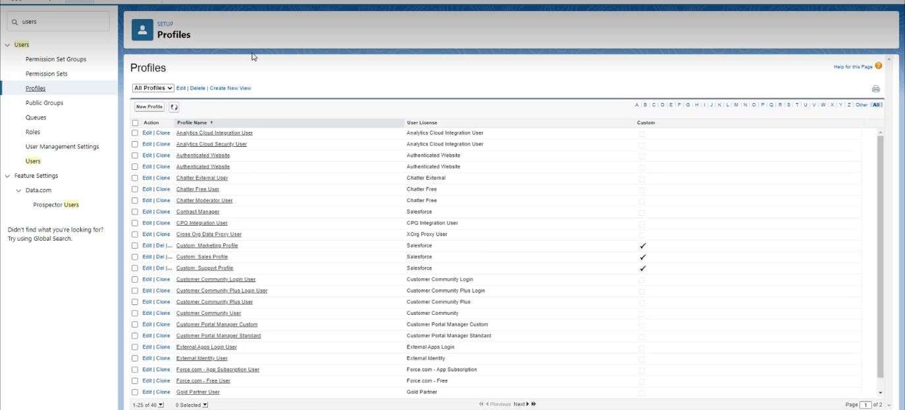
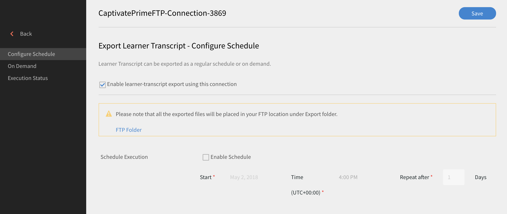
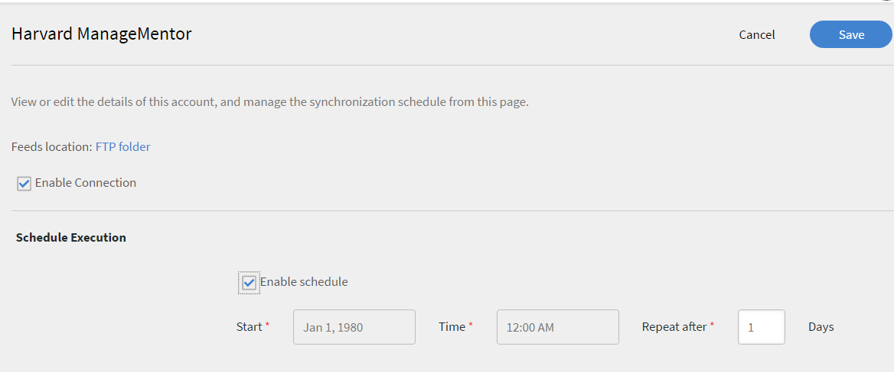
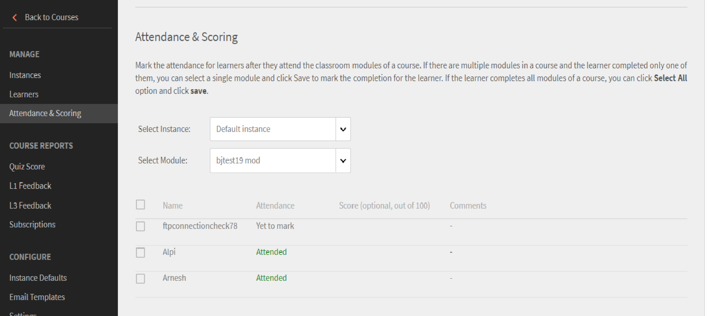
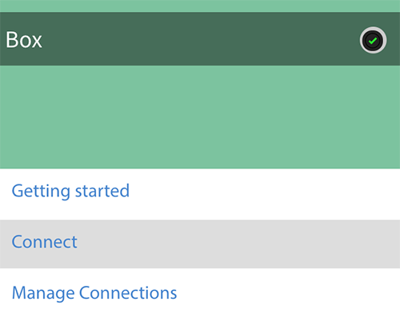
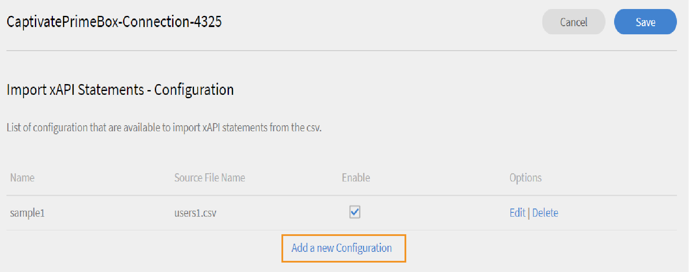
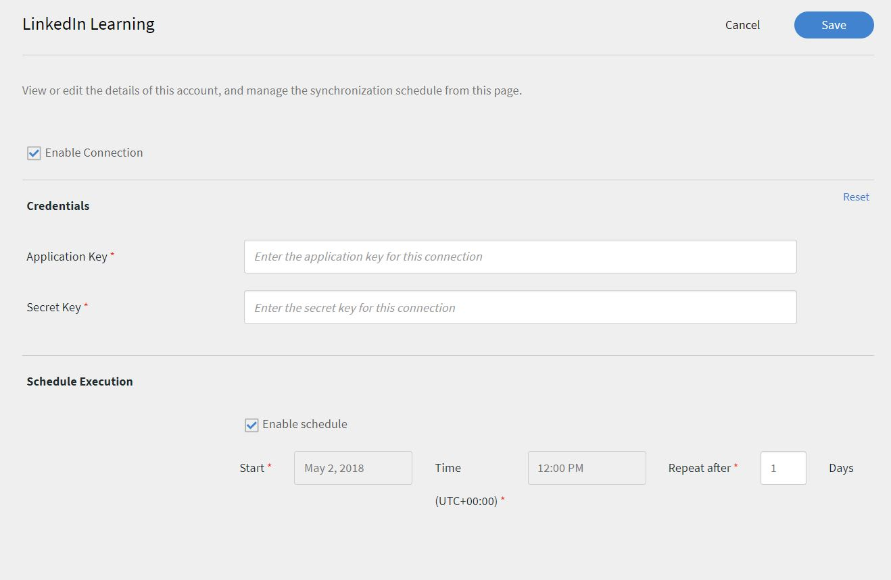
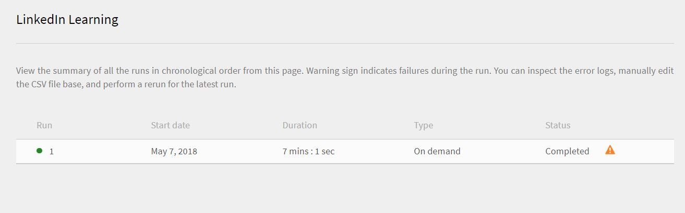
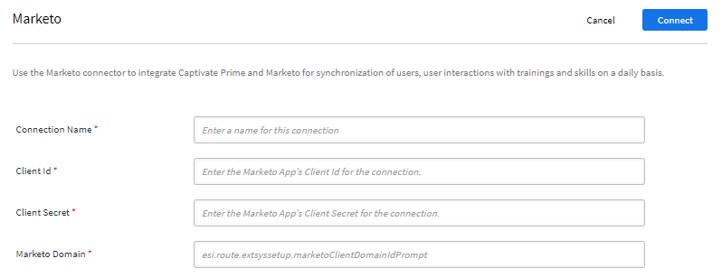

# Learning Manager Connectors 

Enterprises have other applications and systems which have to be integrated with Learning Manager. Connectors are utilities that Help in performing data-based integrations such as importing data into Learning Manager from external  systems.  It also performs exporting of data to external systems from Learning Manager.

Learning Manager provides Salesforce and FTP connectors. Using Salesforce connector, integration Administrators of an organization can integrate their Salesforce application with Learning Manager. As an integrator, you can also use FTP connector to auto import a set of users into your enterprise application.

Learning Manager also provides the Lynda, getAbstract, and the Harvard Management System connectors. These connectors enable learners to access and consume courses from Lynda.com, getAbstract, and Harvard ManageMentor.

Read on to know how to configure and use each of these connectors in Learning Manager.

<!--
>[!NOTE]
>
>**Update:** December 2020 update of Learning Manager
>
>For **FTP**, **Box**, and **Custom FTP** connectors, while exporting Learner Transcript or xAPI, you can also export the data as a **zip** file, for:
>
>* Learner Transcripts
>* xAPI
-->

>[!NOTE]
>
>With the November 2022 release of Adobe Learning Manager, Zoom has deprecated [JWT authentication by June 2023](https://marketplace.zoom.us/docs/guides/auth/jwt/). Accordingly, the Zoom connector with JWT will continue to work until mentioned date, but we recommend users to create Server-to-Server OAuth app to replace the functionality in their account. Any new connection will have Zoom OAuth authentication by default.

## Salesforce connector {#sfconnector}

Salesforce connector connects Learning Manager and Salesforce accounts to automate data synchronization. Salesforce connector capabilities are as follows: 

### Map attributes {#map-attributes}

Integration Administrator can choose Salesforce columns and map them to corresponding Learning Manager's group-able attributes. Once the mapping is completed, the same mapping is used in subsequent user imports. It can be reconfigured if Administrator wants to have a different mapping for importing users.

### Automated user import {#automated-user-import}

User import process allows Learning Manager Administrator to fetch employee details from Salesforce and import them into Learning Manager automatically. This automation avoids the manual effort involved in creating CSV and uploading into Learning Manager.

### Auto Schedule {#auto-schedule}

Using auto scheduling feature along with automated user import feature can be effective. Learning Manager Administrator can set up schedule according to organization's needs. Users in the Learning Manager application can be up-to-date according to the schedule. Sync can be performed on daily basis in Learning Manager application. 

### Filtering users {#filtering-user}

Learning Manager Administrator can apply filtering on the users before importing them. For example, Learning Manager Administrator can choose to import all users in the hierarchy under one or more specific Managers. 

### Configure Salesforce connector {#configuresalesforceconnector}

To integrate Salesforce with Learning Manager, learn the process 

#### Pre-requisites {#prerequisites}

Ensure that you have your Salesforce organization URL with you. For example, if your organization name is **myorg**, the Salesforce URL could be `https://myorg.salesforce.com`. It is the only input which is required to connect Salesforce account with Learning Manager.

Also make sure that you have the appropriate credentials to log in to the account.

#### Create a connection {#createaconnection}

1. In Learning Manager home page, hover mouse over the Salesforce card/thumbnail. A menu appears. Click **[!UICONTROL Connect]** item in the menu.

   
   
   *Connect option*

1. A dialog appears prompting you to enter the org-url. Click **[!UICONTROL Connect]** after providing the URL. 
1. Upon successful connection, the overview page appears.

### Map attributes {#mapattributes}

Once the connection is successfully established, you can map Salesforce columns to the corresponding attributes of Learning Manager. This step is mandatory. 

1. In the mapping page, on left side you can see Learning Manager's columns and on right side you can see the Salesforce columns. Select the appropriate column name that maps to the Learning Manager's column name.

   
   *Map attributes*

   >[!NOTE]
   >
   >Learning Manager's column data shown on the left side are fetched from the active fields. The **manager** field must be mapped to a field of type email address. Mapping all the columns is mandatory before the connector can be used.

1. Click **[!UICONTROL Save]** after completing the mapping. 
1. The connector is now ready for use. The account that has been configured and appears as a data source within the Administrator app. The administrator can schedule the import or for on-demand sync.

## Using Salesforce connector {#usingsalesforceconnector}

Salesforce connector connects to Salesforce.com to fetch the users as configured and add them to Learning Manager. 

### Import users from Salesforce contacts {#import-salesforce-contacts}

Learning Manager enhances the Salesforce connector to fetch Contacts as well as Salesforce Users and import them into Learning Manager automatically.

On the Salesforce connector page, enter the Salesforce url and complete the authentication. Once you've authenticated, you can then proceed to import users or contacts. If you choose the option Contacts, then specify the subset of contacts to be imported.

Choose the Salesforce columns and map them to corresponding Learning Manager's group-able attributes. Once the mapping is completed, the same mapping is used in subsequent user imports.

1. Sign in to Salesforce.  
1. On the connection page, click **[!UICONTROL Import Internal Users]**. 

   
   *Import internal users*

1. On the **Import Users** page, there is a new option, Contacts. Click the radio button **Contacts** and you will see the following options.

   
   *Map the contact attributes*

1. If you click **[!UICONTROL Yes]**, you can perform the following:

   * **Choose Contacts column:** Select the field that you want to import to Learning Manager.
   * **Specify values:** Choose the values that represent the field selected.

   
   *Specify the values*

   * Map the Salesforce columns with that of Learning Manager.  
   * To start importing, click **[!UICONTROL Save]**.

1. If you click **[!UICONTROL No. Import all Contacts]**, you can map the fields directly without filtering the contacts. Here, you'd import all contacts from Salesforce.
1. To start importing, click **[!UICONTROL Save]**.

## Export learning records {#export-learning-records}

Learning Manager offers an ability to export learning records like transcript, user report, skill report to Salesforce. You can determine if the exported data should be linked with the 'User' table or the 'Contacts' table in Salesforce. 

 
*Exporting learning records*

### Custom objects in Salesforce {#custom-objects-in-salesforce}

Before exporting learning records from Learning Manager, you must create custom objects in Salesforce. Custom objects are objects that you create to store information that's specific to your company or industry. For more information, see [Salesforce custom objects](https://trailhead.salesforce.com/en/content/learn/modules/data_modeling/objects_intro).

Here's how you'll create the objects:

1. Download and install the packages to create the Custom Objects.

   * [Package 1](https://test.salesforce.com/packaging/installPackage.apexp?p0=04t1k0000008WPJ)
   * [Package 2](https://test.salesforce.com/packaging/installPackage.apexp?p0=04t1k0000008WPT)
   * [Package 3](https://test.salesforce.com/packaging/installPackage.apexp?p0=04t1k0000008WPi)

1. Rename the names of the Custom Objects in Salesforce.
1. Select the events and click **[!UICONTROL Save]**.

>[!NOTE]
>
>Please ensure that system administrator access has been granted to all active fields added after the package installation.

**Link events with:** Choose which section you want to export- User or Contact. If you choose Contact object, users who are present in Learning Manager but not in Salesforce, will be created in Salesforce. 

*Link events option*

>[!NOTE]
>
>You can create multiple connections in one account. A single connection can serve up to three Custom Objects in Salesforce. If you want to create multiple connections for the same Salesforce account, you must install the three packages. We provide support up to three packages.
>
>As many connections that you want to create, you must install as many packages.

>[!NOTE]
>
>On the Execution Status page for Salesforce, the number of records processed can only be checked from Salesforce. Learning Manager displays the status as completed even when there is a partial export or failure in all the records that had been processed.

## Install Salesforce Package {#install-salesforce-package}

Learning Manager offers a Salesforce App package. Once installed and configured in SFDC, sales employees can perform their training activities within the SFDC portal. This app allows SFDC users to explore new trainings, view recommendations and consume them right inside the SFDC portal. Users also get the announcements sent by Administrators in the form of mastheads right inside the app within the SFDC portal.  

### Set up in Learning Manager app {#setup-in-learning-manager-app}

1. Log in to your Learning Manager Admin account as Integration Admin.
1. Click **[!UICONTROL Applications]** > **[!UICONTROL Featured Apps]**.
1. Click **[!UICONTROL Salesforce]**.
1. On the Salesforce app page, note the Application id (also known as client id) and the client secret mentioned in the description.
1. Click **[!UICONTROL Approve]** and your app must be approved successfully.
1. Click **[!UICONTROL Developer Resources]** > **[!UICONTROL Access Tokens for Testing and Development]**.
1. In the Get OAuth Code section, the Client ID and scope must be set to - admin:read,admin:write. Click **[!UICONTROL Submit]**.
1. In Get Refresh Token, enter the Client ID and Client secret. Click **[!UICONTROL Submit]** and note the refresh token.

### Create account in Salesforce app {#create-account-in-salesforce-app}

1. Create an account on the Salesforce sign-up page. You must create a Salesforce account in developer or enterprise edition.  [Developer signup URL](https://developer.salesforce.com/signup). Ensure that you must use the email ID to sign up for Salesforce that you'd used for Learning Manager. 
1. Verify your account via the verification email. 
1. Create a password and sign into Salesforce.
1. Note the Salesforce url after login (For eg, site.lightning.force.com)

### Install Learning Manager package {#install-learning-manager-package}

If you want to install the package, you must first delete the existing package in Salesforce. Before uninstalling, you must enable the settings, as shown below. Applying these settings is mandatory, otherwise you will be unable to install the package. 

>[!NOTE]
>
>The Adobe Learning Manager app is only supported in Salesforce Lightning view.

1. Launch the [Learning Manager package url](https://login.salesforce.com/packaging/installPackage.apexp?p0=04t1k0000008WOQ).  
1. In the **Login** page, click **[!UICONTROL Use Custom Domain]**.
1. Enter the package URL and click **[!UICONTROL Continue]**. The installation page must have the option Install for Admins Only selected. Do not change this option.
1. Click **[!UICONTROL Install]**. Once the package is installed, click **[!UICONTROL Done]**. You are guided to the Installed Packages page, and you can see the Adobe Learning Manager installed package.
1. Go to the App Launcher (next to Setup) and search for Adobe Learning Manager.
1. To configure the app, click **[!UICONTROL Configure]**.
1. Click **[!UICONTROL New]** and add the following details:

   * **Config:** Enter a name of your choice.
   * **ClientID**: Enter the value that you'd obtained from the first section.
   * **ClientSecret:** Enter the value that you'd obtained from the first section.
   * **RefreshToken:** Enter the value that you'd obtained from the first section.
   * **LearningManagerBaseURL:** The URL of the site where Learning Manager is hosted.

### Add Remote Site Settings {#add-remote-site-settings}

1. In the top-right corner of the page, click **[!UICONTROL Setup]**.
1. In **[!UICONTROL Quick Find]**, search for Remote Site Settings.
1. Click **[!UICONTROL New Remote Site]**.
1. Enter the details:

   * **Remote Site Name:** Enter a name of your choice.
   * **Remote Site URL:** The URL of the site where Learning Manager is hosted.

1. Launch Learning Manager.

### Enable Notifications for the Learning Manager app {#enable-notifications-for-learning-manager-app}

1. In the upper-right corner, click **[!UICONTROL Setup]**. 
1. Search for Custom Notifications. 
1. Click **[!UICONTROL New]**.
1. Enter the following details:  

   1. **Custom Notification Name:** LearningManagerNotification 
   1. **API Name:** LearningManagerNotification

1. Select both **Desktop** and **Mobile** as Supported channels.

1. Click **[!UICONTROL Save]**.
1. To enable push notifications for mobile devices, follow the steps below:

   1. Install Salesforce mobile app in your mobile phone.
   1. Log in to the app using your credentials.
   1. Go to **Setup** > **Notification Delivery Settings**.
   1. Add Salesforce for iOS and Android.

### Uninstall Learning Manager from Salesforce

1. In Salesforce app, go to Installed packages.
1. Click **[!UICONTROL Uninstall]**.

## Configure Learning Manager for Salesforce users {#configure-learning-manager-for-salesforce-users}

The Learning Manager app is also available to users, who are present in any Salesforce account. The Salesforce admin can add users based on the profiles. The Salesforce profiles are similar to what they are in Learning Manager. For example, Administrator, Integration Admin, Instructor, and so on. The Salesforce admin can also create a custom profile.

As a Salesforce admin, you can either assign the profiles to users or create a custom profile.

When installing the package, you can assign the Salesforce profile to the learners.

After installing the package, you must configure the profile.

Click **[!UICONTROL Configure]** > **[!UICONTROL New]**, and then add the following:

* Config Name
* ClientID
* ClientSecret
* LearningManagerBaseURL
* Disable Redirect

>[!NOTE]
>
>For Learners to view the Learning Manager app, you must enable the app for all learners.

The next step is to provide the permission to access the Learning Manager app.

*Set permissions to access the Learning Manager app*

Select the users and assign the permissions accordingly. The learners can now access the Learning Manager app.

Now, select a profile, for example, Standard Profile of a user, and click the profile. Click **[!UICONTROL Edit]** and in the **Custom App Settings** section, enable the check-box **Adobe Learning Manager**. This makes the app accessible to the user.

In the **Custom Tab Settings** section, in the **Learner Home** drop-down list, select the option **Default On**.

You must make the app visible to all the profiles.

Click **[!UICONTROL Save]** and the learners belonging to all the profiles will access Learning Manager app.

### Learning Path-related changes {#learning-path-changes}

#### Existing connections {#existing-connections}

If the option Learning Path is disabled in the Admin account, no rows and columns are added in the report.

If the option Learning Path is enabled in the Admin account, the column "Type" will be populated with Learning Path in case learners are enrolled to it.

>[!NOTE]
>
>If the flag is enabled and you use an existing connection, a few records may be missed.

#### New connections {#new-connections}

If the option Learning Path is disabled in the Admin account, the training report will consist of the following columns, but will not contain any data.

* **Embedded Path:** Displays the name of the Learning Program
* **Embedded Path ID:** Displays the IDs for the Learning Program.
* **Embedded Course ID:** Displays the IDs of courses that are inside a Learning Path. 

Also, for new connections in accounts where Learning Path is enabled, the three new columns will appear, and all data will flow.

In addition, the report will contain the column type Learning Path (Higher Level) for all learners who are enrolled in a Learning Path.

In the Type column, the Learning Program will be renamed as Learning Path. For existing connections, there will be no change. 

## Learning Manager FTP connector {#ftpconnector}

Using the FTP connector, you can integrate Learning Manager with arbitrary external systems to automate data synchronization. It is expected that external systems can export data in a CSV format and place it in the appropriate folder of the Learning Manager FTP account. FTP connector capabilities are as follows:

You can also use the Box connector for data migration, user import, and data export. For more information, see Box connector.

### Data import {#data-import}

The user import process allows the Learning Manager Administrator to fetch employee details from the Learning Manager FTP service and import them into Learning Manager automatically. Using this feature, you can integrate multiple systems by placing the CSV generated by those systems in the appropriate folders of the FTP accounts. The Learning Manager picks up the CSV files, merges them, and imports the data according to the schedule. Refer to the Scheduling feature for more information.

**Map attributes**

The Integration Administrator can choose the columns of CSV and map them to the Learning Manager's group-able attributes. This mapping is a time effort. Once the mapping is done, the same mapping is used in subsequent User imports. The mapping can be reconfigured if the Administrator wants to have a different mapping for importing users.

#### Export Data {#export-data}

The Data Export allows users to export user skills and learner transcripts to an FTP location to integrate with any third-party system.

#### Scheduling {#scheduling}

Administrators can set up scheduling tasks as per the organization's requirements and users in the Learning Manager application are up-to-date according to the schedule. Similarly, the Integration Admin can schedule skill export on a timely basis to be integrated with an external system. Sync can be performed daily in the Learning Manager application.

### Configure Learning Manager FTP connector {#configure-captivate-prime-ftp-connector}

To integrate the FTP connector with Learning Manager, learn the process.

#### Create a connection {#Create-a-connection-1}

1. On the Learning Manager home page, hover the mouse over the FTP card/thumbnail. A menu appears. Select the Connect item in the menu.

   
   
   *Connect option*

To connect to any FTP Server using FTP Client, you will need the following information:

* **FTP Domain**: This is the address of the FTP server you want to connect to. For example, ftp.example.com
* **Port**: The default FTP port is 21, but some servers might use different ports for security reasons. For Adobe Learning Manager – Port 22
* **FTP Username**: The username you need to access the FTP server.
* **FTP Password**: The password associated with the username.

**FileZilla (Windows, macOS, and Linux)**

**Step 1: Download and Install FileZilla**

If you haven't installed FileZilla yet, download it from the official website: [Download](https://filezilla-project.org/) and install it on your computer.

**Step 2: Open FileZilla**

After installing, launch FileZilla on your computer.

**Step 3: Gather FTP Server Information**

**Step 4: Enter FTP Server Information in FileZilla**

In the top menu, select **[!UICONTROL File]** and then select **[!UICONTROL Site Manager]** (or use the shortcut Ctrl+S).

**Step 5: Add New FTP Site**

In the Site Manager, select **New Site** and type a name (e.g., My FTP Server).

**Step 6: Enter FTP Details**

Type the following information:

* **Host**: Type your FTP server's address.
* **Port**: If the server uses a port over 21, enter the correct port number.
* **Protocol**: Choose **[!UICONTROL SFTP – SSH File Transfer Protocol]**.
* **Logon Type**: Select **[!UICONTROL Normal]**.
* **User**: Type your FTP username.
* **Password**: Type your FTP password.

**Step 7: Connect to the FTP Server**

Select the **[!UICONTROL Connect]** button in the Site Manager. FileZilla will connect to the FTP server if all the information is correct.

**Step 8: Navigate and Transfer Files**

Once connected, you will see the remote files on the right side and your local files on the left side. You can navigate the directories and transfer files by dragging and dropping them between the panels.

>[!CAUTION]
>
>When transferring files, avoid changing important files on the server.

<!--1. A dialog appears prompting you to enter the email id. Provide the email id of the person responsible for managing the Learning Manager FTP account for the organization. Click **[!UICONTROL Connect]** after providing the email id. 
1. Learning Manager sends you an email prompting the user to reset the password before accessing the FTP for the first time. The user must reset the password and use it for accessing the Learning Manager FTP account.

   >[!NOTE]
   >
   >Only one Learning Manager FTP account can be created for a given Learning Manager account.

   In the overview page, you can specify the Connection Name for your integration. Choose what action you want to take  from  the following options:

   * Import Internal Users  
   * Import xAPI
   * Export User Skills - Configure a Schedule  
   * Export User Skills - OnDemand  
   * Export Learner Transcripts - Configure a Schedule
   * Export Learner Transcripts - OnDemand

   
   *Export options*-->

### Import {#import}

+++Internal User

The import internal user option allows you to import the users from a csv into a Learning Manager on demand or scheduling.

+++

+++Map Attributes

Once connection is successfully established, you can map the columns of CSV files. It is placed in the FTP folder to the corresponding attributes of Learning Manager. This step is mandatory. 

1. In the Map Attributes page, on left side you can see Learning Manager's expected columns and on right side you can see the CSV column names. Initially, on the right side, you can see an empty select box. Import any template CSV by clicking **Choose File**.
1. The above step populates the right side select drop-down list with all the CSV column names. Select the appropriate column name that maps to the Learning Manager's column name.

   >[!NOTE]
   >
   >The Manager field must be mapped to a field of type email address. Mapping all the columns is mandatory before the connector can be used.

1. Select **[!UICONTROL Save]** after completing the mapping. 

   The connector is now ready for use. The configured account appears as a data source within the Administrator app for the Administrator to schedule the import or for on-demand sync.

+++

+++Using the Learning Manager FTP connector

1. The CSV files from external systems must be placed at the following path: 

   `code $OPERATION$/$OBJECT_TYPE$/$SUB_OBJECT_TYPE$/data.csv`

   >[!NOTE]
   >
   >In the July 2016 Release, only import of users is allowed. Therefore to use the FTP connector, ensure that the CSV files are placed in the following folder:  

   `code Home/import/user/internal/*.csv`

1. The FTP connector takes all rows from CSV files. It is important that the row corresponding to a user in one CSV does not appear in any other CSVs.
1. All CSVs must contain the columns specified in the mapping.
1. All the required CSVs must be present in the folder before the process begins. 

>[!NOTE]
>
>While importing users into Learning Manager, Administrator also have to know how users are managed in Learning Manager. Refer to [User Management Help](migration-manual.md#usermanagement) to know more information.

+++

+++Import xAPI

The import xAPI options allows you to schedule the import of xAPI statements from third party services into Learning Manager on demand.

+++

+++Configurations required to import xAPI

1. From the configuration page,  select an existing configuration that is available in the configuration list to import xAPI statements from the CSV. Click edit or **add a new Configuration** link to navigate to the configure Import-Sources page.

   **Configuration**

   * In the Configure Import-Sources page, fill in the two fields i.e. Name and Source File Name. The source file name should match the file name that is provided in the FTP folder location.
   * Click **[!UICONTROL Save]** to save your changes.

   
   *Configure*

   **Filter**

   * From the left pane, click **[!UICONTROL Filter]**.
   * In the configure Import-Filter page, fill in the Name and Conditions fields to filter out the records. Click **[!UICONTROL Add new Filter]** to add another filter. You can save or delete a filter by clicking **Save** or **Delete** option under the Actions column.

   
   *Filter*

   **Mapping**

   * From the left pane, click **[!UICONTROL Mapping]**.
   * In the Import xAPI Statements-Configuration-Mapping page, on the left side you can see the xAPI JSON field path names which needs to be mapped with the CSV column names.
   * By default, the three JSON path field names that need to be mapped with the CSV column names are **actor.mbox**, **verb.id**, and **object.id**. You can add other fields to map by clicking **Add a new Mapping**.
   
   * Select the type of column name that you are mapping with the Json field path name (whether it is string, number, Boolean, or date type).
   * Click save after completing the mapping. The xAPI import can now be imported on schedule or On demand.

   
   *Mapping*

1. From the left pane, click **[!UICONTROL Configure Schedule]**. Click **[!UICONTROL Enable Schedule]** to schedule the import of xAPI statements.

   You can enter the start time and date, and then enter the frequency of your xAPI import schedule in days. For example, enabling xAPI import for every 3 days.

   
   *Import xAPI statements - Configure Schedule*

1. From the left pane, click **[!UICONTROL On Demand Execution]**.  

   
   *Import xAPI statements- On Demand*

1. From the left pane, click **[!UICONTROL Execution Status]** to view the summary of all the runs for this connector, in a chronological order. You can view the start date and duration of the time taken to import xAPI, the type of import (whether it is on demand or scheduled) and the status of the import (whether the xAPI import is in progress or has completed or has failed).

   
   *Import xAPI statements - Execution Status*

+++

<!--### Export

+++Skills

There are two options to export User skill reports.

**[!UICONTROL User Skills - On Demand]**: You can specify the  start date and export the report using the option. The report is extracted from the date entered until present.

*On demand export option*

**[!UICONTROL User Skills - Configure]**: This option let's you schedule the extraction of the report. Select the Enable Schedule check box and specify the start date and time. You can also specify the interval at which you want the report to be generated and sent.

*Configure export of report*

+++

To open the Export folder where the exported files are placed, open the link to FTP Folder provided in the User Skills page as shown below.

*FTP folder to view files*

The auto-exported files are present in the location **Home/export/&#42;FTP_location&#42;**

The auto-exported files are available with the title, **skill_achievements_&#42;date from&#42;_to_&#42;date to&#42;.csv**

*Exported .csv file*

+++Learner Transcript

**Configure**: This option  let's  you schedule the extraction of the report. Select the Enable Schedule check box and specify the start date and time. You can also specify the interval at which you want the report to be generated and sent.

+++

To open the Export folder where the exported files are placed in your FTP location, open the link to FTP Folder provided on the Learner Transcript page as shown below

The auto-exported files are present in the location **Home/export/&#42;FTP_location&#42;**

The auto-exported files are available with the title, **learner_transcript_&#42;date from&#42;_to_&#42;date to&#42;.csv**-->

### Support for manual csv fields {#support-for-manual-csv-fields}

While importing user data through FTP , an admin has to map all active field present in the system to corresponding field in the csv.

This is mandatory for all the csv active fields. For manual active fields, the integration admin can select the option **DontImportFromSource**.

By selecting this option, the manual active field values are not populated using csv import. The learner-provided values remain intact.

>[!NOTE]
>
>While mapping, if the option **DontImportFromSource** is selected for csv active field, then this field will be deleted from the system.

*FTP connector for Active fields*

## Lynda connector {#lynda-connector}

The Lynda connector is used by enterprise customers of Lynda.com who would like their learners to discover and consume Lynda courses from within Learning Manager. The connector can be configured to fetch courses from Lynda.com periodically with your API key. Once a course is created within Learning Manager, users can search for them and consume them. Learner progress can then be tracked within Learning Manager.

### Configure the Lynda connector {#configure-the-lynda-connector}

1. From the Integrated Admin dashboard, click Lynda.

   You see the tile with three options: Getting Started, Connect, and Manage Connections.

1. If you are configuring the Lynda connector for the first time, click Connect.

   <!--Configure the Exavault FTP account before you configure this connector.-->

1. From the connection page, specify a name for your connector. Enter the Appkey and the Secret key for your connection.

   >[!NOTE]
   >
   >Contact your vendor to get the Appkey and the Secret key.

1. Click Save.

   The configuration is saved and the Lynda connection for your account is added. You can now click Manage Connections from the home  page,  and edit your configuration anytime.

1. If you already have a connection established, click Manage Connections view all your connections.

   >[!NOTE]
   >
   >Migration feature must be enabled for your account before you configure this connector.

1. Click the connection that you want to edit.
1. From the left pane, click **[!UICONTROL Configure]**. Do one of the following:

   * View or edit the details of your account, and the synchronization schedule from this window. Select the Enable Connection check box if you want to enable this account. 
   * Click Edit and edit your credentials. To undo your updates to this field click Reset
   * Click Enable Schedule to schedule your synchronization. You can enter the start time and date, and then enter the frequency of your synchronization schedule in days. For example, enabling synchronization every three days.

   Click **[!UICONTROL Save]** to save your changes.

   
   
   *Configure the Lynda connector for Learning Manager*

1. From the left pane, click On-Demand Execution. This option allows you to import user feeds and other relevant data from Lynda. Enter the Start Date for the on demand execution, and click Execute to execute the synchronization. All the data from the start date until present is imported.

   * You can click Disable access to Learning Manager during execution where the application has a downtime during the synchronization.
   * If you click Enable access to Learning Manager during execution, there is no disruption in service during synchronization.

   
   
   *Perform on-demand execution for Lynda connector*

1. You can also click Execution Status from the left pane anytime to view the summary of all the runs for this connector, in a chronological order. You can view the start date and duration of the synchronization, the type of synchronization (whether it is on-demand synchronization) and status of the synchronization (whether the synchronization is in progress or is complete).

   >[!NOTE]
   >
   >When you delete and re-create a connection, the previous runs for the connector come up again. You can view all the runs before you deleted the connection.

   You can perform a rerun only for the latest synchronization.

   
   
   *View the summary of all runs click Execution Status*

## getAbstract connector {#getabstractconnector}

The getAbstract connector is used by enterprise customers of getAbstract.com, who would like their learners to discover and consume getAbstract summaries. The connector can be configured to fetch usage data periodically, based on which learner completion records are created within Learning Manager. Read on to know how to configure this connector in Learning Manager.

### Configure the getAbstract connector {#configure-the-get-abstract-connector}

1. From the Integrated Admin dashboard, click getAbstract.

   From the tile, you see three options: Getting Started, Connect, and Manage Connections.

1. If you are configuring the getAbstract connector for the first time, click Connect.

   <!--Configure the Exavault FTP account before you configure this connector.

   Ensure that you share this FTP credentials with your content provider to access the feeds.-->

1. Enter a name for your connection in the Connection Name field.

   Enter the appropriate keys in the Client Id and Client Secret fields. Contact your vendor to get the appropriate keys for this connector.

   The keys are required to get the course metadata for the courses consumed by the client.

1. If you already have a connection established, from the home page, click getAbstract > Manage Connections to view and edit your existing configuration.

   >[!NOTE]
   >
   >Migration feature must be enabled for your account before you configure this connector.

1. Click the connection whose configuration you want to view or edit. 

   
   
   *Configure the getAbstract connector for Learning Manager*

1. From the left pane, click Configure. Do one of the following:

   * View or edit the details of your account, and the synchronization schedule from this window. Select the Enable Connection check box if you want to enable this account. 
   * Click Edit and edit your credentials. To undo your updates to this field click Reset
   * Click Enable Schedule to schedule your synchronization. You can enter the start time and date, and then enter the frequency of your synchronization schedule in days. For example, enabling synchronization every three days.

1. Click **[!UICONTROL Save]**.

   The configuration is saved and the getAbstract connection for your account is added.

1. From the left pane, click On-Demand Execution. This option allows you to import user feeds and other relevant data from getAbstract. Enter the Start Date for the on demand execution, and click Execute to execute the synchronization. All the data from the start date until present is imported.

   * You can click Disable access to Learning Manager during execution where the application has a downtime during the synchronization.
   * If you click Enable access to Learning Manager during execution, there is no disruption in service during synchronization.

1. You can also click Execution Status from the left pane anytime to view the summary of all the runs for this connector, in a chronological order. You can view the start date and duration of the synchronization, the type of synchronization (whether it is on-demand synchronization) and status of the synchronization (whether the synchronization is in progress or is complete).

   >[!NOTE]
   >
   >When you delete and re-create a connection, the previous runs for the connector come up again. You can view all the runs before you deleted the connection.

   You can perform a rerun only for the latest synchronization.

   For any type of synchronization to work, ensure that the user feed is present in the getAbstract FTP folder for the dates specified in the synchronization.

   See the following excel sheet, which is a sample user feed file from getAbstract. The filename must follow the format: **report_export_yyyy_MM_dd_HHmmss.xlsx** or **report_export_yyyy_MM_dd.xlsx**.
   [getAbstract user feed sample excel sheet](assets/report-export-20170401175342.xlsx)

## Harvard ManageMentor connector {#hmmconnector}

The Harvard ManageMentor connector is used by enterprise customers of Harvard ManageMentor, who would like their learners to discover and consume Harvard ManageMentor courses. The connector helps create courses within Learning Manager, and can be configured to fetch learner progress data periodically. To configure this connector, perform the following procedure:

### Configure the Harvard ManagerMentor connector {#configure-the-harvard-managermentor-connector}

1. From the Integrated Admin dashboard, click Harvard ManageMentor.

   From the tile, you see three options: Getting Started, Connect, and Manage Connections.

1. If you are configuring the Harvard ManageMentor connector for the first time, click Connect.

   <!--Configure the Exavault FTP account before you configure this connector.

   Ensure that you share this FTP credentials with your content provider to access the feeds.-->

1. In the Connection Name field, enter a name for your connection. Click Connect to save this connection.
1. If you already have a connection established, from the home page, click Harvard ManageMentor > Manage Connections. Click the connection that you want to edit your existing configuration.

   >[!NOTE]
   >
   >Migration feature must be enabled for your account before you configure this connector.

   
   
   *Configure the HarvardManage Mentor connector for Learning Manager*

1. From the left pane, click Configure. Do one of the following:

   * View or edit the details of your account, and the synchronization schedule from this window. Select the Enable Connection check box if you want to enable this account. 
   * Click Enable Schedule to schedule your synchronization. You can enter the start time and date, and then enter the frequency of your synchronization schedule in days. For example, enabling synchronization every three days.

1. From the left pane, click On-Demand Execution. This option allows you to import user feeds and other relevant data from Harvard ManageMentor. Enter the Start Date for the on demand execution, and click Execute to execute the synchronization. All the data from the start date until present is imported for this connection.

   * You can click Disable access to Learning Manager during execution where the application has a downtime during the synchronization.
   * If you click Enable access to Learning Manager during execution, there is no disruption in service during synchronization.

   If you want to automate the synchronization every few days, specify the number of days in the Repeat No of Days field. Synchronization ensures that your account is updated with the latest version of the abstracts and summaries from Harvard ManageMentor.

1. You can also click Execution Status from the left pane anytime to view the summary of all the runs for this connector, in a chronological order. You can view the start date and duration of the synchronization, the type of synchronization (whether it is on-demand synchronization) and status of the synchronization (whether the synchronization is in progress or is complete).

   >[!NOTE]
   >
   >When you delete and re-create a connection, the previous runs for the connector come up again. You can view all the runs before you deleted the connection.

   You can perform a rerun only for the latest synchronization.

   For the synchronization to be successful, ensure that at least one of the following files are present in the Harvard ManageMentor FTP folder:

   hmm12_metadata.csv: This file gives the course metadata for the Harvard ManageMentor connector. Ensure that you follow the naming convention when you upload the file.

   client_hmm12_20150125.csv: It is the user feed for the Harvard ManageMentor connector. The file naming convention that follows is **client_hmm12_yyyyMMdd.csv.**

   See the following two sample user feed and course feed files for this connector:

   * [Course metadata file for the Harvard ManageMentor connector](assets/hmm12-metadata.csv) 
   * [User feed for the Harvard ManageMentor connector](assets/client-hmm12-20170304.csv)

## Workday connector {#workdayconnector}

Using the Workday connector, you can integrate Learning Manager with Workday tenant to automate data synchronization.

### Import {#import-1}

#### Map attributes {#map-attributes-1}

Integration Administrator can choose Workday columns and map them to corresponding Learning Manager's group-able attributes. Once the mapping is completed, the same mapping is used in subsequent user imports. It can be reconfigured if Administrator wants to have a different mapping for importing users.

#### Automated user import {#automated-user-import-1}

User import process allows Learning Manager Administrator to fetch employee details from Workday and import them into Learning Manager automatically.

#### Filtering users {#filtering-users}

Learning Manager Administrator can apply filtering to the users before importing them. For example, Learning Manager Administrator can choose to import all users in the hierarchy under one or more specific Managers. 

### Export {#export}

The User-skill Export allows users to export user skills to Workday automatically.

>[!NOTE]
>
>Skills from multiple Learning Manager accounts cannot be exported simultaneously using the same Workday account.

#### Points to note {#points-to-note}

* Ensure UUID, Email Address, and name of the employee is unique across multiple Workday Integrations. Incorrect values will result a connection failure.
* The UUID field once populated via Workday on cannot be deleted by any client facing LMS Administrator. If you want to change the value, get in touch with the Adobe Learning Manager onboarding or support team.
* The User Purge option may also not work since User Purge only supports 50 users to be purges per run. Exercise extreme caution while uploading the users via the UUIDs. 

### Scheduling {#Scheduling-1}

Administrator can set up scheduling tasks as per organization's requirements and users in the Learning Manager application are up-to-date according to the schedule. Similarly, Integration Admin can schedule skill export on a timely basis to be integrated with an external system. Sync can be performed on daily basis in Learning Manager application. 

### Configure Workday connector {#configure-workday-connector}

>[!PREREQUISITES]
>
>Request the Workday Administrator of your organization, to create an Integration System User (ISU) with the permissions as defined in the ISU_Permissions document. Download a copy from the link below.

[Download a copy of integration system user (ISU) security.](assets/isu-permissions-v1.pdf) To integrate Workday connector with Learning Manager, learn the process.

1. In Learning Manager home page, hover your mouse over the Workday tile. A menu appears. Click **[!UICONTROL Connect]** item in the menu.

   
   
   *Workday tile*

1. A dialog appears prompting you to enter the credentials for the new connection. Before you make the connection, enter the following fields.

   * Connection name: Provide a connection name according to your preference.
   * Host URL: Integration admin can get the Host URL details from the corresponding Workday admin.
   * Tenant: The tenant is internal to your company. Your Workday admin provides you the tenant details.
   * User name and password: The Workday admin creates an integrated system user (ISU) with the required security privileges and shares it with the integration admin.

>[!NOTE]
>
>   Learning Manager uses version 40.1 of Workday API.

   
   *Configure Workday connector*

1. Click connect after entering information in all the relevant fields.

   >[!NOTE]
   >
   >You can also have multiple Workday connections synced to your Learning Manager account.

In the overview page, you can specify the Connection Name for your integration. Choose what action you want to take from the following options:

* Import Internal Users  
* Export User Skills - Configure a Schedule  
* Export User Skills - OnDemand

 
*Workday overview*

### Import {#import-5}

#### Map Attributes {#map-attributes-4}

You can use Workday connector to integrate Learning Manager and Workday to automate data synchronization. You can import all active users from Workday to Learning Manager. Users can be imported from various data sources including FTP and Salesforce.

Before importing users, the user attributes from Learning Manager and Workday have to be mapped. In the Overview page, use the Internal Users option under Import to provide the map attributes.

Enter the Adobe Learning Manager credentials under Adobe Learning Manager column. Use the drop downs to select the correct credentials for the columns under Workday.

>[!NOTE]
>
>Currently, Learning Manager supports the import of 69 user attributes from Workday. Add more attributes using the Active Fields in Learning Manager.

*Map attributes*

Select the **Exclude Contingent Workers** checkbox to prevent the temporary workers available under a manager from getting imported.

Workday has four levels of hierarchy while Learning Manager has two levels. The four levels in Workday are skill profile category, skill profile, skill item category, and skill item. Your skill name, and level from Learning Manager together are mapped in Workday under the skill item.

>[!NOTE]
>
>You can add additional Workday attributes. Contact your CSAM to get the attributes added.

+++List of supported Workday attributes

wd:User_ID
wd:Worker_ID
manager
wd:Personal_Data.wd:Name_Data.wd:Preferred_Name_Data.wd:Name_Detail_Data.@wd:Formatted_Name
wd:Personal_Data.wd:Name_Data.wd:Legal_Name_Data.wd:Name_Detail_Data.@wd:Formatted_Name
wd:Personal_Data.wd:Name_Data.wd:Legal_Name_Data.wd:Name_Detail_Data.wd:Prefix_Data.wd:Title_Descriptor
wd:Personal_Data.wd:Name_Data.wd:Preferred_Name_Data.wd:Name_Detail_Data.wd:Prefix_Data.wd:Title_Descriptor
wd:Personal_Data.wd:Name_Data.wd:Preferred_Name_Data.wd:Name_Detail_Data.wd:First_Name
wd:Personal_Data.wd:Name_Data.wd:Preferred_Name_Data.wd:Name_Detail_Data.wd:Last_Name
wd:Personal_Data.wd:Name_Data.wd:Legal_Name_Data.wd:Name_Detail_Data.wd:First_Name
wd:Personal_Data.wd:Name_Data.wd:Legal_Name_Data.wd:Name_Detail_Data.wd:Last_Name
wd:Personal_Data.wd:Contact_Data.wd:Address_Data.0.@wd:Formatted_Address
wd:Personal_Data.wd:Contact_Data.wd:Address_Data.0.wd:Postal_Code
wd:Personal_Data.wd:Contact_Data.wd:Email_Address_Data.0.wd:Email_Address
wd:Personal_Data.wd:Contact_Data.wd:Address_Data.0.wd:Country_Region_Descriptor
wd:Personal_Data.wd:Contact_Data.wd:Phone_Data.0.@wd:Formatted_Phone
wd:Personal_Data.wd:Contact_Data.wd:Phone_Data.0.wd:Country_ISO_Code
wd:Personal_Data.wd:Contact_Data.wd:Phone_Data.0.wd:International_Phone_Code
wd:Personal_Data.wd:Contact_Data.wd:Phone_Data.0.wd:Phone_Number
wd:Personal_Data.wd:Primary_Nationality_Reference.wd:ID.1.$
wd:Personal_Data.wd:Gender_Reference.wd:ID.1.$
wd:Personal_Data.wd:Identification_Data.wd:National_ID.0.wd:National_ID_Data.wd:ID
wd:Personal_Data.wd:Identification_Data.wd:Custom_ID.0.wd:Custom_ID_Data.wd:ID
wd:User_Account_Data.wd:Default_Display_Language_Reference.wd:ID.1.$
wd:Role_Data.wd:Organization_Role_Data.wd:Organization_Role.0.wd:Organization_Role_Reference.wd:ID.1.$
wd:Employment_Data.wd:Worker_Job_Data.0.wd:Position_Data.wd:Position_Title
wd:Employment_Data.wd:Worker_Job_Data.0.wd:Position_Data.wd:Business_Title
wd:Employment_Data.wd:Worker_Job_Data.0.wd:Position_Data.wd:Business_Site_Summary_Data.wd:Name
wd:Employment_Data.wd:Worker_Job_Data.0.wd:Position_Data.wd:Business_Site_Summary_Data.wd:Address_Data.@wd:Formatted_Address
wd:Employment_Data.wd:Worker_Job_Data.0.wd:Position_Data.wd:Job_Classification_Summary_Data.0.wd:Job_Classification_Reference.wd:ID.1.$
wd:Employment_Data.wd:Worker_Job_Data.0.wd:Position_Data.wd:Job_Classification_Summary_Data.0.wd:Job_Group_Reference.wd:ID.1.$
wd:Employment_Data.wd:Worker_Job_Data.0.wd:Position_Data.wd:Work_Space__Reference.wd:ID.1.$
wd:Employment_Data.wd:Worker_Job_Data.0.wd:Position_Data.wd:Job_Profile_Summary_Data.wd:Job_Family_Reference.0.wd:ID.1.$
wd:Employment_Data.wd:Worker_Job_Data.0.wd:Position_Data.wd:Job_Profile_Summary_Data.wd:Job_Profile_Name
wd:Employment_Data.wd:Worker_Job_Data.0.wd:Position_Data.wd:Job_Profile_Summary_Data.wd:Job_Profile_Reference.wd:ID.1.$
wd:Employment_Data.wd:Worker_Job_Data.0.wd:Position_Data.wd:Business_Site_Summary_Data.wd:Address_Data.0.wd:Country_Reference.wd:ID.2.$
wd:Employment_Data.wd:Worker_Job_Data.0.wd:Position_Data.wd:Worker_Type_Reference.wd:ID.1.$
wd:Employment_Data.wd:Worker_Job_Data.0.wd:Position_Data.wd:Business_Site_Summary_Data.wd:Address_Data.0.@wd:Formatted_Address
wd:Employment_Data.wd:Worker_Job_Data.0.wd:Position_Data.wd:Job_Profile_Summary_Data.wd:Management_Level_Reference.wd:ID.1.$
wd:Employment_Data.wd:Worker_Status_Data.wd:Active
wd:Employment_Data.wd:Worker_Status_Data.wd:Active_Status_Date
wd:Employment_Data.wd:Worker_Status_Data.wd:Hire_Date
wd:Employment_Data.wd:Worker_Status_Data.wd:Original_Hire_Date
wd:Employment_Data.wd:Worker_Status_Data.wd:Retired
wd:Employment_Data.wd:Worker_Status_Data.wd:Retirement_Date
wd:Employment_Data.wd:Worker_Status_Data.wd:Terminated
wd:Employment_Data.wd:Worker_Status_Data.wd:Termination_Date
wd:Employment_Data.wd:Worker_Status_Data.wd:Termination_Last_Day_of_Work
wd:Organization_Data.wd:Worker_Organization_Data.0.wd:Organization_Data.wd:Organization_Code
wd:Organization_Data.wd:Worker_Organization_Data.0.wd:Organization_Data.wd:Organization_Name
wd:Organization_Data.wd:Worker_Organization_Data.0.wd:Organization_Data.wd:Organization_Type_Reference.wd:ID.1.$
wd:Organization_Data.wd:Worker_Organization_Data.0.wd:Organization_Data.wd:Organization_Subtype_Reference.wd:ID.1.$
wd:Qualification_Data.wd:Education.0.wd:School_Name
wd:Qualification_Data.wd:External_Job_History.0.wd:Job_History_Data.wd:Job_Title
wd:Qualification_Data.wd:External_Job_History.0.wd:Job_History_Data.wd:Company
wd:Management_Chain_Data.wd:Worker_Supervisory_Management_Chain_Data.wd:Management_Chain_Data.0.wd:Manager.Employee_ID
Primary Work Email
wd:Organization_Type_Reference_Cost_Center_ID
wd:Organization_Type_Reference_Cost_Center_Name
wd:Organization_Type_Reference_Company
wd:Organization_Subtype_Reference_Department
wd:Organization_Subtype_Reference_Division
wd:Universal_ID
wd:Integration_Field_Override_Data.3.wd:Value
wd:Employment_Data.wd:Worker_Job_Data.0.wd:Position_Data.wd:Business_Site_Summary_Data.wd:Address_Data.0.wd:Country_Region_Descriptor
wd:Employment_Data.wd:Worker_Job_Data.0.wd:Position_Data.wd:Business_Site_Summary_Data.wd:Address_Data.0.wd:Country_Region_Reference.wd:ID.2.$
wd:Personal_Data.wd:Contact_Data.wd:Address_Data.0.wd:Municipality

+++

### Export {#export-1}

You can export all the skills achieved by a user from Learning Manager to Workday. Only all active user skills are exported and Learning Manager does not export retired skills. You can also connect multiple Learning Manager  
accounts to the same Workday connector. In case the skill names are same in two Learning Manager accounts, they are mapped to the same skill in Workday. Before updating the skill in Workday, in case two Learning Manager accounts are using the same Workday account, it is advisable to update skill names in all Learning Manager Accounts.

+++User Skills - Configure

This option lets you schedule the extraction of the report. Ensure the Enable user-skill export using this connection check box is enabled. Select the Enable Schedule check box and specify the start date and time. You can also specify the interval at which you want the report to be generated and sent. Select the enable schedule check box and enter the Start date, Time, and Repeat after 'n' number of days. Once done, click Save.

*Configure user skills report*

+++

+++User Skills - On Demand

You can specify the start date and export the report using the option. The report is extracted from the date entered until present. Enter the date from which you want to start generating the report and click Execute.

*On demand user skills report*

+++

+++User Skills - Execution status

Here, you can view the summary of all the Tasks and get their status report. You can download error reports by clicking error report link.

*User skills execution report*

+++

## miniOrange connector {#mini-orange-connector}

Using the miniOrange connector, you can integrate Learning Manager with miniOrange tenant to automate data synchronization.

### Import {#import-6}

#### Map attributes {#map-attributes-5}

Integration Administrator can choose  miniOrange  attributes and map them to corresponding Learning Manager's group-able attributes. Once the mapping is completed, the same mapping is used in subsequent user imports. It can be reconfigured if Administrator wants to have a different mapping for importing users.

#### Automated user import {#automated-user-import-3}

User import process allows Learning Manager Administrator to fetch employee details from  miniOrange  and import them into Learning Manager automatically.

#### Filtering users {#filtering-users-3}

Learning Manager Administrator can apply filtering to the users before importing them. For example, Learning Manager Administrator can choose to import all users in the hierarchy under one or more specific Managers. 

To set up   miniOrange   connector, contact the Learning Manager CSM team.

### Configure miniOrange connector {#configure-mini-orange-connector}

1. In Learning Manager home page, hover  mouse  over the  miniOrange  card/thumbnail. A menu appears. Click  **[!UICONTROL Connect]** option in the menu.

   

   *miniOrange connector tile*

1. Click **[!UICONTROL Connect]** to establish a new connection. The  miniOrange  connector page appears. Enter the details of your account you want to map.

   

   *Create a connection*

1. If you want to import miniOrange user directly as a Learning Manager internal user, use the **[!UICONTROL Import Internal Users]** option.

   

   *Import internal users*

1. In the mapping page, on  left   side  you can see Learning Manager's columns and on  right   side  you can see the  miniOrnage  columns. Select the appropriate column name that maps to the Learning Manager's column name.

   

   *Map attributes*

1. To view and edit data source, as an Administrator, click **[!UICONTROL Settings > Data Source]**.

   The established  miniOrange  source would be listed. If you require to edit the filter, click **[!UICONTROL Edit]**.

   

   *View and edit a data source*

1. You receive a notification upon completion of import. To view or edit the import log, click **[!UICONTROL Users > Import log.]**

<!-- #### Delete a connection {#deleteaconnection}

To delete an established  miniOrange  connection, follow these steps. -->

## Zoom connector {#zoom-connector}

You can integrate Learning Manager with Zoom connectors and use them to host classes.  The connector enables you to set up video conferencing meetings/classes with the learners.

To set up and use the connector, follow these steps.

1. In Learning Manager  home page , hover the mouse over the Zoom thumbnail. A menu appears. Click  **[!UICONTROL Connect]** option from the menu.

   <!-- 

   *Zoom connector tile* -->

1. The Zoom connector page opens. Enter the details of your account into respective fields to integrate and synchronize the user feed. You can get the details from the administrator of your connector account.

   <!-- 
   *Connect to BlueJeans/ Zoom* -->

   >[!NOTE]
   >
   >As a learner, while enabling the connector, use the same email id used for your Learning Manager account to enable user feeds back into Learning Manager.

1. Once the connection is established, as an Author, create a VC course with Zoom as the conferencing system.

   <!-- 
   
   *Create a VC course* -->

1. Administrators, managers, and learners can enroll learners  to  the created course. Upon enrollment, the learner receives an email. The learner can sign in to their Learning Manager account to view the program details and take the course.
1. When the course is complete, the completion report is sent to Learning Manager. The administrator can see the completion report to check the attendance and score of the learners.

   
   *Attendance and scoring report*

### Create a zoom server-to-server OAuth app {#create-a-zoom-server-to-server-oauth-app}

When you create a Zoom Server-to-Server OAuth app to be used in Adobe Learning Manager, you must add scopes required by Adobe Learning Manager while creating the connection.

Adobe Learning Manager requires the scopes below and the scopes must be selected in the OAuth app.

* View all user meetings `/meeting:read:admin`
* View and manage all user meetings `/meeting:write:admin`
* View report data `/report:read:admin`
* View all user information `/user:read:admin`
* View users' information and manage users `/user:write:admin`

## Box connector {#box_connector}

Using the Box connector, you can integrate Learning Manager with arbitrary external systems to automate data synchronization. It is expected that external systems can export data in a CSV format and place it in the appropriate folder of the Learning Manager Box account. Box connector capabilities are as follows: 

You can also use the FTP connector for data migration, user  import,  and data export. For more information, [Learning Manager FTP connector.](connectors.md#main-pars_header_1427405935)

### Data Import {#data-import-1}

User import process allows Learning Manager Administrator to fetch employee details from the Learning Manager Box service and import them into Learning Manager automatically. Using this feature, you can integrate multiple systems by placing the CSV generated by those systems in the appropriate folders of the Box accounts. Learning Manager picks up the CSV files, merges them, and imports the data according to the schedule. Refer to Scheduling feature for more information. 

**Map attributes**

Integration Administrator can choose the columns of CSV and map them to Learning Manager's group-able attributes. This mapping is  one time  effort. Once the mapping is done, the same mapping is used in subsequent User imports. The mapping can be reconfigured if the Administrator wants to have a different mapping for importing users.

## Data Export {#data-export}

The Data Export allows users to export user skills and Learner Transcripts to a Box location to integrate with any third-party system.

## Schedule reports {#schedule-reports}

Administrator can set up scheduling tasks as per organization's requirements and users in the Learning Manager application are up-to-date according to the schedule. Similarly, Integration Admin can schedule skill export on a timely basis to be integrated with an external system. Sync can be performed on daily basis in Learning Manager application. 

## Configure Box connector {#boxconnector}

To integrate Box connector with Learning Manager, learn the process.

1. In Learning Manager home page, hover  mouse  over the Box card/thumbnail. A menu appears. Click Connect item in the menu.

   
   
   *Connect to Box*

1. A dialog appears prompting you to enter the email id. Provide the email id of the person responsible for managing the Learning Manager Box account for the organization. Click Connect after providing the email id.   
1. Learning Manager sends you an email prompting the user to reset the password before accessing the Box for the first time. The user must reset the password and use it for accessing the Learning Manager Box account.

   >[!NOTE]
   >
   >Only one Learning Manager Box account can be created for a given Learning Manager account.

   In the overview page, you can specify the Connection Name for your integration. Choose what action you want to take  from  the following options:

   * Import Internal Users  
   * Import xAPI Activity Reports
   * Export User Skills - Configure a Schedule  
   * Export User Skills - OnDemand  
   * Export Learner Transcript - Configure a Schedule
   * Export Learner Transcript - OnDemand

## Import {#import-7}

+++Internal user

The import internal user option allows you to schedule the generation of user import report automatically. The generated reports are sent to you as .CSV files.

+++

+++Map attributes

Once a connection is successfully established, you can map the columns of CSV files that are placed in the Box folder to the corresponding attributes of Learning Manager. This step is mandatory.

1. In the Map Attributes page, on  left   side  you can see Learning Manager's expected columns and on  right   side  you can see the CSV column names. Initially, on the right side, you can see an empty select box. Import any template CSV by clicking Choose File.  
1. The above step populates the right side select drop-down list with all the CSV column names. Select the appropriate column name that maps to the Learning Manager's column name.

   *The Manager field has to be mapped to a field of type email address. Mapping all the columns is mandatory before the connector can be used.*

1. Click Save after completing the mapping. 

   The connector is now ready for use. The configured account appears as a data source within the Administrator app for the Administrator to schedule the import or for on-demand sync.

+++

+++xAPI Activity Report

The xAPI Report Activity option allows you to generate the import of xAPI statements from the third party services. The files are saved as .CSV files and then converted to xAPI statements while importing to Learning Manager.

+++

+++Configurations required to import xAPI

1. From the configuration page,  select an existing configuration that is available in the configuration list to import xAPI statements from the CSV. Click edit or A**dd a new Configuration** link to navigate to the Import xAPI Statements-Configuration-Source File page.

   
   
   *Edit or Add a new configuration*

   **Configuration**

   * In the Configure Import-Sources page, fill in the two fields i.e. Name and Source File Name. The source file name should match the file name that is provided in the FTP folder location.
   * Click **[!UICONTROL Save]** to save your changes.

   
   
   *Configure*

   **Filter**

   * From the left pane, click Filter
   * In the configure Import-Filter page, fill in the Name and conditions field to filter out the records. Click Add new filter to add another filter. You can save or delete a filter by clicking save or delete option under the Actions column.

   
   
   *Filter*

   **Mapping**

   * From the left pane, click Mapping.
   * In the Configure Import-Mapping page, on the left side you can see the xAPI Json field path names which needs to be mapped with the CSV column names.
   * By default, the three Json path field names that need to be mapped with the CSV column names are **actor.mbox**, **verb.id**, and **object.id**. You can add other fields to map by clicking Add new Mapping.
   * Select the type of column name that you are mapping with the Json field path name (whether it is string, number, Boolean, or date type).
   * Click save after completing the mapping. The xAPI import can now be imported on schedule or On demand.

   
   *Mapping*

1. From the left pane, click **[!UICONTROL Configure Schedule]**. Click Enable Schedule to schedule the import of xAPI statements. You can enter the start time and date, and then enter the frequency of your xAPI import schedule in days. For example, enabling xAPI import for every 3 days.

   
   *Import xAPI statements - Configure Schedule*

1. From the left pane, click **[!UICONTROL On Demand Execution]**.  

   
   *Import xAPI statements - On Demand*

1. From the left pane, click **[!UICONTROL Execution Status]** to view the summary of all the runs for this connector, in a chronological order. You can view the start date and duration of the time taken to import xAPI, the type of import (whether it is on demand or scheduled) and the status of the import (whether the xAPI import is in progress or has completed or has failed).

   
   *Import xAPI statements - Execution Status*

+++

+++Using Learning Manager Box connector

1. The CSV files from external systems must be placed  at  the following path: 

   `code $OPERATION$/$OBJECT_TYPE$/$SUB_OBJECT_TYPE$/data.csv`

   >[!NOTE]
   >
   >In the July 2016 Release, only import of users is allowed. Therefore to use the Box connector, ensure that the CSV files are placed in the following folder:  

   `code Home/import/user/internal/*.csv`

1. The Box connector takes all rows from CSV files. It is important that the row corresponding to a user in one CSV does not appear in any other CSVs.
1. All CSVs must contain the columns specified in the mapping.
1. All the required CSVs must be present in the folder before the process begins. 

While importing users into Learning Manager, Administrator also has to know how users are managed in Learning Manager. Refer to [User Management Help](migration-manual.md#usermanagement) to know more information. 

+++

## Export {#export-2}

+++Skills

There are two options to export User skill reports.

User Skills - On Demand: You can specify the start date and export the report using the option. The report is extracted from the date  entered  until present

**[!UICONTROL User Skills - Configure]**: This option let's you schedule the extraction of the report. Select the Enable Schedule check box and specify the start date and time. You can also specify the interval at which you want the report to be generated and sent.

+++

To open the Export folder where the exported files are placed in your Box location, open the link to Box Folder provided in the User Skills page as shown below.

The auto-exported files are present in the location **Home/export/&#42;Box_location&#42;**

The auto-exported files are available with the title, **skill_achievements_&#42;date from&#42;_to_&#42;date to&#42;.csv**

>[!NOTE]
>
>The customer manages the access permissions and the content in the Box folder shared by the Learning Manager team.  Also  the content in the folder would be physically stored in Frankfurt region.

### Support for manual csv fields {#support-for-manual-csv-fields-1}

While importing user data through Box , an admin has to map all active field present in the system to corresponding field in the csv.

This is mandatory for all the csv active fields. For manual active fields, the integration admin can select the option **DontImportFromSource**.

By selecting this option, the manual active field values are not populated using csv import. The learner-provided values remain intact.

>[!NOTE]
>
>While mapping, if the option **DontImportFromSource** is selected for csv active field, then this field will be deleted from the system.

*Box connector for Active fields*

>[!NOTE]
>
>Any connector or migration, which uses FTP/Box as data source , all the csv files that are processed will be deleted.
>
>The csv for the content connectors, for example, LinkedIn, will be deleted after seven days, while the csv for import users will be deleted immediately.

## LinkedIn Learning connector {#linkedinlearningconnector}

The LinkedIn Learning connector is used by enterprise customers of LinkedIn.com who would like their learners to discover and consume courses from within Learning Manager. The connector can be configured to fetch courses periodically with your API key. Once a course is created within Learning Manager, users can search for them and consume them. Learner progress can then be tracked within Learning Manager.

>[!NOTE]
>
>You will get the Unique LO IDs for all the courses imported from the LinkedIn Learning connector to Adobe Learning Manager.

>[!NOTE]
>
>The learning time spent in LinkedIn Learning courses is communicated by the LinkedIn content/LinkedIn platform to Learning Manager learning platform. If LinkedIn learning does not send the learning time, it cannot be recorded by our learning platform. In such case, learning time spent displayed by Learning Manager is zero.

### Configure settings in Linkedln Learning portal {#configure-settings-in-linkedln-learning-portal}

1. Login into Linkedln Learning LMS as an admininstrator.
1. Click **[!UICONTROL admin]** from the top navigation panel.
1. Click **[!UICONTROL settings]** tab from the next window.
1. Select **[!UICONTROL Playback Integration]** from the left navigation panel and then click the **Integration** tab.
1. Click **[!UICONTROL LMS Content Launch Settings]** to expand its settings.
1. Add the following three host names: **learningmanager.adobe.com**, **learningmanagerlrs.adobe.com**, **cpcontents.adobe.com**
1. Select **[!UICONTROL Enable AICC Integration]**.

   
   
   *LinkedIn Learning configuration*

### Configure LinkedIn Learning connector {#configure-linkedin-learning-connector}

1. From the Integration Admin dashboard, click [!UICONTROL LinkedIn Learning]. The Getting Started, Connect, and Manage Connections options are shown.
1. If you are configuring the LinkedIn Learning connector for the first time, click [!UICONTROL Connect].

   <!--Configure the Exavault FTP account before you configure this connector.

   
   *Configure connection*-->

1. From the connection page, specify a name for your connector. Enter the Appkey and the Secret key for your connection.

   >[!NOTE]
   >
   >The enterprise admin can generate a new application from the LinkedIn Learning Admin portal to get the Appkey and the Secret  key .

1. Click **[!UICONTROL Save]**.

   The configuration is saved and the LinkedIn Learning connection for your account is added. You can now click **[!UICONTROL Manage Connections]** from the home page, and edit your configuration anytime.

1. If you already have a connection established, click **[!UICONTROL Manage Connections]** view all your connections.

   >[!NOTE]
   >
   >Migration feature must be enabled for your account before you configure this connector.

1. Click the connection that you want to edit.
1. From the left pane, click Configure. Do one of the following:

   * View or edit the details of your account, and the synchronization schedule from this window. Select the **[!UICONTROL Enable Connection]** check box if you want to enable this account. 
   * Click **[!UICONTROL Edit]** and edit your credentials. To undo your updates to this field click Reset.
   * Click **[!UICONTROL Enable Schedule]** to schedule your synchronization. You can enter the start time and date, and then enter the frequency of your synchronization schedule in days. For example, enabling synchronization every three days.

   Click **[!UICONTROL Save]** to save your changes.

1. From the left pane, click **[!UICONTROL On-Demand Execution]**. This option allows you to import user feeds and other relevant data from LinkedIn. Enter the Start Date for the  on demand  execution, and click Execute to execute the synchronization. All the data from the start date until present is imported.

   * You can click **[!UICONTROL Disable access]** to Learning Manager during execution where the application has a downtime during the synchronization.
   * If you click **[!UICONTROL Enable access]** to Learning Manager during execution, there is no disruption in service during synchronization.

   
   
   *On demand execution of report*

1. You can also click Execution Status from the left pane anytime to view the summary of all the runs for this connector, in a chronological order. You can view the start date and duration of the synchronization, the type of synchronization (whether it is on-demand synchronization) and status of the synchronization (whether the synchronization is in progress or is complete).

   
     
   *Report execution status*

   >[!NOTE]
   >
   >When you delete and re-create a connection, the previous runs for the connector come up again. You can view all the runs before you deleted the connection.

   You can perform a rerun only for the latest synchronization.

### Filter LinkedIn Learning content {#filter-linkedin}

There are filters in LinkedIn connectors to segregate content based on LinkedIn Learning Libraries. In addition, you can also filter content based on language and library, and import only the courses in required languages. Once imported, content gets segregated to multiple catalogs based on the import configuration.

The following are the filters:

**Filter Training using:** Filters a subset of courses from LinkedIn into Learning Manager.

* **Based on language**

*Filter by language*

* **Based on Library from LinkedIn Learning**

*Filter by catalog*

**Import Trainings to**

*Import training to catalogs*

**Import tags**

There is a tag type- **Custom Tag**, which you can use to add custom tags to your LinkedIn Learning courses. You can add as many tags as you want, separated by commas.

*Add custom tags*

The content is saved only after migration. The content will be saved in respective catalogs.

## Power BI connector {#powerbiconnector}

>[!NOTE]
>
>Learning Manager supports integration with only commercial license of Microsoft Power BI. It does not integrate with Microsoft Power BI on Government cloud.

You can use integration with this connector to take advantage of your existing Power BI accounts to analyze and visualize learning data from Learning Manager within Power BI. During configuration, the integration administrator can set up their Power BI workspace to be incrementally populated with two live data sets - learner transcript and user skill reports. You can then use all the features and power of PowerBI to develop, deploy, and distribute custom dashboards as they desire in their organizations.

### Configuring the connector {#configuring-the-connector}

To configure the connector,  in  the **[!UICONTROL Connectors]** page, hover over the **[!UICONTROL Power BI]** tile and click **[!UICONTROL Connect]**. The Power BI page opens. To establish a connection, you provide the App Client Id, App Client secret, Tenant name, and Workspace Id (optional). To obtain these credentials, follow these steps.

*Configure the Power BI connector*

1. Launch <https://app.powerbi.com/embedsetup>.
1. Click **[!UICONTROL Embed for your organization]** and sign in to your Microsoft account.  
1. Enter the name of the app.  
1. In the App type section, select the option Server-side Web app.  
1. In the **[!UICONTROL Redirect URL]** section, select the option **Use a custom URL** (Choose this if you know the target application's URL). Enter the following URL:

   `https://learningmanager.adobe.com/ctr/app/azure/_callback` (update the domain based on the environment)

1. In the Home URL field, enter the following URL, `https://learningmanager.adobe.com/`
1. In the permissions section, select **Read All data set** and **Read and Write all data set**.

   Obtaining Tenant: Contact your Power BI admin to provide the tenant name. 

   Obtaining the Workplace Id: Workplace creation is possible for Power BI Pro users only. You can create a workplace in the Power BI and get the Id from the URL.

1. Click **[!UICONTROL Register app]** and store the Client Id and Client Secret.

>[!NOTE]
>
>If you want to authorize the connection again, you must create another Power App, and specify the rebranded redirect URL.

You can export Learner Transcripts, User Skills, and xAPI Activity Report using the same method. Choose Learner Transcripts/ User Skills from the left panel. The Export page opens.

Enable the **[!UICONTROL Enable User-Skill/ Learner Transcript export using this connection check box]**. Save changes.

**Export configure**: If you want to schedule the extraction of the report. Select the **[!UICONTROL Enable Schedule]** check box and specify the start date and time. You can also specify the interval at which you want the report to be generated and sent.

*Export configure to schedule the report*

**Export on demand:** You can specify  the  start  date and export the report using the option . The  report is extracted from the date  entered  until present.

*Export on demand*

The exported data can be viewed by logging in to your Power BI account. The exported data is listed under the data sets option.

### Export xAPI Activity Reports in Learning Manager {#export-xapi-activity-reports-in-captivate-prime}

From the PowerBI-xAPI capabilities page, click **[!UICONTROL Export xAPI Activity Report]**.

*PowerBI - Export xAPI Activity Report*

From the left pane, select **Configuration** and follow the below steps:

* Fill in the JSON path field that matches the column name and string type.
* To add more JSON paths, click **[!UICONTROL Add]**.
* You can edit the entries in the JSON path fields by clicking **[!UICONTROL Edit]**.
* Click **[!UICONTROL Save]** to save your changes.

**Configure Schedule**

From the left pane, click **[!UICONTROL Configure Schedule]** and do the following:

* Click Enable xAPI statements export using this connection.
* Click the **[!UICONTROL Enable Schedule]** checkbox and specify the start date and time. You can also specify the interval of days at which you want the export to repeated and sent.
* Click the **[!UICONTROL Save]** button to save configure schedule settings.

*xAPI Export Configure Schedule*

**On Demand**

From the left pane, click **[!UICONTROL On Demand]** and specify the Start date in the Export xAPi statements-On Demand page.

*xAPI Export On Demand*

All the exported data will go into a dataset that is created by Adobe in your Power BI account.

xAPI export into Power BI fails if few of the xAPI statements in LRS does not have a json path which is configured for exporting. For the xAPI statements where the json path is not available the N/A constant value should be added and shown in Power BI.

**Execution Status**

Select **Execution Status** to view the summary of all the Tasks in a chronological order. The warning sign indicates failures during the run. You can download error reports as **CSV** by clicking on the error report link. 

*xAPI Export Execution Status*

### Unified reports {#unified-reports}

Learning Manager provides a way to create export with combination of reports like User data, Learner Transcript, Gamification, Feedback reports and more, as a one dataset to Power BI.

This allows Power BI users to merge the data from multiple reports to present much powerful analytics and visualizations in Power BI. 

*Unified Power BI reports*

**On Demand Export**

Specify the start date and end date and export the report using the option. The report is extracted for the specified date range.

*On demand export*

**Scheduled Export**

If you want to schedule the extraction of the report. Select the **Enable Schedule** check-box and specify the start date and time. You can also specify the interval at which you want the report to be generated and sent.

*Configure schedule*

You can also export Training Reports to Power BI.

Training Reports can be exported to Power BI as part of the Unified Reports feature.

The Training Report has two additional fields:

* Count of users who've shared feedback on a course  
* Average star rating for a course

### Filter status of Learner Transcripts {#lt-status}

In the Unified Reports section of a Power BI connection, there is an option to export Learner Transcripts based on the status of the Learning Objects.

* **Select All:** Export all records or module level activities in the specified date range.
* **Completed:** Export all records that are completed in the date range.
* **In Progress:** Export all records that have the status- In Progress.
* **Not Started:** Exclude the records that are enrolled in the given date range, but haven't started when generating the report.  

* **Unenrolled:** Include all records that are unenrolled in the date range.

*Filter status of Learning Transcripts*

You can export the required list and then use Power BI to analyze the report later.

### Download Power BI templates {#template}

Learning Manager also provides readymade Power BI templates. These templates provide better analytics capability to Adobe Learning Manager Account Administrators.

You can download the templates, export relevant reports, and plot reports using these available templates easily.

*Download Power BI templates*

This allows users to download these templates and use it in Power BI application and customize these further, and make your reports tell a compelling story. 

[**Download the templates**](https://documentcloud.adobe.com/link/track?uri=urn:aaid:scds:US:842bb6a2-cd7d-4c3d-b968-da38bc1cc18a)

<!--<table> 
 <tbody>
  <tr> 
   <td></td> 
   <td>
 
 
<a disablelinktracking="false" href="https://documentcloud.adobe.com/link/track?uri=urn:aaid:scds:US:842bb6a2-cd7d-4c3d-b968-da38bc1cc18a"><strong><em>Download the templates</em></strong></a>
</td> 
  </tr> 
 </tbody>
</table>-->

You can also download the templates manually via the link above. Use the templates and customize your reports accordingly.

### Export Training Report {#export-training-report}

The training reports can be exported to Power BI as part of the Unified Reports feature.

The Training Report has these additional fields:

* Count of users who've shared feedback on a course  
* Average star rating for a course

 
*Export training report*

### Learning Path-related changes {#learning-path-related-changes}

#### Admin: Learning Transcripts and Unified Report {#learning-transcripts-and-unified-reports}

**Existing connections**

If the option Learning Path is disabled in the Admin account, no rows and columns are added in the reports.

If the option Learning Path is enabled in the Admin account, the report will contain the column type Learning Path (Higher Level) for all learners who are enrolled in a Learning Path.

**New connections**

If the option Learning Path is disabled in the Admin account, the training report will consist of the following columns:

* Embedded Path: Displays the name of the Learning Program
* Embedded Path ID: Displays the IDs for the Learning Program.
* Embedded Course ID: Displays the IDs of courses that are inside a Learning Path.

In addition, the report will contain the column type Learning Path (Higher Level) for all learners who are enrolled to a Learning Path.

In the Type column, Learning Program will be renamed as Learning Path. For existing connections, there will be no change. However, for new connections, the changes will be reflected after 30 days.

#### Training Report: Unified Report {#training-report}

**Existing connections**

If the option Learning Path is disabled in the Admin account, no rows and columns are added in the reports.

If the option Learning Path is enabled in the Admin account, the report will contain the column "Type". The column contains the new value "Learning Path (Higher level), wherever applicable".

**New connections**

If the option Learning Path is disabled in the Admin account, the training report will consist of the following columns:

* **Embedded Path:** Displays the name of the Learning Program
* **Embedded Path ID:** Displays the IDs for the Learning Program.
* **Embedded Course ID:** Displays the IDs of courses that are inside a Learning Path.

In addition, the report will contain the column type Learning Path (Higher Level) for all learners who are enrolled to a Learning Path.

In the Type column, Learning Program will be renamed as Learning Path. For existing connections, there will be no change. However, for new connections, the changes will be reflected after 30 days.

## Custom FTP {#custom-ftp}

**Pre-requisites**

>[!NOTE]
>
>To set up your custom FTP, contact your CSM. The CSM will provide the required details of setting up the FTP.
>
>Setting up the FTP involves a lead time and requires IT support to allow the list of IPs and ports, and also create certain folders with specific permissions on your FTP server.

Learning Manager provides the ability to connect to your custom FTP location.

Your FTP will support these:

### Data Import {#data-import-2}

User import process allows Learning Manager Administrator to fetch employee details from the Learning Manager FTP service and import them into Learning Manager automatically. Using this feature, you can integrate multiple systems by placing the CSV generated by those systems in the appropriate folders of the FTP accounts. Learning Manager picks up the CSV files, merges them, and imports the data according to the schedule. Refer to Scheduling feature for more information. 

**Map attributes**

Integration Administrator can choose the columns of CSV and map them to Learning Manager's group-able attributes. This mapping is one time effort. Once the mapping is done, the same mapping is used in subsequent User imports. The mapping can be reconfigured if the Administrator wants to have a different mapping for importing users.

### Data Export {#data-export-3}

The Data Export allows users to export user skills and Learner Transcripts to the FTP location to integrate with any third-party system..
 
### Schedule reports {#schedule-reports-2}

Administrator can set up scheduling tasks as per organization's requirements and users in the Learning Manager application are up-to-date according to the schedule. Similarly, Integration Admin can schedule skill export on a timely basis to be integrated with an external system. Sync can be performed on daily basis in Learning Manager application. 

To configure your own FTP, sign in as an Integration Admin, and click **[!UICONTROL Custom FTP]** > **[!UICONTROL Connect]**.

There are two types of authentications:

*Custom FTP authentication options*

* **Basic:** In basic authentication, you'll only need to provide the FTP domain url, username, and password. After providing the details, click Connect.
* **Certification:** If customer FTP supports certificate authentication then they can choose this option. After you click Generate SSH Key, the SSH key gets downloaded to your local machine. When you open the file, the key looks like,

*SSH public key*

You must place this public key in your FTP server before you add the below details. Once you set the given key as the public key of your FTP, provide the FTP domain url and the username and click on **Connect** button to set up the connection.

Once connection set up is done then automatically folders for import and export are created in the ftp location. After that import/export functionality is provided by Custom FTP.

>[!NOTE]
>
>A custom FTP connector can be configured with only SFTP servers.

## ADFS Connector {#adfsconnector}

Prerequisites to establish an ADFS connection:

* Log in to your Azure Portal using this URL:  [https://portal.azure.com/](https://portal.azure.com/) before registering your App. 
* Open  Azure  Active Directory.

## Steps to register your application {#steps-to-register-your-application}

* Click Azure Active Directory. Click **[!UICONTROL Add]** > **[!UICONTROL App registration]**.

   <!---->
  <!-- *Add app registration*-->

* Enter the name of the application.

   <!---->
   <!--*Enter the name of the application*-->

   Click **[!UICONTROL Register]**.

* On the right pane, select **[!UICONTROL Certificates and Secrets]**.

   <!---->

   <!--*Select Certificates and Secrets*-->

* Add a client secret.

   <!---->

   <!--*Add a client secret*-->

* Add a description to the secret and set its expiry to 24 months.

  <!-- -->

   <!--*Add description*-->

* Copy the value and the secret to, for example, notepad.

  <!-- -->

   <!--*Copy value and secret key*-->

* Select **API Permissions**.

   <!---->

  <!-- *Left pane containing API Permissions*-->

* Select **Add Permissions**. Also, enable the option, **Grant Admin consent**.

   

   *Add permissions*

* Select **Microsoft Graph**.

   <!---->

   <!--*Select Microsoft Graph*-->

* Select **Application permissions**.

   

   *Select Application permissions*

* Search for *directory* and select **Read directory data**.

   

   *Select Read directory data*

* Enter *user* as the search term.

   

   *Enter the search term*

* Select **Read all users' full profiles**.

   

   *Select Read all users' full profiles*

* Select **Add Permissions**.

   <!---->

  <!-- *Select Add Permissions*-->

### ADFS Configuration page {#adfs-configuration-page}

1. In the ADFS configuration page in Adobe Learning Manager, enter the Client ID and the Client Secret that you had obtained earlier.

   Click **[!UICONTROL Connect]**.

1. Log in to **portal.azure.com**. The values will be populated in the Tenant ID and the Primary Domain fields.

### Import {#import-8}

#### Map attributes {#map-attributes-6}

The Integration Administrator can choose ADFS  attributes and map them to corresponding Learning Manager's group-able attributes. Once the mapping is completed, the same mapping is used in subsequent user imports. It can be reconfigured if  Administrator  wants to have a different mapping for importing users.

#### Automated user import {#automated-user-import-4}

User import process allows Learning Manager Administrator to fetch employee details from ADFS and import them into Learning Manager automatically.

#### Filtering users {#filtering-users-4}

Learning Manager Administrator can apply  filtering  to the users before importing them. For example, Learning Manager Administrator can choose to import all users in the hierarchy under one or more specific Managers. 

To set up ADFS connector ,  contact the Learning Manager CSM team.

## Configure ADFS connector {#configure-adfs-connector}

1. In Learning Manager home page, hover  mouse  over the ADFS card/thumbnail. A menu appears. Click Connect option in the menu.

   
   
   *ADFS thumbnail*

1. Click Connect to establish a new connection. The ADFS connector page appears. Enter the details of your account you want to map.

   
   
   *Establish connection*

1. If you want to import ADFS user directly as a Learning Manager internal user, use the Import Internal Users option.

   
   
   *Import user to Learning Manager*

1. In the mapping page, on  left   side  you can see Learning Manager's columns and on  right   side  you can see the ADFS columns. Select the appropriate column name that maps to the Learning Manager's column name.

   
   
   *Map attributes*

1. To view and edit data source, as an Administrator, click **[!UICONTROL Settings]** > **[!UICONTROL Data Source]**.

   The established ADFS source would be listed. If you require to edit the filter, click **[!UICONTROL Edit]**.

   
   *Data source setting*

1. You receive a notification upon completion of import. To view or edit the import log, click **[!UICONTROL Users]** > **[!UICONTROL Import log]**.

### Delete a connection {#delete-a-connection-1}

To delete an established miniOrange connection, follow these steps.

## Adobe Connect {#connect}

1. On Adobe Connect, click the three dots on the card, and choose **Connect**.
1. Click the **Configure Now** link in Adobe Connect Configuration section.
1. Provide your company's Adobe Connect domain name and log in credentials.

   A sample Adobe Connect URL: ***mycompany.adobeconnect.com***

   You must provide the email id of the Adobe connect account's Administrator.

   >[!NOTE]
   >
   >Only Adobe hosted connect accounts are supported in Learning Manager. Example; '.adobeconnect.com'.

1. Click **[!UICONTROL Integrate]**.

   After authenticating the email id, Learning Manager displays the message as Connect is successfully integrated. You can start viewing your virtual classroom courses using Adobe Connect automatically.

   **After the Connect account admin has authenticated his/her email id, the request goes for approval from the Adobe Connect back-end team. It usually takes a day or two for the integration to be approved and set up.**

   >[!NOTE]
   >
   >Adobe Connect account administrator should accept the Terms and Conditions of using Adobe Connect. If this is not accepted, your login authentication may fail. After creating the Adobe Connect account, log in to the account once. During first time login, a terms and conditions page appears.

### Add virtual classroom session information {#add-virtual-classroom-session-information}

If the author of a virtual classroom course has not provided the session information, then Administrator can include the session details.

In Administrator login, click the VC course name. Click Instances on the left pane and Session Details.  Click the Edit icon at the right corner of the Session Details page to add the session information.

With the integration of Adobe Learning Manager and Adobe Connect for creating virtual classroom modules or sessions, your Connect account should support Meeting rooms with adequate number of rooms and concurrent users for your use case. These meeting rooms are used to host Learning Manager virtual classroom modules. A new Connect meeting room is dynamically created by Learning Manager for each virtual classroom module or session within Learning Manager.

>[!NOTE]
>
>You must purchase Adobe Connect separately, apart from Adobe Learning Manager.

### Adobe Connect persistent meeting room {#persistent}

In Adobe Connect, customers use existing meeting rooms that they have already created in Connect. All meeting rooms in Connect are persistent and the meeting room templates are carefully set up to provide a unified experience for each persistent room.

You can create a virtual classroom session using one of the already created room in Adobe Connect.

Learning Manager also allows learners to enter the connect room for their virtual session using an authentication method.

*Adobe Connect authentication*

When creating a VC module using Adobe Connect, you can select a persistent room. If **No** is selected, a dynamic meeting room gets created as before.

*Persistent room selection*

Once a learner takes a course via Adobe Connect and completes the course, after a while, the recording of the session along with the passcode displays on the Learner app.

*Connect recording*

### Import quiz scores from Adobe Connect {#quiz-adobe-connect}

Import Connect quiz data into Learning Manager and integrate it with existing reporting workflow so that Learning Manager users can get quiz data, user responses and scores from Adobe Connect sessions within report, like the way it is available for self-paced modules having quizzes.

In the Connect section, if any learner takes a quiz course or any interactions that supports quiz reporting, all interactions by the learners are tracked in addition to completion. The course must be a Connect VC training.

Here is a brief workflow of the process.

**Adobe Connect - Host**

* The host in Connect creates a course and uploads content which contains quiz and is interactive.
* The host creates a **Virtual Classroom** training and saves the VC training. The host has the option to link the above created course to the VC or he/she can use the **Share Course** option from within the Connect App during the session to share the course.

**Learning Manager - Author**

* The Author creates a course in Learning Manager with the module type as **Virtual Classroom.**
* From the **Conferencing System** drop-down list, choose Connect as the VC Provider.
* Choose the Persistent Meeting course and select the VC Classroom created by the host in Connect. Choose the Instructor. Save and Publish the course.

**Learning Manager - Learner**

* After the course is published, the learner enrolls into the course.
* The learner is redirected to the Connect VC session where he/she is allowed access to the VC session by the Connect host.

**Adobe Connect - Host**

* Within the VC session, the Connect host shares the quiz that was shared previously. 

**Adobe Connect - Learner**

* The learner takes the quiz and closes the session once the quiz is completed.

**Learning Manager - Learner**

* The learner closes the session and the session syncs automatically.

**Learning Manager - Admin**

* Once the session has expired, the quiz import workflow will be triggered after the scheduled duration.
* Wait until the schedule is triggered and the processing is complete. To check the processing status from the Integration admin side, you can view the **Execution Status** within the Adobe Connect connector to watch the progress. Once the execution is successful, the status will change to **Completed**.

* The admin then choose the Learning Manager Course created previously. The admin sees the following:

   * **Attendance & Scoring** -Displays the final quiz score and the attendance status.
   * **L2 Quiz Score**

     * **By User** - Displays the final quiz score displayed as **Points** and **Percentage**.
     * **By Question** - Displays the quiz information as a report chart.

## Marketo Engage connector {#marketo}

Learning Manager integrates with Marketo Engage, a marketing automation software that helps run marketing campaigns.

The Marketo Engage Connector is designed to add (or update) leads in the Marketo Engage database, when a new user is added to the Learning Manager Account. It also associates learning behaviors of the user in Learning Manager (course enrollment, course completion, skill assignment and skill accomplishment) as custom objects with the corresponding leads in Marketo Engage. This enables a marketer to use this information to target audiences based on their learning behaviors captured from Learning Manager and use features of Marketo Engage like "Smart Lists".

As an Integration Admin, you can integrate Learning Manager with a Marketo Engage instance to automate data synchronization. You can export internal users and export training enrollments and skill completion events. The operations can be performed on a schedule, and these can be configured, on demand.

For Learning Manager to integrate with your Marketo account, your Marketo account needs to have the ability to create schemas by APIs.

From the Marketo app, you can download these three reports:

* User report
* Learning Transcript
* User skill report

When you create a Marketo Engage connection, you must provide the following details:

* Connection name
* Client Id
* Client Secret
* Marketo Engage Domain

*Enter credentials for Marketo*

>[!NOTE]
>
>You can get the Client Id and secret from the Marketo Engage app. On the Marketo app, you can get the Client id and secret from the **LaunchPoint** section, and the Marketo Domain from the **WebServices** section.

On the **Unified Reports** section of the Markeo Engage connection in the Learning Manager app, you can create campaigns based on the following:

* A new user is added to Learning Manager  
* A new user is enrolled to a course
* A new user has completed a course
* A learner is enrolled into a skill
* A learner has achieved a skill

Like any other connector, you can schedule and export data on demand.

### Column mapping in Marketo Engage {#column-mapping-in-marketo-engage}

In Marketo, there are two types of databases:

* Lead Database
* Custom Object Database

Column mapping is used to create lead database. Leads are users that you've exported from the User Report.

The fields from the User Report are listed under the column Adobe Learning Manager. The fields under the column Marketo are what Marketo provides. Using both the columns, you can map any field in Learning Manager to that from Marketo. From a Learning Manager column you join a related column from Marketo. After joining the columns, a lead database gets created.

You can then view all the exported users in Marketo.

In the **Marketo Custom Objects** section in the Marketo app, you can see that all the three reports, Learner Transcript, User Skill, and User Report, are present. These reports have the string **"cp_"** prepended to each. Each new user who gets exported to Marketo is considered as a lead.

### Events

Export data from Learning Manager events to a Marketo Engage instance. Select the events to export to the Marketo Engage database either on demand or on a schedule.

* New user addition
* Update user metadata
* Update user activity
* Training enrollment
* Self enrollment
* Skill completion

<!--## BlueJeans Events {#bj-events}

BlueJeans Events connector connects Learning Manager and BlueJeans systems to automate data synchronization. Using this connector, you can:

* **Set up virtual sessions using BlueJeans Events:** Configure a new event in BlueJeans and setup a VC session in Learning Manager by selecting the appropriate BlueJeans event. Date and time details are picked automatically from the BlueJeans events.
* **Automated User Completion Syncing:** An Automated user completion syncing process allows the Learning Manager Administrator to fetch completion records for BlueJeans events automatically.

This new connector requires a separate set of credentials to configure the connector. The credentials of the existing BlueJeans Meetings connector will not work for BlueJeans Events connector.

 
*Credentials for BlueJeans Event Connector*

### Workflow {#workflow}

1. The BlueJeans Event moderator creates an event from within BlueJeans.
1. The author creates BlueJeans event course using the BlueJeans event url, which is created in future dates.
1. Since BlueJeans events have a similar title for multiple events, the author must append the event attendee url to the room name, so that he/she can choose the appropriate event.

   The format to enter event url: ***event name--event attendee url***

   For Dynamic rooms, the behavior is similar to that of Adobe Connect.

   
   *BlueJeans Events configuration*

1. Once the author enters the BlueJeans event url, the date and time will be auto populated.
1. Add an instructor to the event. The instructor will now have elevated privileges as a Presenter in a BlueJeans event.

Administrators, managers, and learners can enroll learners to the created course. Upon enrollment, the learner receives an email. The learner can sign in to their Learning Manager account to view the program details and take the course.

When the course is complete, the completion report gets triggered after a scheduled duration. The administrator can see the completion report to check the attendance and score of the learners.

If the BlueJeans Event moderator enables the recording during the session, after session ends, the recording is available in the learner app.

*BlueJeans Events configuration*

When you enable the check-box **Fetch Events created by the other users**, you can then add the list of BlueJeans event creators in the **Additional Event Creators** field. In the Author app, only events created by these users are searchable via the type-ahead field.

If the **Additional Event Creators** field is left blank, all events created in BlueJeans will be available for searching in the Author App.

The Author, in the Author app, then selects an event from the list of available events. In addition, the Author can add instructors to the event. These instructors in Learning Manager would become the presenters within BlueJeans events.

>[!NOTE]
>
>All users must belong to the same enterprise in BlueJeans Events App.

>[!NOTE]
>
>We've added a caching mechanism that improves the overall user experience. It is applicable when you select additional event creators. In this mode, the events are fetched the first time when an author searches for an event. The cache persists for 30 mins so that authors know how long they must wait to fetch the new events.-->

## Microsoft Teams Connector {#teams-connector}

Microsoft&reg; Teams&reg; is a persistent chat-based collaboration platform that supports document sharing, online meetings, and other features for business communications.

Adobe Learning Manager uses a virtual classroom connector that can be used to integrate Microsoft Teams meetings into Learning Manager.

Microsoft Teams connector connects the Learning Manager and Microsoft Teams systems to enable automatic data synchronization. The following list describes the Microsoft Teams connector capabilities:

**Set up virtual sessions using Microsoft Teams**

This connector helps integrate your Adobe Learning Manager account with your Microsoft Teams account. Once integrated, the connector enables an Author in Learning Manager to use Microsoft Teams as the technology service provider for the Virtual Classroom modules created in Learning Manager.

**Allow Microsoft Teams to authenticate learners when entering virtual classroom**

A meeting organizer can enable lobby to restrict entry into the meeting as well as control the other meeting options as provided by Microsoft Teams.

**Use automated user completion syncing**

The automated user completion syncing process allows a Learning Manager Administrator to automatically fetch the completion records and recording URL for the Teams meeting.

For more information, see  [**Install Microsoft Teams connector in Adobe Learning Manager**](install-microsoft-teams-connector.md).

## Training data access connector {#training-data-access}

>[!IMPORTANT]
>
>This specific functionality is available only if Adobe Learning Manager is sold as an add-on to Adobe Experience Manager. The course data would be stale in 24 hours.

>[!NOTE]
>
>The section highlights how the infrastructure works but for building a headless or AEM-based non-logged-in experience, please contact us. We will suggest the right approach basis your use case. This functionality is not currently available as self-serve.

The **[!UICONTROL Training Data Access]** connector lets you create a headless experience. This experience can be standalone, or a custom user interface based on AEM Sites. It helps retrieve and display training information to learners and allows searching and filtering. Once the data connector is enabled, a set of public APIs will be available to build the interface, where the course/learning path information will be displayed to learners.

### Configure the connector {#configure-training-data-connector}
 
Use the **[!UICONTROL Training Data Access]** connector to integrate your Adobe Learning Manager account with data storage and search systems. This helps your AEM Sites-based interface get training data, display web pages, and offer better search options for learners.

Export training metadata from Adobe Learning Manager to the data retrieval and search enablement services using the APIs. You can also create a schedule to automate these exports.

To configure the training data access connector, follow these steps:

1. In the Integration Admin app, select **[!UICONTROL Training Data Access]** > **[!UICONTROL Getting Started]**.
1. Select **[!UICONTROL Next]** on the **[!UICONTROL Getting Started]** page.
1. Type the connection name and allow-listed domains.
   
   
   Type connection name and domain name

1. Select the **[!UICONTROL Type of interface]** from the following options:

   * **[!UICONTROL Native Learning Manager]**: This is the standard offering, which is available only for native interface.
   ***[!UICONTROL  Headless interfaces]**: This is the premium offering that exposes APIs to build a non-logged-in experience.

   
   Types of interface

1. Select **[!UICONTROL Connect]**. The base URL and the CDN URL will be auto-generated.
   You can use these URLs to retrieve the data using APIs.

   >[!NOTE]
   >
   >Customers using the premium offering will get a different URL than those using the standard offering.

1. Select **[!UICONTROL Export Training Metadata]** on the connector page.
1. Select **[!UICONTROL Enable training metadata export]** using this connection to export the training data.
1. Once you enable the connection, the images of all the courses, learning paths, and certificates get migrated to the CDN.
1. Export the metadata of the courses, learning paths, and certificates into the search and retrieval service. 
1. You can schedule the metadata export by selecting the Enable schedule option. The schedule will occur automatically every 3 hours for the premium plan.
1. For an on-demand report, go to **[!UICONTROL On Demand]**, select the **[!UICONTROL Start date]**, and then **[!UICONTROL click]** Execute.
You can check the status of the report execution on the **[!UICONTROL Execution Status]** page.

### Create website in AEM {#create-website-in-aem}

**Pre-requisite:** Install the AEM package from the  [**GitHub repository**](https://github.com/adobe/adobe-learning-manager-reference-site/releases/tag/1.0.0).

1. Use the base and retrieval URLs, Client ID, Client Secret, and Admin Refresh Token and create a configuration in AEM. 
1. Create the website using the AEM components.
1. Publish the website.

For more information, see this  [**document**](../../adobe-learning-manager-integration-aem.md).

### Learners {#learners}

The published website displays a list of all migrated Courses, Certificates, and Learning Paths that are retrieved from the search service for non-logged in learners.

When a learner clicks Course or Certificate or Learning Path, the Overview page launches. On the page, when the learner enrolls, they must log in first, and then take the Course.

### Non-logged-in experience {#non-logged-in-experience}

The non-logged-in experience allows you to create a real-time experience for non-logged-in users. For example, a non-logged-in experience serves as a landing page for marketing campaigns to encourage sign-ups. 

The non-logged-in experience in Adobe Learning Manager can be configured using the **[!UICONTROL Training Data Access]** connector. The connector provides the following offerings:

* Standard offering
* Premium offering

**Standard offering**

The standard offering is to build the native version of Adobe Learning Manager. Users can build a demonstration-only, non-logged-in headless experience. The demonstration headless experience is unscalable and should not be used in a production environment.

**Premium offering**

The premium offering helps users build a headless interface, which is configured by the **[!UICONTROL Training Data Access]** connector. This allows users to get real-time data on course and learning path details such as name, description, author, skills, duration, etc. For blended learning scenarios, you also get real-time seat limits, seats occupied, waitlist limits, and waitlist counts. Customers can use these APIs to create search and filter capabilities and a complete course summary for non-logged-in learners.

Customers can purchase a premium plan to build this highly scalable non-logged-in experience. 

>[!NOTE]
>
>Please contact the support team or CSM to purchase the premium plan.

After a user buys a plan, the CSM team will activate the premium plan for them. Using the Training Data Access connector, users can set up a non-logged-in experience with the features mentioned earlier.

## Adobe Commerce connector {#adobe-commerce-connector}

>[!NOTE]
>
>This specific functionality is available only if Adobe Learning Manager is sold as an Add-on to Adobe Experience Manager.

>[!NOTE]
>
>This connector can be enabled for trial accounts also.

Adobe Learning Manager now offers integration with Adobe Commerce, a platform to build eCommerce experiences for B2B and B2C customers.

Adobe Commerce is an extensible and scalable commerce enablement solution that enables you to build multi-channel commerce experiences for B2B and B2C customers on a single platform. Use the Adobe Commerce connector to connect your Adobe Learning Manager account with Adobe Commerce and realize e-commerce capabilities on the learning platform. 

Enable this connector and utilize the Adobe Commerce features to provide the learning offerings as paid training. Note that you need to purchase Adobe Commerce separately before you can integrate it with Adobe Learning Manager using this connector.

The connector integrates with Adobe Commerce by sending training data to the commerce platform, which then enables learners to make a payment and purchase training. 

In addition to initiating a purchase, the connector also collects purchase details from Adobe Commerce, which is used by Adobe Learning Manager to validate the purchase and unlock access to the training.

**Pre-requisites**

1. Enable  [RabbitMq](https://devdocs.magento.com/cloud/project/services-rabbit.html) or any other messaging broker.
1. Enable  [CRON](https://devdocs.magento.com/cloud/env/variables-deploy.html#cron_consumers_runner).
1. For steps 1 and 2, edit the following files:

   1. .magento.app.yaml
   1. .magento/services.yaml
   1. .magento.env.yaml    

1. Override options limit via custom module. This is an optional step but highly recommended for large datasets.
1. Enable all async APIs on the page. Since there may be a lot of data, the export happens asynchronously. The APIs from Adobe Commerce are called the request payload is sent. The request pushes the messages to a queue and there is a consumer to this queue, which processes these messages and creates products on the commerce side. Adobe Commerce does not provide this async processing by default. That is why you must enable this option.  
1. Add a link to return to ALM on the payment success page. This return URL must be configured in Adobe Commerce. The URL to be used for the link. -  `https://learningmanager.adobe.com/app/learner#/postPayment`
1. Change indexing from "On save" to "Scheduled".  For more information, see this  [KB](https://support.magento.com/hc/en-us/articles/360040227191).
1. Apply the following patches. For more information, see  [Apply patches](https://devdocs.magento.com/cloud/project/project-patch.html).
1. Configure Fastly.  Fastly is required for Adobe Commerce on cloud infrastructure, and is used in Staging and Production environments. For more information, see [Set up Fastly](https://devdocs.magento.com/cloud/cdn/configure-fastly.html).

### Configure the connector {#configure-connector}

As an Integration Administrator, in the Adobe Commerce connector, click **[!UICONTROL Connect]**.

On the configuration page, enter the following details. These details, the authorization keys, are available in Adobe Commerce. Once you create an integration in Adobe Commerce, the credentials will be available there. 

*Configure Adobe Commerce Connector*

Once Adobe Commerce connector connection is enabled, an author can set the price for a course, Learning path, or a certificate.

After the course, Learning Path, or certificate is published, a learner can buy courses the learner app.

* **Native Learning Manager:** The learner can purchase a course, Learning Plan, or a certificate from within Learning Manager. This is only applicable where the author has added a price.
* **Custom-made using AEM sites:** The learner can purchase a course from an AEM site.

### Workflow {#workflow}

The Adobe Commerce Administrator configures Learning Manager as an integration.

The Author marks the courses, Learning Paths, or certificates as premium and assigns prices. This option comes only if ecommerce is enabled for the account. For more information, see [Create courses](../../authors/feature-summary/courses.md).

The course or Learning Path will not be available for purchase until the data is synchronized in Adobe Commerce. 

### Export courses to Adobe Commerce {#export-commerce}

After an author has set the prices on various courses, Learning Paths, or certifications, you, as the Integration Administrator, will export the courses, Learning Paths, or certifications into Adobe Commerce.

>[!NOTE]
>
>In the March 2024 release of Adobe Learning Manager, we've introduced support for [Adobe Commerce 2.4.6](https://experienceleague.adobe.com/docs/commerce-operations/release/notes/adobe-commerce/2-4-6.html?lang=en).

1. Click **[!UICONTROL Export Training Metadata]** > **[!UICONTROL On Demand]**.  

1. Select the dates.  

1. Click **[!UICONTROL Execute]**. Upon successful execution, all courses or Learning Paths that are priced, will be moved to Adobe Commerce. The learner can then buy the course from Learning Manager. 

### Native Learning Manager with Adobe Commerce {#learning-manager-with-commerce}

#### Learner {#learner}

As a learner, you must be logged in to buy a course, certificate, or a Learning Path.

To purchase the course, click Buy now. You are redirected to Adobe Commerce to complete the purchase. Once the payment is successful, you can see a message that prompts you to return to Learning Manager and start the course. You must also log in to Adobe Commerce separately to complete the purchase.

When you purchase a Course, Certificate, or Learning Path from ALM Native or AEM, you get emails from ALM as well as Adobe Commerce.

In addition, you can enable/disable emails from Adobe Commerce as well.

### AEM sites with Adobe Commerce {#aem-sites-with-adobe-commerce}

When the Custom-made using AEM sites option is enabled, you, as a learner, can buy courses from a custom-built AEM site. 

The AEM site will have all the metadata from Learning Manager for enabling search through Adobe Commerce. The courses are fetched from Adobe Commerce in non-logged in cases.

Both logged in and non-logged in experience is possible. Non-logged in users can search and browse the course catalog, Learning Plan, and Certificates. However, if you want to purchase a course, you must log in to the AEM site.

As with native Learning Manager, after logging in, you can add a course to the cart and then preview or buy the course. 

### Set up the Adobe Commerce connector {#setup-commerce-connector}

#### Pre-requisite {#pre-requisites}

The Administrator enables the checkbox, **Enable pricing for trainings**, in **Settings > General** in the Admin app. If the option is enabled, Authors can specify prices for trainings. When you add an Adobe Commerce connection, this checkbox is automatically selected and enforced.

Adobe Learning Manager supports eCommerce to buy and sell training. Here, users can sell training to promote the up-selling and cross-selling of their products. 

With the integration of Adobe Commerce, Adobe Learning Manager supports buying and selling of training to provide a more complete customer experience in Customer Partner Education scenarios.

The primary objectives of this integration are as follows:

* Users can generate revenue by selling courses on Adobe Learning Manager or on a Headless learning interface.  
* Enable Adobe Commerce integration to the platform to sell courses using Learning Manager's native app and AEM.  
* Allow Learning Manager's customers to offer formal learning in the form of paid courses.   
* Enable learners to preview courses before deciding to purchase the training.

#### Adobe Learning Manager native {#native-learning-manager}

**Integration Administrator**

1. On the Integration Administrator page, add the Adobe Commerce connector. Get the authentications from the application that was created in Adobe Commerce.
1. Once Adobe Commerce is enabled, eCommerce is enabled on Adobe Learning Manager. The data from Learning Manager to Adobe Commerce is synced according to a schedule. The data includes all the training (paid) along with the metadata (users, skills, author name, price etc.).

>[!NOTE]
>
>Adobe Learning manager and Adobe Commerce have different logins.

### AEM {#aem}

In this mode, a Learner takes the course off an AEM-based site, which is built by using AEM-based templates and components.

On the AEM site, the learner has support for shopping cart, add to cart button, deleting courses from the shopping cart, and so on.

If the user is not logged in, they can still search for course catalogs and view course details but cannot purchase a course. As a learner, you must be logged in if you want to purchase a course.

After the Learner purchases the course, they are redirected to the course overview page in the enrolled state, where they can take the purchased training.

#### Headless- Non-logged in {#headless-non-logged-in}

A Learner can:

* Search for any training from the search bar.
* Filter any training by price range.

A learner cannot:

* Purchase a course from the Overview page.
* Preview paid content.

#### Headless- Logged in {#headless-logged-in}

A Learner can:

* Explore, view, search, and filter paid or free training courses.

* Add a course to a cart and then check out for purchase.
* Add, update, or delete training courses in the cart.
* Simultaneously pay for multiple training courses.
* Preview a paid course in the Player.
* See messages if there is a payment error.

* See the invoice as an attachment in the email after purchasing the course.

#### On-demand sync {#on-demand-sync}

The sync between Learning Manager and Adobe Commerce happens twice daily. After the Administrator enables an account for e-commerce, the **Enable training metadata export using this connection** option, when enabled, stores the images of the Course, Learning Path, and Certificates in a public CDN.

If the data remains unsynchronized, the pricing information do not appear for a learner.

For native Learning Manager, if e-commerce is enabled and sync between Learning Manager and Adobe Commerce is completed, learners can view or search free or paid training.

For AEM, there is no Buy Now, only an **Add to Cart** button. This button also remains disabled if the sync is not performed.

#### Frequently Asked Questions {#faqs}

+++What courses cannot be purchased?

Courses, such as, recurring certifications, content marketplace training, acquired training, training from connectors, Job Aids, and Manager approved/nominated courses cannot be purchased by a learner.
+++

+++Is there any change in the Learner Transcript and Trainings Report?

These reports display the price and the date of purchase for all purchased training in the account.
+++

+++Can a learner enroll in a free training?

Yes, a learner can enroll in free training. Free training displays the Preview and Enroll button on the Training Overview page.
+++
