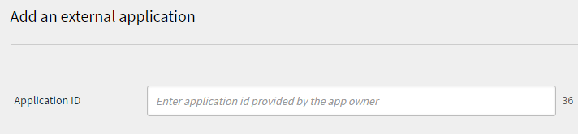

`Learning Manager Learning Programs are renamed to Learning Paths. This change happens immediately after the October 2021 release and the terminology of Learning Path is reflected for all roles.`

Learning Manager V1 API is now deprecated. The V1 APIs will stop working from 28th February 2021. We recommend that you use V2 APIs to interact with Learning Manager.

# Overview {#overview}

[Adobe Learning Manager](http://www.adobe.com/in/products/captivateprime.html) is a cloud-hosted, learner-centric, and self-service learning management solution. Customers can access Learning Manager resources programmatically using the Learning Manager API to integrate it with other enterprise applications. The API can also be used by Adobe partners to enhance the value proposition of Learning Manager, by extending its functionality or by integrating it with other applications or services.

### Usage scenario {#usagescenario}

Using Learning Manager API, developers can build self-contained applications that extend the functionality of Learning Manager or integrate Learning Manager with other enterprise applications workflows. You can develop a web application, desktop client or a mobile app using any technology of your choice. As a developer you can access your application data from within Learning Manager.&nbsp;The deployment of the application that you develop is external to the Learning Manager platform and you have full control over the software development lifecycle as the application evolves. Typically, applications are developed by a customer organization for use with their Learning Manager account, and these applications are private to that specific customer organization. Also, Adobe partners can build generic applications with Learning Manager API, that can be used by a large set of Learning Manager customers.

# Learning Manager API {#apidescription}

The Learning Manager API is based on principles of REST, and exposes key elements of the Learning Manager Object Model to application developers through HTTP. Before knowing the details of the API endpoints and the HTTP methods, developers can become familiar with the various Learning Manager objects, their attributes and inter-relationships. Once the models are understood, it will be useful to get a basic understanding of the structure of API requests and responses, and a few common programming terms that we use generically across the API.

For details of the various API endpoints and methods, refer to the&nbsp; [Learning Manager API documentation](https://captivateprime.adobe.com/docs/primeapi/v2/).

## API authentication {#apiauthentication}

When writing an application that makes API calls to Prime, you have to register your application using the Integration Admin app.&nbsp;

Learning Manager APIs use OAuth 2.0 framework to authenticate and authorize your client applications.&nbsp;

**Procedure**

**1. Set up your application&nbsp;**

You can set up your application with client id and client secret to use the proper end points.&nbsp;Once you register your application, you can get the clientId and clientSecret. Get URL should be used in browser as it authenticates the Learning Manager users using their pre-configured accounts such as SSO, Adobe ID, and so on.&nbsp;

GET&nbsp;https://captivateprime.adobe.com/oauth/o/authorize?client_id=<Enter&nbsp;your clientId>&redirect_uri=<Enter a url to redirect to>&state=<Any String data>&scope=<one or more comma separated scopes>&response_type=CODE.

After successful authentication, your browser redirects to the redirect_uri mentioned in the above URL. A parameter **code** is appended along with the redirect uri.

**2. Get refresh token from code**

POST&nbsp;https://captivateprime.adobe.com/oauth/token&nbsp;Content-Type: application/x-www-form-urlencoded

Body of the post request:

```
client_id: 
<enter your clientid>
  & client_secret: 
 <enter your clientsecret>
   & code: 
  <code from step 1> </code> 
 </enter> 
</enter>
```

**3.**&nbsp;**Obtain an access token from refresh token**

URL to obtain access token:&nbsp;

POST [https://captivateprime.adobe.com/oauth/token/refresh](https://captivateprime.adobe.com/oauth/token/refresh) Content-Type: application/x-www-form-urlencoded

Body of the post request:

```
client_id: 
<enter your clientid>
  & client_secret: 
 <enter your clientsecret>
   & refresh_token: 
  <refresh token> 
  </refresh> 
 </enter> 
</enter>
```

**URL to verify access token details**

GET&nbsp;https://captivateprime.adobe.com/oauth/token/check?access_token=<access_token>

**Usage limitation**

An access token is valid for seven&nbsp;days. After a day, you have to generate a new access token using refresh token. If you generate a new access token from refresh token while an existing access token is still valid, the existing token is returned.&nbsp;

Some of the frequently used terms in Learning Manager API are explained below for your reference.&nbsp;

**Includes**

Developers can access a single API object model and also multiple models associated with that model. To access the subsequent related models, you need to understand the relationship of each model with other models. **Includes **parameter enables developers to access the dependant models. You can use comma separator to access multiple models.&nbsp;For sample usage and more details on **includes**, refer to sample API model section in this page.&nbsp;

**API request**

The API requests can be made by making a HTTP Request. Depending upon the end point and method developer may have a choice of various HTTP verbs such as GET, PUT, POST, DELETE, PATCH, etc. For some requests query parameters can be passed. When making a request for a specific data model, the user can also request for related models as described in the JSON API specifications. The structure of a typical API Request is described in [sample model usage](#main-pars_header_1415780624).

**API response**

When an API request is made by a client, a SON document is obtained according to the JSON API specification. The response also contains the HTTP Status code, which the developer can verify to perform the appropriate next steps in his application logic.&nbsp;The structure of a typical API Response is described in&nbsp; [sample model usage](#main-pars_header_1415780624).

**Errors**

When an API request fails, an Error response is obtained. The HTTP Status code returned in the response indicates the nature of error. Error codes are represented with numbers for each model in the API reference. 200, 204, 400 and 404 are some of the common errors represented in APIs indicating HTTP access issues. &nbsp;

**Fields**

API object's attributes and its relationships are collectively called Fields. Refer to [JSON API for more information.](http://jsonapi.org/format/#document-resource-object-fields)&nbsp;You can use Fields as a parameter while making API calls to fetch one or more speicific attributes from the model. In absence of the Fields parameter, the API call fetches all the available attributes from the model. For example, in the following API call, fields[skill]=name fetches you the name attribute of the skill model alone.&nbsp;

https://captivateprime.adobe.com/primeapi/v2/users/{userId}/userSkills/{id}?include=skillLevel.skill&fields[skill]=name&nbsp;

**Pagination**

Sometimes, an API request results in a long list of objects to be returned in the response. In such cases, the pagination attribute enables the developer to fetch the results sequentially in terms of multiple pages, where each page contains a range of records. For example, pagination attribute in Learning Manager enables you to set the maximum number of records to be displayed in a page. Also, you can define the range value of records to be displayed on page.&nbsp;

**Sorting**

Sorting is allowed in API models. Based on the model, choose the type of sorting to be applied for the results. Sorting can be applied in ascending or descending order. For example, if you specify `code sort=name`, then it is ascending sort by name. If you specify `code sort=-name`, it is descending sort by name. Refer to [JSON API spec for more information](http://jsonapi.org/format/#fetching-sorting).&nbsp;

## API usage illustration {#samplemodel}

Let us consider a scenario where a developer wants to get&nbsp;skill name, max points assigned for skill level and points earned by the learner for that skill.

A userSkill model in Learning Manager APIs consists of id, type, dateAchieved, dateCreated, pointsEarned as default attributes. So, when a developer uses GET method to acquire details of userSkill model, the current data pertaining to the default attributes is shown in the response output.&nbsp;

But, in this scenario, the developer wants to get the skill name, and points of skill level for the user. Learning Manager API enables you to access this related information using relationship fields and include parameter. The associated models for userSkill are obtained in relatioships tag. You can get the details of each associated models by calling these models along with the userSkill. To get this information, use **`code include`**&nbsp;parameter with dot (period) separated values for each of the associated models.&nbsp;You can use comma as separator to request another model like user include=skillLevel.skill,course

**API Call**

[https://captivateprime.adobe.com/primeapi/v2/users/{userId}/userSkills/{id}?include=skillLevel.skill&fields[skill]=name&fields[skillLevel]=maxCredits&fields[userSkill]=pointsEarned](https://captivateprimeqe1.adobe.com/primeapi/v1/users/%7buserId%7d/userSkills/%7bid%7d?include=skillLevel.skill&fields%5bskill%5d=name&fields%5bskillLevel%5d=maxCredits&fields%5buserSkill%5d=pointsEarned)

For example userId can be 746783 and the userSkills id: 746783_4426_1.&nbsp;

**Response of API call**

```
\{ "links": {"self": "https://captivateprime.adobe.com/primeapi/v2/users/746783/userSkills/746783_4426_1?include=skillLevel.skill&fields[userSkill]=pointsEarned&fields[skillLevel]=maxCredits&fields[skill]=name"}, "data": { "id": "746783_4426_1", "type": "userSkill", "attributes": {"pointsEarned": 5}, "links": {"self": "https://captivateprime.adobe.com/primeapi/v2/users/746783/userSkills/746783_4426_1"} }, "included": [ { "id": "4426", "type": "skill", "attributes": {"name": "Java"}, "links": {"self": "https://captivateprime.adobe.com/primeapi/v2/skills/4426"} }, { "id": "4426_1", "type": "skillLevel", "attributes": {"maxCredits": 10} } ] }
```

## Learning Manager models {#models}

The Learning Manager API allows developers to access Learning Manager objects as RESTful resources. Each API endpoint represents a resource, typically an object instance like Badge, or a collection of such objects. The developers then use the HTTP verbs such as PUT, GET, POST and DELETE to perform the CRUD operations on those objects (collections).

+++V1 API

The following diagram represents the various elements of the Learning Manager Object Model in V1 API.


The following table describes various elements of the Learning Manager V1 object model:&nbsp;

<table border="1" cellspacing="0" cellpadding="0"> 
 <tbody> 
  <tr> 
   <td width="72" valign="top"><p><strong>Serial No</strong></p> </td> 
   <td width="150" valign="top"><p><strong>Learning Manager Object</strong></p> </td> 
   <td width="550" valign="top"><p><strong>Description</strong></p> </td> 
  </tr> 
  <tr> 
   <td width="72" valign="top"><p>1.&nbsp;&nbsp;&nbsp;&nbsp;&nbsp;&nbsp;</p> </td> 
   <td width="246" valign="top"><p>user</p> </td> 
   <td width="306" valign="top"><p>User is the key model in Learning Manager. Users are typically the internal or external learners of an organization who consume learning objects. However they may play some other roles such as author and Manager along with learner role. User id, type, email are some of the inline attributes.&nbsp;</p> </td> 
  </tr> 
  <tr> 
   <td width="72" valign="top"><p>2.&nbsp;&nbsp;&nbsp;&nbsp;&nbsp;&nbsp;</p> </td> 
   <td width="246" valign="top"><p>course</p> </td> 
   <td width="306" valign="top"><p>Course is one of the learning objects supported in Learning Manager, that consists of one or more modules.&nbsp;</p> </td> 
  </tr> 
  <tr> 
   <td width="72" valign="top"><p>3.&nbsp;&nbsp;&nbsp;&nbsp;&nbsp;&nbsp;</p> </td> 
   <td width="246" valign="top"><p>module</p> </td> 
   <td width="306" valign="top"><p>Module is a building block to create learning objects in Learning Manager. Modules can be of four different types such as Class room, virtual class room, activity and self-paced. Use this module model to get the details of all modules in an account.&nbsp;</p> </td> 
  </tr> 
  <tr> 
   <td width="72" valign="top"><p>4.&nbsp;&nbsp;&nbsp;&nbsp;&nbsp;&nbsp;</p> </td> 
   <td width="246" valign="top"><p>certification</p> </td> 
   <td width="306" valign="top"><p>Certification is awarded to learners based on successful completion of courses. Courses are required in the application before you use certifications.&nbsp;</p> </td> 
  </tr> 
  <tr> 
   <td width="72" valign="top"><p>5.&nbsp;&nbsp;&nbsp;&nbsp;&nbsp;&nbsp;</p> </td> 
   <td width="246" valign="top"><p>learning program</p> </td> 
   <td width="306" valign="top"><p>Learning programs are uniquely designed courses meeting specific learning requirements of users. Typically, learning programs are used to drive learning goals spanning across individual courses.&nbsp;</p> </td> 
  </tr> 
  <tr> 
   <td width="72" valign="top"><p>6.&nbsp;&nbsp;&nbsp;&nbsp;&nbsp;&nbsp;</p> </td> 
   <td width="246" valign="top"><p>badge</p> </td> 
   <td width="306" valign="top"><p>Badge is a token of accomplishment that learners get when they reach specific milestones as they progress within a course.&nbsp;</p> </td> 
  </tr> 
  <tr> 
   <td width="72" valign="top"><p>7.&nbsp;&nbsp;&nbsp;&nbsp;&nbsp;&nbsp;</p> </td> 
   <td width="246" valign="top"><p>skill</p> </td> 
   <td width="306" valign="top"><p>Skills model consists of levels and credits. Skills can be acquired by learners after relevant course completion.&nbsp;</p> </td> 
  </tr> 
  <tr> 
   <td width="72" valign="top"><p>8.&nbsp;&nbsp;&nbsp;&nbsp;&nbsp;&nbsp;</p> </td> 
   <td width="246" valign="top"><p>certificationEnrollment</p> </td> 
   <td width="306" valign="top"><p>This model provides details of an enrollment by a user to a single certification.</p> </td> 
  </tr> 
  <tr> 
   <td width="72" valign="top"><p>9.&nbsp;&nbsp;</p> </td> 
   <td width="246" valign="top"><p>courseEnrollment</p> </td> 
   <td width="306" valign="top"><p>This model provides details of an enrollment by a user to a single course.&nbsp;</p> </td> 
  </tr> 
  <tr> 
   <td width="72" valign="top"><p>10.&nbsp;&nbsp;</p> </td> 
   <td width="246" valign="top"><p>courseInstance</p> </td> 
   <td width="306" valign="top"><p>A course can have one or many instances associated with it. You can get Course instance&nbsp;</p> </td> 
  </tr> 
  <tr> 
   <td width="72" valign="top"><p>11.&nbsp;&nbsp;</p> </td> 
   <td width="246" valign="top"><p>courseSkill</p> </td> 
   <td width="306" valign="top"><p>A courseSkill model specifies the progress of a single skill that is achieved&nbsp;by completing a course.</p> </td> 
  </tr> 
  <tr> 
   <td width="72" valign="top"><p>12.&nbsp;&nbsp;</p> </td> 
   <td width="246" valign="top"><p>courseModule</p> </td> 
   <td width="306" valign="top">A courseModule model specifies how a module is included &nbsp;in a course.&nbsp;For instance, whether the module is used for pretest or for content.</td> 
  </tr> 
  <tr> 
   <td width="72" valign="top"><p>13.&nbsp;&nbsp;</p> </td> 
   <td width="246" valign="top">learningProgramInstance</td> 
   <td width="306" valign="top"><p>A learning program can consist of multiple instances imbibing similar properties of a learning program or customized instances.&nbsp;</p> </td> 
  </tr> 
  <tr> 
   <td width="72" valign="top"><p>14.&nbsp;&nbsp;</p> </td> 
   <td width="246" valign="top"><p>job aid</p> </td> 
   <td width="306" valign="top"><p>Job aid is a learning content accessible to learners without any enrollment or completion criteria. You can fetch, updated date, state, id information along with its related models such as job aid version, authors and skill level.&nbsp;</p> </td> 
  </tr> 
  <tr> 
   <td width="72" valign="top"><p>15.&nbsp;&nbsp;</p> </td> 
   <td width="246" valign="top"><p>jobAidVersion</p> </td> 
   <td width="306" valign="top"><p>Job aid can have one or many versions associated to it based on number revisions in content and number of uploads. This model provides details of a single job aid version.&nbsp;</p> </td> 
  </tr> 
  <tr> 
   <td width="72" valign="top"><p>16.&nbsp;&nbsp;</p> </td> 
   <td width="246" valign="top"><p>learningProgramInstanceEnrollment</p> </td> 
   <td width="306" valign="top"><p>Learning program consists of one or many instances. Learners can enroll to a learning program instance by themselves or assigned by administrator. This model provides details of an enrollment by a user to a single learning program instance.&nbsp;</p> </td> 
  </tr> 
  <tr> 
   <td width="72" valign="top"><p>17.&nbsp;&nbsp;</p> </td> 
   <td width="246" valign="top"><p>moduleVersion</p> </td> 
   <td width="306" valign="top"><p>A module can have one or many versions based on its revised content uploads. Use this model to obtain specific info about any single module version.&nbsp;</p> </td> 
  </tr> 
  <tr> 
   <td width="72" valign="top"><p>18.&nbsp;&nbsp;</p> </td> 
   <td width="246" valign="top"><p>skillLevel</p> </td> 
   <td width="306" valign="top"><p>A skill level comprises of one or many courses to be consumed in order to acquire a level along with its associated credits.&nbsp;</p> </td> 
  </tr> 
  <tr> 
   <td width="72" valign="top"><p>19.&nbsp;&nbsp;</p> </td> 
   <td width="246" valign="top"><p>userBadge</p> </td> 
   <td width="306" valign="top"><p>UserBadge relates a single badge with a single user. It contains details such as when was it achieved, assertionUrl and so on.&nbsp;</p> </td> 
  </tr> 
  <tr> 
   <td width="72" valign="top"><p>20.&nbsp;&nbsp;</p> </td> 
   <td width="246" valign="top"><p>userSkill</p> </td> 
   <td width="306" valign="top"><p>UserSkill indicates how much of a&nbsp;single skill level is achieved by a single user.</p> </td> 
  </tr> 
 </tbody> 
</table>

+++

+++V2 API

Following are the various elements of the Learning Manager class diagram in V2 API.

 

<table width="100%" cellspacing="0" cellpadding="1" border="1"> 
 <tbody> 
  <tr> 
   <th>Learning Manager Object</th> 
   <th>Description</th> 
  </tr> 
  <tr> 
   <td>account</td> 
   <td>Encapsulates the details of a prime customer.</td> 
  </tr> 
  <tr> 
   <td> <g class="gr_ gr_64 gr-alert gr_spell gr_inline_cards gr_run_anim ContextualSpelling only-del replaceWithoutSep" id="64" data-gr-id="64">
      badge 
    </g></td> 
   <td>Badge is a token of accomplishment that learners get when they reach specific milestones as they progress within a course.&nbsp;<br> </td> 
  </tr> 
  <tr> 
   <td> <g class="gr_ gr_66 gr-alert gr_spell gr_inline_cards gr_run_anim ContextualSpelling only-del replaceWithoutSep" id="66" data-gr-id="66">
      catalog 
    </g></td> 
   <td>Catalog is a&nbsp;collection of learning objects.</td> 
  </tr> 
  <tr> 
   <td> <g class="gr_ gr_68 gr-alert gr_spell gr_inline_cards gr_run_anim ContextualSpelling only-del replaceWithoutSep" id="68" data-gr-id="68">
      user 
    </g></td> 
   <td>User is the key model in Learning Manager. Users are typically the internal or external learners of an organization who consume learning objects. However, they may play some other roles such as author and Manager along with learner role. User id, type, email are some of the inline attributes.&nbsp;</td> 
  </tr> 
  <tr> 
   <td>resource</td> 
   <td>This is used to model each content resource that a module seeks to encapsulate. All resources encapsulated within <g class="gr_ gr_72 gr-alert gr_gramm gr_inline_cards gr_run_anim Grammar multiReplace" id="72" data-gr-id="72">
      an 
    </g> <g class="gr_ gr_54 gr-alert gr_spell gr_inline_cards gr_run_anim ContextualSpelling ins-del multiReplace" id="54" data-gr-id="54">
      loResource 
    </g> are equivalent in terms of the learning objective, but they differ from each other in terms of delivery type or content locale.<br> </td> 
  </tr> 
  <tr> 
   <td>userNotification</td> 
   <td>This model contains notification information pertaining to a learner.<br> </td> 
  </tr> 
  <tr> 
   <td>userSkill</td> 
   <td>UserSkill indicates how much of a&nbsp;single skill level is achieved by a single user.<br> </td> 
  </tr> 
  <tr> 
   <td>userBadge</td> 
   <td>UserBadge relates a single badge <g class="gr_ gr_76 gr-alert gr_gramm gr_inline_cards gr_run_anim Grammar multiReplace" id="76" data-gr-id="76">
      with 
    </g> a single user. It contains details such as when was it achieved, <g class="gr_ gr_58 gr-alert gr_spell gr_inline_cards gr_run_anim ContextualSpelling ins-del multiReplace" id="58" data-gr-id="58">
      assertionUrl 
    </g> and so on.&nbsp;<br> </td> 
  </tr> 
  <tr> 
   <td>skill</td> 
   <td>Skills model consists of levels and credits. Skills can be acquired by learners after relevant course completion.&nbsp;<br> </td> 
  </tr> 
  <tr> 
   <td>skillLevel</td> 
   <td>A skill level comprises of one or many courses to be consumed in order to acquire a level along with its associated credits.&nbsp;<br> </td> 
  </tr> 
  <tr> 
   <td>learningObject</td> 
   <td>A Learning Object is an abstraction for various kinds of objects which users can enroll into and learn from. Currently Prime has the four types of Learning Objects – Course, Certification, Learning Program <g class="gr_ gr_82 gr-alert gr_gramm gr_inline_cards gr_run_anim Punctuation only-ins replaceWithoutSep" id="82" data-gr-id="82">
      and 
    </g> Job Aid.<br> </td> 
  </tr> 
  <tr> 
   <td>learningObjectInstance<br> </td> 
   <td>A specific instance of a learning object.<br> </td> 
  </tr> 
  <tr> 
   <td>learningObjectResource</td> 
   <td>This is equivalent to the concept of <g class="gr_ gr_62 gr-alert gr_gramm gr_inline_cards gr_run_anim Grammar only-ins doubleReplace replaceWithoutSep" id="62" data-gr-id="62">
      module 
    </g>. A course is composed of one <g class="gr_ gr_52 gr-alert gr_spell gr_inline_cards gr_run_anim ContextualSpelling ins-del" id="52" data-gr-id="52">
      of 
    </g> more modules. In Prime, a module can be delivered in a variety of equivalent ways. Therefore the <g class="gr_ gr_53 gr-alert gr_spell gr_inline_cards gr_run_anim ContextualSpelling ins-del multiReplace" id="53" data-gr-id="53">
      loResource 
    </g> essentially encapsulates all those equivalent resources.<br> </td> 
  </tr> 
  <tr> 
   <td>loResourceGrade<br> </td> 
   <td>This encapsulates the outcome of the user consuming a specific resource in the context of a learning object he is enrolled into. It has information such as the duration spent by <g class="gr_ gr_48 gr-alert gr_gramm gr_inline_cards gr_run_anim Grammar only-ins replaceWithoutSep" id="48" data-gr-id="48">
      user 
    </g> in the resource, percentage progress made by the user, pass/fail status and the score obtained by the user in any associated quiz.<br> </td> 
  </tr> 
  <tr> 
   <td>calendar<br> </td> 
   <td>A calendar object is a list of <g class="gr_ gr_42 gr-alert gr_gramm gr_inline_cards gr_run_anim Grammar only-ins doubleReplace replaceWithoutSep" id="42" data-gr-id="42">
      upcoming classroom 
    </g> or virtual classroom courses that the user can enroll into.<br> </td> 
  </tr> 
  <tr> 
   <td>l1FeedbackInfo<br> </td> 
   <td>L1 Feedback encapsulates the answers provided by a learner for the feedback questions associated with Learning Objects. Typically this is collected after the user completes a Learning Object&nbsp;if configured&nbsp;to collect such feedback from learners.<br> </td> 
  </tr> 
  <tr> 
   <td>enrollment<br> </td> 
   <td>This abstraction encapsulates the details pertaining to the transaction representing the assignment of a specific user to a specific learning object instance.<br> </td> 
  </tr> 
 </tbody> 
</table>

+++

List of object attributes and relationships.

+++account

**Attributes** 
dateCreated  
gamificationEnabled  
id  
locale  
loginUrl  
logoUrl  
name  
subdomain  
themeData  
timeZoneCode

**Relationships** 
contentLocales(localizationMetadata)  
gamificationLevels(gamificationLevel)  
timeZones(timeZone)  
uiLocales(localizationMetadata)

+++

+++badge

**Attributes** 
id  
imageUrl  
name  
state

+++

+++catalog

**Attributes** 
dateCreated   
dateUpdated   
description  
id  
isDefault   
isInternallySearchable   
isListable   
name  
state

+++

+++data

**Attributes** 
id  
names

+++

+++gamification

**Attributes** 
color  
name  
points

+++

+++learningObject

**Attributes** 
authorNames  
dateCreated  
datePublished  
dateUpdated  
effectivenessIndex  
enrollmentType  
id  
imageUrl  
isExternal  
isSubLoOrderEnforced  
loType  
state  
tags

**Relationships** 
authors(user)  
enrollment(learningObjectInstanceEnrollment)  
instances(learningObjectInstance)  
prerequisiteLOs(learningObject)  
skills(learningObjectSkill)  
subLOs(learningObject)  
supplementaryLOs(learningObject)  
supplementaryResources(resource)

+++

+++learningObjectInstance

**Attributes** 
completionDeadline  
dateCreated  
enrollmentCount  
id  
isDefault  
seatLimit  
state  
validity

**Relationships** 
badge(badge)  
l1FeedbackInfo(feedbackInfo)  
learningObject(learningObject)  
loResources(learningObjectResource)  
localizedMetadata(localizationMetadata)  
subLoInstances(learningObjectInstance)

+++

+++learningObjectInstanceEnrollment

**Attributes** 
dateCompleted   
dateEnrolled   
dateStarted   
hasPassed   
id  
progressPercent   
score  
state

**Relationships** 
learner(user)  
learnerBadge(userBadge)  
learningObject(learningObject)  
loInstance(learningObjectInstance)  
loResourceGrades(learningObjectResourceGrade)

+++

+++learningObjectResource

**Attributes** 
externalReporting  
id  
loResourceType  
resourceType  
version

**Relationships** 
learningObject(learningObject)  
loInstance(learningObjectInstance)  
localizedMetadata(localizationMetadata)  
resources(resource)

+++

+++learningObjectResourceGrade

**Attributes** 
dateCompleted   
dateStarted   
dateSuccess   
duration  
hasPassed   
id  
progressPercent   
score

**Relationships** 
loResource(learningObjectResource)

+++

+++learningObjectSkill

**Attributes** 
credits  
id  
**Relationships** 
learningObject(learningObject)  
skillLevel(skillLevel)

+++

+++recommendation

**Attributes** 
id  
reason

**Relationships** 
learningObject ( learningObject )

+++

+++resource

**Attributes** 
authorDesiredDuration  
completionDeadline  
contentStructureInfoUrl  
contentType  
contentZipSize  
contentZipUrl  
dateCreated  
dateStart  
desiredDuration  
downloadUrl  
extraData  
hasQuiz  
hasToc  
id  
instructorNames  
isDefault  
locale  
location  
name  
onlyQuiz  
reportingInfo  
reportingType  
seatLimit

+++

+++skill

**Attributes** 
description  
id  
name  
state

**Relationships** 
levels( skillLevel )

+++

+++skillLevel

**Attributes** 
id  
level  
maxCredits   
name  
**Relationships** 
badge(badge)  
skill(skill)

+++

+++user

**Attributes** 
avatarUrl  
bio  
contentLocale  
email  
fields  
id  
name  
pointsEarned  
profile  
roles  
state  
timeZoneCode  
uiLocale

**Relationships** 
account(account)  
manager(user)

+++

+++userBadge

**Attributes** 
assertionUrl  
dateAchieved  
id  
modelType

**Relationships** 
badge(badge)  
learner(user)  
model(learningObject)

+++

+++userCalendar

**Attributes** 
course  
courseType   
dateStart   
enrolled  
id  
month  
quarter

**Relationships** 
containerLO(learningObject)  
course(learningObject)

+++

+++userNotification

**Attributes** 
actionTaken   
channel  
dateCreated   
id  
message  
modelIds   
modelNames   
modelTypes   
read  
role

+++

+++userSkill

**Attributes** 
dateAchieved  
dateCreated  
id  
pointsEarned

**Relationships** 
learnerBadge(userBadge)  
learningObject(learningObject)  
skillLevel(skillLevel)  
user(user)

+++

# Application development process {#registration}

## Pre-requisites {#prerequisites}

As a developer you have to create a trial account on Prime, so that you can have full access to all the roles within that account. To be able to write an application, a developer has to create some users and courses and get the account to a reasonable state so that the application being developed can have access to some sample data.

## Create client id and secret {#createclientidandsecret}

1. In Integration Admin login, click **Applications** on the left pane.&nbsp;

   

1. Click **Register&nbsp;**at the upper-right corner of the page to register your application details. Registration page appears.&nbsp;

   

   It is mandatory to fill up all the fields in this page.&nbsp;

   **Application Name**: Enter your application name. It is not mandatory to use the same application name, it can be any valid name.&nbsp;

   **URL**: If you know the exact URL where the application is hosted, you can mention it. If you are not aware, then you can mention your company URL. Valid URL name is mandatory in this field.&nbsp;

   **Redirect Domains**: Enter the domain name of the application where you want the Learning Manager application to redirect after OAuth authentication. You can mention multiple URLs here but you have to use the valid URLs such as http://google.com, http://yahoo.com and so on.&nbsp;

   **Description: **Enter the brief description for your application.&nbsp;

   **Scopes: **Choose one of the four available options to define the scope of your application. Based on your choice mentioned here, Learning Manager API endpoint are accessible for your application. For example, If you chose **Learner role read access, **then all the Learning Manager learner API end points are read-only accessible to your application.&nbsp;

   **For this account only?**&nbsp;  
   **Yes** - if you choose Yes, then the application is not visible to other account administrators.  
   **No - **if you choose No,&nbsp;other account admins can also access this application but they need to use the application id to access this application. Application id is generated and displayed in Learning Manager application Edit mode.&nbsp;

   If you choose **Admin role read and write access** as scope while registering the application and choose&nbsp;**Admin role read access&nbsp;**while authoring the APIs, you can still have write access for the application as the app registration scope supersedes the authorization workflow.&nbsp;

1. Click **Register** at the upper-right corner after filling up the details in the registration page.

## Application development and testing {#applicationdevelopmentandtesting}

The Learning Manager API can be used by developers to build any application. Developers have to ensure that their accounts consist of some valid users and courses. They can create a few dummy users and courses and simulate activity in the trial account, so that they can test functionality of the application.

## Application deployment {#applicationdeployment}

We recommend that the Learning Manager Administrator or an Integration Administrator for the production account, to take ownership of making the application available to users within their organization. Once the application has been tested and is considered ready for production, inform the administrator of the production account. Ideally, the administrators want to generate a new client-id and client-secret for the application in the production account, and perform the necessary steps to incorporate them inside the application in a secure manner. The actual procedure for deploying applications varies from enterprise to enterprise, and the Learning Manager Administrator of your organization has to take support from the IT/IS department within your organization to complete the deployment.

## External application approval {#externalapplicationapproval}

You can add external applications by clicking Approve**&nbsp;**at the upper-right corner of the&nbsp;**Applications&nbsp;**page. Provide the external application id and click **Save.**

 

# Frequently Asked Questions

**1. Does Learning Manager&nbsp;have an E-commerce integration?**

Adobe Learning Manager does not have an E-commerce integration. However, we provide APIs so that you can create your own headless LMS and implement E-commerce features.&nbsp;
