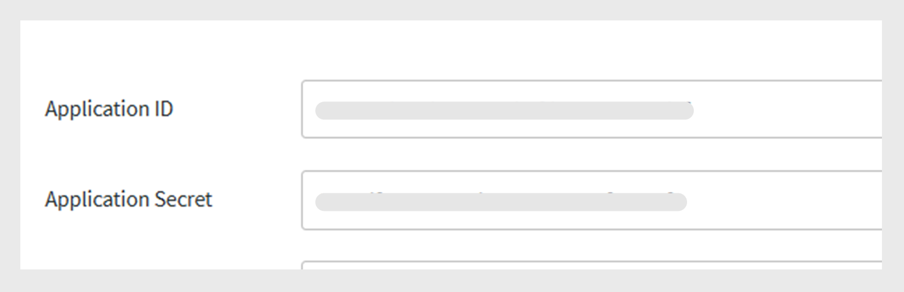
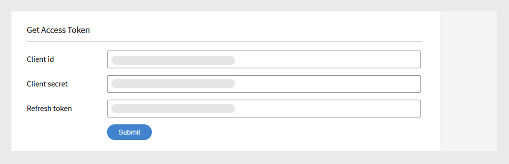

# Adobe Learning Manager Developer Manual

## Overview

Adobe Learning Manager provides RESTful APIs that allow developers to integrate and customize applications or workflows effectively. The Developer Manual offers guidance on how to use these APIs, covering topics such as authentication, data models, and integration with other applications. Additionally, this guide [API reference documentation](https://learningmanager.adobe.com/docs/primeapi/v2/) assists developers in creating external applications or backend workflows that interact with various features of Adobe Learning Manager, including course creation, tracking learner progress, skill mapping, certification, gamification, and transcripts. 

This manual covers the following: 

* OAuth2.0 authentication 
* API object models 
* Shows how to use include, fields, and other parameters 
* Provides endpoints for real-world use cases

>[!IMPORTANT]
>
>This developer manual exclusively covers the V2 APIs of Adobe Learning Manager. All examples, request structures, and authentication workflows described in this guide are specific to the /primeapi/v2/ endpoints. For information on older versions or deprecated APIs, refer to the [API reference documentation](https://learningmanager.adobe.com/docs/primeapi/v2/). 

## API usage scenarios 

Developers can use Learning Manager APIs to enhance or integrate Learning Manager with other enterprise applications. You can create web, desktop, or mobile apps using any technology. Developers can access application data within Learning Manager, but deployment is external and fully controlled by you. Apps are typically developed by customer organizations for their own accounts, while Adobe partners can create general applications for wider use. 

## Authentication using OAuth 2.0 

To access Adobe Learning Manager APIs securely, you must authenticate using ALM's OAuth 2.0 mechanism. This process includes registering your application, generating an authorization code, exchanging it for a refresh token, and finally using the refresh token to get an access token. 

### Register an application 

Integrate Adobe Learning Manager with external applications for enhanced versatility. The steps involve accessing Integration Administrator interface, registering the application, and obtaining client ID and Secret. Generate authentication tokens (OAuth, Refresh, and Access Tokens) from ALM, emphasizing the use of the OAuth 2.0 framework for authentication and authorization. The access token has a validity of seven days. 

1. Sign in to Adobe Learning Manager as an integration administrator. 
2. Select **[!UICONTROL Applications]** on the left pane. 

   

3. Select **[!UICONTROL Register]** and add the following information: 

   * **[!UICONTROL Application Name]**: Type the name of your application (max 50 characters). 
   * **[!UICONTROL URL]**: The official URL of your company or application. Used for identification and reference. 
   * **[!UICONTROL Redirect Domains]**: Specify the domains (for example, [http://learningmanager.adobe.com](http://learningmanager.adobe.com)) that ALM can redirect to after authorization.  You can mention multiple URLs, but the URLs must be valid. 
   * **[!UICONTROL Description]**: Brief description of what the application does. 
   * **[!UICONTROL Scopes]**: Select one of the six available options to define the scope of your application. Based on your choice mentioned here, the Learning Manager API endpoints are accessible for your application. For example, if you chose Learner role read access, then all the Learning Manager learner API end points are read-only accessible to your application.  

      * Admin role read/write access: Allows the application to access or modify data as an administrator. 
      * Learner role read/write access: Allows the application to access or modify data for learners. 
      * xAPI read/write access: Enables the application to access and send Experience API (xAPI) statements. 

   * **[!UICONTROL For this account only?]** 

      * **[!UICONTROL Yes]** - if you choose Yes, then the application is not visible to other account administrators. 
      * **[!UICONTROL No]** - if you choose No, other account admins can also access this application, but they need to use the application id to access this application. Application id is generated and displayed in Learning Manager application Edit mode.  

      

4. Select **[!UICONTROL Save]** to register the application. 

   * After you register the application, the application is available in the list of applications created in the account. Select the application and you'll see the following in addition to the previously entered fields: 
   * Application ID: This is the Client ID. This ID tells ALM the application that is requesting access. It's included in API requests to identify the app. 
   * Application Secret: This is used to authenticate your app and verify its identity during token exchange steps (for example, when requesting a refresh token or an access token). 
   
   

## Obtain an access token 

### Get authorization code from redirect 

After getting the Client ID and Client Secret, use them to request an access token, which is used to authenticate API calls.  

To begin the authorization code flow, direct your users to the following URL in a browser: 

```
GET https://learningmanager.adobe.com/oauth/o/authorize?client_id=<Enter your clientId>&redirect_uri=<Enter a url to redirect to>&state=<Any String data>&scope=<one or more comma separated scopes>&response_type=CODE 
```

Once the user authorizes the application, Adobe Learning Manager will redirect to the specified redirect_uri with an appended query parameter: 

[https://yourapp.com/callback?code=abc123xyz](https://yourapp.com/callback?code=abc123xyz)

A parameter code is appended along with the redirect uri. 

### Get refresh token from code 

After you obtain the code, use any API tool, and add the following POST request: 

```https://learningmanager.adobe.com/oauth/token ``` 

**Request Body (x-www-form-urlencoded)**: 

```
grant_type=authorization_code  
&code=abc123xyz  
&client_id=<your_client_id>  
&client_secret=<your_client_secret>  
&redirect_uri=<your_redirect_url> 
```

**Response** 

```

{ 

  "access_token": "eyJhbGciOiJIUzI1...", 
  "refresh_token": "xTjlfz0jCk6gF1...", 
  "expires_in": 604800, 
  "token_type": "Bearer" 

} 
```

Use the access_token in the Authorization header to make authenticated API requests. 

### Use the access token in an API call 

Verify the access token using the following: 

```
GET https://learningmanager.adobe.com/oauth/token/check?access_token=<access_token> 
```

An access token is valid for seven days. After seven days, you have to generate a new access token using refresh token. If you generate a new access token from refresh token while an existing access token is still valid, the existing token is returned. 

### Get access tokens for testing and development 

Use the Adobe Learning Manager (ALM) token generation tool to quickly create access tokens for testing and development purposes. These tokens are intended solely for your personal use during development and debugging phases. Keep in mind that test tokens grant access to your ALM data, so it's essential to handle them securely. Never share your test tokens with others, use them in production applications, or include them in public code repositories. Treat them like passwords to ensure the security of your account and data. 

1. Sign in to Adobe Learning Manager as Integration Admin. 
2. Select **[!UICONTROL Developer Resources]** and then **[!UICONTROL select Access Tokens for Testing and Development]**. 
   
   

3. Type the **[!UICONTROL Client ID]** that you got after creating an application to get the OAuth code. Then select **[!UICONTROL Submit]**. 

   

4. Add the **[!UICONTROL Client ID]** and the **[!UICONTROL Client Secret]** to get the refresh token. Then select **[!UICONTROL Submit]**. The OAuth is pre-populated from the previous step. 
   
   

5. Add the Client ID and the Client Secret to get the access token. Then select **[!UICONTROL Submit]**. 

   

6. Add the access token and select Submit to get the access token details. 
   
   

Upon selecting **[!UICONTROL Submit]**, the access token is verified, and the following response appears: 

```
{ 
  "access_token": "access token", 
  "refresh_token": "refresh token", 
  "user_role": "admin", 
  "account_id": "1234", 
  "user_id": "123456", 
  "expires_in": 604800 
} 
```

As before, the access token for testing expires in seven days. 

### Use an API tool for testing the endpoints 

While you can use any third-party API testing tool, we'll use Postman to test the endpoints. The examples in this document use Postman for endpoint testing. 

1. Open Postman and create a new request. 
2. Select the Authorization tab. 
3. Set the Auth Type to Bearer Token. 

   
4. Paste the access token that you obtained from the previous section, in the Token field. 
   
   

5. Add the following in the Headers tab. 

    * Key: Accept
    * Value: application/json 
6. Enter your API endpoint in the URL field. Example: [https://learningmanager.adobe.com/learningManager/api/v2/users](https://learningmanager.adobe.com/learningManager/api/v2/users)
View [Adobe Learning Manager API Reference](https://learningmanager.adobe.com/docs/primeapi/v2/) for more information. 
7. Select Send to make the API request.

## Types of APIs 

### Admin APIs 

Adobe Learning Manager's Admin APIs allow administrators to automate and manage learning operations at a scale. 

Using the Admin APIs, developers can: 

>[!NOTE]
>
>The list is not exhaustive. 

* **Manage users and groups**: Create, update, and delete users or assign them to groups. 
* **Enroll learners**: Automate enrollment into courses, Learning Paths, or certifications. 
* **Track learner progress**: Retrieve course/module progress, quiz scores, and completion status. 
* **Generate reports**: Access data on learner activity, engagement, and performance. 
* **Manage content**: Create and organize courses, and Learning Objects. 

View [Adobe Learning Manager API Reference](https://learningmanager.adobe.com/docs/primeapi/v2/) for more information. 

### Learner APIs 

The Learner APIs are designed for authenticated users (learners) and allow you to access learner-specific information. These APIs allow tasks like:  

* Accessing a learner's courses and progress  
* Fetching badges or certifications earned  
* Updating learner profile information  
* Viewing skills associated with completed courses 

**Key points:**  

* These APIs require an authenticated user token, ensuring data security and privacy.  
* The APIs are intended for scenarios where users are fully registered and logged in, rather than anonymous or shared users. 

View [Adobe Learning Manager API Reference](https://learningmanager.adobe.com/docs/primeapi/v2/) for more information. 

## API design and common parameters 

The APIs provide developers with access to key Learning Manager resources like users, courses, skills, certifications, and learning programs. It follows REST principles, using HTTP methods (GET, POST, PUT, DELETE) for data operations. 

| | |
|--|--|
|Methods | GET, PUT, POST, DELETE |
|Format | application/vnd.api+json, application/json. [Learn more](https://developer.mozilla.org/en-US/docs/Web/HTTP/Guides/MIME_types/Common_types) about common MIME types. |
|Base URL | [https://learningmanager.adobe.com/primeapi/v2/](https://learningmanager.adobe.com/primeapi/v2/) |

### Common parameters 

|Parameters | Purpose|
|--|--|
|include| Get related resources in one call. |
|fields| Select specific attributes to reduce payload. |
|filter| Narrow results (for example, by ID, name) |
|sort| Order results. |
|page[limit], page[offset] | Pagination support. |

Here is a brief explanation of each: 

### include

ALM APIs can be used to retrieve useful information while building a custom application or a headless LMS. The API endpoints can further be included with additional 'include' parameters to retrieve the additional information which are in relationship with the data received by default. These relationships are data model relations, for example while making a call to get user details you will receive the user information and relationship of manager ID and the ALM account ID. With the include parameter, you can extract additional details along with the user details such as their manager details and the ALM account details in a detailed manner.
In short, the **include** parameter is used in API calls to fetch related (linked) resources along with the primary resource in a single response. It is useful when you want to access nested or dependent data, such as modules of a course or the skills mapped to a learner, without making separate API calls.

Key benefits:

* Reduces multiple API calls: Avoids the need to manually request each related resource.
* Improves efficiency: Faster development, less server load, and quicker rendering of data.
* Ensures data consistency: Retrieves all related data in a consistent snapshot.

**How to use the include parameter**

Append the include parameter to your API URL and specify which related entities to include.

**Common include paths**

|Include value |Description |
|---|---|
|instances |Returns all instances of the learning object|
|enrollment |Returns enrollment details for the user|
|instances.loResources.resources |Fetches modules and resources inside an instance|
|supplementaryResources |Returns associated supplementary resources|
|skills.skillLevel.badge |Fetches skill levels and their associated badges|
|prerequisiteLOs |Includes prerequisite learning objects|
|subLOs |Fetches sub-learning objects (used in LPs or certifications)|
|subLOs.enrollment |Enrollment for sub-learning objects|
|instances.badge |Badge assigned for the completion of a course instance|
|subLOs.subLOs.instances.loResources.resources |Deeply nested resources inside a sub-sub-LO instance|

**Example 1**

Retrieve the details of a user using userID parameter in the endpoint 

```
https://learningmanager.adobe.com/primeapi/v2/users/<userID>
```

```
GET https://learningmanager.adobe.com/primeapi/v2/users/<userID>
```

In the response, you can see that the data object has a relationship with the account and the manager of the user.

```
"relationships": {
            "account": {
                "data": {
                    "id": "1010",
                    "type": "account"
                }
            },
            "manager": {
                "data": {
                    "id": "3400476",
                    "type": "user"
                }
            }
        }
```

Using the include parameter in the request, you can retrieve detailed information about the manager as shown below:

```
GET https://learningmanager.adobe.com/primeapi/v2/users/<userid>?include=manager
```

**Example 2**

To retrieve the course details, use the include parameter in the endpoint call. The following endpoint gets the course information along with its relationships.

```
GET https://learningmanager.adobe.com/primeapi/v2/learningObjects/<courseID>
```

The relationships are displayed in the response as follows:

* instances
* skills
* authors

```
"relationships": {
            "authors": {
                "data": [
                    {
                        "id": "3400468",
                        "type": "user"
                    }
                ]
            },
            "instances": {
                "data": [
                    {
                        "id": "course:16444_31598",
                        "type": "learningObjectInstance"
                    }
                ]
            },
            "skills": {
                "data": [
                    {
                        "id": "course:16444_1796",
                        "type": "learningObjectSkill"
                    },
                    {
                        "id": "course:16444_3103",
                        "type": "learningObjectSkill"
                    }
                ]
            }
        }
```

Other relationships could include (not present in the above response):

* prerequisiteLOs
* supplementaryLOs
* supplementaryResources

To get detailed data of the instances and skills, include "instances,skills" in the include parameter.

```
GET https://learningmanager.adobe.com/primeapi/v2/learningObjects/<courseID>?include=instances,skills
```

Now, for example, if you want to retrieve more data associated with the course instance, such as loResources (module information of the course), apply loResources as a nested include.

```
GET https://learningmanager.adobe.com/primeapi/v2/learningObjects/<courseID>?include=instances.loResources
```

Additionally, combine skills and instances with a nested include.

```
GET https://learningmanager.adobe.com/primeapi/v2/learningObjects/<courseID>?include=instances,instances.loResources,skills
```

**Other include filters**

  <table>
  <tbody>
  <tr>
   <td>
    <p style="text-align: left;"><b>Learning Programs</b></p></td>
   <td>
    <p style="text-align: left;"><b>Course</b></p></td>
  </tr>
  <tr>
  <td><br>subLOs.prerequisiteLOs.enrollment</br><br>subLOs.subLOs.prerequisiteLOs.enrollment</br><br>subLOs.enrollment.loResourceGrades</br><br>subLOs.subLOs.enrollment.loResourceGrades</br><br>subLOs.subLOs.instances.loResources.resources.room</br><br>subLOs.instances.loResources.resources.room</br><br>subLOs.supplementaryResources</br><br>subLOs.enrollment</br><br>SubLOs.enrollment.loInstance.loResources.resources</br><br>subLOs.supplementaryLOs.instances.loResources.resources</br>
  </td>
  <td>
  <br>instances.enrollment.loResourceGrades</br><br>enrollment.loInstance.loResources.resources</br>prerequisiteLOs</br><br>authors</br><br>instances.loResources.resources</br><br>supplementaryLOs.instances.loResources.resources</br><br>supplementaryResources</br><br>instances.badge</br><br>skills.skillLevel.badge</br><br>skills.skillLevel.skill</br><br>instances.loResources.resources.room</br><br>prerequisiteLOs.enrollment</br><br>enrollment.loResourceGrades</br>
  </td>
  </tr>
  </table>

#### fields

An API object's attributes and relationships are called Fields. Use Fields as a parameter in API calls to retrieve specific attributes from the model. Without the Fields parameter, the API call retrieves all available attributes.

For example, in the following API call, fields[skill]=name fetches you the name attribute of the skill model alone.

```
GET https://learningmanager.adobe.com/primeapi/v2/users/3400490/userSkills/3400490_1796_1?include=skillLevel.skill&fields[skill]=name
```

#### pagination

API pagination is a technique used in APIs to break down large sets of data into smaller, manageable chunks, called pages, rather than returning the entire data in a single response.

Pagination reduces client and server load, limits response size to avoid server bottlenecks, or is useful for displaying data in tables or lists one page at a time.

**How pagination in ALM APIs work**

ALM APIs support pagination through parameters like:

* page[limit]: Number of records per page.
* page[offset]: Number of records to skip.
* page[cursor]: Pointer to the next set of results. Instead of using offset-based pagination (which skips a number of records), cursor-based pagination uses a unique marker returned from the API to fetch the next page of results. 

Here's how to use pagination in APIs:

**page[limit]**

While [https://learningmanager.adobe.com/primeapi/v2/users](https://learningmanager.adobe.com/primeapi/v2/users) returns all users and related information in a single call, using page[limit] restricts the number of results to the specified value.

To return only five user records in a single call, use the following API:

```
GET https://learningmanager.adobe.com/primeapi/v2/users?page[limit]=5
```

**page[offset]**

Use this API call to return three user records, skip the first five users, and start from the sixth.

```
GET https://learningmanager.adobe.com/primeapi/v2/users?page[limit]=3&page[offset]=5 
```

**page[cursor]**

1. Start by requesting the first page with a limit of 5.

   ```
   GET https://learningmanager.adobe.com/primeapi/v2/users?page[limit]=5
   ``` 

2. Copy the cursor value from links.next and use it in the next request:

    ```
    "links": {
        "self": "https://learningmanager.adobe.com/primeapi/v2/users?page[limit]=5",
        "next": "https://learningmanager.adobe.com/primeapi/v2/users?page[limit]=5&page[cursor]=3400482"
     }

    ```

3. Send the following request:

   ```
   GET https://learningmanager.adobe.com/primeapi/v2/users?page[limit]=5&page[cursor]=3400482
   ```

This returns the next set of 10 records, starting after the last item from the previous page.

#### filter

The filter parameter allows you to narrow down API results based on one or more field values.

Adobe Learning Manager APIs provide different variations of the filter parameter to narrow the responses.

View [Adobe Learning Manager API Reference](https://learningmanager.adobe.com/docs/primeapi/v2/) for more information.

This example shows how to filter the job aids a learner has enrolled in using the endpoint with the filter parameter:

```
GET https://learningmanager.adobe.com/primeapi/v2/users/3400480/enrollments?filter.loTypes=jobAid
```

#### sort

The sort parameter is used to sort API results in ascending or descending order based on one or more fields.

The Adobe Learning Manager provides various sort options to sort the API response. View [Adobe Learning Manager API Reference](https://learningmanager.adobe.com/docs/primeapi/v2/) for more information.

Extending the previous example, you'll now sort the user's enrollment to Learning Programs by date enrolled in ascending order.

```
GET https://learningmanager.adobe.com/primeapi/v2/users/3400480/enrollments?filter.lotypes=learningProgram&sort=dateEnrolled
```

## Overview of API models

The Adobe Learning Manager APIs allow developers to access Learning Manager objects as RESTful resources. Each API endpoint represents a resource, typically an object instance like Badge, or a collection of such objects. The developers then use HTTP verbs such as PUT, GET, POST and DELETE to perform the CRUD operations on those objects (collections).


|Learning Manager Object|Description|
|----|----|
|account|Encapsulates the details of a Learning Manager customer.|
|badge|A badge is a token of accomplishment that learners get when they reach specific milestones as they progress within a course.|
|catalog|Catalog is a collection of learning objects.|
|user|User is the key model in Learning Manager. Users are typically the internal or external learners of an organization who consume learning objects. However, they may play some other roles such as author and Manager along with learner role. User id, type, email are some of the inline attributes.|
|resource|This is used to model each content resource that a module seeks to encapsulate. All resources encapsulated within an ``loResource are equivalent in terms of the learning objective, but they differ from each other in terms of delivery type or content locale.|
|userNotification|This model contains notification information pertaining to a learner.|
|userSkill|UserSkill indicates how much of a single skill level is achieved by a single user.|
|userBadge|UserBadge relates a single badge with a single user. It contains details such as when it was achieved, assertionUrl and so on.|
|skill|Skills model consists of levels and credits. Skills can be acquired by learners after relevant course completion.|
|skillLevel|A skill level comprises of one or many courses to be consumed to acquire a level along with its associated credits.|
|learningObject|A Learning Object is an abstraction for various kinds of objects which users can enroll into and learn from. Currently Learning Manager has the four types of Learning Objects, Course, Certification, Learning Program and Job Aid.|
|learningObjectInstance|A specific instance of a learning object.|
|learningObjectResource|This is equivalent to the concept of module . A course is composed of one of more modules. In Learning Manager, a module can be delivered in a variety of equivalent ways. Therefore the loResource essentially encapsulates all those equivalent resources.|
|loResourceGrade|This encapsulates the outcome of the user consuming a specific resource in the context of a learning object he is enrolled into. It has information such as the duration spent by user in the resource, percentage progress made by the user, pass/fail status and the score obtained by the user in any associated quiz.|
|calendar|A calendar object is a list of upcoming classroom or virtual classroom courses that the user can enroll into.|
|l1FeedbackInfo|L1 Feedback encapsulates the answers provided by a learner for the feedback questions associated with Learning Objects. Typically this is collected after the user completes a Learning Object if configured to collect such feedback from learners.|
|enrollment|This abstraction encapsulates the details pertaining to the transaction representing the assignment of a specific user to a specific learning object instance.|


## Learner APIs and endpoints

Here are key API endpoints for working with learner data. These APIs guide developers on interacting with learner information, tracking progress, managing enrollments, and retrieving course content.

### Retrieve details of all learners

Fetch learner details (name, email, UUID, user profile, and so on). Use the API to List all learners in the account.

```
GET https://learningmanager.adobe.com/primeapi/v2/users
```

### Retrieve details of a specific learner

If you want to view a learner's profile by ID, use the following API to make a call.

```
GET https://learningmanager.adobe.com/primeapi/v2/users/<userID>
```

### List all courses, learning programs, job aids, and certifications

Retrieve the details of all learning objects in which the learner is enrolled, has completed, or has been enabled by the administrator.

```
GET https://learningmanager.adobe.com/primeapi/v2/learningObjects
```

### Get details of a specific Learning Object

Get detailed information about a Learning Object. It includes its creation date, published date, updated date, and other information.

```
GET https://learningmanager.adobe.com/primeapi/v2/learningObjects/<LearningObjectID>

```

### Retrieve list of skills linked to courses

Display skills assigned to all learners in the account.

```
GET https://learningmanager.adobe.com/primeapi/v2/skills
```

### Get skill level and badge information

Check learners' progress in skill-based learning journeys.

```
GET https://learningmanager.adobe.com/primeapi/v2/skills/<skillID>?include=levels
```

### List of all badges created for an account

Make a call to the following endpoint to retrieve a list of all badges created for an account in an organization.

```
GET https://learningmanager.adobe.com/primeapi/v2/badges
```

### Retrieve information of a badge

Obtain detailed information about a badge, including the badge name, badge image URL, and the status of the badge.

```
GET https://learningmanager.adobe.com/primeapi/v2/badges/<skillID>
```

This produces the following response:

```
{
    "links": {
        "self": "https://learningmanager.adobe.com/primeapi/v2/badges/499"
    },
    "data": {
        "id": "499",
        "type": "badge",
        "attributes": {
            "imageUrl": "https://cpcontentsdev.adobe.com/public/account/1010/accountassets/1010/badges/test_57a5ab00555a475a8fc6671562184dc9.png",
            "name": "penguins",
            "state": "Retired"
        }
    }
}

```

## Other API usage examples

### Create a user

1. Use the endpoint:

    ```
    POST https://learningmanager.adobe.com/primeapi/v2/users
    ```

   Processes the attributes from the API body or JSON payload to generate a user, and subsequently provides a user with the respective user ID filled in. 

2. Use the following payload as body:

   ```
   { 
      "data": { 
        "type": "user", 
        "attributes": { 
         "email": "bob@example.com", 
          "name": "Bob", 
          "userType": "INTERNAL" 
        } 
      } 
    }
   ```

There are three mandatory attributes: 

* email: Email Id of the user. This value should be unique for every user. 
* name: The name of the user. 
* userType: At present, only internal users can be added using this endpoint. The userType should be "INTERNAL".

The following response appears:

```
{
  "links": {
      "self": "https://learningmanager.adobe.com/primeapi/v2/users"
  },
  "data": {
      "id": "13386404",
      "type": "user",
      "attributes": {
          "avatarUrl": "https://cpcontents.adobe.com/public/images/default_user_avatar.svg",
          "email": "bob@example.com",
          "name": "Bob",
          "pointsEarned": 0,
          "pointsRedeemed": 0,
          "preferredResolution": "AUTO",
          "profile": "Employee",
          "roles": [
              "Learner"
          ],
          "state": "ACTIVE",
          "userType": "Internal",
          "userUniqueId": "bob@example.com"
      },
      "relationships": {
          "account": {
              "data": {
                  "id": "1010",
                  "type": "account"
              }
          },
          "manager": {
              "data": {
                  "id": "3400468",
                  "type": "user"
              }
          }
      }
  }
}

```

### Delete a user

1. Get the user ID of the user you want to delete.
   
   ```
   GET https://learningmanager.adobe.com/primeapi/v2/users/<userID>
   ```

2. Then using DELETE, make the following call:

   ```
   DELETE https://learningmanager.adobe.com/primeapi/v2/users/<userID>
   ```

A 204 response appears. A 204 response code indicates success without any content to return. The server successfully processed the request but does not have any data to provide to the client.

The status of the user is now **[!UICONTROL DELETED]** after you retrieve the user's details.

### Update user details

1. Update user details of user using the v2 API. Learner can modify bio, uiLocale, contentLocale, timezone. For large accounts, these are async calls. There are many other user attributes that can be updated using this API endpoint. Use the /users/{id} endpoint, where id is the user id of the user whose details are to be updated.

```
PATCH https://learningmanager.adobe.com/primeapi/v2/users/<userID>
```

Add the following in the payload of the request to update the user with ID `<userID>`, from the previous section.

Change any field in the payload.

```
{
    "data": {
        "id": "3400468",
        "type": "user",
        "attributes": {
            "avatarUrl": "https://cpcontents.adobe.com/public/images/default_user_avatar.svg",
            "binUserId": "3e6d571f-3956-44db-be69-8e458bde649f",
            "bio": "Manager",
            "contentLocale": "de-DE",
            "email": "user@example.com",
            "enrollOnClick": true,
            "fields": {
                "Web": "Web",
                "newfororder": "newvalue",
                "location": "New",
                "test1": "b"
            },
            "gamificationEnabled": true,
            "lastLoginDate": "2025-04-30T09:30:51.000Z",
            "metadata": {
                "level": "5",
                "expertise": "java",
                "sport": "tennis"
            },
            "name": "John Adams",
            "pointsEarned": 8600,
            "pointsRedeemed": 0,
            "preferredResolution": "AUTO",
            "profile": "Employee",
            "roles": [
                "Learner",
                "Admin",
                "Author",
                "Instructor",
                "Integration Admin",
                "Manager"
            ],
            "state": "ACTIVE",
            "timeZoneCode": "213",
            "uiLocale": "en-US",
            "userType": "Internal",
            "userUniqueId": "user@example.com"
        },
        "relationships": {
            "account": {
                "data": {
                    "id": "1010",
                    "type": "account"
                }
            }
        }
    }
}
```

After you make the call, the user's details are updated.

### Create an external profile

An external profile refers to a user profile that is created for external learners, typically individuals who are not part of the organization's internal user base. These learners may include customers, partners, vendors, franchisees, or temporary contractors who need access to training or certification programs offered by the organization.

1. Use the following endpoint:
   
   ```
   POST https://learningmanager.adobe.com/primeapi/v2/externalProfiles
   ```

2. Use the following payload as body:

```
{
    "data": {
      "type": "externalProfile",
      "attributes": {
        "name": "Jonas Albertson",
        "expiry": "2027-12-31T18:29:59.000Z",
        "managerEmail": "jonas@acme.com",
        "seatLimit": 10
      }
    }
}
```

The payload has the following attributes:

* name: The name of the external user.
* expiry: The expiry date (in ISO-8601 format) of the user's registration in Adobe Learning Manager.
* managerEmail: The email address of the user's manager of the partner organization.
* seatLimit: The number of seats allowed for the partner organization.

After you make the call, you get the following response:

```
{
    "links": {
        "self": "https://learningmanager.adobe.com/primeapi/v2/externalProfiles"
    },
    "data": {
        "id": "18805",
        "type": "externalProfile",
        "attributes": {
            "accessKey": "8gte2ne7f4r14",
            "enabled": true,
            "expiry": "2027-12-31T18:29:59.000Z",
            "managerEmail": "jonas@acme.com",
            "name": "Jonas Albertson",
            "seatLimit": 10,
            "url": "https://learningmanager.adobe.com/eplogin?groupid=18805&accesskey=8gte2ne7f4r14"
        }
    }
}
```

This means the external user has been successfully added to Adobe Learning Manager. Send the URL that's in the response to the user, using which they can register on the platform.

### Extract user report with user ID and manager details

A user report can be downloaded directly from the user interface (**[!UICONTROL Admin]** > **[!UICONTROL Users]** > **[!UICONTROL Internal]**). However, the report doesn't return the user ID and associated manager's details.
Using the Jobs API for an administrator, you can retrieve the details.

1. Add the following payload to the Jobs API.

   ```
   {
       "data": {
           "type": "job",
           "attributes": {
               "description": "description of your choice",
               "jobType": "generateUsers",
               "payload":{
                   "expandMetadata":true
               }
           }
      }
   }
   ```

2. Use the following endpoint.

   ```
   POST https://learningmanager.adobe.com/primeapi/v2/jobs
   ```

3. Copy the job id from the response.

   ```
   {
       "links": {
           "self": "https://learningmanager.adobe.com/primeapi/v2/jobs"
       },
       "data": {
           "id": "43118",
           "type": "job",
           "attributes": {
               "dateCreated": "2025-05-26T06:35:35.000Z",
               "description": "description of your choice",
               "jobType": "generateUsers",
               "payload": {
                   "expandMetadata": true
               },
             "status": {
                   "code": "Submitted"
               }
           }
       }
   }
   ```

    In the response, the job ID is 43118.
4. After copying the id, use the id in the Jobs API to download the report.
   
   ```
   GET https://learningmanager.adobe.com/primeapi/v2/jobs/43118
   ```

5. Copy the S3 URL from the response.
6. Paste the URL in your browser. The browser prompts you to save or open the CSV file. Save the file on your computer.
The downloaded file contains the following columns:

internalUserID, userEmail, customerDefinedUniqueUserId, name, managerEmail, userType, state, excludedFromGamification, pointsEarned, profile, roles, dateCreated, lastLoginDate, dateDeleted, uiLocale, contentLocale, timeZoneCode, userSource, group, Active fields, metadata, and lastSocialActivityDate.

### Generate badge using Jobs API

1. Get a list of badges for a user in the organization. Use the following endpoint:
   
   ```
   GET https://learningmanager.adobe.com/primeapi/v2/users/3400476/userBadges
   ```
   
   Where 3400476 is the user ID.
2. Copy the badge ID from the response. For example, 3400476_759_COMPETENCY_1796_1 is the badge ID.

   ```
   {
    "id": "3400476_759_COMPETENCY_1796_1",
    "type": "userBadge",
    "attributes": {
        "assertionUrl": "https://cpcontentsdev.adobe.com/public/accountassets/1010/badges/assertions/a99566b5aa8f4cfa92380581733c63a9_1626278856926.json",
        "dateAchieved": "2016-02-25T08:45:25.000Z",
        "modelType": "skillLevel"
    },
    "relationships": {
        "badge": {
            "data": {
                "id": "759",
                "type": "badge"
            }
        },
        "learner": {
            "data": {
                "id": "3400476",
                "type": "user"
            }
        },
        "model": {
            "data": {
                "id": "1796_1",
                "type": "skillLevel"
            }
        }
    }
   }
   ```

3. Create a payload and specify the badge ID in the payload. An example payload is as follows:

   ```
   {
    "data": {
        "type": "job",
        "attributes": {
            "description": "Acme Corp Badge",
            "jobType": "generateUserBadge",
            "payload": {
                "userBadgeId": "3400476_759_COMPETENCY_1796_1"
            }
        }
    }
   }  
   ``` 

   After you make a call, you'll get the job ID in the response.
4. Take the job ID from the response and use the job ID in the following endpoint to make the call.

   ```
   GET https://learningmanager.adobe.com/primeapi/v2/jobs/<jobsID>
   ```

5. Copy the badge URL from the response and open the URL in a browser. The certificate will be downloaded as a PDF.

### Create users in Adobe Learning Manager

The POST /users endpoint helps you create a user using the headless mode. Create users with detailed information, like the registration process in the native User Interface in Adobe Learning manager.

For example,

```
POST https://learningmanager.adobe.com/primeapi/v2/users
```

Add the following body to the request:

```
{   
   "data":  
     {  
       "type": "user",  
       "attributes": {  
         "bio": "",  
         "contentLocale": "fr-FR",  
         "email": "user@work.com",  
         "enrollOnClick": true,  
         "fields": {  
           "Learning Categories": [  
             "Business"  
           ],  
           "Categories": "IT"  
         },  
         "gamificationEnabled": true,  
         "name": "Test User",  
         "profile": "Engineer",  
         "userType": "INTERNAL",  
         "userUniqueId": "user@work.com"  
       },  
       "relationships": {  
         "account": {  
           "data": {  
             "id": "108079",  
             "type": "account"  
           }  
         }
         }  
       }  
    } 
``` 

After you make the call, the following response appears:

```
{
    "links": {
        "self": "https://learningmanager.adobe.com/primeapi/v2/users"
    },
    "data": {
        "id": "13385627",
        "type": "user",
        "attributes": {
            "avatarUrl": "https://cpcontents.adobe.com/public/images/default_user_avatar.svg",
            "email": "user@work.com",
            "name": "Test User",
            "pointsEarned": 0,
            "pointsRedeemed": 0,
            "preferredResolution": "AUTO",
            "profile": "Engineer",
            "roles": [
                "Learner"
            ],
            "state": "ACTIVE",
            "userType": "Internal",
            "userUniqueId": "user@work.com"
        },
        "relationships": {
            "account": {
                "data": {
                    "id": "1010",
                    "type": "account"
                }
            },
            "manager": {
                "data": {
                    "id": "3400468",
                    "type": "user"
                }
            }
        }
    }
}
```

A new user will be added to Adobe Learning Manager.

### Post L1 feedback

1. Retrieve the learner's course, instance, and enrollment data. Use the following endoint:
   
   ```
   GET /enrollments
   ```

2. Check if L1 feedback is enabled for the course instance.
   
   ```
   GET https://learningmanager.adobe.com/primeapi/v2/learningObjects/<loID>/instances/<loInstanceID>/l1Feedback
   ```

3. Submit the L1 feedback.
   
   ```
   POST /enrollments/{id}/l1Feedback
   ```

Required payload example:

```
{
    "data": {
      "id": "course:7454218_10333537_11257863",
      "type": "feedback",
      "attributes": {
        "questions": [
          {
            "answer": "8",
            "questionId": "1",
            "mandatory": true,
            "questionType": "scaleTen"
          }
        ],
        "score": 80
      }
    }
  }
```

### Fetch the module level information of a course

1. Retrieve the details of a Learning Object by ID.
   
   ```
   GET https://learningmanager.adobe.com/primeapi/v2/learningObjects/<loID>
   ```

   ```   
   {
    "links": {
        "self": "https://learningmanager.adobe.com/primeapi/v2/learningObjects/course:1171899"
    },
    "data": {
        "id": "course:1171899",
        "type": "learningObject",
        "attributes": {
            "authorNames": [
                "James Adams"
            ],
            "dateCreated": "2017-11-01T15:28:09.000Z",
            "datePublished": "2017-11-01T15:28:20.000Z",
            "dateUpdated": "2017-11-01T15:28:20.000Z",
            "duration": 60,
            "effectiveModifiedDate": "2017-11-01T15:28:20.000Z",
            "effectivenessIndex": 0,
            "enrollmentType": "Self Enroll",
            "hasOptionalLoResources": false,
            "hasPreview": false,
            "isExternal": false,
            "isMqaEnabled": false,
            "isPrerequisiteEnforced": false,
            "isSubLoOrderEnforced": false,
            "loFormat": "Self Paced",
            "loResourceCompletionCount": 3,
            "loType": "course",
            "moduleResetEnabled": false,
            "state": "Published",
            "unenrollmentAllowed": true,
            "catalogLabels": [
                {
                    "catalogLabelValueIds": [
                        {
                            "name": "Sales",
                            "id": "catalogLabel:13_31"
                        }
                    ],
                    "description": "",
                    "mandatory": false,
                    "name": "Department",
                    "values": [
                        "Sales"
                    ]
                }
            ],
            "localizedMetadata": [
                {
                    "locale": "en-US",
                    "name": " Test course 2"
                }
            ],
            "rating": {
                "averageRating": 0,
                "ratingsCount": 0
            }
        },
        "relationships": {
            "authors": {
                "data": [
                    {
                        "id": "3400468",
                        "type": "user"
                    }
                ]
            },
            "instances": {
                "data": [
                    {
                        "id": "course:1171899_2067352",
                        "type": "learningObjectInstance"
                    }
                ]
            },
            "skills": {
                "data": [
                    {
                        "id": "course:1171899_1797",
                        "type": "learningObjectSkill"
                    }
                ]
            }
        }
    }
   }
   ```

2. Use the include parameter to retrieve the following:

   a. List all modules of the Learning Object.

   ```
   GET https://learningmanager.adobe.com/primeapi/v2/learningObjects/course:1171899?include=instances.loResources
   ```

   b. List all content in the modules.
   
   ```
   GET https://learningmanager.adobe.com/primeapi/v2/learningObjects/course:1171899?include=instances.loResources.resources
   ```

### Check module progress

1. Retrieve the Learning Object from catalog using course ID.
   
   ```
   GET https://learningmanager.adobe.com/primeapi/v2/learningObjects?page[limit]=10&filter.loTypes=course&sort=name&filter.ignoreEnhancedLP=true&id=<courseID>
   ```

2. Get enrollment details of a learner using the enrollment ID.

   ```
   GET https://learningmanager.adobe.com/primeapi/v2/enrollments/<enrollmentID>
   ```

   Copy the Learning Object resource grade ID from the response.
3. Use the ID in the following endpoint.

   ```
   GET https://learningmanager.adobe.com/primeapi/v2/loResourceGrades/<courseResourceGradeID>
   ```

You'll get information regarding the progress of the module in the response.

### Implement learner impersonation

When implementing a headless LMS with Adobe Learning Manager as the backend, organizations may require support staff to impersonate learners for troubleshooting or assistance. The API-driven impersonation method ensures secure access while maintaining learner credential confidentiality and supports seamless transitions in session states.

Adobe Learning Manager (ALM) facilitates learner impersonation in headless LMS environments through a dedicated API. This feature allows support personnel to temporarily take on the identity of a learner, enabling them to diagnose issues, test functionalities, or provide hands-on assistance by simulating the learner's experience. Impersonation is activated using a cached admin access token, which is used to programmatically generate a learner access token. This process allows the system to operate as if it were logged in as the learner.

>[!IMPORTANT]
>
>Users must request special API access to utilize this feature, and the system must handle session switching, authorization, and other indicators to ensure transparency and accountability during impersonation.

**API endpoint details**

```
POST /oauth/learnerToken
```

**Full URL example**

```
https://learningmanager.adobe.com/oauth/o/learnerToken?learner_email=foo@acme.com&force=false
```

**Query parameters:**

* learner_email: (string) The email of the learner to impersonate.
* force: (boolean) Whether to forcibly generate a new token if one exists.

**Request body:**

```
{
    "client_id": "your-client-id",
    "client_secret": "your-client-secret",
    "refresh_token": "your-admin-refresh-token"
}  
```

**Sample response:**

```
{
    "access_token": "generated-token",
    "refresh_token": "new-refresh-token",
    "user_role": "learner",
    "account_id": "123456",
    "user_id": "7891011",
    "expires_in": 604800
}  
```

**Sample cURL:**

```
curl --location --request POST 'https://learningmanager.adobe.com/oauth/o/learnerToken?learner_email=foo@acme.com&force=false' \
--header 'Content-Type: application/json' \
--data-raw '{
  "client_id": "xxxx",
  "client_secret": "xxxx",
  "refresh_token": "xxxx"
}'
```

### Generate Learner Transcripts

**Error codes**

|HTTP status|Meaning|Troubleshooting|
|---|---|---|
|400 |Bad request |Check for missing or malformed parameters in the request. Verify required fields and correct formatting. For example, invalid syntax for filter, fields, or include parameters.|
|401 |Unauthorized Invalid or missing token |Ensure your access token is correct and included in the Authorization header. Verify that the token is active. Also use the correct client ID and client secret when requesting the token.|
|403 |Forbidden. No access |You do not have permission to access the resource. Verify that your token has the correct scopes (admin:read, learner:write, and so on.).|
|404 |Resource not found |he endpoint or resource ID is incorrect or does not exist. Make sure the resource exists in the list of parameters.|
|406 |Not acceptable- Incorrect Accept header |Add this header to your request: Accept: application/vnd.api+json <br>Adobe Learning Manager APIs strictly require this content type.</br>|
|500 |Internal Server Error  |This is a server-side issue. Retry after some time or report the issue to Adobe Learning Manager support teams if it continues.|


<!--# Application developer manual

>[!NOTE]
>
>Learning Manager V1 API is now deprecated. We recommend that you use V2 APIs to interact with Learning Manager.


## Overview {#overview}

[Adobe Learning Manager](http://www.adobe.com/in/products/learningmanager.html) is a cloud-hosted, learner-centric, and self-service learning management solution. Customers can access Learning Manager resources programmatically using the Learning Manager API to integrate it with other enterprise applications. The API can also be used by Adobe partners to enhance the value proposition of Learning Manager, by extending its functionality or by integrating it with other applications or services.

### Usage scenario {#usagescenario}

Using Learning Manager API, developers can build self-contained applications that extend the functionality of Learning Manager or integrate Learning Manager with other enterprise applications workflows. You can develop a web application, desktop client or a mobile app using any technology of your choice. As a developer you can access your application data from within Learning Manager. The deployment of the application that you develop is external to the Learning Manager platform and you have full control over the software development lifecycle as the application evolves. Typically, applications are developed by a customer organization for use with their Learning Manager account, and these applications are private to that specific customer organization. Also, Adobe partners can build generic applications with Learning Manager API, that can be used by a large set of Learning Manager customers.

## Learning Manager API {#apidescription}

The Learning Manager API is based on principles of REST, and exposes key elements of the Learning Manager Object Model to application developers through HTTP. Before knowing the details of the API endpoints and the HTTP methods, developers can become familiar with the various Learning Manager objects, their attributes and inter-relationships. Once the models are understood, it will be useful to get a basic understanding of the structure of API requests and responses, and a few common programming terms that we use generically across the API.

For details of the various API endpoints and methods, refer to the  [Learning Manager API documentation](https://learningmanager.adobe.com/docs/primeapi/v2/).

## Learner APIs

Adobe Learning Manager - Learner APIs allow you to create a custom learning experience for your users. The usage of these APIs need a valid user token and are to be used only for the purpose of workflows where there is a fully licensed/registered Learner.
 
>[!IMPORTANT]
>
>They are not to be used, as is, for any sort of data retrieval to support any non-logged in user/shared users or any other such cases.
 
The non-logged in use cases require special handling. 

**Reach out to the Solution Architecture team, in case you have any questions on the appropriate use of these APIs and ensure that a Solution Architect has vetted a solution before you deploy it**.

## API authentication {#apiauthentication}

When writing an application that makes API calls to Learning Manager, you have to register your application using the Integration Admin app. 

Learning Manager APIs use OAuth 2.0 framework to authenticate and authorize your client applications. 

**Procedure**

**1. Set up your application**

You can set up your application with client id and client secret to use the proper end points. Once you register your application, you can get the clientId and clientSecret. Get URL should be used in browser as it authenticates the Learning Manager users using their pre-configured accounts such as SSO, Adobe ID, and so on. 

```
GET https://learningmanager.adobe.com/oauth/o/authorize?client_id=<Enter your clientId>&redirect_uri=<Enter a url to redirect to>&state=<Any String data>&scope=<one or more comma separated scopes>&response_type=CODE.
```

After successful authentication, your browser redirects to the redirect_uri mentioned in the above URL. A parameter **code** is appended along with the redirect uri.

**2. Get refresh token from code**

`POST https://learningmanager.adobe.com/oauth/token Content-Type: application/x-www-form-urlencoded`

Body of the post request:

```
client_id: 
<enter your clientid>
 & 
 client_secret: 
 <enter your clientsecret>
  & 
  code: 
  <code from step 1></code>
 </enter>
</enter>
```

**3.** **Obtain an access token from refresh token**

URL to obtain access token: 

POST [https://learningmanager.adobe.com/oauth/token/refresh](https://learningmanager.adobe.com/oauth/token/refresh) Content-Type: application/x-www-form-urlencoded

Body of the post request:

```
client_id: 
<enter your clientid>
 & 
 client_secret: 
 <enter your clientsecret>
  & 
  refresh_token: 
  <refresh token>
   
  </refresh>
 </enter>
</enter>
```

**URL to verify access token details**

`GET https://learningmanager.adobe.com/oauth/token/check?access_token=<access_token>`

**Usage limitation**

An access token is valid for seven days. After a day, you have to generate a new access token using refresh token. If you generate a new access token from refresh token while an existing access token is still valid, the existing token is returned. 

Some of the frequently used terms in Learning Manager API are explained below for your reference. 

**Includes**

Developers can access a single API object model and also multiple models associated with that model. To access the subsequent related models, you need to understand the relationship of each model with other models. **Includes** parameter enables developers to access the dependant models. You can use comma separator to access multiple models. For sample usage and more details on **includes**, refer to sample API model section in this page. 

**API request**

The API requests can be made by making a HTTP Request. Depending upon the end point and method developer may have a choice of various HTTP verbs such as GET, PUT, POST, DELETE, PATCH, etc. For some requests query parameters can be passed. When making a request for a specific data model, the user can also request for related models as described in the JSON API specifications. The structure of a typical API Request is described in [sample model usage](/help/migrated/integration-admin/feature-summary/developer-manual.md#api-usage-illustration).

**API response**

When an API request is made by a client, a SON document is obtained according to the JSON API specification. The response also contains the HTTP Status code, which the developer can verify to perform the appropriate next steps in his application logic. The structure of a typical API Response is described in  [sample model usage](/help/migrated/integration-admin/feature-summary/developer-manual.md#api-usage-illustration).

**Errors**

When an API request fails, an Error response is obtained. The HTTP Status code returned in the response indicates the nature of error. Error codes are represented with numbers for each model in the API reference. 200, 204, 400 and 404 are some of the common errors represented in APIs indicating HTTP access issues.  

**Fields**

API object's attributes and its relationships are collectively called Fields. Refer to [JSON API for more information.](http://jsonapi.org/format/#document-resource-object-fields) You can use Fields as a parameter while making API calls to fetch one or more specific attributes from the model. In absence of the Fields parameter, the API call fetches all the available attributes from the model. For example, in the following API call, fields[skill]=name fetches you the name attribute of the skill model alone. 

`https://learningmanager.adobe.com/primeapi/v2/users/{userId}/userSkills/{id}?include=skillLevel.skill&fields[skill]=name `

**Pagination**

Sometimes, an API request results in a long list of objects to be returned in the response. In such cases, the pagination attribute enables the developer to fetch the results sequentially in terms of multiple pages, where each page contains a range of records. For example, pagination attribute in Learning Manager enables you to set the maximum number of records to be displayed in a page. Also, you can define the range value of records to be displayed on page. 

**Sorting**

Sorting is allowed in API models. Based on the model, choose the type of sorting to be applied for the results. Sorting can be applied in ascending or descending order. For example, if you specify `code sort=name`, then it is ascending sort by name. If you specify `code sort=-name`, it is descending sort by name. Refer to [JSON API spec for more information](http://jsonapi.org/format/#fetching-sorting). 

## API usage illustration {#samplemodel}

Let us consider a scenario where a developer wants to get skill name, max points assigned for skill level and points earned by the learner for that skill.

A userSkill model in Learning Manager APIs consists of id, type, dateAchieved, dateCreated, pointsEarned as default attributes. So, when a developer uses GET method to acquire details of userSkill model, the current data pertaining to the default attributes is shown in the response output. 

But, in this scenario, the developer wants to get the skill name, and points of skill level for the user. Learning Manager API enables you to access this related information using relationship fields and include parameter. The associated models for userSkill are obtained in relatioships tag. You can get the details of each associated models by calling these models along with the userSkill. To get this information, use **`code include`** parameter with dot (period) separated values for each of the associated models. You can use comma as separator to request another model like user include=skillLevel.skill,course

**API Call**

`https://learningmanagerqe1.adobe.com/primeapi/v1/users/%7buserId%7d/userSkills/%7bid%7d?include=skillLevel.skill&fields%5bskill%5d=name&fields%5bskillLevel%5d=maxCredits&fields%5buserSkill%5d=pointsEarned`

For example userId can be 746783 and the userSkills id: 746783_4426_1. 

**Response of API call**

```
\{ 
 "links": {"self": "https://learningmanager.adobe.com/primeapi/v2/users/746783/userSkills/746783_4426_1?include=skillLevel.skill&fields[userSkill]=pointsEarned&fields[skillLevel]=maxCredits&fields[skill]=name"}, 
 "data": { 
 "id": "746783_4426_1", 
 "type": "userSkill", 
 "attributes": {"pointsEarned": 5}, 
 "links": {"self": "https://learningmanager.adobe.com/primeapi/v2/users/746783/userSkills/746783_4426_1"} 
 }, 
 "included": [ 
 { 
 "id": "4426", 
 "type": "skill", 
 "attributes": {"name": "Java"}, 
 "links": {"self": "https://learningmanager.adobe.com/primeapi/v2/skills/4426"} 
 }, 
 { 
 "id": "4426_1", 
 "type": "skillLevel", 
 "attributes": {"maxCredits": 10} 
 } 
 ] 
} 

```

## Learning Manager models {#models}

The Learning Manager API allows developers to access Learning Manager objects as RESTful resources. Each API endpoint represents a resource, typically an object instance like Badge, or a collection of such objects. The developers then use the HTTP verbs such as PUT, GET, POST and DELETE to perform the CRUD operations on those objects (collections).

+++V1 API

The following diagram represents the various elements of the Learning Manager Object Model in V1 API.


The following table describes various elements of the Learning Manager V1 object model: 

<table border="1" cellspacing="0" cellpadding="0">
 <tbody>
  <tr>
   <td>
    <p><strong>Serial No</strong></p></td>
   <td>
    <p><strong>Learning Manager Object</strong></p></td>
   <td>
    <p><strong>Description</strong></p></td>
  </tr>
  <tr>
   <td>
    <p>1.      </p></td>
   <td>
    <p>user</p></td>
   <td>
    <p>User is the key model in Learning Manager. Users are typically the internal or external learners of an organization who consume learning objects. However they may play some other roles such as author and Manager along with learner role. User id, type, email are some of the inline attributes. </p></td>
  </tr>
  <tr>
   <td>
    <p>2.      </p></td>
   <td>
    <p>course</p></td>
   <td>
    <p>Course is one of the learning objects supported in Learning Manager, that consists of one or more modules. </p></td>
  </tr>
  <tr>
   <td>
    <p>3.      </p></td>
   <td>
    <p>module</p></td>
   <td>
    <p>Module is a building block to create learning objects in Learning Manager. Modules can be of four different types such as Class room, virtual class room, activity and self-paced. Use this module model to get the details of all modules in an account. </p></td>
  </tr>
  <tr>
   <td>
    <p>4.      </p></td>
   <td>
    <p>certification</p></td>
   <td>
    <p>Certification is awarded to learners based on successful completion of courses. Courses are required in the application before you use certifications. </p></td>
  </tr>
  <tr>
   <td>
    <p>5.      </p></td>
   <td>
    <p>learning program</p></td>
   <td>
    <p>Learning programs are uniquely designed courses meeting specific learning requirements of users. Typically, learning programs are used to drive learning goals spanning across individual courses. </p></td>
  </tr>
  <tr>
   <td>
    <p>6.      </p></td>
   <td>
    <p>badge</p></td>
   <td>
    <p>Badge is a token of accomplishment that learners get when they reach specific milestones as they progress within a course. </p></td>
  </tr>
  <tr>
   <td>
    <p>7.      </p></td>
   <td>
    <p>skill</p></td>
   <td>
    <p>Skills model consists of levels and credits. Skills can be acquired by learners after relevant course completion. </p></td>
  </tr>
  <tr>
   <td>
    <p>8.      </p></td>
   <td>
    <p>certificationEnrollment</p></td>
   <td>
    <p>This model provides details of an enrollment by a user to a single certification.</p></td>
  </tr>
  <tr>
   <td>
    <p>9.  </p></td>
   <td>
    <p>courseEnrollment</p></td>
   <td>
    <p>This model provides details of an enrollment by a user to a single course. </p></td>
  </tr>
  <tr>
   <td>
    <p>10.  </p></td>
   <td>
    <p>courseInstance</p></td>
   <td>
    <p>A course can have one or many instances associated with it. You can get Course instance </p></td>
  </tr>
  <tr>
   <td>
    <p>11.  </p></td>
   <td>
    <p>courseSkill</p></td>
   <td>
    <p>A courseSkill model specifies the progress of a single skill that is achieved by completing a course.</p></td>
  </tr>
  <tr>
   <td>
    <p>12.  </p></td>
   <td>
    <p>courseModule</p></td>
   <td>A courseModule model specifies how a module is included  in a course. For instance, whether the module is used for pretest or for content.</td>
  </tr>
  <tr>
   <td>
    <p>13.  </p></td>
   <td>learningProgramInstance</td>
   <td>
    <p>A learning program can consist of multiple instances imbibing similar properties of a learning program or customized instances. </p></td>
  </tr>
  <tr>
   <td>
    <p>14.  </p></td>
   <td>
    <p>job aid</p></td>
   <td>
    <p>Job aid is a learning content accessible to learners without any enrollment or completion criteria. You can fetch, updated date, state, id information along with its related models such as job aid version, authors and skill level. </p></td>
  </tr>
  <tr>
   <td>
    <p>15.  </p></td>
   <td>
    <p>jobAidVersion</p></td>
   <td>
    <p>Job aid can have one or many versions associated to it based on number revisions in content and number of uploads. This model provides details of a single job aid version. </p></td>
  </tr>
  <tr>
   <td>
    <p>16.  </p></td>
   <td>
    <p>learningProgramInstanceEnrollment</p></td>
   <td>
    <p>Learning program consists of one or many instances. Learners can enroll to a learning program instance by themselves or assigned by administrator. This model provides details of an enrollment by a user to a single learning program instance. </p></td>
  </tr>
  <tr>
   <td>
    <p>17.  </p></td>
   <td>
    <p>moduleVersion</p></td>
   <td>
    <p>A module can have one or many versions based on its revised content uploads. Use this model to obtain specific info about any single module version. </p></td>
  </tr>
  <tr>
   <td>
    <p>18.  </p></td>
   <td>
    <p>skillLevel</p></td>
   <td>
    <p>A skill level comprises of one or many courses to be consumed in order to acquire a level along with its associated credits. </p></td>
  </tr>
  <tr>
   <td>
    <p>19.  </p></td>
   <td>
    <p>userBadge</p></td>
   <td>
    <p>UserBadge relates a single badge with a single user. It contains details such as when was it achieved, assertionUrl and so on. </p></td>
  </tr>
  <tr>
   <td>
    <p>20.  </p></td>
   <td>
    <p>userSkill</p></td>
   <td>
    <p>UserSkill indicates how much of a single skill level is achieved by a single user.</p></td>
  </tr>
 </tbody>
</table>

+++

+++V2 API

Following are the various elements of the Learning Manager class diagram in V2 API.


<table>
 <tbody>
  <tr>
   <th><b>Learning Manager Object</b></th>
   <th><b>Description</b></th>
  </tr>
  <tr>
   <td>account</td>
   <td>Encapsulates the details of a Learning Manager customer.</td>
  </tr>
  <tr>
   <td><code>
     badge
    </code></td>
   <td>Badge is a token of accomplishment that learners get when they reach specific milestones as they progress within a course. <br></td>
  </tr>
  <tr>
   <td><code>
     catalog
    </code></td>
   <td>Catalog is a collection of learning objects.</td>
  </tr>
  <tr>
   <td><code>
     user
    </code></td>
   <td>User is the key model in Learning Manager. Users are typically the internal or external learners of an organization who consume learning objects. However, they may play some other roles such as author and Manager along with learner role. User id, type, email are some of the inline attributes. </td>
  </tr>
  <tr>
   <td>resource</td>
   <td>This is used to model each content resource that a module seeks to encapsulate. All resources encapsulated within <code>
     an
    </code> <code>
     loResource
    </code> are equivalent in terms of the learning objective, but they differ from each other in terms of delivery type or content locale.<br></td>
  </tr>
  <tr>
   <td>userNotification</td>
   <td>This model contains notification information pertaining to a learner.<br></td>
  </tr>
  <tr>
   <td>userSkill</td>
   <td>UserSkill indicates how much of a single skill level is achieved by a single user.<br></td>
  </tr>
  <tr>
   <td>userBadge</td>
   <td>UserBadge relates a single badge <code>
     with
    </code> a single user. It contains details such as when was it achieved, <code>
     assertionUrl
    </code> and so on. <br></td>
  </tr>
  <tr>
   <td>skill</td>
   <td>Skills model consists of levels and credits. Skills can be acquired by learners after relevant course completion. <br></td>
  </tr>
  <tr>
   <td>skillLevel</td>
   <td>A skill level comprises of one or many courses to be consumed in order to acquire a level along with its associated credits. <br></td>
  </tr>
  <tr>
   <td>learningObject</td>
   <td>A Learning Object is an abstraction for various kinds of objects which users can enroll into and learn from. Currently Learning Manager has the four types of Learning Objects  Course, Certification, Learning Program <code>
     and
    </code> Job Aid.<br></td>
  </tr>
  <tr>
   <td>learningObjectInstance<br></td>
   <td>A specific instance of a learning object.<br></td>
  </tr>
  <tr>
   <td>learningObjectResource</td>
   <td>This is equivalent to the concept of <code>
     module
    </code>. A course is composed of one <code>
     of
    </code> more modules. In Learning Manager, a module can be delivered in a variety of equivalent ways. Therefore the <code>
     loResource
    </code> essentially encapsulates all those equivalent resources.<br></td>
  </tr>
  <tr>
   <td>loResourceGrade<br></td>
   <td>This encapsulates the outcome of the user consuming a specific resource in the context of a learning object he is enrolled into. It has information such as the duration spent by <code>
     user
    </code> in the resource, percentage progress made by the user, pass/fail status and the score obtained by the user in any associated quiz.<br></td>
  </tr>
  <tr>
   <td>calendar<br></td>
   <td>A calendar object is a list of <code>
     upcoming classroom
    </code> or virtual classroom courses that the user can enroll into.<br></td>
  </tr>
  <tr>
   <td>l1FeedbackInfo<br></td>
   <td>L1 Feedback encapsulates the answers provided by a learner for the feedback questions associated with Learning Objects. Typically this is collected after the user completes a Learning Object if configured to collect such feedback from learners.<br></td>
  </tr>
  <tr>
   <td>enrollment<br></td>
   <td>This abstraction encapsulates the details pertaining to the transaction representing the assignment of a specific user to a specific learning object instance.<br></td>
  </tr>
 </tbody>
</table>

+++

List of object attributes and relationships.

+++account

**Attributes** 
dateCreated  
gamificationEnabled  
id  
locale  
loginUrl  
logoUrl  
name  
subdomain  
themeData  
timeZoneCode

**Relationships** 
contentLocales(localizationMetadata)  
gamificationLevels(gamificationLevel)  
timeZones(timeZone)  
uiLocales(localizationMetadata)

+++

+++badge

**Attributes** 
id  
imageUrl  
name  
state

+++

+++catalog

**Attributes** 
dateCreated  
dateUpdated  
description  
id  
isDefault  
isInternallySearchable  
isListable  
name  
state

+++

+++data

**Attributes** 
id  
names

+++

+++gamification

**Attributes** 
color  
name  
points

+++

+++learningObject

**Attributes** 
authorNames  
dateCreated  
datePublished  
dateUpdated  
effectivenessIndex  
enrollmentType  
id  
imageUrl  
isExternal  
isSubLoOrderEnforced  
loType  
state  
tags

**Relationships** 
authors(user)  
enrollment(learningObjectInstanceEnrollment)  
instances(learningObjectInstance)  
prerequisiteLOs(learningObject)  
skills(learningObjectSkill)  
subLOs(learningObject)  
supplementaryLOs(learningObject)  
supplementaryResources(resource)

+++

+++learningObjectInstance

**Attributes** 
completionDeadline  
dateCreated  
enrollmentCount  
id  
isDefault  
seatLimit  
state  
validity

**Relationships** 
badge(badge)  
l1FeedbackInfo(feedbackInfo)  
learningObject(learningObject)  
loResources(learningObjectResource)  
localizedMetadata(localizationMetadata)  
subLoInstances(learningObjectInstance)

+++

+++learningObjectInstanceEnrollment

**Attributes** 
dateCompleted  
dateEnrolled  
dateStarted  
hasPassed  
id  
progressPercent  
score  
state

**Relationships** 
learner(user)  
learnerBadge(userBadge)  
learningObject(learningObject)  
loInstance(learningObjectInstance)  
loResourceGrades(learningObjectResourceGrade)

+++

+++learningObjectResource

**Attributes** 
externalReporting  
id  
loResourceType  
resourceType  
version

**Relationships** 
learningObject(learningObject)  
loInstance(learningObjectInstance)  
localizedMetadata(localizationMetadata)  
resources(resource)

+++

+++learningObjectResourceGrade

**Attributes** 
dateCompleted  
dateStarted  
dateSuccess  
duration  
hasPassed  
id  
progressPercent  
score

**Relationships** 
loResource(learningObjectResource)

+++

+++learningObjectSkill

**Attributes** 
credits  
id  
**Relationships** 
learningObject(learningObject)  
skillLevel(skillLevel)

+++

+++recommendation

**Attributes** 
id  
reason

**Relationships** 
learningObject(learningObject)

+++

+++resource

**Attributes** 
authorDesiredDuration  
completionDeadline  
contentStructureInfoUrl  
contentType  
contentZipSize  
contentZipUrl  
dateCreated  
dateStart  
desiredDuration  
downloadUrl  
extraData  
hasQuiz  
hasToc  
id  
instructorNames  
isDefault  
locale  
location  
name  
onlyQuiz  
reportingInfo  
reportingType  
seatLimit

+++

+++skill

**Attributes** 
description  
id  
name  
state

**Relationships** 
levels(skillLevel)

+++

+++skillLevel

**Attributes** 
id  
level  
maxCredits  
name  
**Relationships** 
badge(badge)  
skill(skill)

+++

+++user

**Attributes** 
avatarUrl  
bio  
contentLocale  
email  
fields  
id  
name  
pointsEarned  
profile  
roles  
state  
timeZoneCode  
uiLocale

**Relationships** 
account(account)  
manager(user)

+++

+++userBadge

**Attributes** 
assertionUrl  
dateAchieved  
id  
modelType

**Relationships** 
badge(badge)  
learner(user)  
model(learningObject)

+++

+++userCalendar

**Attributes** 
course  
courseType  
dateStart  
enrolled  
id  
month  
quarter

**Relationships** 
containerLO(learningObject)  
course(learningObject)

+++

+++userNotification

**Attributes** 
actionTaken  
channel  
dateCreated  
id  
message  
modelIds  
modelNames  
modelTypes  
read  
role

+++

+++userSkill

**Attributes** 
dateAchieved  
dateCreated  
id  
pointsEarned

**Relationships** 
learnerBadge(userBadge)  
learningObject(learningObject)  
skillLevel(skillLevel)  
user(user)

+++

## Application development process {#registration}

## Pre-requisites {#prerequisites}

As a developer you have to create a trial account on Learning Manager, so that you can have full access to all the roles within that account. To be able to write an application, a developer has to create some users and courses and get the account to a reasonable state so that the application being developed can have access to some sample data.

## Create client id and secret {#createclientidandsecret}

1. In **Integration Admin** login, click **[!UICONTROL Applications]** on the left pane. 

   

   *Select Applications on Integration Admin*

1. Click **[!UICONTROL Register]** at the upper-right corner of the page to register your application details. Registration page appears. 

   

   *Register the application*

   It is mandatory to fill up all the fields in this page. 

   **Application Name**: Enter your application name. It is not mandatory to use the same application name, it can be any valid name. 

   **URL**: If you know the exact URL where the application is hosted, you can mention it. If you are not aware, then you can mention your company URL. Valid URL name is mandatory in this field. 

   **Redirect Domains**: Enter the domain name of the application where you want the Learning Manager application to redirect after OAuth authentication. You can mention multiple URLs here but you have to use the valid URLs such as `http://google.com`, `http://yahoo.com` and so on. 

   **Description:** Enter the brief description for your application. 

   **Scopes:** Choose one of the four available options to define the scope of your application. Based on your choice mentioned here, Learning Manager API endpoint are accessible for your application. For example, If you chose **Learner role read access**, then all the Learning Manager learner API end points are read-only accessible to your application. 

   **For this account only?**   
   **Yes** - if you choose Yes, then the application is not visible to other account administrators.  
   **No** - if you choose No, other account admins can also access this application but they need to use the application id to access this application. Application id is generated and displayed in Learning Manager application Edit mode. 

   If you choose **Admin role read and write access** as scope while registering the application and choose **Admin role read access** while authoring the APIs, you can still have write access for the application as the app registration scope supersedes the authorization workflow. 

1. Click **[!UICONTROL Register]** at the upper-right corner after filling up the details in the registration page.

## Application development and testing {#applicationdevelopmentandtesting}

The Learning Manager API can be used by developers to build any application. Developers have to ensure that their accounts consist of some valid users and courses. They can create a few dummy users and courses and simulate activity in the trial account, so that they can test functionality of the application.

## Application deployment {#applicationdeployment}

We recommend that the Learning Manager Administrator or an Integration Administrator for the production account, to take ownership of making the application available to users within their organization. Once the application has been tested and is considered ready for production, inform the administrator of the production account. Ideally, the administrators want to generate a new client-id and client-secret for the application in the production account, and perform the necessary steps to incorporate them inside the application in a secure manner. The actual procedure for deploying applications varies from enterprise to enterprise, and the Learning Manager Administrator of your organization has to take support from the IT/IS department within your organization to complete the deployment.

## External application approval {#externalapplicationapproval}

You can add external applications by clicking **Approve** at the upper-right corner of the **Applications** page. Provide the external application id and click **Save.**


*Add and approve an external application*

## Frequently Asked Questions

+++Does Learning Manager have an E-commerce integration?

Adobe Learning Manager does not have an E-commerce integration. However, we provide APIs so that you can create your own headless LMS and implement E-commerce features.
+++
-->