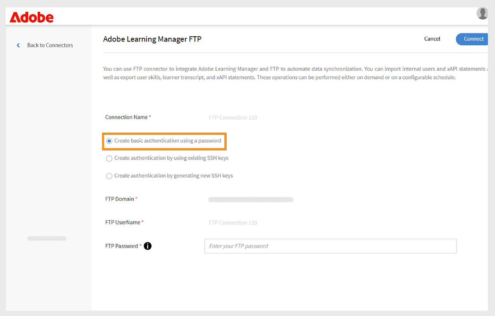
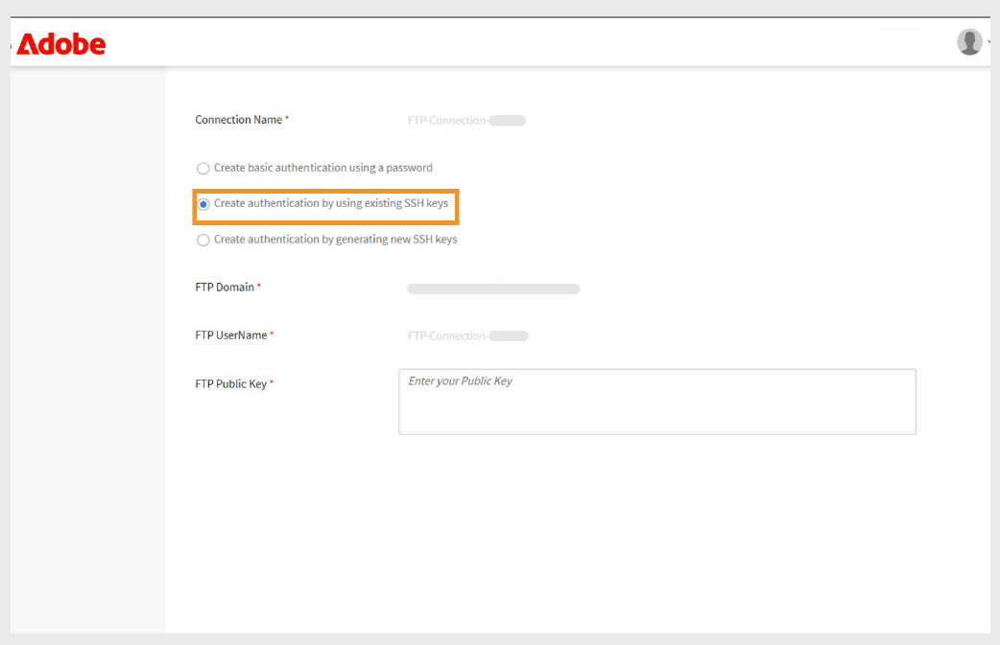

# FTP connector in Adobe Learning Manager

## Introduction

FTP (File Transfer Protocol) is a standard network protocol used to transfer files between a client and a server over the internet or a local network. It enables users to upload, download, and manage files on a remote server. For secure file transfers, variants like SFTP (SSH File Transfer Protocol) and FTPS (FTP Secure) are commonly used. FTP is widely adopted in enterprise environments for automating data exchange between systems, such as syncing user or training data between Adobe Learning Manager and external platforms.

This document offers step-by-step guidance for integration administrators on setting up and using the FTP connector in Adobe Learning Manager. The FTP connector enables automated data exchange between Learning Manager and external systems using secure file transfer protocols.

You'll learn how to configure FTP connections, map data fields, schedule automated user imports or exports, and monitor synchronization activity. This guide supports smooth and secure integration with external learning platforms or HR systems. You can import internal users and xAPI statements, and export user skills, learner transcripts, and xAPI data.

Integration administrators must generate CSV files for migrating users, user data, or learning content, and upload them to designated folders in the Adobe Learning Manager FTP account. Adobe Learning Manager then reads, merges, and imports the data based on a defined schedule.

Perform these operations either on demand or by setting up a schedule that meets your organization's needs.

## Benefits of FTP integration

- Reduces manual effort and human error in data management.
- Integrates data from multiple external sources simultaneously.
- Supports both on-demand and scheduled data operations.
- Allows detailed field mapping between different system formats.

## Prerequisites

Before configuring the FTP connector, ensure your environment meets these requirements:

- Integration administrator role with FTP connector permissions.
- Stable internet connection with adequate bandwidth for file transfers.
- Firewall configuration allowing FTP traffic on required ports.
- Required port access, depending on your security requirements

### Permission and access

Make sure you have the following:

- Access to generate and manage SSH keys (if using SSH authentication).
- Permission to create and update CSV files in the specified FTP folders.

## Key capabilities

### Data import and export with the FTP connector

The FTP connector in Adobe Learning Manager simplifies data exchange between external systems and your Adobe Learning Manager account. It supports scheduled and on-demand import or export operations, reducing manual effort and ensuring accurate, up-to-date information.

This method supports integration with multiple external systems. If different systems generate separate CSV files, Adobe Learning Manager merges the data and imports it as a single batch.

### Import data into Adobe Learning Manager

_User data import_ 

Upload structured CSV files to designated FTP folders to import internal user data. Adobe Learning Manager reads and processes these files based on your configured schedule to keep user information current.

_Multi-source integration_ 

If you're using multiple external systems, each system can generate its own CSV file. Adobe Learning Manager merges the files and processes the data as a single batch, making it easier to manage user records from different sources.

_xAPI import_ 

The connector also supports xAPI (Experience API) statements. Import these from third-party learning systems to track and report on learning activities across multiple platforms.

### Export data from Adobe Learning Manager

_Learner data export_ 

Export user data such as skill progress, course completions, and performance metrics to a designated FTP location. Use this data for external reporting or analysis.

_Learner transcripts_ 

Generate and export detailed transcripts with course completions, certifications, and learning paths to support compliance and credential verification.

### Attribute mapping

Map CSV file columns to Adobe Learning Manager user attributes. You can reuse and update the mapping configuration as needed, making it easy to adapt to changes in data requirements.

### Scheduling and automation

Schedule import and export tasks to run at regular intervals, such as daily, weekly, or at custom intervals. This ensures consistent data updates without manual effort.

## Configure the FTP connector

Configure the FTP connector to establish secure data synchronization between Adobe Learning Manager and external systems.

To configure the FTP connector:

1. Log in as an integration admin.
2. Select **Adobe Learning Manager FTP** and then select **Getting started**.

   
      _Adobe Learning Manager FTP connector interface showing the Getting Started button_

3. Select **Next**   to proceed with the FTP connector setup wizard.

   
         _Configuration page displays the Next button to proceed with the FTP connector setup_

### Configure the authentication

Adobe Learning Manager supports three authentication methods, each with different security levels and complexity requirements.

#### Basic authentication

This method uses traditional username and password credentials for FTP access. While simpler to implement, it provides lower security than SSH-based alternatives.

1. Select **Create basic authentication using a password**.
2. Type the FTP username and password in the fields provided. Verify credentials are entered correctly before proceeding.

   
            _FTP authentication form with fields for username and password, showing basic authentication option selected_

#### Existing SSH key authentication

Use this method if you already have established SSH key pairs for secure authentication.

1. Select **Create authentication by using existing SSH keys**.
2. Copy and paste your public key content into the provided text field. Ensure the public key format is correct (typically begins with ssh-rsa or ssh-ed25519).

   
      _SSH key authentication interface with text field for public key input_

#### Generate a new SSH key

Use this option to create a new SSH key pair specifically for this FTP connection.

1. Select **Create authentication by generating new SSH key**.
2. Select **Generate SSH Key** to create a new key pair. Securely download and store the generated private key. The public key will be automatically configured for the FTP connection.

   
      _SSH key generation screen with Generate SSH Key button and other configuration options_

## Connect to FTP using FileZilla

FileZilla is an optional tool for FTP connection management. It can be used when you need to manually upload files, verify directory structures, or troubleshoot connection issues outside of the automated Adobe Learning Manager processes.

### FileZilla installation and setup

FileZilla is a free, open-source FTP client that provides a user-friendly interface for file transfer operations.

To connect your FTP to FileZilla:

1. Download and install FileZilla from the [official website](https://filezilla-project.org/).
2. Open **FileZilla**.
3. Select **File** and then select **Site Manager**.
4. Select **New Site**.
5. Type the following details:
   - **FTP Domain:** The address of the FTP server you want to connect to, for example ftp.example.com. You can find your host domain on the FTP Connector page in Adobe Learning Manager.
   - **Port:** The default FTP port is 21. However, Adobe Learning Manager uses Port 22 for secure connections.
   - **FTP Username:** The login name required to access the FTP server.
   - **FTP Password:** The password linked to your FTP username.
6. Select **Connect**.
7. Once connected, you can transfer files by dragging and dropping between local (left) and remote (right) panels.

## Use the FTP connector in Adobe Learning Manager

### Import internal users using FTP connector

The user import functionality allows automated synchronization of employee data from HR systems and other external sources into Adobe Learning Manager.

### Map attributes

Attribute mapping creates the connection between your external data and the supported data structure of Adobe Learning Manager, ensuring data lands in the correct fields. This step is mandatory.

To map attributes:

1. Select **Internal Users** in the **FTP connector** page.
2. Select **Column Mapping**.
3. In the **Map Attributes** page:
   - The **left side** shows the required fields in Adobe Learning Manager.
   - The **right side** shows the CSV column names. Initially, this side contains empty dropdowns.
   - Select **Choose CSV** to upload a sample CSV file. This populates the right-side dropdown with the column names from your CSV. Refer to [this article](https://experienceleague.adobe.com/en/docs/learning-manager/using/integration/migration-manual#csv). 
   - Map each Adobe Learning Manager field with the corresponding CSV column.

   
      _Attribute mapping interface showing Adobe Learning Manager fields on the left and CSV column dropdowns on the right_

4. Select **Save** to complete the mapping.

After saving, the configured account appears as a **data source** in the Administrator app. Admins can then schedule an import or trigger a manual sync.

### Import xAPI statements

xAPI statement import allows detailed learning activity tracking by bringing external learning data into Adobe Learning Manager.

_Configure source_

xAPI source configuration establishes the connection between external learning systems and Adobe Learning Manager's activity tracking.

To configure a source:

1. Navigate to the xAPI configuration section.
2. Select **Add a new Configuration** in the configuration list.

   
      _Configuration management page with Add a new Configuration button and existing configuration list_

3. Type the **Name** and **Source File Name**:
   - **Name:** Descriptive identifier for this xAPI source (for example, LMS Integration or External Training System).
   - **Source File Name:** Exact filename that will be uploaded to your FTP folder (must match exactly, including file extension).

   
      _Configuration form showing name field and source file name field_

4. Select **Save** to create the basic configuration.

_Add filters (optional)_

Filters allow you to selectively import xAPI statements based on specific criteria.

To add a filter for source:

1. Select **Filter** on the left pane.
2. Select **Add new filter**.

   
      _Filter configuration page with Add new filter button_

3. Configure the following:
   - **Name:** Descriptive name for the filter rule.
   - **Condition:** Comparison operator (equals, contains, greater than, etc.).

   
      _Filter creation dialog showing name field and conditions_

4. Select **Add new Filter** to add more filters.
5. Select **Save** or **Delete** as needed under the **Actions** column.
6. After adding filters, select **Save**.

_Map fields_

To map the fields:

1. Select **Mapping** on the left pane.
2. On the **Mapping** page, you will see JSON field paths on the left and CSV column names on the right.

   
      _Add a mapping for the import source_

3. By default, map the following required fields:
   - **actor.mbox:** This represents the email address of the learner (the actor performing
the action). It uniquely identifies who did the activity.   
   - **verb.id:** This is the identifier for the action performed by the learner, such as
completed, attempted, or passed. It specifies the learner's action.
   - **object.id:** This indicates the learning object or activity the learner interacted with,
such as a course, module, or learning path.
4. Select **Add a new Mapping** to map additional fields.
5. For each field, select the appropriate **data type** (string, number, Boolean, or date).
6. Select **Save** to complete the mapping.

## Schedule the import

Automated scheduling ensures consistent data synchronization without manual intervention,
maintaining current learning activity records.

To schedule the import:

1. Select **Configure Schedule** in the left pane.

   
      _Schedule configuration page showing enable options and timing controls_

2. Select **Enable xAPI statements import using this connection.**
3. Select **Enable schedule** to set up automatic imports.
4. Set the following parameters:
   - **Start Date:** When scheduled imports should begin.
   - **Time:** Time of day for import execution.
   - **Repeat after:** How often imports should run (daily, weekly, custom intervals).
5. Select **Save**.

## Run on demand (optional)

On-demand execution provides immediate data imports outside of regular scheduled operations.

When to use on-demand imports:

- Testing new configurations before scheduling
- Processing urgent or time-sensitive data updates
- Handling one-time data migrations or corrections. Troubleshooting import issues

To manually import xAPI statements:

1. Select **On Demand** on the left pane.
2. Select **Execute**.

   
      _On-demand execution page with Execute button_

## View execution status

Status monitoring allows proactive management of import operations and quick identification of issues.

To view the execution status:

1. Select **Execution Status** to see a list of all import runs.
2. The page shows:

   - **Start Date:** When the import operation began.
   - **Duration:** Total time required for processing.
   - **Type of import:** Whether the import was scheduled or on-demand.
   - **Current Status:** Real-time status information.
      - **In Progress:** Import currently running
      - **Completed:** Successful completion with record counts
      - **Failed:** Error occurred with diagnostic information

## Troubleshoot import failure

The execution status section provides a comprehensive summary of all import tasks in chronological    order, allowing administrators to monitor operations and quickly identify issues.

Status Indicators:

- **Success:** Import completed without errors.
- **Warning Sign:** Indicates failures or issues during execution.
- **In Progress:** Import operation currently running.
- **Pending:** Import scheduled but not yet started.

When failures occur, the system displays warning indicators next to failed import runs. Select the Error report link to download detailed error reports.
