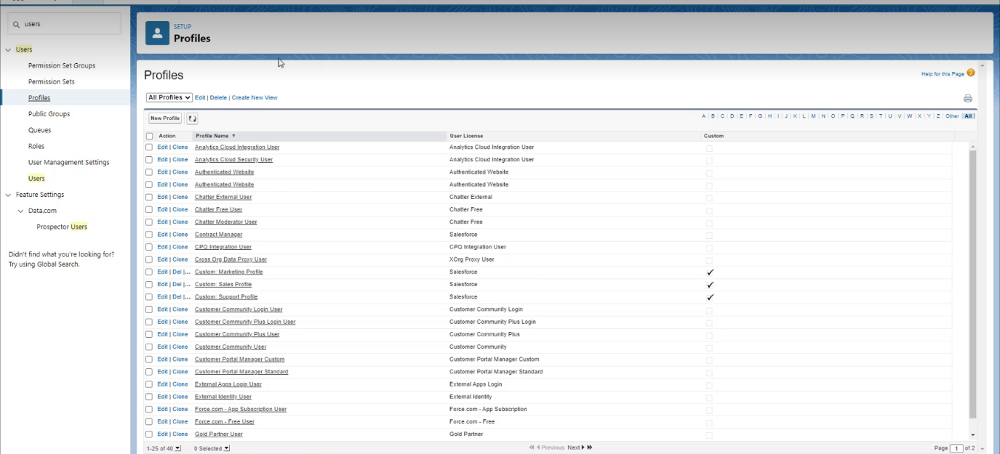

# Install Salesforce Package

## Overview

Learning Manager offers a Salesforce App package. Once installed and configured in SFDC, sales employees can perform their training activities within the SFDC portal. This app allows SFDC users to explore new trainings, view recommendations and consume them right inside the SFDC portal. Users also get the announcements sent by Administrators in the form of mastheads right inside the app within the SFDC portal.  

### Set up in Learning Manager app

1. Log in to your Learning Manager Admin account as Integration Admin.
1. Click **[!UICONTROL Applications]** > **[!UICONTROL Featured Apps]**.
1. Click **[!UICONTROL Salesforce]**.
1. On the Salesforce app page, note the Application id (also known as client id) and the client secret mentioned in the description.
1. Click **[!UICONTROL Approve]** and your app must be approved successfully.
1. Click **[!UICONTROL Developer Resources]** > **[!UICONTROL Access Tokens for Testing and Development]**.
1. In the Get OAuth Code section, the Client ID and scope must be set to - admin:read,admin:write. Click **[!UICONTROL Submit]**.
1. In Get Refresh Token, enter the Client ID and Client secret. Click **[!UICONTROL Submit]** and note the refresh token.

### Create account in Salesforce app

1. Create an account on the Salesforce sign-up page. You must create a Salesforce account in developer or enterprise edition.  [Developer signup URL](https://developer.salesforce.com/signup). Ensure that you must use the email ID to sign up for Salesforce that you'd used for Learning Manager. 
1. Verify your account via the verification email. 
1. Create a password and sign into Salesforce.
1. Note the Salesforce url after login (For eg, site.lightning.force.com)

### Install Learning Manager package

If you want to install the package, you must first delete the existing package in Salesforce. Before uninstalling, you must enable the settings, as shown below. Applying these settings is mandatory, otherwise you will be unable to install the package. 

*Install the Learning Manager package*

>[!NOTE]
>
>The Adobe Learning Manager app is only supported in Salesforce Lightning view.

1. Launch the  [Learning Manager package url](https://nam04.safelinks.protection.outlook.com/?url=https%3A%2F%2Ftest.salesforce.com%2Fpackaging%2FinstallPackage.apexp%3Fp0%3D04t1k0000008YWn&data=04%7C01%7Ckillamse%40adobe.com%7Cf588f553fc694d2edee108d9a5c74711%7Cfa7b1b5a7b34438794aed2c178decee1%7C0%7C0%7C637723097572585825%7CUnknown%7CTWFpbGZsb3d8eyJWIjoiMC4wLjAwMDAiLCJQIjoiV2luMzIiLCJBTiI6Ik1haWwiLCJXVCI6Mn0%3D%7C1000&sdata=mhYKVdwvS4F7WPruy0Kvw%2FsqgWxzTQpaZJyEACu8CNw%3D&reserved=0).  
1. In the **Login** page, click **[!UICONTROL Use Custom Domain]**.

1. Enter the package URL and click **[!UICONTROL Continue]**. The installation page must have the option Install for Admins Only selected. Do not change this option.
1. Click **Ins[!UICONTROL ]tall**. Once the package is installed, click **[!UICONTROL Done]**. You are guided to the Installed Packages page, and you can see the Adobe Learning Manager installed package.

1. Go to the App Launcher (next to Setup) and search for Adobe Learning Manager.
1. To configure the app, click **[!UICONTROL Configure]**.
1. Click **[!UICONTROL New]** and add the following details:

   * **Config:** Enter a name of your choice.
   * **ClientID**: Enter the value that you'd obtained from the first section.
   * **ClientSecret:** Enter the value that you'd obtained from the first section.
   * **RefreshToken:** Enter the value that you'd obtained from the first section.
   * **LearningManagerBaseURL:** The URL of the site where Learning Manager is hosted.
   * **Disable Redirect:** Disable redirection to the learner home page in Learning Manager.

>[!NOTE]
>
>You can only create a single configuration. If you try to add another configuration, you will see an error message. The configuration maps the Salesforce account with the Learner account.

### Add Remote Site Settings

1. In the top-right corner of the page, click **[!UICONTROL Setup]**.
1. In **Quick Find**, search for Remote Site Settings.
1. Click **[!UICONTROL New Remote Site]**.
1. Enter the details:

   1. **Remote Site Name:** Enter a name of your choice.
   1. **Remote Site URL:** The URL of the site where Learning Manager is hosted.

1. Launch Learning Manager.

### Enable Notifications for Learning Manager app

1. In the upper-right corner, click **Setup**. 
1. Search for Custom Notifications. 
1. Click **[!UICONTROL New]**.
1. Enter the following details:  

   1. **Custom Notification Name:** LearningManagerNotification 
   1. **API Name:** LearningManagerNotification

1. Select both **Desktop** and **Mobile** as Supported channels.

1. Click **[!UICONTROL Save]**.
1. To enable push notifications for mobile devices, follow the steps below:

   1. Install Salesforce mobile app in your mobile phone.
   1. Log in to the app using your credentials.
   1. Go to **Setup** > **Notification Delivery Settings**.
   1. Add Salesforce for iOS and Android.

### Uninstall Learning Manager from Salesforce

1. In Salesforce app, go to Installed packages.
1. Click **[!UICONTROL Uninstall]**.

## Configure Learning Manager for Salesforce users

The Learning Manager app is also available to users, who are present in any Salesforce account. The Salesforce admin can add users based on the profiles. The Salesforce profiles are similar to what they are in Learning Manager. For example, Administrator, Integration Admin, Instructor, and so on. The Salesforce admin can also create a custom profile.

### Profile

As a Salesforce admin, you can either assign the profiles to users or create a custom profile.

>[!NOTE]
>
>The users must be present in both Salesforce and Learning Manager.

*Assign a profile to a learner*

Whle adding a learner, you must assign a specific profile to the learner. Then go to that profile and grant the required access.

For Learners to view the Learning Manager app, you must enable the app for all learners.

The next step is to provide the permission to access the Learning Manager app.

*Add permissions to access the Learning Manager app*

When you install the package, a new permission set is created, **Adobe Learning Manager User**. Go to the permission set and then add the users.

Select the users and assign the permissions accordingly. The learners can now access the Learning Manager app.

Now, select a profile, for example, Standard Profile of a user, and click the profile. Click **[!UICONTROL Edit]** and in the **Custom App Settings** section, enable the check-box **Adobe Learning Manager**. This makes the app accessible to the user.

In the **Custom Tab Settings** section, in the **Learner Home** drop-down list, select the option **[!UICONTROL Default On]**.

You must make the app visible to all the profiles.

Click **[!UICONTROL Save]** and the learners belonging to all the profiles will access Learning Manager app.
