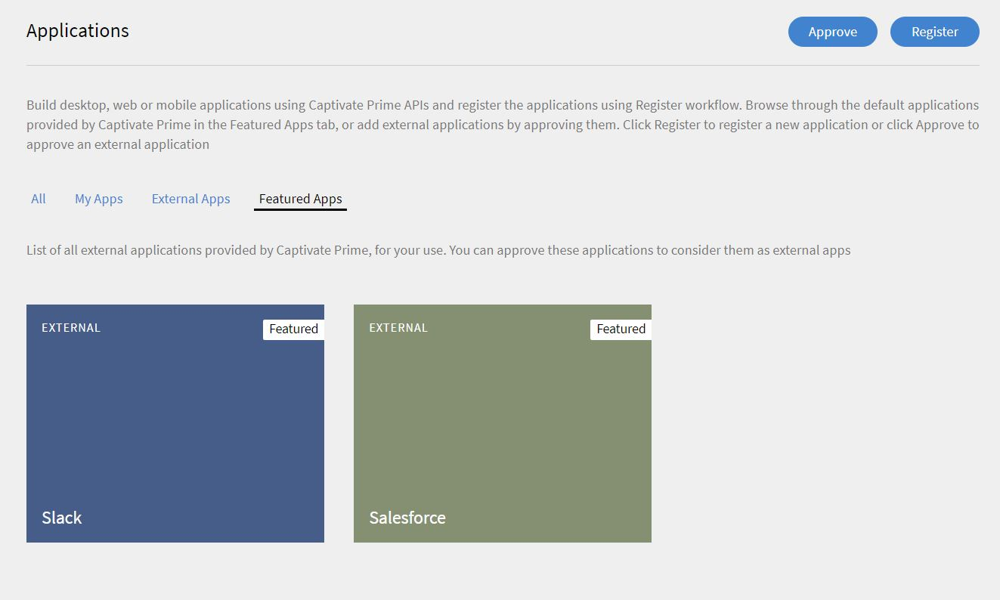

# Learning Manager integration with Slack {#learning-manager-integration-with-slack}

As a Slack user, you can install the Adobe Learning Manager app from the Slack App Directory into your Slack teams, and explore Learning Manager content from right within Slack. You can interact with  Primebot  to search for new courses, view recommendations and get notified of upcoming deadlines in Learning Manager. You can also enroll and jump straight to your learning from within Slack. 

Learning Manager app for Slack is not supported in an Azure instance of Learning Manager.

## Installing Adobe Learning Manager app {#installingadobecaptivateprimeapp}

As a Learner, you can install the CP Prime app in your Slack Account. To install the app, in your Slack account open the App directory and search for Learning Manager. Download and install the App. If the app is not approved in your account, reach out to your Integration Admin for approval. If it is already approved, you will be able to sign in.

## Approving Learner sign in as an Integration Admin {#approvinglearnersigninasanintegrationadmin}

As an integration Admin, to approve the  permission  for a Learner to use  Prime  application on Slack, follow these steps.

1. Select **[!UICONTROL Applications]** from the left pane and click on the **[!UICONTROL Featured apps]** tab.

   

1. Click on the **[!UICONTROL Slack]** tile > the slack integration page opens. Click **[!UICONTROL Approve]**  on  the top right corner to approve the application.

   

1. Go back to the **[!UICONTROL Applications]** page. Once approved, Slack should appear in the **[!UICONTROL External Apps]** tab.
1. Learners can now sign in to their Prime account using Slack.

## Primebot functionalities {#primebotfunctionalities}

You can now start interacting with the  Primebot . The following are the functionalities of the bot.

1. Command

   &#42;/prime&#42; can be used for one-off, pointed queries regarding your Adobe Learning Manager account.

   The available subcommands are:

   /prime find `<query>` - search for courses, certifications, etc.

   /prime recommend - show recommendations

   /prime deadlines - show overdue and upcoming deadlines

   /prime enrollments - show enrollments

   /prime skills - show skills

   /prime notifications - show notifications

   /prime catalogs - show catalogs

   /prime invite - [Admin Only] invite Slack users in the current team to try out  primebot

   /prime profile- show profile

   /prime logout - sign out of your Prime account in this Slack team

   /prime help - show help message

1. Recommend

   You can try a phrase like `show my recommendations` to get a personalized list of recommended courses, certifications and learning programs from your Adobe Learning Manager account.

1. Search

   You can try phrases like `search for machine learning` or `search for artificial intelligence`. You can specify the kind of learning object using phrases like `search for machine learning certifications`, `search for artificial intelligence courses` or `search for adobe photoshop job aids`. You can also search within a catalog using phrases like `search for machine learning in Lynda catalog`.

1. Deadlines

   Use  phrase  like `show my deadlines` to get a list of overdue and upcoming deadlines from your Adobe Learning Manager account. You can filter out overdue or upcoming deadlines with phrases like `show my overdue deadlines` or `show my upcoming deadlines'.
