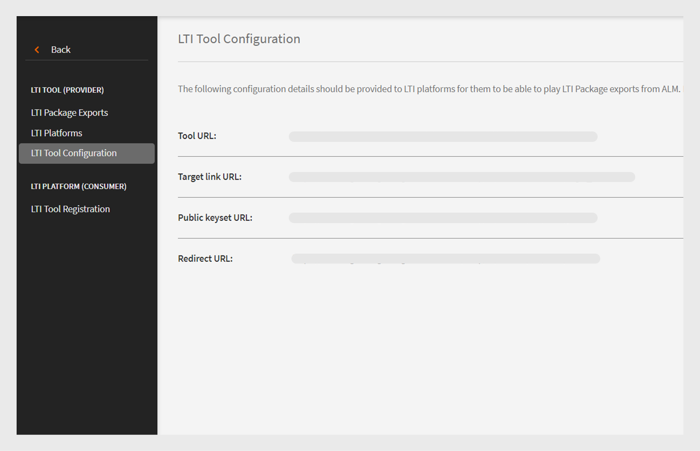
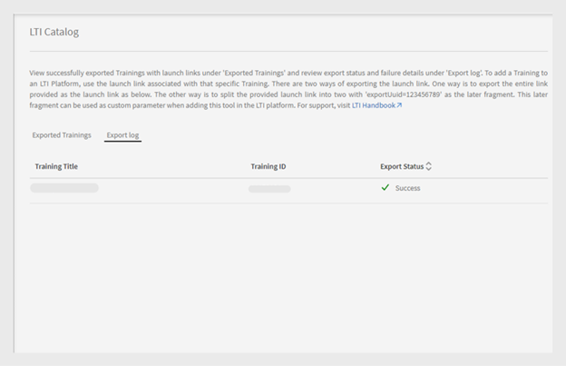

# LTI integration

## What is LTI?

Learning Tools Interoperability (LTI) is an IMS standard for integration of rich learning applications within educational environments. Users can access external learning content from external content providers directly within their LMS without signing in or navigating to a different LMS.

## LTI integration with Adobe Learning Manager

Adobe Learning Manager now supports LTI version 1.3, which allows it to act as both a tool provider and a tool consumer. This feature enhances interoperability between Adobe Learning Manager and other Learning Management Systems (LMS).

**LTI as a tool provider**: LTI as a tool provider allows external systems to integrate with an LMS. Adobe Learning Manager acts as an LTI Tool Provider, allowing other LMS platforms to access learning objects from the Adobe Learning Manager directly within their LMS. 

**LTI as a tool consumer**: LTI as a Tool Consumer allows LMS to integrate external tools via Learning Tools Interoperability (LTI). In this scenario, LMS is a consumer of services provided by external tools. Adobe Learning Manager acts as an LTI Tool Consumer, allowing it to integrate third-party learning tools, which allows Adobe Learning Manager learners to consume the learning objects from the third-party tools within the Adobe Learning Manager.

## Set up LTI connector in ALM

Follow these steps to enable LTI integration in Adobe Learning Manager:

1. Log in as an **[!UICONTROL Integration Admin]**.
2. On the homepage, select **[!UICONTROL Applications]** > **[!UICONTROL Featured Apps]**.
3. Select **[!UICONTROL LTI Integrations]** on the **[!UICONTROL Applications]** page.
4. Select the **[!UICONTROL Enable LTI Integrations]** option and select **[!UICONTROL Save]**. 

 
_Enable LTI Integrations_

>[!NOTE]
>
>You cannot modify or disable the LTI Integrations option once enabled.

This will create the new LTI Integrations sidebar in the admin account. 
 

_LTI Sidebar_

A new custom role, **[!UICONTROL LTI Integration]**, has been added under **[!UICONTROL Account privileges]** in the **[!UICONTROL Custom Role]** section. Admins can assign this role to users, allowing them access to the **[!UICONTROL LTI Integration]** section. Admins also need to grant **[!UICONTROL Catalogs]** permissions to these users for exporting the courses. This setup provides full access to the LTI and Catalogs sections for exporting courses.
 

_LTI Integration custom role_

## Adobe Learning Manager as an LTI tool provider

As an LTI Provider, Adobe Learning Manager allows you to export courses from your catalogs as LTI packages that can be shared with external LMS platforms.

### Create and share the LTI credentials with external LMS - Admin workflow

Follow these steps to share the LTI credentials with external LMS:

1. Log in as an **[!UICONTROL Admin]**.
2. On the homepage, select **[!UICONTROL LTI Integration]** > **[!UICONTROL LTI Tool Configuration]**. You can see the configuration credentials on this page.
3. Admin can share these credentials with an external LMS for the LTI site registration. 

    
   _LTI Tool Configuration credentials_

   * **[!UICONTROL Token URL]**: The URL where the LMS requests an access token to authenticate and authorize communication with the LTI tool.
   * **[!UICONTROL Target Link URL]**: The destination URL where users are redirected when launching the LTI tool from the LMS.
   * **[!UICONTROL Public Keyset URL]**: The URL that provides public keys used to verify security tokens for secure communication.
   * **[!UICONTROL Redirect URL]**: The URL where users are sent after completing an action on the LTI tool, usually redirecting them back to the LMS.

### External LMS setup

Using the credentials shared by the Adobe Learning Manager admin, the external LMS admin registers Adobe Learning Manager and generates credentials. These credentials will be added to the Adobe Learning Manager as a final step to set up Adobe Learning Manager as a tool provider. The following are the external LMS-generated credentials:

* **[!UICONTROL Issuer or Platform ID]**: A unique identifier for the LMS or platform that sends the LTI launch request to the tool provider.
* **[!UICONTROL Client ID]**: A unique identifier assigned to the LTI tool by the LMS for authorization purposes.
* **[!UICONTROL Deployment ID]**: An identifier that links a specific LTI tool deployment to the LMS for managing multiple instances.
* **[!UICONTROL Token URL]**: The endpoint where the LMS requests an access token to authenticate and authorize interactions with the LTI tool.
* **[!UICONTROL Authentication URL]**: The URL where the LMS sends users for authenticating and initiating the LTI connection.
* **[!UICONTROL Public Key URL]**: The URL that provides the public key used by the LTI tool to verify security tokens and ensure secure communication.

### Add Adobe Learning Manager as a tool provider - Admin workflow

Follow these steps to add Adobe Learning Manager as a tool provider:

1. Log in as an **[!UICONTROL Admin]**.
2. On the homepage, select **[!UICONTROL LTI Integrations]** > **[!UICONTROL LTI Platforms]**.
3. Select **[!UICONTROL Add]** and enter the credentials shared by external LMS.
 
   
   _Add a new LTI Platform_

4. Once all these values are added, select **[!UICONTROL Validate]** and **[!UICONTROL Add]**.

### Export LTI package - Admin workflow

LTI Tools allows you to export training from your Catalogs as a downloadable package of learning content that can be shared with external Learning Management Systems (LMS) or platforms using the Learning Tools Interoperability (LTI) standard.

Follow these steps to export the course from Adobe Learning Manager:

1. Log in as an **[!UICONTROL Admin]**.
2. On the homepage, select **[!UICONTROL LTI Integrations]** > **[!UICONTROL LTI Package Exports]**.
3. Select **[!UICONTROL New package export]**.
 
   
   _Export LTI package_

4. Select the required catalog from the list. You can see the list of courses available in the catalog.
5. Select the required courses and select **[!UICONTROL Export as LTI]**.
6. Select the course to see the launch link. 
7. Select the **[!UICONTROL Download Link]** icon to download the package. The package is a zip file containing the IMSCC files successfully exported.

Using this launch link or IMSCC file, you can export the Adobe Learning Manager courses into the external LMS. Learners can consume the Adobe Learning Manager courses from their LMS.

>[!NOTE]
>
>If an admin edits a course or updates the modules after creating the launch link, the link will automatically update. However, if an admin retires a course after the launch link is created, the retired course will fail to launch in the LTI consumer.

## Adobe Learning Manager as an LTI consumer - Admin workflow

As an LTI Consumer, Adobe Learning Manager allows you to use activity, tools, content, and widgets from external LTI providers.
To add Adobe Learning Manager as an LTI consumer, you need the following credentials from the external LTI provider:

* Initiate Login URL
* Target Link URL
* Redirect URL
* Public Key Type

Follow these steps to add Adobe Learning Manager as an LTI consumer:

1. Log in as an **[!UICONTROL Admin]**.
2. On the homepage, select **[!UICONTROL LTI Integrations]** > **[!UICONTROL LTI Tool Registration]**.
3. Select **[!UICONTROL Add]** > **[!UICONTROL New LTI Tool]**.

   >[!NOTE]
   >
   >You can import multiple LTI tools by uploading a .csv file. 

4. Enter the above credentials from the LTI Provider.
 
   
   _Add a new LTI tool_

5. Once done, select **[!UICONTROL Validate]** and **[!UICONTROL Add]**.
6. You can see the following screen:
 
    
   _Registration credentials_

7. Share these credentials with the LTI provider for registration. Once the registration is complete, you can get the launch link or IMSCC file from the LTI provider to import the courses.

### Create LTI content - Author workflow

The LTI providers provide you with a launch link or IMSCC file to add their courses to Adobe Learning Manager. Follow these steps to add courses from external LMS:

1. Log in as an **[!UICONTROL Author]**. 
2. Select **[!UICONTROL Content Library]** > **[!UICONTROL Add]** > **[!UICONTROL LTI Module]**.

   
   _Add LTI Content - Author_

3. Type the **[!UICONTROL Name]** and **[!UICONTROL Description]**.
4. Type the **[!UICONTROL Launch Link]** and **[!UICONTROL Custom Parameters]** from the LTI provider.
5. Select your [!UICONTROL LTI provider] from the **[!UICONTROL Tool Provider]** dropdown menu.
6. Search and select the **[!UICONTROL Public]** in the **[!UICONTROL Add to Folder]** option. This makes the courses available to all authors.
7. Select **[!UICONTROL Save]**.
   Once the content is created, you can add this content when creating the course. 

### Create course with LTI content - Author workflow

Follow these steps to create a course with LTI content:

1. Log in as an **[!UICONTROL Author]**.
2. On the homepage, select **[!UICONTROL Courses]** > **[!UICONTROL Add]**.
3. Type the **[!UICONTROL Name]** and **[!UICONTROL Description]** of the course.
4. In the **[!UICONTROL Modules]** option, select **[!UICONTROL Add Modules]** > **[!UICONTROL Self Paced Module]**.
5. Select the **[!UICONTROL LTI Content]** you created and select **[!UICONTROL Save]**.
6. Enter the required details such as **[!UICONTROL Skills]**, **[!UICONTROL Authors]**, and **[!UICONTROL Enrollment type]**.
7. Once done, publish the course. Adobe Learning Manager learners can take the LTI courses from the external LTI provider. 

## LTI export failure scenarios

The following types of courses cannot be exported as LTI courses:

* **Course with Activity Module**: Courses containing specific activity-based modules.
* **Course with multiple delivery type**: Courses with multiple delivery type includes self-paced module, virtual or classroom module, activity module and blended learning.
* **Course with Pre-requisites**: Courses that require pre-completion.
* **Course with multi enrollment**: Courses containing multiple enrollment
* **Courses with Multiple Instances**: Courses that offer multiple delivery instances.

| Default Instance  | One or more non-default instances | Expectation | Error messages |
|---|---|---|---|
| Active | None | Export | None |
| Active | Active | Don't Export | Multiple Instances |
| Active | Retired | Don't Export | Multiple Instances |
| Active | Deleted | Export | None |
| Retired | None | Don't Export | Retire Def Instance |
| Retired | Active | Don't Export | Retire Def Instance, Multiple Instances |
| Retired | Retired | Don't Export | Retire Def Instance, Multiple Instances |
| Retired | Delete | Don't Export | Retire Def Instance |

* **Courses with Multiple Question-Answer**: Courses with MQA enabled.
* **Course with Instance Switch Enabled**: Courses allowing learners to switch between instances.
* **Paid Course**: Courses requiring payment for enrollment.
* **Courses Part of Learning Path, Certification, or Learning Plan**: Courses part of learning paths or plans.
* **Courses Not of Self-Enrolled Type**: Courses restricted from learner self-enrollment.
* **Classroom or Virtual Classroom Courses**: Courses with classroom or virtual classroom sessions.
* **Courses with Non-Mandatory Modules**: Courses containing optional or non-compulsory modules.

 
_Export status_

## LTI limitations 

The following are LTI limitations for both LTI consumer and LTI provider:

* Able to export blended courses which affects learners' course consumption experience.
* Able to export self-paced courses with classroom, virtual classroom, or activity modules, impacting learners' course experience.
* Able to export shared courses like LinkedIn Learning and Go1 courses.
* Able to launch courses with past enrollment dates in ALM, which affects learners' course access and experience.
* Learners are unable to consume LTI courses on the iOS ALM mobile app, which affects the course consumption experience. 
* Learners are unable to download and access LTI courses offline in the ALM mobile app, as these courses are provided by third-party platforms.
* Admins are able to view only enabled catalogs and are unable to see disabled catalogs.
* ALM has limitations on name (63 characters) and email (64 characters) lengths, preventing access for external LTI learners who exceed these limits.
* Course completion sync or grade sync delays are caused by the third-party LTI system.
* Course sync messages do not appear for Teams learners consuming LTI courses through the Teams app or browser, impacting learner notifications.
* User Data reports are unable to export data for users registered through LTI.
* Tool provider names are not automatically recognized when authors add launch links in the tool consumer, requiring manual selection.
* Bulk tool uploads via CSV require UTF-8 encoding for accented characters to avoid import errors.
* LTI Account Admins are not able to share Courses, Learning Paths, or Certifications that include LTI Modules.
* Unable to resynchronize grades when users reopen the player for completed ALM courses, which affects learners' score updates and requires a manual retrigger.
* ALM allows only active and trial users to consume the LTI courses. 
* Grade synchronization enabled in Moodle prevents the ALM player from launching, which affects the learners' course access and experience.
* The LTI active field is single-value and does not support multiple values. 
* Failure reasons are not available when an export fails during the migration of courses without core content.
* External LTI course grades are not appearing in the Learner Transcript, and scores are not visible on the L2 Quiz page, affecting learners' performance tracking.

## LTI launch failure cases

The following are the courses that the external LTI player cannot launch because of recent changes made in ALM after the launch links were created:

* Courses where the instance is retired.
* Courses that are retired and have no enrollments in ALM.
* Courses that have enrollments in ALM but are retired.
* Courses that have been deleted in ALM.
* Courses where the enrollment limit has been reached.

## Best practice

It is recommended that a catalog be created with courses that support LTI to prevent export failures and make exporting the courses easier.

 
LTI Catalog showing successful export status
