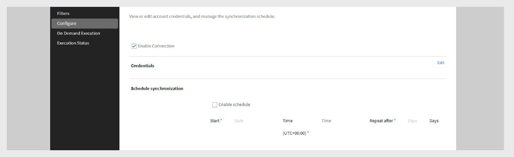

# LinkedIn Learning connector in Adobe Learning Manager

## Introducction

The LinkedIn Learning connector allows you to seamlessly integrate LinkedIn Learning content with Adobe Learning Manager. With this connector, organizations can automatically bring LinkedIn Learning courses into Adobe Learning Manager so learners can find, enroll in, and complete LinkedIn courses directly within the platform.

When set up, learner progress on LinkedIn Learning content is tracked back in Adobe Learning Manager, allowing administrators to monitor completions and time spent. You can schedule automatic content synchronization, run on-demand imports, and filter which courses are brought into your system by language, library, or custom tags.

>[!NOTE]
>
>When you import courses from LinkedIn Learning, Adobe Learning Manager generates unique LO (Learning Object) IDs for each course. Learning time spent on LinkedIn Learning content is reported by the LinkedIn platform to Adobe Learning Manager. If the LinkedIn platform does not send this data, Adobe Learning Manager cannot record it, and the time spent will show as zero.

## Configure LinkedIn Learning portal settings

To configure LinkedIn Learning portal settings:

1. Log in to **LinkedIn Learning LMS** as an administrator.
2. Select **Admin** from the top navigation panel.
3. Click the **Settings** tab.
4. From the left navigation, select **Playback Integration**, then select the **Integration** tab.
5. Expand **LMS Content Launch Settings**.
6. Add the following hostnames:

   - learningmanager.adobe.com
   - learningmanagerlrs.adobe.com
   - cpcontents.adobe.com
7. Select **Enable AICC integration**.

   
   _Select Enable AICC integration to configure the LinkedIn Learning connector_

## Connect LinkedIn Learning in Adobe Learning Manager

To configure the LinkedIn Learning connector:

1. Log in to Adobe Learning Manager as an integration administrator.
2. Hover over the **LinkedIn Learning** tile and select **Connect**.

   
   _Select Connect to configure LinkedIn Learning connector_

3. On the connection setup page:
   - Type a **Connection Name**.
   - Type the **Application Key** and **Secret Key**.

   
   _Type the connection name, application key, and secret key to configure the LinkedIn Learning connector_

   >[!NOTE]
   >
   >The enterprise admin can generate these keys by creating an application in the LinkedIn Learning Admin portal.

4. Select **Save** to add the connection.

To edit an existing connection, select **Manage Connections** on the **LinkedIn Learning** tile.

>[!IMPORTANT]
>
>The **Migration** feature must be enabled for your account before you can configure this connector.

## Manage connection and synchronization

To manage the LinkedIn Learning connector:

1. Select **Manage Connections** and select the connection.
2. From the left pane, select **Configure**.
3. Select **Enable Connection**.

   
   _Select Enable Connection in the Configure LinkedIn Learning connector page_

4. Select **Edit** to update credentials. Use **Reset** to undo edits.
5. To automate syncing, select **Enable Schedule**.
6. Set the start date, time, and frequency (for example, every 3 days).
7. Select **Save**.

### On-demand sync

To run on-demand synchronization:

1. Select **On Demand Execution** in the left pane.
2. Type a **Start Date**.
3. Select any of the options from the following to **Enable** or **Disable access** to Adobe Learning Manager during execution:
   - **Enable access to Adobe Learning Manager during execution**: No downtime for users.
   - **Disable access to Adobe Learning Manager during execution**: The application is unavailable during sync.

   
   _Select On Demand Execution to run the import_

4. Select **Execute** to import user feeds and data from LinkedIn Learning from that date forward.

To monitor all sync runs:

Select **Execution Status** in the left pane to view the history of all syncs, their duration, type (scheduled or on-demand), and current status (in progress, completed).

>[!NOTE]
>
>If you delete and recreate a connection, previous runs are retained and shown in **Execution Status**. You can rerun only the most recent sync.

## Filter LinkedIn Learning content

When setting up your connector, you can filter which LinkedIn Learning courses to import.

To set up your filter:

1. Select **Filter** on the left pane.
2. Select the required option under **Filter Trainings using**.
   - **No Filter** – Import all courses.
   - **Language** – Filter courses by specific languages.
   - **Library** – Filter courses by LinkedIn Learning libraries.
3. If filtering by **Language**, select the languages you want. For example, **English** and **Spanish**.
4. In **Import Trainings to**, select where the courses will be imported.
5. Choose how to organize the imported courses.
6. Select any of the options below for **Segregate Trainings based on** option:

   - **Language** – Group by language.
   - **Library** – Group by library.
7. Under **Import tags**, select the tag types you want to apply to imported courses.
   
   - **Language**
   - **Library**
   - **Subject**
   - **Topic**
   - **Custom Tag**
8. In the **Custom Tag** field, type a custom tag you want to assign. Separate multiple tags with commas.

   
   _Select filter options to import the data from the LinkedIn Learning connector_

9. If you want learners to be able to unenroll from these courses, select **Users can Unenroll**.
10. Select **Save** to apply your filter and import settings.
