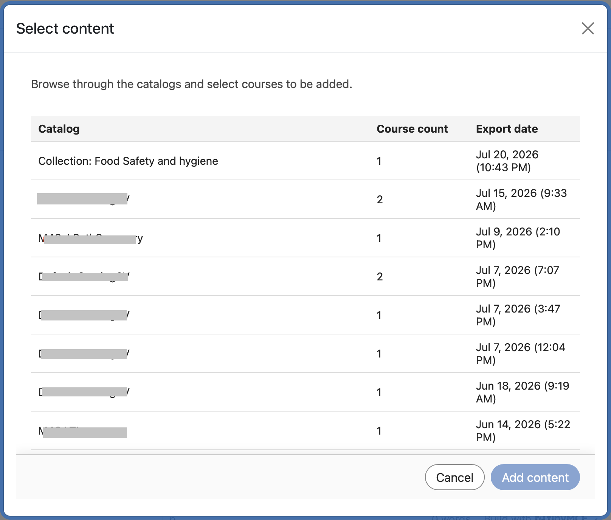
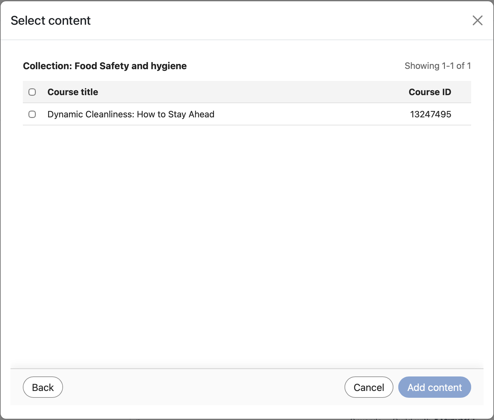

# LTI Deep Linking in Adobe Learning Manager

## Overview

**The following section is for admins**

LTI Deep Linking is an LTI advantage capability that allows instructors or course authors to browse, select, and embed specific learning items from Adobe Learning Manager (ALM) directly into an external LTI tool consumer/platform (like Canvas or Moodle) courses.

LTI deep links simplify the process of adding courses to a learning platform such as Moodle. In the current workflow, an author must manually copy the course URL, including the export UUID parameter, and then paste the required details into the LMS while configuring the course link. This step must be repeated for every course and for every placement. For example, if the same course needs to be added in 10 different locations, the author must repeat the copy-and-paste process 10 times. This manual approach increases effort and introduces a higher risk of configuration errors.

Deep linking removes this overhead by allowing the LMS to handle course selection during setup and provides the appropriate launch URL for content selection. 

In this model:

* Instructors and authors in the external LMS launch a dedicated deep-link selection experience to browse ALM.
* The system returns a deep-link object from ALM to the external LMS so the selected item can be embedded as part of their course authoring workflow.
* Students consume deep-linked content in their primary LMS, which seamlessly launches the material hosted in ALM.

## Problem statement

ALM currently supports LTI 1.3 integration, but without a complete deep-linking workflow, instructors and authors do not have a structured way to:

* Launch a dedicated deep-link selection experience from a modal. 
* Browse only the learning objects that should be exposed for a given platform.
* Select a specific learning object from the platform.
* ALM returns that learning object to the platform so that it can be embedded directly into a course.

Without this capability:

* Content selection is manual or fragmented
* All account content may be unintentionally exposed unless explicitly filtered
* Tool-provider integrations are harder to operationalize
* Course authors cannot embed external LTI content with a consistent, governed workflow

## Objectives

The primary objectives of this feature are:

1. Enable LTI Deep Linking in an LTI tool provider
    * Support deep-link launches from ALM to an LTI tool provider.
2. Provide a governed content selection workflow
    * Expose only approved and relevant catalogs and content during deep-link selection.
3. Allow instructors and authors to select learning objects
    * Provide a searchable and filterable UI for selecting eligible learning objects.
4. Return a valid deep-link response to ALM
    * Redirect the user back to the platform using the deep_link_return_url parameter with the required deep-link payload.
5. Support platform-specific catalog exposure
    * Allow admins to control which catalogs are exposed to which LTI platform.

## Personas and their roles

The LTI deep-linking workflow involves the following personas:

| Persona | Description |
|---|---|
| Instructor or author | Creates or manages courses and launches the deep-link selection flow to embed external content. |
| Integration Admin | Registers and manages LTI tools and enables and configures deep-linking behavior. |
| Learner | Launches and consumes content that was added through the deep-link workflow. |

*Each persona maps to a distinct step in the deep-linking workflow, from configuration to consumption.*

## Data and parameter requirements

Deep linking exchanges the following parameters between ALM and the LTI platform:

| Parameter | Purpose |
|---|---|
| `deep_link_return_url` | Return endpoint used to send the selected deep-link object back to ALM |
| `accepted_types` | Defines the resource types accepted by the platform |
| `accept_multiple` | Indicates whether multiple resource selection is allowed; configurable per tool |
| `auto_create` | Indicates the platform can auto-create the linked resource entry |

*These parameters control what content is exposed and how selections are returned to ALM.*

## Create a deep link

### Prerequisite

1. You should be logged in as an Integration Admin. 
2. While setting up the LTI integration, select the Supports Deep Linking checkbox.
3. Provide the URL in the field to take the user or author to the selection. 
4. Select Save Changes. 

    The same launch URL is reused to simplify configuration and usage. 

    The behavior is determined by the LTI message type. When the message type is `content_consumption`, the user is directed to the course player. When the message type is `content_selection`, the user is routed through the deep-linking flow, where the author can select the desired content directly without manually copying course-specific identifiers. 

    After you save your changes, select the **Select Content** tab. (The **Select Content** tab becomes active only after this checkbox is selected.)  

**The following section is for authors.**

As an author, you can select content from the **Select Content** window. The **Select Content** window displays **Catalog**, **Course count**, and **Export date**.

1. Go to your external integration tool.

    

2. Select a **Catalog** and select the courses that you want to deep link by selecting the checkboxes next to each course. If you add multiple courses, a confirmation pop-up appears for you to confirm.

    

    

3. Select **Add content**. Selecting **Add content** fills in all the fields for you. You can view the export UUID in the Custom parameters field. A confirmation message is displayed if you have selected multiple courses in the previous step.

    

4. At this point, you can select **Cancel** and return to **Select Content** tab if you would like to select some other courses or make changes or you can either select **Save and return** to the course or select **Save and display**. The deep links are added to the destinations.

     
