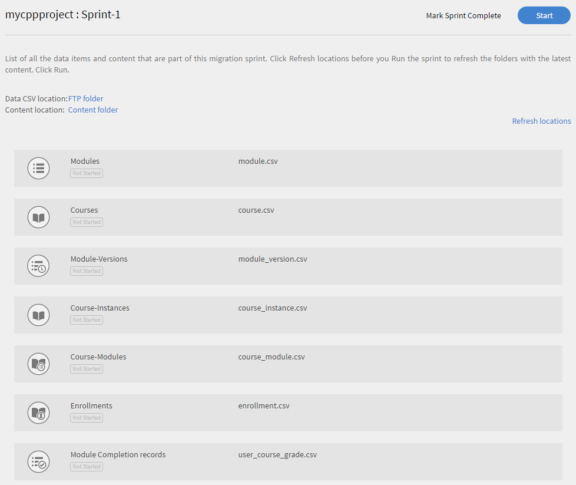
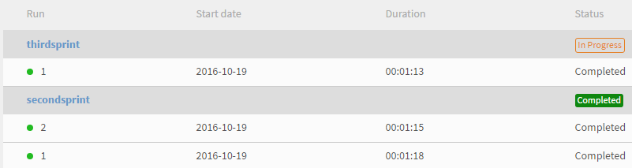

# Migration manual

Reference manual for Integration Administrators who want to migrate an existing LMS to Learning Manager LMS

<!-- ## Overview {#overview} -->

## Usage scenario {#usagescenario}

In general, large enterprises have their in-house LMS or any vendor provided legacy Learning Management Systems. LMS consists of your enterprise training content and training data. As an enterprise when you purchase the Learning Manager, you may want to move your existing LMS content and data to Learning Manager so you can leverage the benefits of modern and intuitive LMS without losing any of your organization's legacy data.

Learning Manager provides the necessary tools and specifications so that your organization's integration Administrator can set up and perform the migration tasks. 

As of today, the Migration feature in Learning Manager can be accessed by an organization's Administrators by contacting Adobe support team. To enable Migration feature in your account, you can reach out to the Adobe Learning Manager support team.

## Migration process {#apidescription}

Pre-requisites for migration, key steps involved in migration process, migration sprints, specifications, data and content migration steps are explained in this section as follows: 

### Pre-requisites {#prerequisites}

Learning Manager team expects that the following tasks are performed by your organization's Integration Administrators before undertaking the migration process:

* The Integration Administrator extracts data and content from the incumbent LMS, and transforms the data to the file formats as defined by Learning Manager. 
* Learning Manager does not support importing of users as part of migration process and expects the organization to import users using connectors. Adobe Systems expect that these connectors are configured prior to the migration process. Refer to [Learning Manager connectors Help](connectors.md) for more information. 

Learning Manager recommends that Administrators can try out the migration process in a trial account before migrating the data and content into the Learning Manager production environment. 

### Key steps of migration process {#keystepsofmigrationprocess}

The key steps involved in migrating content and data from an existing LMS to Learning Manager are as follows: 

1. The Integration Administrator or partner evaluates the existing LMS data and content that needs to be migrated.
1. Integration Administrator evaluates the tools and specifications that Learning Manager provides for ingesting data and content. 
1. Integration Administrator writes code or undertakes manual work to export the training data and content from the older LMS based on the functionality provided by the older LMS. 
1. Once the training data and content is available, the Integration Administrator analyzes and maps the data and content to match the Learning Manager migration specifications. 
1. Integration Administrator uses the tools provided by Learning Manager to migrate in the following order: 

   1. Transfer the learners over to Learning Manager
   1. Transfer training content into Learning Manager and 
   1. Finally, transfer training Data into Learning Manager.

The organization can start using Learning Manager LMS along with the legacy content. 

### Scope of migration objects {#scopeofmigrationobjects}

You can migrate content only for the following learning objects: 

* Module
* Badges
* Course
* Module version
* Course instance
* Course module
* Skills
* Skill level
* Skill course
* Certification
* Certification course
* Certification commit
* Learning program
* Learning program course
* Learning program instance
* Learning program course instance
* Job aid
* Job aid version
* Job aid course
* Job aid skills
* Enrollment
* Certification enrollment
* Learning program enrollment
* Job aid enrollment
* User course grades

### Key concepts of migration {#keyconceptsofmigration}

Some of the key concepts of Learning Manager migration process are explained briefly for your quick reference, as follows: 

**Migration project**

In Learning Manager, a migration project consists of one or more sprints. You can also have multiple migration projects for your account. Your migration process in Learning Manager starts with creating a migration project. 

**Sprint**

A Sprint, in Learning Manager migration process, defines a set of migration items that you have chosen to migrate from the existing LMS. A migration item can be a course module, learner records, or a set of courses. You can have multiple learning data items in a sprint. You can execute migration jobs in each sprint. 

**Sprint Runs**

Sprint Run is the process of starting a Sprint migration job. You can stop the sprint run at any point in time of a Run. 

**Sprint Re-runs**

You can re-execute a migration sprint after its completion at any point in time. This situation of re-execution or re-run of a sprint occurs when you want to append the data in a sprint item and migrate it to the application again or correct the errors in CSVs. 

**CSV specification**

Learning Manager provides you a set of [standard CSV specifications](migration-manual.md#main-pars_header_140933605). Best practice is to go through these CSV specifications before starting with the migration process. Integration Administrator of your organization can analyze the existing data formats and map them to match with the Learning Manager provided CSV template items.  

**Migration project tags**

Adobe Systems recommends that you use a set of keywords as tags to identify your migration projects easily within the Learning Manager application. These tags enable you to identify your projects internally in the Learning Manager application at any given point in time. 

**Contentless module**

Learning Manager allows you to upload a module without content. Adobe Systems considers it as a contentless module in Learning Manager. In a scenario where you want to migrate some of the legacy data from your existing LMS without the need for any content, you can upload the module_version.csv file without URL reference. 

## CSV specifications and sample CSVs {#csv}

Find below, the standard CSV specifications that you can use to map with your existing LMS migration data. Click csv-specifications and sample-csvs to download zip files. The downloaded csv-specifications.zip contains seven Excel sheet files. These excel sheet files are specifications with descriptions to make you understand how to fill up the .csv files. The corresponding .csv files should contain the data for each field in the prescribed format as explained in these .xlsx files. 

<table border="1" cellspacing="0" cellpadding="0" width="100%">
 <tbody>
  <tr>
   <th>
    <p><b>Sl.no</b></p></th>
   <th>
    <p><b>File Name</b></p></th>
   <th>
    <p><b>Description of contents</b></p></th>
   <th>
    <p>Notes</p></th>
  </tr>
  <tr>
   <td>
    <p>1</p></td>
   <td>
    <p>module.xlsx</p></td>
   <td>
    <p>Metadata for module.csv</p></td>
   <td> </td>
  </tr>
  <tr>
   <td>
    <p>2</p></td>
   <td>
    <p>badge.xlsx</p></td>
   <td>
    <p>Metadata for badge.xlsx</p></td>
   <td> </td>
  </tr>
  <tr>
   <td>
    <p>3</p></td>
   <td>
    <p>course.xlsx</p></td>
   <td>
    <p>Metadata for course.csv</p></td>
   <td>
    <p>Mention one author name for a given course as sometimes multiple author names are not displayed accurately in the application after migration. </p></td>
  </tr>
  <tr>
   <td>
    <p>4</p></td>
   <td>
    <p>module_version.xlsx </p></td>
   <td>
    <p>Metadata for module_version.csv</p></td>
   <td>
    <p>Ensure that you provide the URL path of Box account folder where you uploaded the content. </p></td>
  </tr>
  <tr>
   <td>
    <p>5</p></td>
   <td>
    <p>course_instance.xlsx</p></td>
   <td>
    <p>Metadata for course_instance.csv </p></td>
   <td> </td>
  </tr>
  <tr>
   <td>
    <p>6</p></td>
   <td>
    <p>session.xlsx</p></td>
   <td>
    <p>Metadata for session.csv</p></td>
   <td>
    <p>Ensure that every entry in the session csv is associated with at least one Classroom/Virtual Classroom module</p></td>
  </tr>
  <tr>
   <td>
    <p>7</p></td>
   <td>
    <p>course_module.xlsx</p></td>
   <td>
    <p>Metadata for course_module.csv</p></td>
   <td> </td>
  </tr>
  <tr>
   <td>
    <p>8</p></td>
   <td>
    <p>skill.xlsx</p></td>
   <td>
    <p>Metadata for skill.csv</p></td>
   <td> </td>
  </tr>
  <tr>
   <td>
    <p>9</p></td>
   <td>
    <p>skill_level.xlsx</p></td>
   <td>
    <p>Metadata for skill_level.csv</p></td>
   <td> </td>
  </tr>
  <tr>
   <td>
    <p>10</p></td>
   <td>
    <p>skill_course.xlsx</p></td>
   <td>
    <p>Metadata for skill_course.csv</p></td>
   <td> </td>
  </tr>
  <tr>
   <td>
    <p>11</p></td>
   <td>
    <p>certification.xlsx</p></td>
   <td>
    <p>Metadata for Certification.csv</p></td>
   <td> </td>
  </tr>
  <tr>
   <td>
    <p>12</p></td>
   <td>
    <p>certification_course.xlsx</p></td>
   <td>
    <p>Metadata for certification_course.csv</p></td>
   <td> </td>
  </tr>
  <tr>
   <td>
    <p>13</p></td>
   <td>
    <p>certification_commit.xlsx</p></td>
   <td>
    <p>Metadata for certification_commit.csv</p></td>
   <td> </td>
  </tr>
  <tr>
   <td>
    <p>14</p></td>
   <td>
    <p>learning_program.xlsx</p></td>
   <td>
    <p>Metadata for learning_program.csv</p></td>
   <td> </td>
  </tr>
  <tr>
   <td>
    <p>15</p></td>
   <td>
    <p>learning_program_course.xls </p></td>
   <td>
    <p>Metadata for learning_program_course.csv </p></td>
   <td> </td>
  </tr>
  <tr>
   <td>
    <p>16</p></td>
   <td>
    <p>learning_program_instance.xlsx </p></td>
   <td>
    <p>Metadata for learning_program_instance.csv</p></td>
   <td> </td>
  </tr>
  <tr>
   <td>
    <p>17</p></td>
   <td>
    <p>learning_program_instance_course_instance.xlsx </p></td>
   <td>
    <p>Metadata for learning_program_instance_course_instance.csv</p></td>
   <td> </td>
  </tr>
  <tr>
   <td>
    <p>18</p></td>
   <td>
    <p>job_aid.xlsx</p></td>
   <td>
    <p>Metadata for job_aid.csv</p></td>
   <td>
    <p>Every job_aid migrated requires to have one or more job_aid versions.</p></td>
  </tr>
  <tr>
   <td>
    <p>19</p></td>
   <td>
    <p>Job_aid_version.xlsx</p></td>
   <td>
    <p>Metadata for job_aid_version.csv</p></td>
   <td> </td>
  </tr>
  <tr>
   <td>
    <p>20</p></td>
   <td>
    <p>job_aid_course.xlsx</p></td>
   <td>
    <p>Metadata for job_aid_course.csv</p></td>
   <td> </td>
  </tr>
  <tr>
   <td>
    <p>21</p></td>
   <td>
    <p>job_aid_skills.xlsx</p></td>
   <td>
    <p>Metadata for job_aid_skills.csv</p></td>
   <td> </td>
  </tr>
  <tr>
   <td>
    <p>22</p></td>
   <td>
    <p>enrollments.xlsx</p></td>
   <td>
    <p>Metadata for  enrollments.csv</p></td>
   <td> </td>
  </tr>
  <tr>
   <td>
    <p>23</p></td>
   <td>
    <p>certification_enrollement.xlsx</p></td>
   <td>
    <p>Metadata for certification_enrollement.csv</p></td>
   <td> </td>
  </tr>
  <tr>
   <td>
    <p>24</p></td>
   <td>
    <p>learning_program_enrollment.xlsx</p></td>
   <td>
    <p>Metadata for learning_program_enrollment.csv<br><br></p></td>
   <td> </td>
  </tr>
  <tr>
   <td>
    <p>25</p></td>
   <td>
    <p>job_aid_enrollment.xlsx</p></td>
   <td>
    <p>Metadata for job_aid_enrollment.csv</p></td>
   <td> </td>
  </tr>
  <tr>
   <td>
    <p>26</p></td>
   <td>
    <p>user_course_grade.xlsx</p></td>
   <td>
    <p><br>
      Metadata for user_course_grade.csv</p></td>
   <td>
    <p>Provide the required learner records data in the .csv file even though they are not mandatory. Without this info, even if the .csv is processed for migration, the Learning Manager application may not reflect any data. sample-csvs.zip file contains seven .csv files with the similar naming convention as above.</p></td>
  </tr>
  <tr>
   <td>
    <p>27</p></td>
   <td>
    <p>user_skill.xlsx</p></td>
   <td>
    <p><br>
      Metadata for user_skill.csv</p></td>
   <td>
    <p> </p></td>
  </tr>
 </tbody>
</table>

Learning Manager supports date and time values in UTF 8 and 32 bit format only. You may get errors during migration if you mention date in CSV files with an out of range date as 2038-07-17T08:53:21.000Z or 1980-04-17T08:13:25.322Z. 

* [sample-csvs.zip](assets/sample-csvs.zip) 
* [csv_specifications.zip](assets/csv-specifications.zip)

You need to be aware of the following dependencies on CSV files during import:

* module_version.csv is dependent on module.csv
* course_instance.csv is dependent on course.csv
* course_module.csv is dependent on course.csv, module.csv and module_version.csv
* course_instance.csv is dependent on course.csv
* session.csv is dependent on course.csv and module.csv
* enrollment.csv is dependent on course.csv
* user_course_grade.csv is dependent on course.csv and module.csv
* skill_course.csv is dependent on course.csv
* skill_level.csv is dependent on skill.csv
* learning_program_instance.csv is dependent on learning_program and learning_program_course.csv
* learning_program_course.csv is dependent on learning_program.csv
* learning_program_enrollment.csv is dependent on learning_program and learning_program_instance.csv
* learning_program_instance_course_instance.csv is dependent on learning_program.csv, learning_program_instance.csv  and course_instance.csv  
* certification_course.csv  is dependent on certification.csv and course.csv
* certification_commit.csv is dependent on certification.csv and certification_course.csv 
* certification_enrollment.csv is dependent on certification.csv, certification_course.csv and certification_enrollment.csv

## Migration procedure {#migrationprocedure}

Before you start with the migration procedure, it is important to note the following points: 

* Only one migration project can be active in an account at any given point in time. Within a project, only one sprint can be active at any given point in time.
* You cannot undo a Run that is already in migration process. However, you can use the existing delete option within each feature of Learning Manager to undo any data or content migration. 
* As soon as the migration project starts, it moves into a state of 'Under Migration'. During migration, no other role other than integration administrator role can log in to Learning Manager. 

### Creating FTP and Box accounts {#creatingftpandboxaccounts}

Planning your migration project is very important. It is recommended that you break your projects into multiple sprints, and clearly identify what you would like to migrate in each sprint. It may even be a good idea to do some validation after each sprint to feel confident about the data migrated in that sprint, instead of one grand validation phase at the end of the project. Before you start the Sprint as part of your migration project, you need to upload data and content CSV files in FTP and Box servers respectively. If you do not have accounts for Custom FTP and Box, you can create them. 

<!--**Create FTP account**-->

<!--Click **[!UICONTROL Request for CSV FTP folder]**. A pop-up dialog appears prompting you to enter your e-mail id. Go through online instructions and create an FTP account. As soon as you create your account, you can view your migration project and sprint project folders in FTP. 

A sample snapshot of project files and folder of FTP is shown below for your reference. -->

<!---->

**Create Box account**

Create content upload folder in a similar process as followed for the FTP folder creation. Click Migration on the left pane and click Request for a content upload folder at the bottom of the page that appears.

You would receive an email from Box with a link to the shared folder. If you do not have a box account, click SignUp and create an account. Login instructions are sent to Integration Admin email id.

**Uploading data (.csv files) to FTP folders or Box folders**

Creating an FTP or Box account is a pre-requisite before you create a migration project. So, at this stage you can create a Migration Project and Sprint in Learning Manager application.  Refer to **Data and content migration procedure** section in this page to create migration project. 

In FTP or Box account, click your project folder name and click the Sprint name. Inside the sprint folder, you can upload the .csv data files you intend to migrate. To upload, click Upload Files button at the top in FTP or Box server and drop the .csv files. A sample snapshot after uploading into FTP, is shown below for your reference. 

<!---->

You can come back to Learning Manager migration project, click **[!UICONTROL Refresh]** and view all the .csv data types being listed in your migration Sprint.

**Upload training content to Content folders**

Upload the training content of your existing LMS to your Box account. If you have created the Migration project and sprint already, then the Box account would populate the Migration project and Sprint name. You can upload the content in the same path. Refer to **Data and content migration procedure** section in this page to create migration project. 

You can drag and drop the content files or click **[!UICONTROL Upload]** and select the files from your desktop. If the file size of your content is huge, you may experience some time lag in uploading the files. Depending on the size of the file, the time taken for uploading the files to your Box account varies. 

A sample snapshot of Box account after uploading content to it is shown below for your reference: 


*Files in Box account*

After the files are uploaded to your Box account, ensure that you mention the relative path of this Box content file in module_version.csv file. This is a mandatory step for you to indicate the path of the module content. 

Once you log in to the FTP and Box servers and upload the content, the CSV locations appear as shown in the snapshot below in Learning Manager. 


*CSV locations in Box account*

## Data and content migration procedure {#dataandcontentmigrationprocedure}

The procedure to migrate your enterprise LMS data and content to Learning Manager is explained as follows: 

Go through the pre-requisites of migration process before you start with the migration. Refer to [CSV specifications and sample CSVs](migration-manual.md#main-pars_header_140933605) section in this page and prepare the CSVs for data and content migration. 

1. Log in to Learning Manager application as an Integration Administrator and click **[!UICONTROL Migration]** on the left pane. 

   Migration Projects home page appears. If your organization has created migration projects already, you can view the list of all migration projects in this page. 

1. Click **[!UICONTROL New]** at the upper-right corner of the page to create a migration project. Alternatively, you can click **[!UICONTROL Create a migration project]** link on the page to create a migration project. Create a migration project page appears. 

   If you have not created an FTP folder already, you will be prompted to create an FTP folder in the account. This is mandatory step before you start creating a migration project. 

   
   *Create FTP folder*

   Provide the project name, project tag, course catalog and description for your migration project. Click **[!UICONTROL Create]**. 

   Your migration data items are identified using this Migration Project Tag. If you do not have any specific course catalog choose the default catalog from the drop-down. All the courses that you migrate using a migration project will be included in the catalog that you choose at this stage. If you do not choose any catalog, all the migrated courses will be part of the default catalog. 

1. Sprint configuration page appears as shown in the following snapshot. You need to create a sprint as part of your migration project. Choose Sprint name and provide brief description of the sprint. You can choose Yes if you want to migrate content as part of this sprint. Click **[!UICONTROL Next]**. 

   
   *Sprint migration*

   Select the checkbox with title **Users have been added or modified since the last run**, to synchronize the list of users with the Learning Manager application. If you are migrating the content and data into Learning Manager application, this may not be required. But, if there is a time lapse between your earlier sprint migration to the latest sprint migration, then best practice is that you choose to synchronize the list of users. This step enables the Learning Manager database to be in sync with your LMS users. 

   This Synchronization step is recommended when enrollment.csv and user_course_grade.csv are migrated. This step enables the Learning Manager database to be in sync with your Migration database and ensures that all users whose records to be migrated in the Sprint are available in Migration database.

1. You can start the Sprint migration with your uploaded data and content. Click **[!UICONTROL Refresh]** link before starting the Sprint Run to sync up the FTP and Content folders with Learning Manager application. 

   
   *Start sprint migration*

   Click **[!UICONTROL Start]** at the upper-right corner of the page. You can click **[!UICONTROL Stop]** at any point in time during Sprint migration process to abort the sprint migration. 

   Migration status is displayed on each of the sprint data items and content. Check the number of success and failed items as part of migration sprint run.

   If you are uploading module content, ensure that the path of content folder is provided in module_version.csv. If you miss this step, you may face errors during migration. For example, if you are uploading a self-paced module content such as videos, then you need to specify relative Box URL path in module_version.csv. For Activity module content, you can specify the URL name. 

   A sample snapshot of progress dialog is provided below for your reference. As shown in the snapshot, you can view the number of records processed for each migration data item along with success and failed items status. Click Download error records against the failed items to download and view the error logs. You can fix the issues in CSV and upload again in FTP. 

   
   *View sprint progress*

   Click Sprint list on the left pane if you want to view the list of all the sprints of a migration project. You can view a list of all the sprints, the number of Runs you executed for each sprint,  start date, duration and completion status as shown in the sample snapshot below. 

   
   *View list of sprints*

1. After uploading the latest updated CSVs you can click ReRun at the upper-right corner of the page. Rerun processes all the data items once again, ignoring the items that do not have any changes. Once you are satisfied with the migration of data items in a sprint, you can mark the spring migration as complete by clicking the button at the top of the page. You can start a new sprint with more data items later. Once a Sprint is marked complete you cannot ReRun it again. Similarly, in a migration project you can have any number of sprints. Once you are satisfied with the migration status of all Sprints, you can mark the Migration project as Complete by clicking **Mark Project Complete** link on the Sprint List page. 

   Before marking the migration project as complete you have to ensure that all the sprints of the project are complete. Once you mark the migration project as complete you cannot go back and create any sprints in that project or make any modifications to that project. You have to create another migration project and add sprints to it.

## Migration verification {#registration}

After migrating the learning data and content from your organization's legacy LMS, you can verify the imported data and content using various learning object features. For example, you can log in to Learning Manager application as Administrator and verify the availability of imported modules and courses data and content. 

### Migration verification through APIs

A new migration API, `runStatus`, allows integration administrators to track the progress of migration runs triggered through the API.

The `runStatus` API also provides a direct link to download error logs in CSV format for completed runs. The download link remains active for seven days, and logs are retained for one month.

**Sample curl**

**Endpoint**

```
GET /bulkimport/runStatus
```

**Parameters**

* **migrationProjectId**: (Required). A unique identifier for a migration project. A migration project is used to transfer data and content from an existing Learning Management System (LMS) to Adobe Learning Manager. Each migration project can consist of multiple sprints, which are smaller units of migration tasks.

* **sprintId**: (Required). A unique identifier for a sprint within a migration project. A sprint is a subset of migration tasks that includes specific learning items (e.g., courses, modules, learner records) to be migrated from an existing LMS to Adobe Learning Manager. Each sprint can be executed independently, allowing for phased migration.

* **sprintRunId**: (Required). A unique identifier used to track the execution of a specific sprint within a migration project. It's associated with the actual migration process for the items defined in a sprint. The sprintRunId helps in monitoring, troubleshooting, and managing the migration job.

**Response**

```
{
  "sprintId": 2510080,
  "sprintRunId": 2740845,
  "migrationProjectId": 2509173,
  "startTime": 1746524711052,
  "endTime": 1746524711052,
  [
    {
      "id": 2609923,
      "lastHeartbeatTime": 1746524711052,
      "objectName": "content",
      "jobState": "COMPLETED",
      "errorCsvLink": "",
      "errorLogLink": "migration/5830/2509173/2510080/2740845/content_err.csv",
      "sequenceNumber": 1
    },
    {
      "id": 2609922,
      "lastHeartbeatTime": 1746524713577,
      "objectName": "course",
      "jobState": "WAITING_IN_QUEUE",
      "errorCsvLink": "",
      "errorLogLink": null,
      "sequenceNumber": 2
    }
  ]
}
```

Additionally, the `startRun` API response now includes the migration project ID, sprint ID, and sprint run ID, which are required to query the new status endpoint.

```
curl -X GET --header 'Accept: text/html' 'https://learningmanager.adobe.com/primeapi/v2/bulkimport/runStatus?migrationProjectId=001&sprintId=10001&sprintRunId=7'
```

Produces the following response. The response contains:

* `migrationId`
* `sprintId`
* `sprintRunId`

**Response**

```
{
  "status": "OK",
  "title": "BULKIMPORT_RUN_INITIATED_SUCCESSFULLY",
  "source": {
    "info": "Success",
    "migrationInfo": {
      "migrationProjectId": "001",
      "sprintId": "10001",
      "sprintRunId": "7"
    }
  }
}
```

## Retrofitting in migration {#retrofittinginmigration}

This integration feature allows you to retrofit historical data for a learning object from a legacy learning management system to an active course that is created in Learning Manager.

Find below, the standard CSV specifications that you can use to map with your existing LMS migration data. Click csv-specifications and sample-csvs to download zip files. The downloaded csv-specifications.zip contains four Excel sheet files. These excel sheet files are specifications with descriptions to make you understand how to fill up the .csv files. The corresponding .csv files should contain the data for each field in the prescribed format as explained in these .xlsx files.

1-enrollment.xlsx-contains descriptions of metadata required for retrofit_enrollment.csv file.

2-certification_enrollment.xlsx-contains descriptions of metadata required for retrofit_certification_enrollment.csv file.

3-learning_program_enrollment.xlsx-contains descriptions of metadata required for retrofit_learning_program_enrollment.csv file.

4-user_course_grades.xlsx-contains descriptions of metadata required for retrofit_user_course_grades.csv file.
[csv-specifications.zip](assets/csv-specifications.zip)

>[!NOTE]
>
>UUID (Universally Unique Id) is also a column in the migration csv.


## Troubleshooting migration issues {#troubleshootingmigrationissues}

Refer to this [article](../../kb/troubleshooting-migration.md) to learn about the workaround/solution to the problems faced by Integration Administrators while migrating data and content from their existing LMS to Learning Manager application.

## Tips for User Management {#usermanagement}

In this topic, you can find some of the tips for you to understand how users are considered and managed in Learning Manager. These concepts would aid you to manage the users better while using CSV import, Connectors and migration features of Learning Manager. 

## Learning Manager Ids {#captivateprimeids}

Learning Manager provides two types of unique Ids for users:

* Email id 
* UUID (Universally Unique Id)

Learning Manager supports UUID to provide flexibility to organizations in controlling user accounts. As an Administrator, if you have UUID of users in an account, you can modify the email ids of users for that account.  

**Usage scenario of UUID in an organization**

Consider a scenario where an employee A joins a company named Learning Manager, as a contractor. During contract period, Learning Manager company may not provide company email id as ```A@example.com```, instead the company may consider only the employee's personal email account, say, ```A@gmail.com```. After completing 6 months of contract period, if the same employee A joins Learning Manager as full time employee, then Learning Manager may want to change his email id to his company email id: ```A@example.com```. 

Having UUID access to user account will benefit the company Learning Manager in the above mentioned scenario. Learning Manager company can easily replace the personal email id of employee A with an official email id. The employee's records relevant to this account remain unaffected by this change. 

## Single user identification {#singleuseridentification}

Learning Manager identifies and remembers how a single user is added to it, say, using self registration, using CSV upload, or a single user added using the user interface or by means of API. 

* If a single user is added using User interface (UI) or through API, you can delete such type of single users using UI or through API. 
* You can update single users using CSV upload process but you need to remember that these single users are treated as the CSV users and the CSV workflows are applicable to such users. 

## Assigning Manager role {#assigningmanagerrole}

You cannot assign a Manager role directly to any user in Learning Manager. A user X can become a Learning Manager Manager only when you set a Manager attribute of any user (say, Y) in that account as X. 

In a scenario where X is the Manager of users, say, A, B and C, if X leaves the organization then you need to ensure that the Manager attribute of A, B, and C are set to the new Manager. Alternatively, you can also set the Manager attribute of these users as ROOT temporarily and assign with the new Manager name later. 

For more information on this topic, refer to the following Help content: 

* [FAQ on uploading CSVs](/help/migrated/administrators/feature-summary/add-users-user-groups.md#bulk-upload-internal-users/)
* [Feature Help on adding users](/help/migrated/administrators/feature-summary/add-users-user-groups.md)
