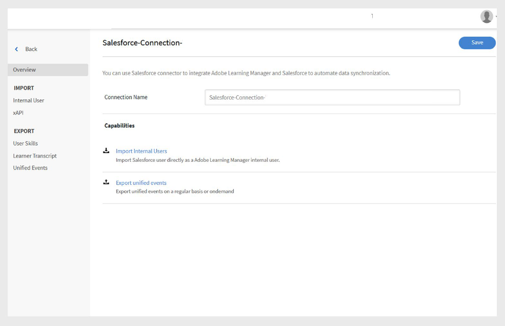
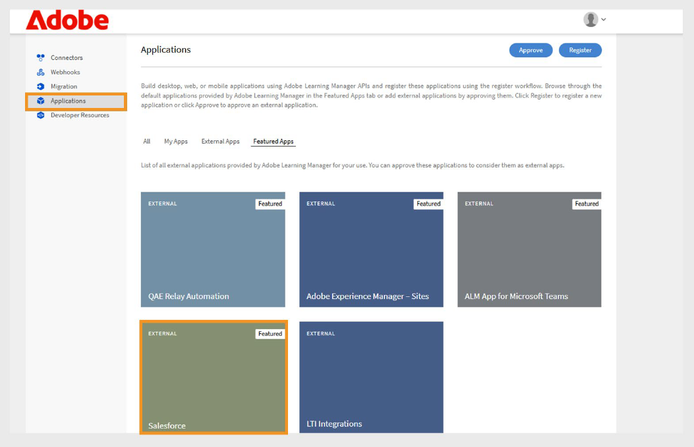

# Salesforce connector for Adobe Learning Manager

## Introduction

The Salesforce connector integrates your Salesforce and Adobe Learning Manager (ALM) accounts, enabling automated user import, data synchronization, and learning record exports. This guide explains how to configure the connector, manage user data, and integrate learning insights within Salesforce. 

The Salesforce connector for Adobe Learning Manager enables smooth integration by automatically importing users, supporting custom data mapping, and exporting learning records to Salesforce. 

By following this guide, you will learn how to:

- Establish secure connections between Salesforce and Adobe Learning Manager. 
- Configure automated user import processes from Salesforce. 
- Map Salesforce fields to Adobe Learning Manager attributes effectively. 
- Export learning records back to Salesforce for comprehensive reporting. 
- Set up filtering and scheduling for targeted data synchronization. 

## What is the Salesforce Connector?

The Salesforce connector is a powerful integration tool that creates a seamless bridge between your Salesforce CRM and Adobe Learning Manager. This connector eliminates manual data entry by automatically synchronizing user information, contact data, and learning records between the two platforms. 

## Key capabilities

### Attribute mapping

It helps create flexible links between Salesforce fields and Adobe Learning Manager user attributes. You can map standard fields like Name, Email, and Manager to corresponding attributes in Learning Manager. The connector also supports custom fields on both platforms, includes required field validation to maintain data accuracy, and allows you to save mapping configurations for reuse in future imports. 

### Automated user import

It streamlines user onboarding and maintenance through automated import processes that eliminate manual CSV file management.

- Direct import from Salesforce user objects without intermediate file formats. 
- Real-time synchronization of user profile changes. 
- Support for both standard users and external contacts. 

### Auto-schedule imports

Configure automated synchronization schedules that maintain data currency without manual intervention. Select from daily, weekly, or custom interval scheduling options.

- Time zone configuration for global organizations. 
- Peak/off-peak scheduling to optimize system performance. 

### User filter

- Apply filtering criteria to target specific user populations and optimize data synchronization efficiency. 
- Role-based filtering for targeted training programs. 
- Geographic or location-based filtering for regional implementations 
- Custom field filtering using Salesforce criteria and formulas. 

## Prerequisites

Before configuring the Salesforce connector, ensure your environment meets these requirements:

- [Salesforce organization URL](https://myorg.salesforce.com)
- Admin login credentials for both Salesforce and Adobe Learning Manager. 
- System Administrator or equivalent permissions in Salesforce. 
- Active Adobe Learning Manager account with appropriate licensing 

## Configure Salesforce connector

The Salesforce Connector in Adobe Learning Manager allows Integration Administrators to automate the synchronization of user data and learning records between Salesforce and Adobe Learning Manager.

To create a Salesforce connector:

1. Log in as an integration admin. 
2. Select **Salesforce** and then select **Connect**.

    
    _Adobe Learning Manager connectors page showing Salesforce connector with Connect button highlighted_

3. Type your Salesforce org URL and select **Connect**. This will take you to the Salesforce login page.

    
    _Salesforce login form displaying username and password input fields_

4. Log in with your username and password. Complete any extra authentication steps, such as twofactor verification or answering security questions. 

    After successful authentication, the connector overview page appears, confirming the established connection between systems.

    
    _Salesforce connector overview page showing successful connection status_

### Map attributes

Understanding Attribute Mapping Attribute mapping creates the essential connection between Salesforce data fields and Adobe Learning Manager user attributes, ensuring that user information transfers accurately between systems. 

#### Mapping Requirements

- All required Adobe Learning Manager fields must be mapped to the corresponding Salesforce fields 
- Mapping configurations are reusable and persistent across multiple imports 

To map the attributes: 

1. Navigate to the Salesforce connector overview page. 
2. Select **Internal Users** and then select **Configure Mapping**. 
3. Select one of the following:

    - **Users:** Standard Salesforce accounts used by employees or internal team members 
    - **Contacts:** External individuals such as customers, partners, or vendors.

4. Match Adobe Learning Manager's active fields with Salesforce columns on the mapping page. The **Manager** field must map to a user manager email field.

    
    _Field mapping interface displaying Adobe Learning Manager user attributes on the left and Salesforce field dropdown selections on the right_

5. Select **Save** to complete the mapping. 

## Import users and contacts

The Salesforce connector allows Adobe Learning Manager to connect with your Salesforce account and automatically import users based on your configuration.

- **Internal Users**: Employees and staff members with Salesforce user accounts. 
- **External Contacts**: Customers, partners, vendors, and other external stakeholders. 
- **Mixed Imports**: Combination of users and contacts in a single synchronization process. 
- **Filtered Imports**: Targeted synchronization based on specific criteria. 

The Salesforce connector allows Adobe Learning Manager to connect with your Salesforce account and automatically import users based on your configuration.

The connector supports importing contacts in addition to standard Salesforce users. This helps extend training programs to external stakeholders, such as clients or partners.

To import contacts:

1. Select **Salesforce** on the **Connectors** page. 
2. Select **Import Internal Users** on the connection page.

    
    _Salesforce connector page with Import Internal Users option highlighted_

3. Select **Contacts** on **Import Users** page. 
4. Select **Yes** for the **Filter Contacts before import** option. **
5. Configure the following options:

    - **Choose Contacts column:** Select the field that you want to import to Adobe Learning Manager. 
    - **Specify values:** Select the values that represent the field selected. 
    - Map the Salesforce attributes with the Adobe Learning Manager fields

    
    _Contact import configuration showing filtering options and field mapping_ 

6. Select **Save**. 
7. If you select **No. Import all Contacts**, you can map the fields directly without filtering the contacts. 

## Export learning records
 
The learning record export functionality enables you to share Adobe Learning Manager data with Salesforce, creating comprehensive reporting and analytics capabilities that combine learning outcomes with CRM data. 

### Custom objects in Salesforce
 
Before you export learning records from Adobe Learning Manager, create custom objects in Salesforce. Custom objects allow you to store data that is specific to your organization or industry needs. For more information, view [Salesforce custom objects](https://trailhead.salesforce.com/en/content/learn/modules/data_modeling/objects_intro). 

### Install Adobe Learning Manager packages
 
Adobe provides pre-built packages that create the necessary custom objects:

- [Package 1](https://test.salesforce.com/packaging/installPackage.apexp?p0=04t1k0000008WPJ): Core learning objects and fields 
- [Package 2](https://test.salesforce.com/packaging/installPackage.apexp?p0=04t1k0000008WPT): Extended learning analytics objects 
- [Package 3](https://test.salesforce.com/packaging/installPackage.apexp?p0=04t1k0000008WPi): Additional reporting and integration objects

>[!IMPORTANT]
>
>Replace [test.salesforce.com](https://acrobat.adobe.com/home/test.salesforce.com) in the package URLs with your actual Salesforce organization domain. 

### Package installation process
 
To install the packages:

1. Log in to Salesforce as an administrator. 
2. Navigate to each package URL in your browser. 
3. Follow the installation wizard for each package and grant appropriate permissions to users who will access learning data. 
4. Rename the names of the custom objects in Salesforce. 
5. Select the events and click **Save**.

>[!NOTE]
>
>Ensure that system administrator access has been granted to all active fields added after the package installation.

### Export records
 
To export the records to Salesforce:

1. Select **Export unified records** in the **Salesforce** connectors page. 
2. Select the events from the following:

    - New User addition 
    - Training Enrollment 
    - Training Completion 
    - Skill Enrollment 
    - Skill Completion 

3. Select **Contact object** in the **Links event with** option. This ensures that users who exist in Adobe Learning Manager but not in Salesforce will be created in Salesforce.

    
    _Learning record export configuration showing event selection and linking options_

>[!NOTE]
>
>You can create multiple connections within a single account. Each connection can support up to three Custom Objects in Salesforce. To create multiple connections for the same Salesforce account, up to three packages can be installed. The number of packages installed should match the number of desired connections.

## Salesforce application setup
 
Adobe Learning Manager provides a Salesforce App package. Once installed and configured in your Salesforce instance, sales users can access and complete training directly within the Salesforce portal. The app allows users to discover new courses, view personalized recommendations, and consume content without leaving Salesforce. 

### Access the Salesforce application
 
To set up the Salesforce application:

1. Log in as an integration admin. 
2. Select **Applications** and then select **Featured Apps**. 
3. Select **Salesforce**.

    
    _Adobe Learning Manager Applications page showing Featured Apps section with Salesforce app tile highlighted_

4. Note the **Application ID** and **Client Secret** shown in the description text box.

    
    _Salesforce application details page in Adobe Learning Manager showing Application ID and Client Secret in the description box_

5. Select **Approve** to enable the application. 

### Generate access tokens
 
To generate access tokens:

1. Navigate to **Developer Resources** in Adobe Learning Manager. 
2. Select **Access Tokens for Testing and Development**.
3. In the **Get OAuth Code** section, type the Client ID (Application ID) and the scope must be set to **admin:read,admin:write**. 
4. Select **Submit**. 
5. In the **Get Refresh Token** section, type the **Client ID** and **Client secret**. 
6. Select **Submit** and note the refresh token and access token. 

>[!IMPORTANT]
>
>Note down the generated refresh token and access token.

### Create a Salesforce account

If you don't have a Salesforce account, follow these steps to create one using the same email address as your Adobe Learning Manager account. You can use either the Developer or Enterprise edition. It's important to sign up using the same email ID associated with your Adobe Learning Manager account.

1. Go to the [Salesforce Developer sign-up page](https://developer.salesforce.com/signup). 
2. Type the required details using the same email address used for your Adobe Learning Manager account. 
3. Check your inbox and verify your account through the email sent by Salesforce. 
4. Set your password and log in to Salesforce. 
5. After logging in, note your Salesforce URL (e.g., https://yourorg.lightning.force.com) for use during configuration.

### Install the Adobe Learning Manager package
 
This section covers installing the Adobe Learning Manager package in your Salesforce environment.

>[!IMPORTANT]
>
>The Adobe Learning Manager app only supports Salesforce Lightning view. Ensure Lightning Experience is enabled before proceeding. 

#### Install the Package
 
To install the package:

1. Open the [Adobe Learning Manager package URL](https://login.salesforce.com/packaging/installPackage.apexp?p0=04t1k0000008WOQ). 
2. Type your username and password in the log in page. 
3. Select **Install**. On the installation page, keep the Install for Admins Only option selected; do not change it. 
4. Select **Done**. You will be guided to the **Installed Packages** page, where you can see the Adobe Learning Manager installed package. 

You'll be redirected to the Installed Packages page, where you can verify the Adobe Learning Manager package installation 

#### Configure the application
 
To configure the application:

1. Select **App Launcher** (9-dot grid icon next to Setup) 
2. Search for Adobe Learning Manager. 
3. To configure the app, select **Configure**. 
4. Select **New** and add the following details:

    - **Config:** Enter a name of your choice. 
    - **ClientID**: Enter the value that you'd obtained from the first section. 
    - **ClientSecret:** Enter the value that you'd obtained from the first section. 
    - **RefreshToken:** Enter the value that you'd obtained from the first section. 
    - **LearningManagerBaseURL:** The URL of the site where Adobe Learning Manager is hosted. 

### Remote site configuration
 
Salesforce requires remote site settings to allow communication with external services like Adobe Learning Manager. 

#### Adding remote site settings
 
To add remote site settings:

1. In Salesforce, select **Setup** in the top-right corner. 
2. Select **Setup** in the top-right corner of the page. 
3. Search for **Remote Site Settings** in **Quick Find**. 
4. Select **New Remote Site**. 
5. Enter the details:

    - **Remote Site Name:** Type a name of your choice (for example, Adobe Learning Manager). 
    - **Remote Site URL:** Type the URL where Adobe Learning Manager is hosted. 
6. Select **Save**. 

### Set up notifications
 
Configure notifications to keep users informed about learning activities and updates. 

#### Creating custom notifications
 
To enable the notifications:

1. Select **Setup** in the upper-right corner. 
2. Search for **Custom Notifications** and then select **New**. 
3. Type the following details:

    - **Custom Notification Name:** LearningManagerNotification 
    - **API Name:** LearningManagerNotification

4. Select both **Desktop** and **Mobile** as supported channels. 
5. Select **Save**. 

#### Enable mobile push notifications (optional)
 
For users who want to receive notifications on mobile devices:

To enable push notifications for mobile devices, follow the steps below:

1. Install the Salesforce mobile app on your mobile phone. 
2. Log in to the app using your credentials. 
3. Go to **Setup** and then select **Notification Delivery Settings**. 
4. Add Salesforce for iOS and Android. 

### User configuration and permissions 

This section covers setting up user access and permissions for the Adobe Learning Manager app within Salesforce. 

#### Understanding user profiles
 
The Adobe Learning Manager app supports various user profiles that correspond to roles in Adobe Learning Manager:

- Administrator 
- Integration Admin 
- Instructor 
- Learner 
- Custom Profiles (as needed) 

#### Assign or create user profiles
 
You can either use existing profiles or create custom profiles for Adobe Learning Manager users: 

**Use existing profiles**

1. Navigate to **Setup** and select **Users**. 
2. Select **Profiles**. 
3. Select a profile that aligns with your users' roles 
4. Assign this profile to users during the package installation.

**Create custom profiles**

1. Navigate to **Setup **and select** Users. **
2. Select **Profiles**.
3. Click **New Profile**.
4. Create a custom profile based on an existing one, tailored to Adobe Learning Manager users. 

#### Configure the profile
 
To configure a profile:

1. After installing the package, select **Configure **and then select** New**. 
2. Type the following details: 

    - **Config Name**
    - **ClientID**
    - **ClientSecret**
    - **LearningManagerBaseURL**
    - **Disable Redirect**

>[!NOTE]
>
>Make sure the Adobe Learning Manager app is enabled for all learners to view it.

#### Set user permissions

Select the users and assign the necessary permissions to access the Adobe Learning Manager app. 

#### Update profile settings

1. Select a profile (e.g., Standard Profile) and then select **Edit**. 
2. In the **Custom App Settings** section, check the box for **Adobe Learning Manager** to make the app accessible. 
3. In the **Custom Tab Settings** section, set **Learner Home** to **Default On**. 
4. Select **Save** to apply the changes.

Learners with the assigned profiles can now access the Adobe Learning Manager app in Salesforce.

You have successfully configured the Salesforce connector for Adobe Learning Manager. Users can now access their learning content directly within Salesforce, improving adoption and engagement with your organization's training programs. 
