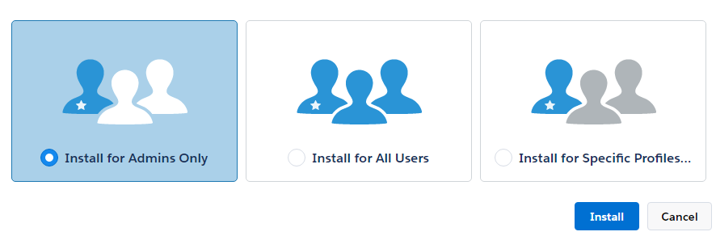

# Captivate Prime App for Salesforce

## Overview {#overview}

Salesforce&trade; is one of the most popular CRM solutions among sales and marketing teams. Using Adobe Captivate Prime app in Salesforce you can allow its users to access all of their learning content right from their Salesforce interface. Users can access their assigned learning content such as courses, learning programs, job aids, and so on from within the Salesforce. Users can also receive notifications about their enrollments and announcements from the Administrator. 

At the moment, Salesforce app is not available as the approval is pending from Salesforce App Exchange. If you are interested to take a preview of beta version of the app, contact your Account Manager or [Captivate Prime support](../../../../in/contact/enterprise-support.other.md#captivate-prime) team. 

## Installation and setup {#installationandsetup}

Learn to install and set up the Captivate Prime app for Salesforce by following the steps below. 

### Pre-requisites {#prerequisites}

1. Integration Administrator of your organization has to approve the salesforce app. This app can be found in the featured applications section of Captivate Prime application for Integration Admin role. 
1. Access to the Salesforce account of your organization, where the app needs to be installed. Typically, the Salesforce Administrator in your organization is the person who installs such apps. If you are a Captivate Prime integration administrator and do not have Salesforce account, contact Salesforce Administrator of your organization. 

### Installation steps {#installationsteps}

1. Request your Account Manager or Customer Success Manager to enable your account for usage of this app by providing your Prime account id. Also, request the CSM for the installable package of the Captivate Prime Learner app for Salesforce.  

1. Log in to your Captivate Prime account as the Integration Administrator and make sure that the Salesforce app is enabled for your account.  

1. To install the Prime app in your Salesforce account, use the installable package provided by your Account Manager or Customer Success Manager. You need to have admin privileges for Salesforce account where you intend to install this app.  

1. Choose the appropriate option for you as shown in the snapshot and click **Install**. 

   

   If you opt for **Install for Specific Profiles**, choose one or more profiles from the list. 

1. Click **Continue** on the pop-up that appears to confirm the third-party access. 

   A message appears confirming that the app has been installed successfully. Click **done.**

## Add notification component to the Home page {#addnotificationcomponenttothehomepage}

Captivate Prime team recommends that the Salesforce Administrator also add the Captivate Prime notifications component to the home page layout. This component enables Salesforce users to get notifications about assignments and other announcements from Captivate Prime, even when they are not within the context of the Learner App.

To add the Captivate Prime notification component to the Home page layout, follow the steps: 

1. Click **Setup** on the upper-right corner. Home page layouts option appears on the left pane as shown in the below snapshot. 

   

1. Choose the layout of your choice and click **Edit**. 
1. Select the Adobe Captivate Prime notifications option that appears on the page and Click **Next**. 
1. Choose the order of the components that appear on the left pane, preview, and click **Save**. 

To learn the instructions on how to log in to Captivate Prime app and use it in Salesforce as a learner, refer to the [Salesforce app Help content](../../learners/feature-summary/sfdc-app.md). 
