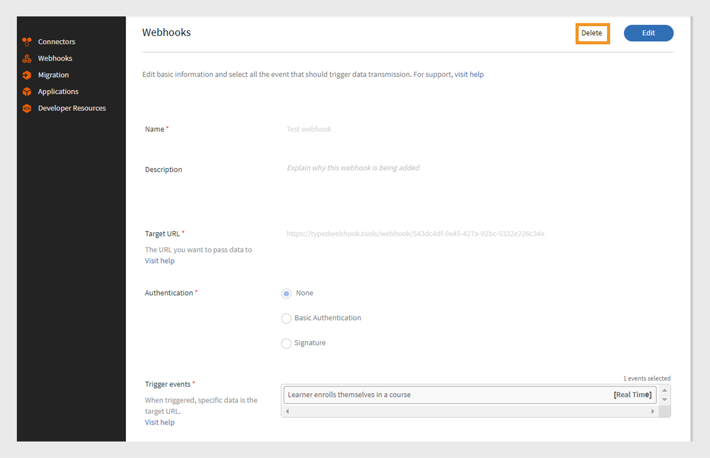

# Webhooks

A webhook allows one entity to automatically send real-time data or notifications to another entity when a specific event occurs. It will enable an application to provide other applications with information without constantly requesting it. For example, if a user completes a Learning Management System (LMS) course, a webhook can automatically send that information to another platform, such as a CRM or reporting tool. Webhooks are often used in integrations to automate processes and reduce the need for manual updates between systems. Set up webhooks by providing a callback URL to which you'd send the data.

## Webhooks vs APIs

Webhooks and APIs both help systems communicate with each other, but they work in different ways. With APIs, the information is shared only when the user requests it. For example, if a learner requires course progress data, they send a request to the API, which then provides the information. On the other hand, Webhooks automatically send data immediately when an event happens. For example, if a learner completes a course, it will send the data immediately to the listener URL without any manual requests.

## What are real-time APIs? 

Real-time APIs allow applications to instantly exchange data when an event happens. Unlike traditional APIs, which wait for a user to request information, real-time APIs share data the moment it happens. Webhooks act as a real-time API and help share the data immediately whenever the specified event occurs. The real-time API ensures that this data transfer happens immediately without needing any manual request, which allows systems to stay updated instantly.

## Webhook events

Webhook events are specific actions happening in a system that automatically sends data to a listener URL. For example, when a learner enrolls in a course, a webhook event is triggered and sends the enrollment details to the listener URL.
Webhook events are classified into two categories:

* **Real-time events**: Events are processed and sent in real-time to a target URL
* **Non real-time events**: Events are processed in batches and sent at specified times instead of in real-time

## Listener URL

A Listener URL is an endpoint or destination that receives data information when an event occurs. Whenever a specific event happens, such as a user enrolling in a course, the system automatically sends the details to this URL without any manual request. The listener URL is the address where all these updates are delivered.
Webhook sends the relevant information in a JSON format. Here's a sample payload for an event triggered in Adobe Learning Manager:

```
{
  "accountId": 1010,
  "events": [
    {
      "eventId": "d5fb7071-10a9-46b2-9f9e-79dde346c052",
      "eventName": "COURSE_ENROLLMENT_BATCH",
      "timestamp": 1727414643000,
      "eventInfo": "1727414643000-047210-84242-0",
      "data": {
        "userId": 4279332,
        "loId": "course:7374992",
        "loInstanceId": "course:7376092_10250977",
        "loType": "course",
        "enrollmentSource": "ADMIN_ENROLL",
        "dateEnrolled": 1727414643
      }
    }
  ]
}
```

## Create and manage Webhooks – Integration Admin

Follow the below steps to create Webhooks integration in Adobe Learning Manager: 

1. Log in as an **[!UICONTROL Integration Admin]**. 
2. On the homepage, select **[!UICONTROL Webhooks]** > **[!UICONTROL Add Webhook]**. 

   
   _Add a webhook_

3. Type the **[!UICONTROL Name]** and **[!UICONTROL Description]** of the Webhook. 
4. Type the listener URL as a **[!UICONTROL Target URL]** where you want to pass the event data. 
5. Select any one of the authentication methods: 
   Authentication in Webhooks is a security method to make sure that the data sent to a listener URL comes from a trusted source.
    * **[!UICONTROL None]**: No authentication required. 
    * **[!UICONTROL Basic]**: This is credential-based authentication. Enter the username and password. 
    * **[!UICONTROL Signature]**: The system creates a special signature and adds it to the webhook data. The receiving server checks this code to make sure the data is real and hasn't been changed. Generate a signature and use it for authentication. Download the signature as JSON.
6. Select the Webhook events from the **[!UICONTROL Trigger events]** dropdown. 

   >[!NOTE]
   >
   >You can also test the webhooks by selecting the Test Webhooks option from the Add Webhook page. 

7. Select the **[!UICONTROL Activation Status]** toggle to enable the webhook. Once enabled, data will be passed whenever the selected events occur.

>[!NOTE]
>
>You can create and manage up to 5 Webhooks.

### Edit Webhooks – Integration Admin

Follow these steps to edit Webhooks from Adobe Learning Manager:

1. Log in as an **[!UICONTROL Integration Admin.]**
2. Select **[!UICONTROL Webhooks]** on the homepage.
3. Select the webhook you want to edit.

   
   _Edit the webhook_
4. Select **[!UICONTROL Edit]** to modify the webhook's details and select **[!UICONTROL Save]**.

### Remove Webhooks – Integration Admin

Follow these steps to edit Webhooks from Adobe Learning Manager:

1. Log in as an **[!UICONTROL Integration Admin]**.
2. Select **[!UICONTROL Webhooks]** on the homepage.
3. Select the webhook you want to delete.
4. Select **[!UICONTROL Delete]** to remove the webhooks.

 
_Remove the webhook_

### Retire Webhooks – Integration Admin

Follow these steps to retire the webhooks:

1. Log in as an **[!UICONTROL Integration Admin]**.
2. Select **[!UICONTROL Webhooks]** on the homepage.
3. Select the webhook you want to edit.
4. Select **[!UICONTROL Edit]** and disable the **[!UICONTROL Activation Status]** to retire the webhook.
 
 
_Retire the webhook_
