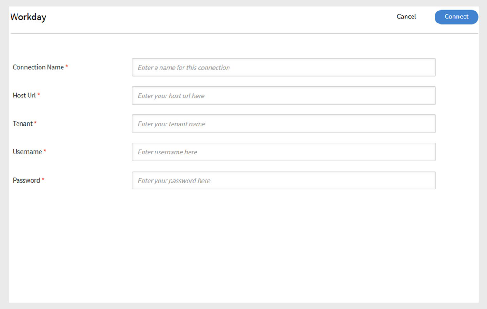
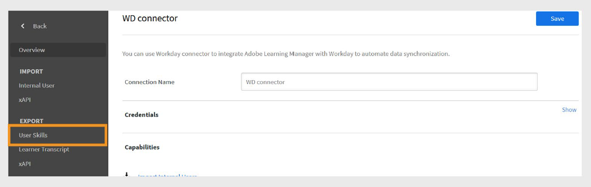

# Workday connector in Adobe Learning Manager

## Introduction

**Workday** is a cloud-based system that helps organizations manage employees and financial data. It's mainly used for HR tasks like hiring, payroll, and performance tracking. When connected with Adobe Learning Manager, it allows automatic syncing of user and skill data between the two platforms.

The Workday Connector allows you to seamlessly integrate Adobe Learning Manager with your organization's Workday tenant. This integration enables automatic synchronization of user data and skills between the two systems, improving data accuracy and reducing manual effort.

## Key benefits

- Import users from Workday to Adobe Learning Manager.
- Map attributes between Workday and Adobe Learning Manager.
- Export user skills from Adobe Learning Manager to Workday.
- Schedule data sync tasks to run automatically.

## Prerequisites

Before configuring the Workday connector, obtain the following details from your Workday administrator:

- Host URL
- Tenant ID
- Username
- Password

## Configure the Workday connector

You can configure the Workday connector in Adobe Learning Manager to allow you to import user data from Workday, export user skills back to Workday, and schedule automated syncs to keep both systems up to date.

To configure Workday connector:

1. Log in to Adobe Learning Manager as an integration administrator.
2. Hover over the **Workday** tile and select **Connect**.

   
   _Configure Workday connector to import and export the data_

3. Type the following connection details:
   - **Connection name**: A name of your choice for the connection.
   - **Host Url**: Provided by your Workday Admin.
   - **Tenant**: Internal identifier from your Workday Admin.
   - **Username and Password**: The Workday admin creates an integrated system user (ISU) with the required security privileges and shares it with the integration admin.

   
   _Add the necessary details to configure Workday connector_

4. Select **Connect** to complete the setup.

>[!NOTE]
>
>You can set up multiple Workday connections in your account.

## Import users from Workday

### Map attributes

You can use the Workday connector to import active users from your Workday tenant into Adobe Learning Manager. This integration streamlines user management by keeping employee records in sync. In addition to Workday, Adobe Learning Manager also supports user imports from other data sources such as FTP and Salesforce.

Before importing users, you must map user attributes between Workday and Learning Manager.

1. Navigate to the **Overview** page in the Workday Connector.
2. Select **Internal Users** under the **Import** section.

   
   _Select Internal Users to map the user attributes_

3. Use the **Map Attributes** option to link fields between the two systems:
   - In the **Adobe Learning Manager** column, select the corresponding Adobe Learning Manager attribute.
   - In the **Workday** column, use the drop-down menu to select the matching Workday attribute.

   
   _Mapping the Workday attributes with Adobe Learning Manager fields_

   >[!NOTE]
   >
   >Adobe Learning Manager currently supports importing up to **69 user attributes** from Workday. You can enable additional fields using the **Active Fields** feature in Adobe Learning Manager. To add custom Workday attributes, contact your Customer Success Account Manager (CSAM).

4. Select the **Exclude Contingent Workers** checkbox to avoid importing temporary workers.
5. Apply filters if needed, for example, to import users under specific managers.

>[!IMPORTANT]
>
>Ensure that UUID, email address, and employee name are unique. Incorrect or duplicate values may cause integration failures.

## Supported Workday attributes

List of supported Workday attributes:

```
wd:User_ID wd:Worker_ID manager wd:Personal_Data.wd:Name_Data.wd:Preferred_Name_Data.wd:Name_Detail_Data.@wd:Formatted_Name wd:Personal_Data.wd:Name_Data.wd:Legal_Name_Data.wd:Name_Detail_Data.@wd:Formatted_Name wd:Personal_Data.wd:Name_Data.wd:Legal_Name_Data.wd:Name_Detail_Data.wd:Prefix_Data.wd:Title_Descriptor wd:Personal_Data.wd:Name_Data.wd:Preferred_Name_Data.wd:Name_Detail_Data.wd:Prefix_Data.wd:Title_Descriptor wd:Personal_Data.wd:Name_Data.wd:Preferred_Name_Data.wd:Name_Detail_Data.wd:First_Name wd:Personal_Data.wd:Name_Data.wd:Preferred_Name_Data.wd:Name_Detail_Data.wd:Last_Name wd:Personal_Data.wd:Name_Data.wd:Legal_Name_Data.wd:Name_Detail_Data.wd:First_Name wd:Personal_Data.wd:Name_Data.wd:Legal_Name_Data.wd:Name_Detail_Data.wd:Last_Name wd:Personal_Data.wd:Contact_Data.wd:Address_Data.0.@wd:Formatted_Address wd:Personal_Data.wd:Contact_Data.wd:Address_Data.0.wd:Postal_Code wd:Personal_Data.wd:Contact_Data.wd:Email_Address_Data.0.wd:Email_Address wd:Personal_Data.wd:Contact_Data.wd:Address_Data.0.wd:Country_Region_Descriptor wd:Personal_Data.wd:Contact_Data.wd:Phone_Data.0.@wd:Formatted_Phone wd:Personal_Data.wd:Contact_Data.wd:Phone_Data.0.wd:Country_ISO_Code wd:Personal_Data.wd:Contact_Data.wd:Phone_Data.0.wd:International_Phone_Code wd:Personal_Data.wd:Contact_Data.wd:Phone_Data.0.wd:Phone_Number wd:Personal_Data.wd:Primary_Nationality_Reference.wd:ID.1.$ wd:Personal_Data.wd:Gender_Reference.wd:ID.1.$ wd:Personal_Data.wd:Identification_Data.wd:National_ID.0.wd:National_ID_Data.wd:ID wd:Personal_Data.wd:Identification_Data.wd:Custom_ID.0.wd:Custom_ID_Data.wd:ID wd:User_Account_Data.wd:Default_Display_Language_Reference.wd:ID.1.$ wd:Role_Data.wd:Organization_Role_Data.wd:Organization_Role.0.wd:Organization_Role_Reference.wd:ID.1.$ wd:Employment_Data.wd:Worker_Job_Data.0.wd:Position_Data.wd:Position_Title wd:Employment_Data.wd:Worker_Job_Data.0.wd:Position_Data.wd:Business_Title wd:Employment_Data.wd:Worker_Job_Data.0.wd:Position_Data.wd:Business_Site_Summary_Data.wd:Name wd:Employment_Data.wd:Worker_Job_Data.0.wd:Position_Data.wd:Business_Site_Summary_Data.wd:Address_Data.@wd:Formatted_Address
wd:Employment_Data.wd:Worker_Job_Data.0.wd:Position_Data.wd:Job_Classification_Summary_Data.0.wd:Job_Classification_Reference.wd:ID.1.$ wd:Employment_Data.wd:Worker_Job_Data.0.wd:Position_Data.wd:Job_Classification_Summary_Data.0.wd:Job_Group_Reference.wd:ID.1.$ wd:Employment_Data.wd:Worker_Job_Data.0.wd:Position_Data.wd:Work_Space__Reference.wd:ID.1.$ wd:Employment_Data.wd:Worker_Job_Data.0.wd:Position_Data.wd:Job_Profile_Summary_Data.wd:Job_Family_Reference.0.wd:ID.1.$ wd:Employment_Data.wd:Worker_Job_Data.0.wd:Position_Data.wd:Job_Profile_Summary_Data.wd:Job_Profile_Name wd:Employment_Data.wd:Worker_Job_Data.0.wd:Position_Data.wd:Job_Profile_Summary_Data.wd:Job_Profile_Reference.wd:ID.1.$ wd:Employment_Data.wd:Worker_Job_Data.0.wd:Position_Data.wd:Business_Site_Summary_Data.wd:Address_Data.0.wd:Country_Reference.wd:ID.2.$ wd:Employment_Data.wd:Worker_Job_Data.0.wd:Position_Data.wd:Worker_Type_Reference.wd:ID.1.$ wd:Employment_Data.wd:Worker_Job_Data.0.wd:Position_Data.wd:Business_Site_Summary_Data.wd:Address_Data.0.@wd:Formatted_Address wd:Employment_Data.wd:Worker_Job_Data.0.wd:Position_Data.wd:Job_Profile_Summary_Data.wd:Management_Level_Reference.wd:ID.1.$ wd:Employment_Data.wd:Worker_Status_Data.wd:Active wd:Employment_Data.wd:Worker_Status_Data.wd:Active_Status_Date wd:Employment_Data.wd:Worker_Status_Data.wd:Hire_Date wd:Employment_Data.wd:Worker_Status_Data.wd:Original_Hire_Date wd:Employment_Data.wd:Worker_Status_Data.wd:Retired wd:Employment_Data.wd:Worker_Status_Data.wd:Retirement_Date wd:Employment_Data.wd:Worker_Status_Data.wd:Terminated wd:Employment_Data.wd:Worker_Status_Data.wd:Termination_Date wd:Employment_Data.wd:Worker_Status_Data.wd:Termination_Last_Day_of_Work wd:Organization_Data.wd:Worker_Organization_Data.0.wd:Organization_Data.wd:Organization_Code wd:Organization_Data.wd:Worker_Organization_Data.0.wd:Organization_Data.wd:Organization_Name wd:Organization_Data.wd:Worker_Organization_Data.0.wd:Organization_Data.wd:Organization_Type_Reference.wd:ID.1.$ wd:Organization_Data.wd:Worker_Organization_Data.0.wd:Organization_Data.wd:Organization_Subtype_Reference.wd:ID.1.$ wd:Qualification_Data.wd:Education.0.wd:School_Name wd:Qualification_Data.wd:External_Job_History.0.wd:Job_History_Data.wd:Job_Title wd:Qualification_Data.wd:External_Job_History.0.wd:Job_History_Data.wd:Company wd:Management_Chain_Data.wd:Worker_Supervisory_Management_Chain_Data.wd:Management_Chain_Data.0.wd:Manager.Employee_ID Primary Work Email wd:Organization_Type_Reference_Cost_Center_ID wd:Organization_Type_Reference_Cost_Center_Name wd:Organization_Type_Reference_Company wd:Organization_Subtype_Reference_Department
wd:Organization_Subtype_Reference_Division wd:Universal_ID wd:Employment_Data.wd:Worker_Job_Data.0.wd:Position_Data.wd:Business_Site_Summary_Data.wd:Address_Data.0.wd:Country_Region_Descriptor wd:Employment_Data.wd:Worker_Job_Data.0.wd:Position_Data.wd:Business_Site_Summary_Data.wd:Address_Data.0.wd:Country_Region_Reference.wd:ID.2.$ wd:Personal_Data.wd:Contact_Data.wd:Address_Data.0.wd:Municipality
```

## Export user skills to Workday

You can export all active user skills from Adobe Learning Manager to Workday. Retired skills are not exported.

>[!IMPORTANT]
>
>- Do not attempt to export skills from multiple Adobe Learning Manager accounts to the same Workday account simultaneously.
>- If multiple Adobe Learning Manager accounts use the same Workday account, ensure skill names are consistent across accounts to avoid conflicts.

### Configure a scheduled export

To configure the scheduled exports:

1. Select **User Skills** and then select **Configure Schedule** in the **Workday Overview** page.

   
   _Select User Skills to schedule the export_

2. Select the **Enable user-skill export using this connection** checkbox.
3. Select **Enable schedule**.
4. Set the start date, time, and recurrence interval.

   
   _Configure the schedule export in the Workday connector_

5. Select **Save** to apply the schedule.

### On demand export

To create on-demand exports:

1. Select **On Demand** in the **Workday Overview** page.
2. Type the start date from which the report should begin.
3. Select **Execute** to run the report.

### View execution status

1. Go to **Execution Status**.
2. View the status of all tasks and download error reports as needed.

## Scheduling sync tasks

You can configure the connector to run data sync tasks automatically:

- Schedule daily user imports from Workday to Learning Manager.
- Schedule periodic exports of user skills to Workday.

>[!NOTE]
>
>Scheduling ensures that user records and skill data are always up to date in both systems.

## Points to Remember

- The UUID field populated from Workday cannot be deleted by client-facing LMS Admins.
- The **User Purge** function only supports up to 50 users per run. Be cautious when importing users with UUIDs.
- Skills are mapped at the skill item level in Workday, using the skill name and level from Adobe Learning Manager.
