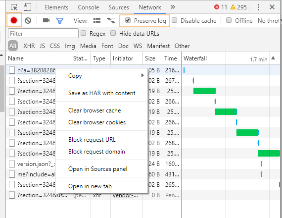

# Generate a HAR file {#generate-a-har-file}

Read on to know how to generate HAR files on Google Chrome.

To generate a HAR file, follow these steps:

1. Open a Google Chrome window and open a new tab.
1. Open developer tools for the page, right-click > Inspect.
1. Open the **[!UICONTROL Network]** tab. Ensure that the red record button is active. Enable the **[!UICONTROL Preserve Log]** checkbox.

   

1. Login to [Learning Manager](https://captivateprime.adobe.com/acapindex.html) using your credentials and take the course. Do all the operations which will result in the issue.
1. In developer tools, right click and select **Save All as HAR with Content.**

   In some versions of Google Chrome, you might have to select **[!UICONTROL Copy > Copy all as HAR.]**

   

1. Paste the copied content in a notepad file. Save it to Desktop as **logs.har** and email it to Adobe.

