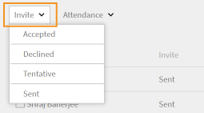
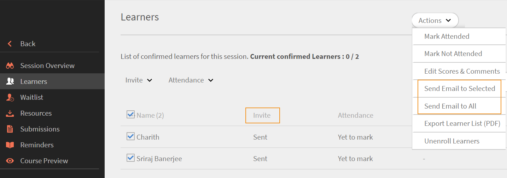

# View learner's response to an outlook calendar invite on Learning Manager {#view-learners-response-to-an-outlook-calendar-invite-on-learning-manager}

Learn how an admin and an instructor can view a learner's response to a calendar invite.

In Learning Manager, when a learner is enrolled to a Virtual Class/Class Room session in a course, the learner gets a detailed outlook calendar invite. 

A learner's response to the session invite is recorded in Learning Manager and the admin and the instructor can view the details. 

If a learner responds to the same invite more than once, then the latest response is considered and overwrites the previous one. If the session timings are changed, all invite responses are cleared, and learners need to respond to the request once again.

## Enabling the invite-reply-tracking feature {#enablingtheinvitereplytrackingfeature}

* Contact Adobe Prime Support to enable the invite-reply-tracking feature. 
* Once the feature is enabled for the account, all future Virtual Class/Class Room sessions created by an author can record the learner's response to the calendar invite.

If learners are enrolled to a Virtual Class/Class Room session created before the invite-reply-tracking feature being enabled, then learner's responses to the calendar invite are not recorded.

## Viewing invite responses as an admin {#viewinginviteresponsesasanadmin}

If a Virtual Class/Class Room session has the invite-reply-tracking feature enabled, then the admin can view the learner's responses to the invite along with other permissions as follows:

1. Click **Course** from the left navigation panel and view the course that was created after the enablement of the invite-reply-tracking feature.
1. Click **Attendance & Scoring** from the left navigation panel.
1. To display a table below with names of learners and their responses to the calendar invite, select the **Instance** and **Module** on the Attendance & Scoring page.
1. Use the **Invite** filter to view learners based on the following options: all responses, accepted, declined, tentative, and sent

   

1. To send emails to only learners who are selected, click **Actions** > **Send Email to Selected** from upper-right corner of the Attendance & Scoring page. 

   To send emails to all learners displayed in the Attendance & Scoring page, click **Actions** > **Send Email to All.**

1. To download a csv report of the learner's session details that is displayed in the attendance & scoring page, click **Actions** > **Export.**

## Viewing invite responses as an instructor {#viewinginviteresponsesasaninstructor}

If the invite-reply-tracking feature is enabled for the account, then follow the below procedure to view the learner's responses to the calendar invite:

1. Click **Upcoming Sessions** from the left navigation panel and select a course.
1. Click **Learners** from the left navigation panel to get a detailed view of the learners who have responded to the calendar invite.
1. Use the **Invite** filter to filter the names of learners according to the following options: Accepted, Declined, Tentative, and Sent

   

1. Based on the displayed learner's information you can send emails to the learners.

   To send emails to only learners who have been selected, click **Actions** > **Email to Selected**.

   To send emails to all learners in the displayed table, click **Actions** > **Email to All**.

   

