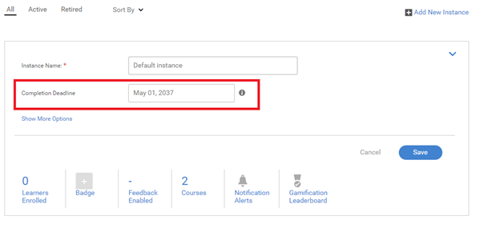

# Issues with retiring a Learning Program

## Issue

A Learning Program automatically gets retired.

## Cause

There are situations where a Learning Program has retired without an Administrator/Author retiring the LP explicitly.

This issue occurs because a Learning Program is a collection of courses. The higher order trainings retire, if any of the courses within it contains a retired instance or the course instance retires.

## Resolution

To check the course that contains a retired instance, follow the steps below:

1. Log in as an administrator and launch the relevant Learning Program.  

1. Click **[!UICONTROL Instances]** > **C[!UICONTROL ]ourses**. The page lists all the courses that are a part of this Learning Program. You will be able to see the course that contains a retired instance. 

   

   *View list of all courses*

1. Once you have figured out the course instance that has retired, click **[!UICONTROL Courses]** > **[!UICONTROL Open the course]**.   

1. Click **[!UICONTROL Instances]**. On the retired instance, click **[!UICONTROL Edit]** and then edit the completion date to a future date to which you want the instance to retire. 

   

   *Edit the completion date of a course*

1. Once completed, click the drop-down as shown in the image below. Then click **[!UICONTROL Reopen Instance]**.

   

   *Repoen the instance of a course*

1. Visit the relevant Learning Program. Click **[!UICONTROL Instances]** and execute the previous step to reopen the instance of the Learning Program.
