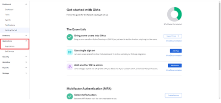

# Okta Active Directory integration with Adobe Learning Manager {#okta-active-directory-integration-with-adobe-learning-manager}

In this document, you will learn how to integrate Adobe Learning Manager with Okta Active Directory (AD). When you integrate Adobe Learning Manager with Okta AD, you can:

* Check and control Learning Manager user's access in Okta AD.
* Enable users to be automatically signed in to Adobe Learning Manager with their Okta AD accounts. 
* Manage your accounts in one central location - the Okta portal.

Adobe Learning Manager supports Identity Provider (IdP) and Service Provider (SP) initiated SSO.

## Create an application in OKTA

1. Log in as an Administrator on Okta AD.
1. Click **Applications**. This opens the Application Store in Okta.

   

1. Click **Create App Integration.**   

   

1. Select **SAML 2.0.**  from the new app integration window. 

   

1. Choose **Create SAML integration** > **General settings page**. Enter an Application Name.

   Note that this can be any name to uniquely identify your application. Once done, click **Next**.

   

1. Perform the following steps on the Configure SAML settings page:

   **For IDP setup:**

   1. In the Single Sign-on URL field, type the URL: [https://learningmanager.adobe.com/saml/SSO](https://learningmanager.adobe.com/saml/SSO)
   1. In the Audience URL field, type the URL: [https://learningmanager.adobe.com](https://learningmanager.adobe.com/)
   1. In the **Name ID Format** drop-down box, select **Email Address**. 
   1. In the **Application username** drop-down, select Okta username.
   1. In case you want to pass any additional attributes, you can add the attributes under the **Attributes Statement** (Optional)

   

   **For SP setup:**

   1. In the Single Sign-on URL field, type the URL: [https://learningmanager.adobe.com/saml/SSO](https://learningmanager.adobe.com/saml/SSO)
   1. In the Audience URL field, type the URL: [https://learningmanager.adobe.com](https://learningmanager.adobe.com/)
   1. In the Name ID Format drop-down box, select **Email Address**.
   1. In the Application, username drop-down select Okta username.
   1. Click on **Show Advanced Settings**.
   1. Under **Signature Algorithm**, select RSA-SHA256
   1. In the **Assertion Algorithm**, select SHA256
   1. In the **Assertion Encryption** dropbox, select **Encrypted**.
   
   1. In the **Encryption Certificate** option, upload the Certificate file shared by Adobe.
   1. In case you want to pass any additional attributes, you can add the attributes under the **Attributes Statement** (Optional).

   

   Once done, click **Next**.

1. The **Feedback**  tab is optional. Once you have selected the options and given your feedback, click **Finish**.

   

## Extract IDP initiated URL and Metadata file

To view the IdP/SP initiated URL and Metadata file, perform the below steps:

1. Open the application that you have created.
1. Under the **Single Sign-On** tab, click **View Instructions.**

   

   **For IDP:** 

   1. The Identity Provider Single Sign-On URL is the IdP initiated URL.
   1. Copy all the text that is present under the **Optional **field. 
   1. Open a new notepad document and paste the copied text. 
   1. Click **File** > **Save as** > "filename.xml". This will be the metadata file.

   **For SP:**

   1. The Identity Provider Single Sign-On URL is the IdP initiated URL.
   1. The Identity Provider Issuer is the Entity ID.
   1. Copy all the text that is present under the **Optional** field. 
   1. Open a new notepad document and paste the copied text. 
   1. Click **File** > **Save as** > "filename**.xml**". This will be the metadata file.

   

   You need to save this file in an XML format.

## Configuring Adobe Learning Manager SSO

To configure Adobe Learning Manager SSO, perform the steps mentioned in the below article.

<!--

article not in TOC

[SSO Authentication](/help/migrated/kb/sso-authentication-for-learning-manager.md)
-->