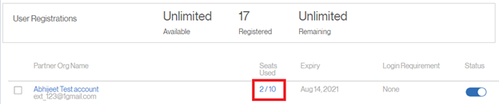
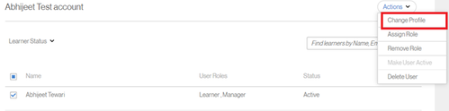
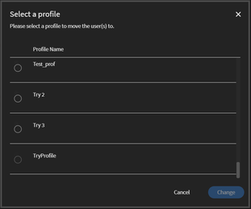
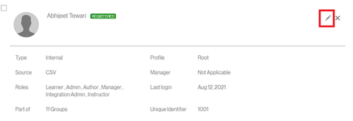

# Unable to register as an External User {#unable-to-register-as-an-external-user}

## Issue

External learners are unable to register to a profile.

## Error

Email id is already registered. Please use a different email.

## Description

There are scenarios where a user is unable to register to an External Profile. The user receives the above error while signing up.

## Cause

This issue occurs under one of the below scenarios:

* The user is already registered to another external profile.
* The user is already an internal learner.
* The user is in a deleted state.

## Resolution:

**Scenario 1:**&nbsp;The user is already registered to another External Profile.

1. Log in as an Administrator.
1. Under **Manage**, click **Users **> **External**.
1. Open the Profile which the user is already a part of by clicking the Seats Used

   

1. Select the User, click **Actions **> **Change Profile.**

   

   This opens a window to select a new profile as below.

   

1. Once selected, click **Change**.

**Scenario 2:**&nbsp;The user is present as an Internal Learner.

1. Log in as an Administrator.
1. Under **Manage**, click **Users **> **Internal**.
1. Click to open a Learner profile and click the Edit icon.

   

1. Change the email address of the Learner or add *_old*&nbsp;to the existing email address.&nbsp;This will free up the email address.

   For example, If the email address of the Learner is *abc@adobe.com,*&nbsp;change it to *abc_old@adobe.com&nbsp;*

1. Click **Save **to retain the changes made.

**Scenario 3**: The user is in a deleted state.

1. Log in as an Administrator.
1. Under **Manage**, click **Users **> **User Cleanup**.
1. Select the Learner and click the Edit icon.

   

1. Change the email address of the Learner or add&nbsp;*_old*&nbsp;to the existing email address.&nbsp;This will free up the email address.

   For example, If the email address of the Learner is&nbsp;*abc@adobe.com,*&nbsp;change it to&nbsp;*abc_old@adobe.com&nbsp;*

