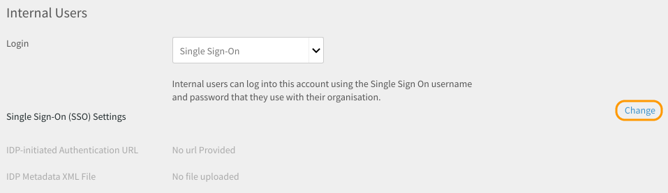

# Log in to Learning Manager using SSO authentication {#log-in-to-learning-manager-using-sso-authentication}

This document helps you configure SSO authentication to log in to your Learning Manager account.

To configure SSO authentication, perform the following steps:

1. Open **[!UICONTROL Settings]** > **[!UICONTROL Login Methods.]**

   

1. Choose **[!UICONTROL Internal Users]** or **[!UICONTROL External Users]** depending on your requirement.
1. Click the drop-down next to  **[!UICONTROL login]** option and select **[!UICONTROL Single Sign-On]**.

   

1. To adjust Single Sign-On (SSO) Settings, click  **[!UICONTROL Change.]**

   

1. Enter  **[!UICONTROL IDP-initiated Authentication URL]** given by your service provider and upload your XML file by clicking **[!UICONTROL IDP Metadata XML File.]**

   

   The SSO you configure in Learning Manager should be SAML 2.0 supported.

   You can now log in to Learning Manager using your SSO authentication.

