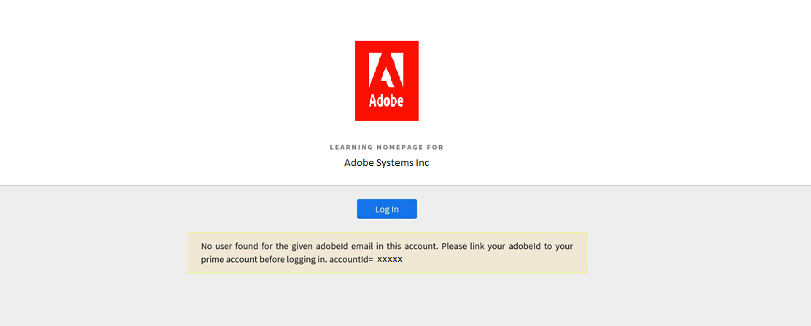

# Unable to log in to Learning Manager

## Issue

When trying to log in to Adobe Learning Manager, you see the error below:

*No user found for the given adobeid email in this account. Please link your adobe id to your Learning Manager account before logging in.*

## Cause

Browser cache and cookies may prevent you from accessing the Adobe Learning Manager platform.

## Resolution

## Clean the browsing history/cache

The links below are browser-specific guides to clean the cache:

* [Google Chrome](https://support.google.com/accounts/answer/32050?co=GENIE.Platform%3DDesktop&hl=en)
* [Internet Explorer](https://kb.wisc.edu/page.php?id=1514)
* [Microsoft Edge](https://www.bitdefender.com/support/how-to-clear-the-cache-and-cookies%C2%A0in-microsoft-edge-1914.html)
* [Firefox](https://kb.iu.edu/d/ahic)
* [Safari](https://oit.colorado.edu/tutorial/clear-web-browser-cache-safari-6)

## Use incognito mode

Use incognito mode in your browser and then sign in to Adobe Learning Manager. See [instructions](https://support.google.com/chrome/answer/95464?co=GENIE.Platform%3DDesktop&hl=en&oco=0).

## Contact Administrator

If you are still unable to log in, contact the Administrator of the account. The Administrator can verify whether you are a registered learner in the account.

If you are a part of the account and still unable to log in, the Administrator must verify if your Adobe ID is the same with which you are trying to log in. 

Sometimes the Adobe ID is different that the Adobe Learning Manager ID on the account.

## What's next

After performing the above steps, if you are still unable to log in, the Administrator can collect the HAR logs for the login. For more information, see [Generate a HAR file](/help/migrated/kb/generate-har-file.md).

Also, contact the Adobe Learning Manager support team so that we can debug the issue further.
