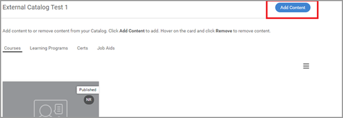

# Unable to search a course in Captivate Prime

Captivate Prime Learning Programs are renamed to Learning Paths. This change happens immediately after the October 2021 release and the terminology of Learning Path is reflected for all roles.

## **Issue**

A learner is unable to search a course in Captivate Prime.

## **Scenario 1:**  `Enrollment is through a higher Learning Object.`

## **Summary**

There are scenarios, where, a learner searches a course and the course is not listed. But if the learner has enrolled for a Learning Program/Certification, then the learner is able to view the course inside the Learning Object.

## **Why does this happen?**

In Captivate Prime, when a learner is enrolled through a Learning Program/Certification, the enrollment for that course is through the Learning Program/Certification.

Therefore, the learner is not able to search for the stand-alone Courses under **My Learning**.

However, the learner cannot view the courses inside the Learning Program/Certification.

## **Scenario 2:**  `Learner does not have access to the Catalog that contains the Course.`

## **Summary**

A learner is unable to search courses in the Catalog or the Learning Dashboard.

## **Why does this happen?**

This issue occurs if:

* The learner is not a part of the Catalog that contains the course **OR**
* The course is not a part of the Catalog that the Learner has access to.

## **Resolution**

1. Log in as administrator.   

1. Click **Catalog **and browse to the catalog that contains the course. 
1. Click **Share Internally** or **Content **(depending upon the scenario mentioned above).

   

1. Review the scenarios below:

   ## A. Learner is not part of the catalog

   To share the catalog, click **Add**, and add the user group that the user is a part of. Click **Save**.

   

   ## **Course is not a part of the Catalog**

   In the Content section, click **Add Content,** and select the course that you need to add to the catalog.

   

